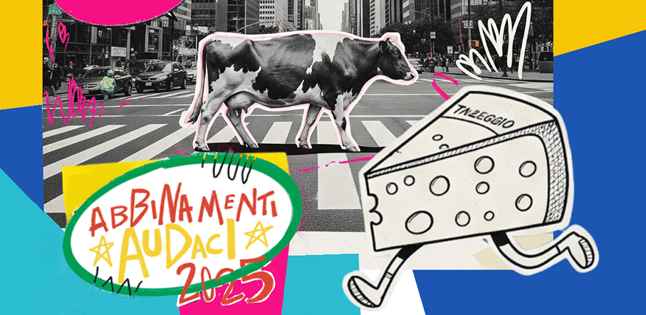

# Abbinamenti Audaci by Taleggio D.O.P.

> Al ristorante **4Cento a Milano**, si è svolta **Abbinamenti Audaci**, un cena a base di **Taleggio D.O.P** condotta da **Joe Bastianich**
 

Il menu **Abbinamenti Audaci** by **Consorzio Tutela Taleggio**, che dimostra come il Taleggio DOP sia un prodotto senza tempo, capace di dialogare con sapori e ingredienti inaspettati, è stato presentato a Milano il 16 settembre in occasione di una cena-evento inedita.

A guidarci alla scoperta degli Abbinamenti Audaci del Taleggio D.O.P. in cucina è stato lo chef statunitense **Joe Bastianich**, che ha condotto i palati dei presenti alla scoperta delle nuove frontiere raggiunte dal **Taleggio DOP**. Ai fornelli, **Dalia Rivolta**, concorrente di **Masterchef 11**, che ha ideato e creato il menù della serata. A darle una mano in cucina, **Mime Kataniwa**, giapponese di origine e fiorentina d’adozione, e **Bruno Tanzi**, anche loro ex concorrenti di Masterchef.

Il **Taleggio D.O.P. è una eccellenza** prodotta in provincia di Bergamo. Ogni forma è un parallelepipedo quadrangolare, con lati di 18-20 cm, uno scalzo dritto di 4-7 cm e un peso da 1,5 a 2,5 kg. La crosta è sottile, morbida e di un rosato naturale, dato dalla microflora caratteristica. Il sapore è dolce, leggermente aromatico, alle volte con retrogusto tartufato; l’odore è caratteristico. Durante la stagionatura, che si protrae almeno 35 giorni, l’attività proteolitica e lipolitica della microflora della crosta contribuiscono al caratteristico andamento centripeto della maturazione di questo formaggio. Il Taleggio è caratterizzato da una **buona digeribilità ed è un alimento naturale** perché non è ammesso alcun trattamento della crosta, oltre a quello con acqua e sale.

Ce ne parla **Lorenzo Sangiovanni**, presidente del **Consorzio Tutela Taleggio** che si batte per la valorizzazione del Taleggio in Italia e all’estero. La nuova campagna di comunicazione in Italia prevede il progetto con alcuni selezionati influencer e food creator.

La Chef torinese **Dalia Rivolta ha proposto il suo menù** in onore del Taleggio DOP e all’insegna degli Abbinamenti Audaci  esaltando a pieno le caratteristiche uniche del formaggio che il consumatore ritrova in ogni fetta. Lo abbiamo scoperto attraverso **4 ricette da replicare a casa**.

**Antipasto che inganna**: giocando sull’ambiguità del gusto, si può trasformare un dolce classico come il crème caramel in uno sformato salato. Il Taleggio crea una consistenza vellutata, un sapore che racconta una storia: aromatico, mai invadente, con note di latte e un finale elegante e persistente che ricorda il tartufo. Nel **Crème Caramel al Taleggio DOP** la pasta del formaggio crea una texture cremosa e vellutata e la sua sapidità equilibrata trova un partner ideale nella riduzione di balsamico.

**Risotto rivoluzionario**: il Taleggio DOP è insuperabile nella mantecatura e i suoi sentori avvolgenti riescono a sposarsi in modo sorprendente anche con sapori forti senza mai coprirli. Per questo Mime ha deciso di utilizzarlo per il **Risotto al Taleggio e Bisque di Canocchie, burro acido e mizuna**: il formaggio e la bisque di canocchie si fondono insieme in un equilibrio sorprendente e la pasta del Taleggio è l’ideale per ottenere la mantecatura perfetta.

**Un secondo croccante dal cuore cremoso**: la pasta del Taleggio è compatta, uniforme e senza occhiature. La vera magia si scopre però nella consistenza, irresistibilmente più morbida e fondente appena sotto la crosta. Per questo è ideale per un piatto come il **Croccante di Radici al Forno con fonduta di Taleggio e anacardi tostati**: un secondo che mette in mostra l’anima rustica del formaggio e in cui il dialogo tra il dolce delle radici e il “retrogusto tartufato” del Taleggio DOP rendono il piatto complesso e profondo.

**Fusione di sapori con un dolce inaspettato**: l’alta qualità del latte del Taleggio lo rende perfetto anche per i dessert. La proposta di Mime è un **Gelato al Taleggio e Fico d’India**, che spinge al limite la percezione del dessert e in cui il sapore caratteristico e aromatico del Taleggio DOP si fonde alla dolcezza del fico, esaltata per contrasto dalla sapidità equilibrata del formaggio.

