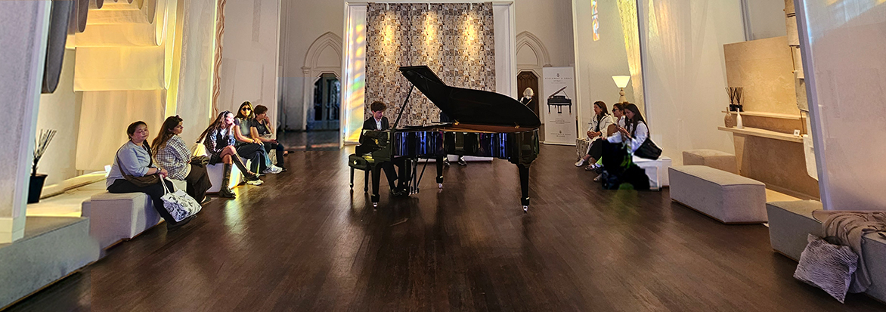
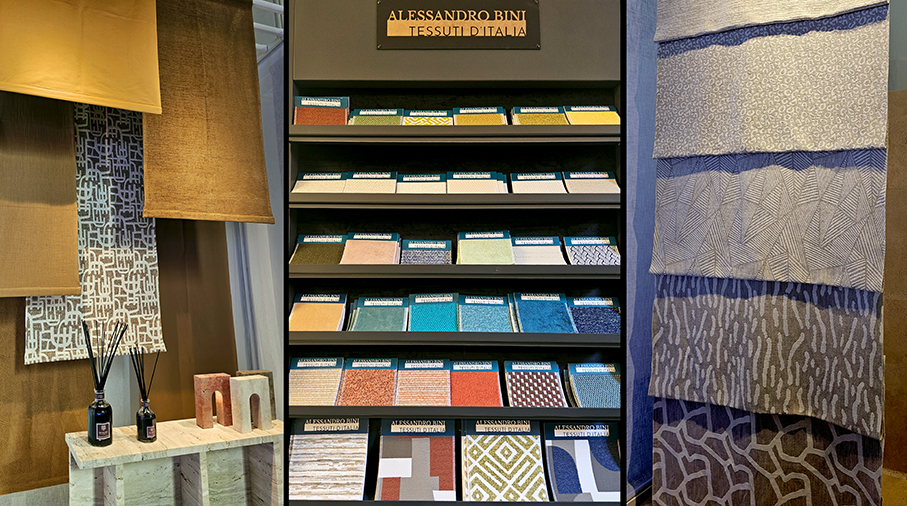
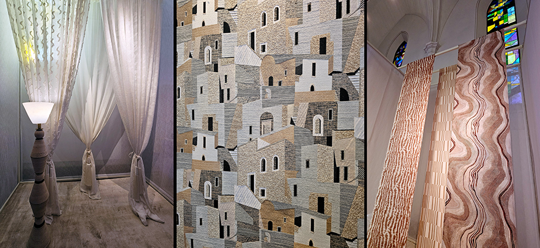
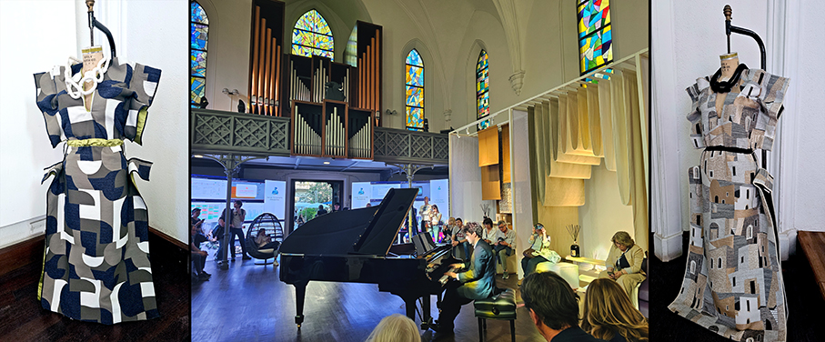
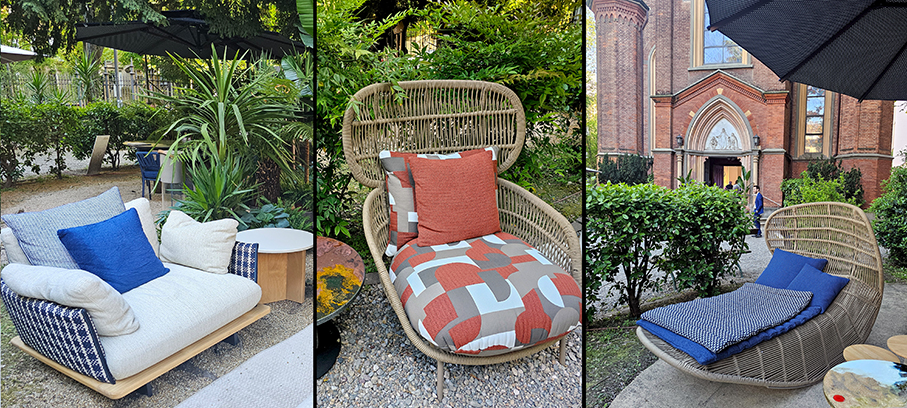
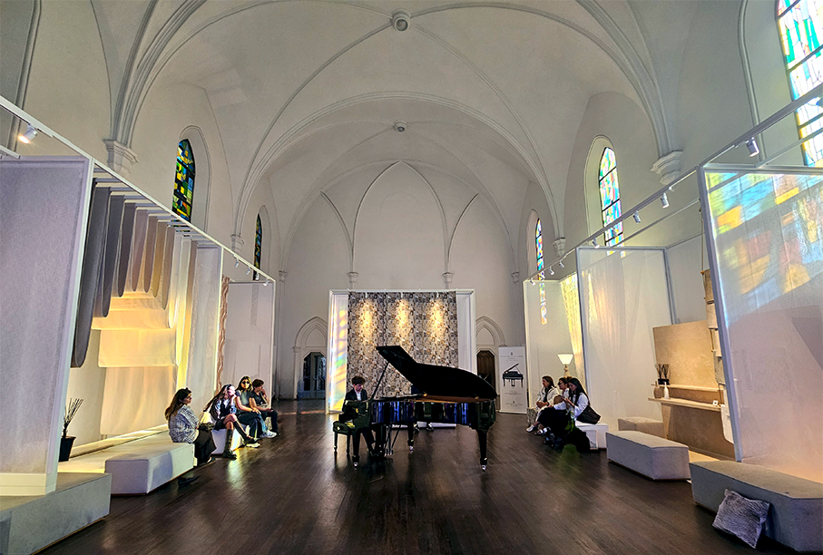

# Alessandro Bini Tessuti d’Italia al Fuorisalone

>**Alessandro Bini** protagonista al **Fuorisalone** di Milano con MONDI/26, un’esperienza indoor e outdoor tra **arte e innovazione tessile**

Nella navata della Chiesa Cristiana Protestante e nel giardino antistante, nel cuore del **Brera Design District**, è stata presentata in anteprima la nuova collezione **Trame di Vita**, in occasione del Fuorisalone . Il progetto espositivo si è sviluppato come un percorso multisensoriale per valorizzare il **tessile come vera e propria opera d’arte**, tra materia, luce e architettura.

Ad arricchire l’esperienza, le **fragranze di Dr. Vranjes Firenze, gli arredi in marmo di Giovannozzi Marmi, le soluzioni outdoor di EdenParkFirenze, l’illuminazione architetturale di Spacecannon e la tecnologia firmata Saet**. Un viaggio che ha celebrato l’eccellenza del **made in Tuscany**, dove tradizione e innovazione si intrecciano per dare forma a una nuova idea di abitare contemporaneo.

**Alessandro Bini Tessuti d’Italia** propone e sviluppa collezioni dallo stile italiano, caratterizzate da **contaminazioni tra arte, artigianalità e innovazione**. Ogni collezione è pone grande attenzione alle **tendenze della moda, alla qualità dei filati, alle tecniche di tessitura e ai finissaggi**. I tessuti sono made in Italy e realizzati con filati naturali e antifiamma. È possibile realizzare prodotti personalizzati in base alle esigenze del cliente. Il brand è presente in tutta Italia e in oltre trenta paesi esteri.

**Dedalo** è uno dei tessuti più rappresentativi della collezione **Trame di Vita** e tra i protagonisti di MONDI/26. Disegnato come un **paesaggio tessile**, intreccia rilievi, texture e cromie ispirate all’architettura e alla materia. Un progetto che unisce ricerca, artigianalità e memoria in una superficie materica e sofisticata. Dedalo è un tessuto **Jacquard lampasso** che nasce dall’incontro tra memoria storica e visione contemporanea.

**Dr. Vranjes Firenze** da oltre quarant’anni riesce a catturare in un flacone l'eleganza di Firenze, la sua tradizione artigianale e l'arte della profumeria. proponendo fragranze per la profumazione di ambienti e il benessere personale. La Cupola del Duomo, simbolo della città, ispira la forma ottagonale della bottiglia. Tra le prime creazioni, **Rosso Nobile**,è ispirato ai più pregiati vini toscani. **Fico Aromatico** è l’ultima novità: una fragranza per ambienti living fresca e vibrante che unisce note verdi, la dolcezza del fico e legni avvolgenti, creando l’atmosfera autentica e rigenerante del paesaggio toscano.

**Edenpark Firenze** è un team specializzato in progettazione e arredo outdoor. Ogni allestimento nasce dalla consapevolezza di avere di fronte uno spazio ogni volta diverso, con le proprie caratteristiche e particolarità. L'obiettivo è capire i desideri del cliente, studiando il miglior modo per realizzare l’allestimento outdoor desiderato, garantendo cura per ogni dettaglio. 

**Giovannozzi Marmi**, con una consolidata esperienza nel settore, rappresenta un’eccellenza nella lavorazione di marmo, granito e travertino, frutto di abilità artigianale e tecnologie avanzate. La collezione di complementi d’arredo rappresenta l’incontro perfetto tra funzionalità e bellezza, con dettagli raffinati che si adattano a ogni ambiente. Da tavoli e consolle a piccoli oggetti decorativi.

Ph. Credits: Maria Rosa Sirotti