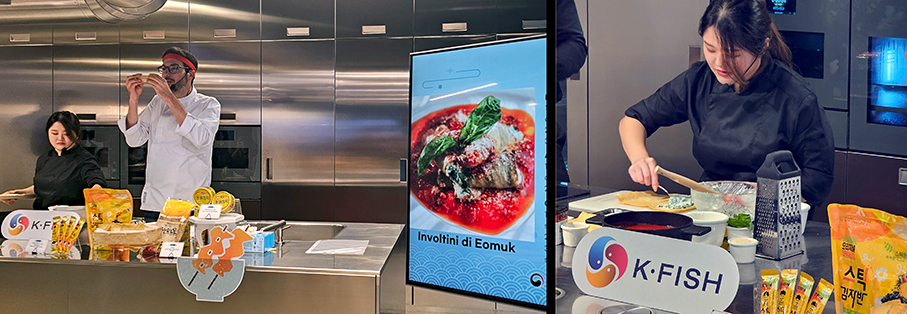
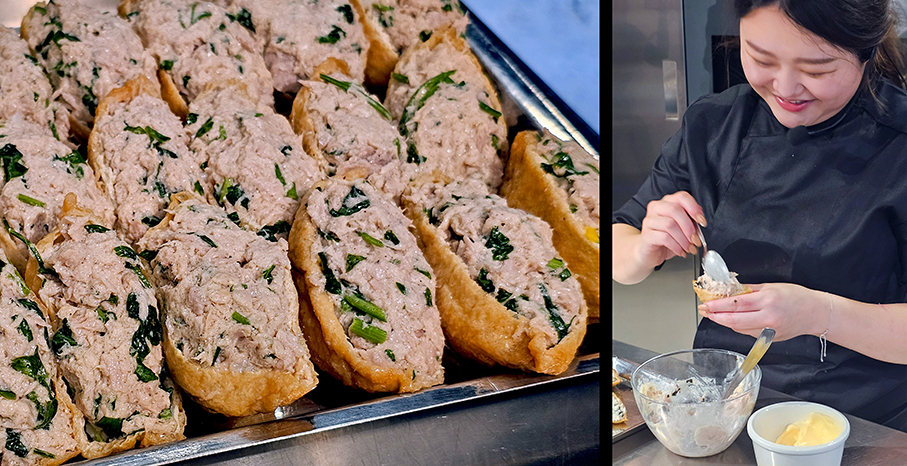

# Alla scoperta del K-FISH coreano

>Lo chef stellato **Fabrizio Ferrari** celebra i **prodotti ittici coreani certificati K∙FISH** con ricette che fondono tradizione coreana e creatività mediterranea

La cucina coreana continua a conquistare i palati italiani e sorprende ancora una volta con **uno showcooking esclusivo** – nella sede di **Signature Kitchen Suite** di Milano - dedicato ai **prodotti ittici coreani certificati K∙FISH**, il marchio ufficiale del **Ministero degli Oceani e della Pesca della Corea del Sud**, sinonimo di freschezza, qualità e sicurezza alimentare. 

**Due ricette** firmate dallo **chef stellato Fabrizio Ferrari**, che, grazie al suo profondo legame con la cucina coreana, interpreta con creatività e maestria la ricchezza dei mari coreani, dando vita a piatti innovativi dal gusto autentico. Noto per la sua cucina specializzata nel pesce di mare, con una particolare attenzione al pesce azzurro e alle materie prime meno nobili ma di grande qualità ed è attivo su Youtube con il suo canale **“Italy Fabri”**.

K∙FISH è il primo **sistema di certificazione del governo coreano** per garantire la tracciabilità dei **prodotti ittici** a livello mondiale e promuovere la bontà e la sicurezza dei prodotti ittici coreani sui mercati esteri. Il sistema K, creato e certificato dal **Ministero degli Oceani e della Pesca** della Corea del Sud, assicura che il pesce provenga da pratiche sostenibili e sia di alta qualità, offrendo ai consumatori garanzie sulla provenienza e sul ciclo produttivo del prodotto ittico coreano. 
Il marchio garantisce che i prodotti ittici provengano da**mari incontaminati**, pescati o allevati in Corea del Sud, rispettino **rigorose normative** coreane e internazionali per la sicurezza alimentare e l'igiene, soddisfino elevati standard di qualità e sicurezza e garantiscano la tracciabilità **lungo tutta la filiera**: dalla cattura o l’allevamento fino alla distribuzione finale.

Il **simbolo K∙FISH** (ispirato al Taegeuk, simbolo della filosofia e della cultura coreana) rappresenta il **mare pulito** (blu), la **qualità** (giallo) e il **controllo rigoroso** (rosso).
La **distribuzione in Italia** dei prodotti ittici con il certificato K∙FISH avviene principalmente attraverso **negozi e supermercati asiatici specializzati** (Il Sempreverde a Milano), **società di Import/Export di Prodotti Ittici** (Pacmall) e **Amazon Italia**.

Le categorie principali di prodotto includono: 
**Prodotti conservati o trasformati** come canned & retort tuna, **tonno in scatola** con metodo di lavorazione e confezionamento – retort - del tonno in Corea, che ne garantisce la sicurezza e una lunga conservazione. Sono disponibili diverse varietà di tonno: tonno piccante al peperoncino, tonno con verdure, tonno con maionese e il tonno in salsa di fagioli neri (jajang). Un punto di forza fondamentale del tonno in scatola coreano è l'**ampia gamma di sapori**, che consente ai consumatori di scegliere e gustare in base alle loro preferenze di gusto o alle ricette.
**Snack di alghe** croccanti molto popolari in Corea, croccanti e dal basso contenuto calorico.
**Prodotti vari di mare essiccati o freschi** come dried radish leaf boneless braised mackerel (Sgombro Brasato Senza Lische con Foglie di Ravanello Essiccate), seasoned eel (Anguilla Condita/Marinara)

**Le ricette dello showcooking**

**Involtini di Eomuk** (tortino di pesce coreano preparato con polpa di pesce bianco macinata, mescolata con amido, farina e condimenti, che viene poi modellata in varie forme come filetti, anelli o polpette)

•	Sbollentare brevemente gli spinaci in acqua bollente, raffreddarli in acqua fredda, strizzare l’acqua in eccesso e tritare finemente.
•	Sbollentare rapidamente le frittelle di pesce in acqua calda per eliminare l’olio in eccesso.
•	Preriscaldare il forno a 180°C.
•	Farcire ogni frittella con spinaci e mozzarella, arrotolare e fissare con uno stecchino.
•	Sistemare gli involtini su una pirofila con salsa di pomodoro sul fondo, cospargere di mozzarella e cuocere per 10-15 minuti fino a doratura e gratinatura.

**Yubu con Tuna Mayo**
Gli yubu sono tasche già pronte preparate con la parte superficiale del tofu, una specie di crosticina che mantiene la forma. 

•	Cuocere il riso lasciandolo leggermente sodo, lasciarlo raffreddare.
•	Mescolare il tonno sgocciolato con maionese per creare il ripieno tuna mayo.
•	Strizzare leggermente il liquido dai yubu (tasche di tofu fritte).
•	Riempire ogni tasca con riso e sopra aggiungere il ripieno tuna mayo, premendo leggermente per dare forma.
•	Guarnire con fiocchi di alghe, semi di sesamo o prezzemolo tritato e servire immediatamente.

_Ph. credits: Maria Rosa Sirotti_

Info: https://kfish.k-seafoodtrade.kr/home/start.php

