# Beauty autunnale per viso, corpo e capelli

>È il momento di restituire **luminosità, elasticità e morbidezza** attraverso azioni e prodotti mirati per **viso, corpo e capelli**

_di Maria Rosa Sirotti_
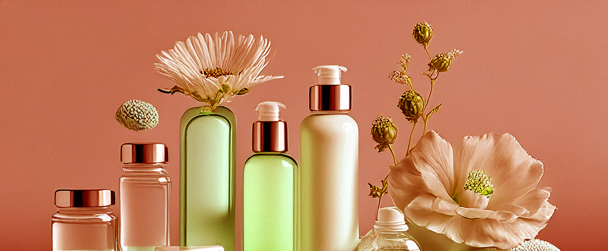

Con il rientro dalle vacanze dopo settimane di sole, salsedine e cloro, **pelle, labbra e capelli** possono apparire più spenti e secchi. Occorre restituire **luminosità, elasticità e morbidezza** attraverso azioni e **prodotti mirati**. Esfoliazioni viso e corpo, creme idratanti, schiarenti e anti-rughe, detergenti delicati ma attivi, oltre a profumi che ci ricordino gli entusiasmi dell’estate o che ci accompagnino al rientro in città.Perché il modo migliore per affrontare settembre è ritrovare il benessere.

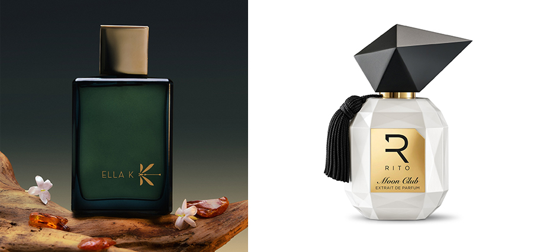

**Myrrh K** di **Ella K** Parfums esplora l’anima intensa dell’Oman, una terra sospesa tra sacralità e dolcezza. Note di fiori baciati dal sole e mandorla amara introduono una dimensione luminosa e delicata. Sontuosa rosa di Jebel Akhdar, raccolta a mano tra le montagne dell’Oman, i cui accenti puri e freschi si intrecciano con note fruttate. Nel cuore, un accordo gourmand con halwa - dolce tradizionale dell’Oman - sesamo tostato, miele e zafferano, illuminato da una nota spirituale di mirra. Sul fondo, assoluta di fava tonka, assoluta di vaniglia del Madagascar e legno di cedro dell’Oman.  

**Moon Club** di **Rito** extrait de parfum Ipnotico e sensuale, ogni ora che passa si trasforma, si adatta, si fonde con chi lo indossa fino a diventare qualcosa di irrinunciabile. Si apre bergamotto e  pepe rosa. Il gelsomino sambac porta sensualità, la davana profondità intensa. Si aprono nel cuore l’albicocca e la magnolia, mentre la fava tonka e l’ambra minerale avvolgono tutto con una presenza indelebile. La vaniglia, il sandalo, la canna da zucchero e il muschio bianco chiudono in una base profonda e affascinante.

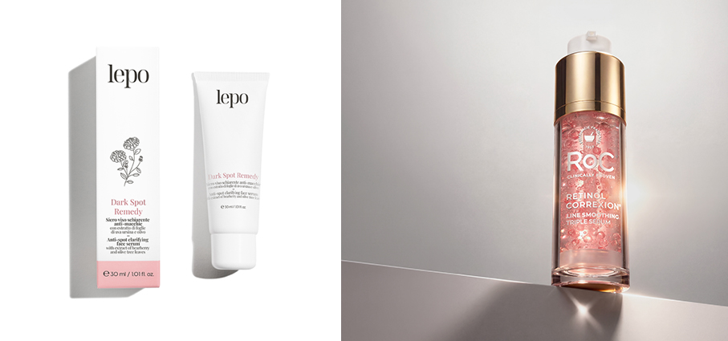

**Dark Spot Remedy** di **Lepo** siero viso schiarente anti-macchie con estratto di foglie di uva ursina e olivo. Agisce efficacemente su macchie scure e discromie, migliorando la luminosità e l’uniformità dell’incarnato, ideale per pelli soggette a iperpigmentazioni da UV, invecchiamento e alterazioni ormonali. Non provoca foto sensibilizzazione, garantendo un trattamento sicuro e delicato anche per l'uso quotidiano.

**Retinol Correxion Triple Sérum** di **RoC®** Nuovo siero della gamma Retinol Correxion® - Line Smoothing, arricchita con Retinolo Clinico che aiuta a ridurre visibilmente rughe e linee sottili. Contiene: Retinolo Clinico, con oltre 1.000 microcapsule sospese nella formula che mantengono il retinolo nella sua forma ideale; PDRN ispirato a un’avanzata procedura biomedica coreana, un frammento di DNA a basso peso molecolare estratto dal ginseng; Acido Ialuronico e Vitamina B5.

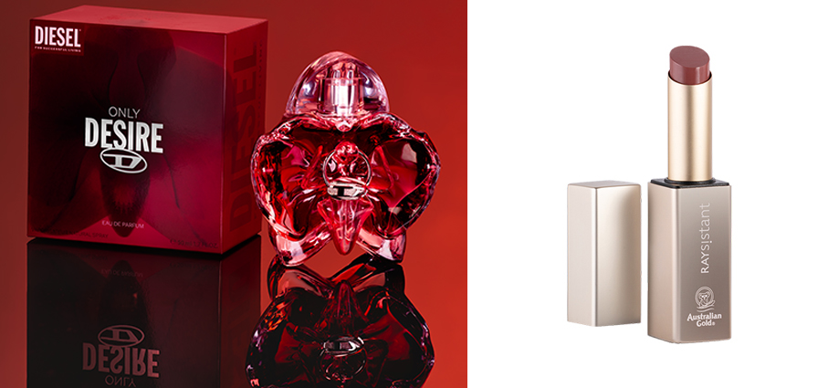

**Only Desire** di **Diesel** ridefinisce il desiderio femminile come una forza vitale, un diritto da coltivare come energia trasformativa e identitaria e da rivendicare senza compromessi. Reinventa la classica vaniglia dando vita alla Metallic Vanilla, unendo la sensualità dell'orchidea a un'esclusiva Vaniglia Bourbon del Madagascar che si distingue per un profilo intenso, animale e affumicato. Questo cuore caldo contrasta con la brillantezza pungente di AmberXtreme e delle aldeidi al platino, richiamando visivamente il dettaglio del piercing presente sul flacone.

**Lipstick Silky Nude** di **RAYsistant - Australian Gold** Uno stick sheer nella sofisticata nuance nude-rosa rouge. Dalla texture cremosa e dal finish lucido, è arricchito con Olio di Cocco, Burro di Cacao, Vitamina B3 e Caffeina. L’estratto di Zenzero e l’Olio di resina di Pepe Africano completano la formula con un effetto tecno-filler pensato per donare un immediato effetto riempitivo e volumizzante.

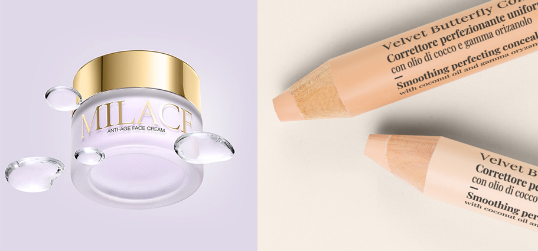

**Anti-Age Face Cream** di **Milace** Una crema viso anti-age dalla texture ricca e vellutata ad azione anti-invecchiamento che contrasta i segni del tempo ed esercita un’azione anti-age globale rendendo la pelle compatta, idratata e setosa. Il protagonista della formula è l’estratto di Zafferano Milace, ottenuto attraverso l’esclusiva Zaffran Ultra -Technology® che in sinergia con Elastina Marina Idrolizzata e Vitamina C Incapsulata regala un effetto anti-age.

**Velvet Butterfly Concealer** di **Lepo** Correttore perfezionante uniformante con olio di cocco, vitamina E e gamma orizanolo. Nel pratico formato, illumina e perfeziona l’incarnato all’istante, uniformando l’aspetto del viso. Texture cremosa ed emolliente è ideale anche per pelli secche e mature. Corregge le imperfezioni e leviga le linee sottili, aderendo perfettamente alla pelle, senza seccare o segnare. Perfetto per i ritocchi on-the-go. Disponibile in 2 nuance: Sabbia e Pesca.

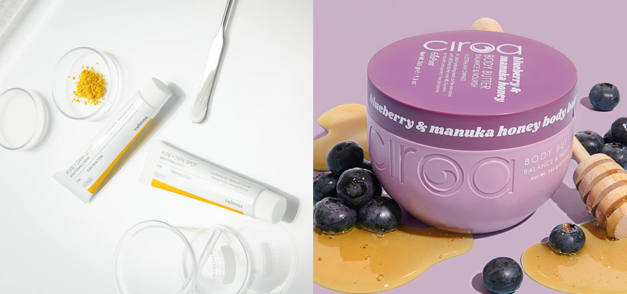

**Pore+Dark Spot Brightening Cream** di **Celimax** crema illuminante per pelli iperpigmentate. La sua formula agisce per ridurre la visibilità delle macchie scure e uniformare il colorito, restituendo al viso un aspetto sano e ringiovanito. Con la sua texture piacevole, si fonde con la pelle, lasciandola morbida e idratata, pronta per affrontare la giornata o per rigenerarsi durante la notte.

**Blueberry & Manuka Honey Body Butter** di **Ciroa** burro corpo ricco di antiossidanti ed estratto di mirtillo che aiuta a proteggere dagli stress quotidiani e favorisce un tono più uniforme e giovane, mentre il miele di Manuka apporta un'idratazione profonda e un trattamento lenitivo. Burro di karité e glicerina per nutrire e rafforzare la barriera cutanea, lasciando il corpo avvolto dal dolce profumo di frutti di bosco succosi e miele dorato.

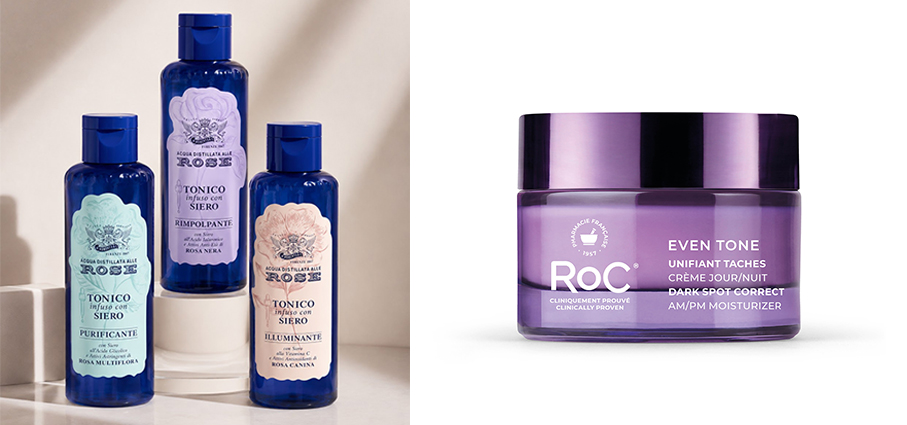

**Tonici Infusi con Siero** di **Acqua alle Rose** diventano parte di essenziale della routine grazie all'innovativa formula 2 in 1 che unisce la leggerezza di un tonico all'efficacia di un siero in un unico gesto. Da applicare dopo la detersione e prima della crema, tonificano, idratano e riequilibrano la pelle grazie agli estratti di rosa e ad attivi specifici pensati per ogni esigenza. Tre varianti, Rimpolpante Illuminante Purificante, per tre risposte mirate.

**Even Tone AM/PM Moisturizer** di **RoC®** Crema viso idratante Anti Macchie. Contiene niacinamide, forma cosmetica della vitamina B3 e  cetyl tranexamate mesylate, derivato lipofilo dell'acido tranexamico studiato per penetrare più in profondità rispetto alla molecola tradizionale. A completare l'azione schiarente, esilresorcinolo, kojic dipalmitate (un estere dell'acido kojico), estratto di radice di liquirizia ed estratto di foglie di gelso bianco. L'idratazione è affidata a glicerina, squalano e burro di karité.

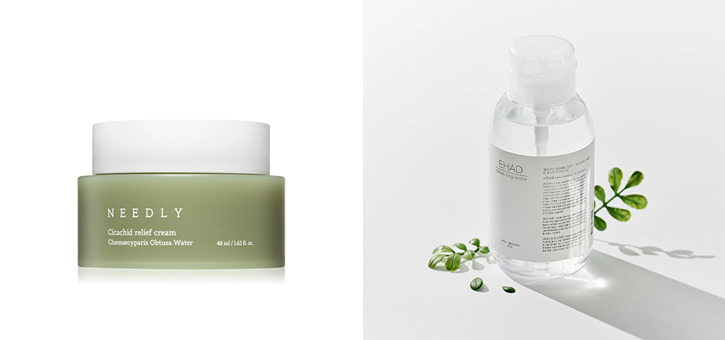

**Cicachid Relief Cream** di **Needly** crema di rigenerazione profonda con effetto lenitivo, nutre e idrata intensamente la pelle irritata e i rossori. Con un'elevata concentrazione di idrolato di cipresso giapponese e estratto di Centella Asiatica, aiuta a ripristinare la pelle irritata, donandole una sensazione di comfort e fornendole l'umidità vitale mancante. Grazie a un livello di pH bilanciato di 5.5 accelera la guarigione di piccole ferite. 

**Cleansing Water** di **Ehad** Acqua detergente delicata e rinfrescante. Contiene un estratto brevettato di Sapindus Mukorossi (frutto del sapone), che deterge e strucca efficacemente il viso: dopo l'uso, è sufficiente risciacquare con acqua, anche senza un detergente aggiuntivo. Il complesso Refresh, con 15 estratti vegetali, dona freschezza e idrata la pelle. Utilizzabile da sola o come primo passaggio nella doppia detersione.

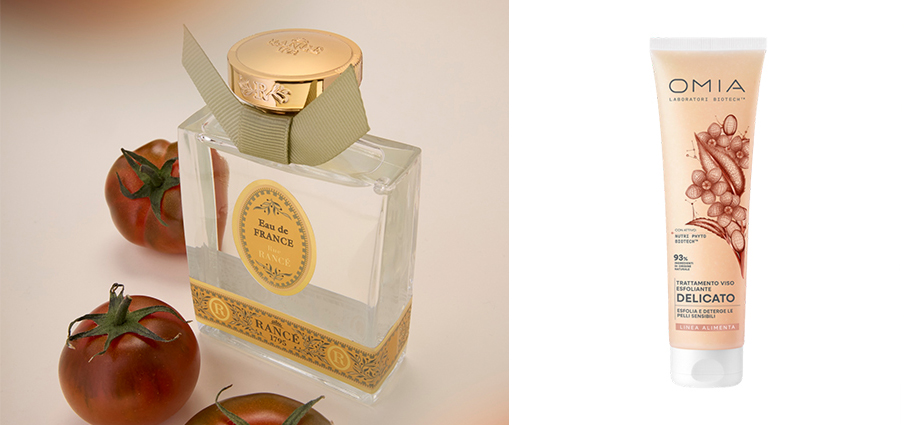

**Eau de France** di **Rancé 1795** riscopre la freschezza luminosa dei suoi luoghi d’origine con una linea che affonda le radici nella storia stessa della Maison e nella città di Grasse, culla della profumeria francese. Una fragranza genderless, intensa e frizzante, in cui le note agrumate del bergamotto si intrecciano con accenti verdi e linfatici della foglia di pomodoro e con sfumature floreali appena accennate, evolvendo in un fondo di legno di sandalo e muschio bianco.

**Delicato Visage** di **Omia** - Linea Alimenta. Trattamento viso esfoliante e detergente delicato che rimuove le impurità, come cellule morte e sebo, anche dalle pelli più sensibili, senza seccare la pelle. Le sfere presenti all'interno della texture agiscono sulla pelle per un'azione esfoliante non aggressiva, adatta anche alle pelli più sensibili.

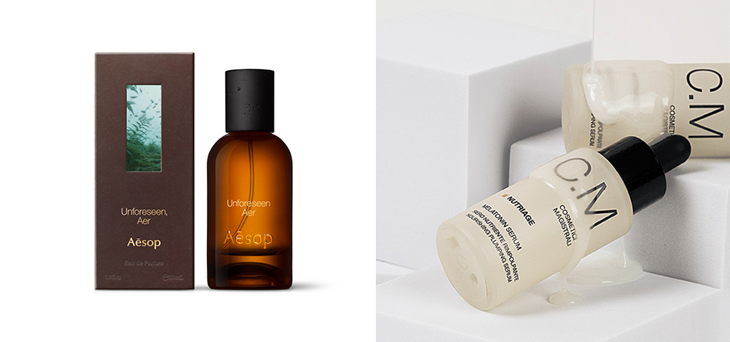

**Unforeseen Aer** di **Aesop**. Segue la storia di un vento leggero che, temendo i disagi che potrebbe causare, impara presto a godere del sublime caos generato dalle sue raffiche e dalle sue selvagge brezze. Presenta un accordo fiabesco di Geranio, Lavandino e Rosmarino per evocare il profumo dell’Aria Pura che scorre tra vette impervie. Questo contrasto nitido di aromi si contrappone alla Noce Moscata, che rivela i pregi dell’imperfezione con il suo calore complesso e strutturato.

**Nutriage Melatonin Serum** di **C.M.** (Cantabria Labs Difa Cooper), nuovo siero viso nutriente, rimpolpante e rassodante pensato per la pelle secca, sottile o caratterizzata da perdita di tonicità e compattezza. Con Melatosphere®, tecnologia esclusiva che utilizza una specifica miscela di oli vegetali di avocado, rosa mosqueta e opuntia per inglobare e veicolare la melatonina a livello cutaneo. Contiene aminoacidi pro-collagene, Palmitoyl Tripeptide-5, ad effetto tensore. 

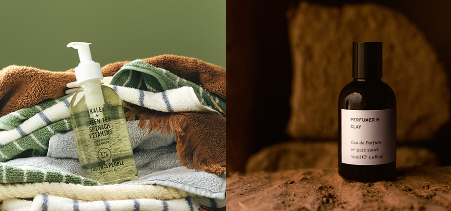

**Superfood Cleanser Kale+Green Tea+ Spinach Vitamins** di **Youth To The People** Delicato ma efficace e ricco di nutrienti, questo detergente iconico è diventato essenziale nelle routine di skincare di tutto il mondo. Offre una detersione profonda in soli 30 secondi rimuovendo trucco e protezione solare, ideale come primo step. La pelle appare più pulita, luminosa e uniforme, con una grana affinata, pori visibilmente ridotti e una sensazione duratura di comfort e idratazione. Testato dermatologicamente e oftalmologicamente, è adatto anche alle pelli sensibili e a tendenza acneica e per il contorno occhi.

**Clay** di **Perfumer H** è Ispirato dalla terra e dalla vita che sostiene. Creato dalla fondatrice e profumiera Lyn Harris, la fragranza è una esplorazione del paesaggio, della materialità e della luce. Rappresenta uno degli elementi più fondamentali della terra: una fonte di vita e la base da cui emergono molte delle materie prime. Fiore d'arancio. Mandarino. Sandalo. Legno di cedro. Ginepro. Catrame di betulla. Muschio. Cenere bruciata.

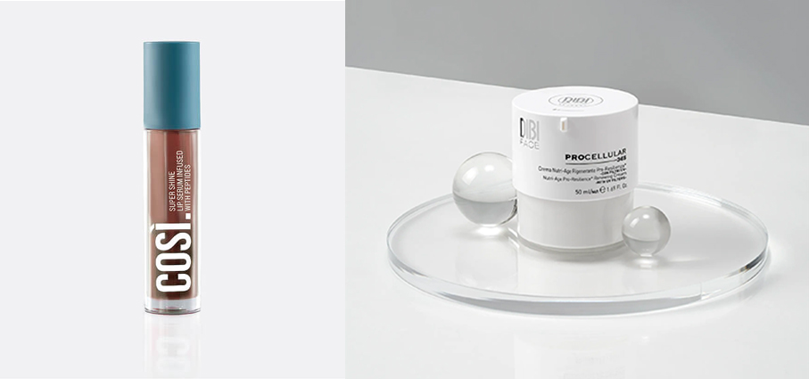

**Super Shine Lip Serum Infused with Peptides** di **Così** Lip Serum dalla formula priva di acqua e dalla texture leggera e vellutata, che si applica facilmente sulle labbra per una sensazione setosa e confortevole, senza appesantire. Brillantezza ultra-gloss effetto specchio per esaltare la bellezza naturale delle tue labbra. Arricchito con profumo di yogurt per un’esperienza sensoriale piacevole. 

**Crema Nutri-Age Rigenerante Pro-Resilienza** di **Dibi Milano** con filtri Uv Crema prebiotica nutriente con filtri Uv, rigenerante e anti-ossidante. Appartiene alla linea Procellular 365 formulata scientificamente per la ri-generazione e ri-codifica del reticolo cutaneo. Testata anche pre e post trattamenti di medicina estetica. Contiene pre-dibiotic, un potente prebiotico nutriente selettivo per la pelle; matrichine, peptidi della giovinezza; vitamina C, dall'azione anti-età e anti-ossidante.

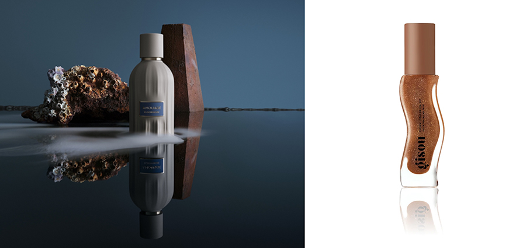

**Elsewhere** di **Amouage** è un’Essence de Parfum al 30% invecchiata per un anno in botti di rovere e scaglie di sandalo. Una creazione legnosa, speziata e ambrata che traduce l’epica storia di magia e riscatto del marinaio Simbad in un percorso olfattivo. In apertura, note di miele, albicocca e mango con tocchi di cardamomo, zenzero e mandarino. Nel cuore, tè nero e davana a un avvolgente accordo cremoso di cappuccino. Al fondo, la dolcezza affumicata di fava tonka e vaniglia unita al legno di cedro e alle sfumature terrose di labdano, cipriolo, vetiver e patchouli.

**Honey Infused Lip Oil – Coco Cacao** di **Gisou** Olio per labbra Limited Edition, un marrone lattiginoso con riflessi dorati. Un tocco di colore e profumo di cocco cremoso avvolto nel cioccolato al latte, per labbra intensamente idratate e dalla lucentezza radiosa. Deliziosamente profumato e arricchito con una miscela di miele idratante Mirsalehi, nutriente olio Bee Garden e l'olio di semi di jojoba lenitivo per labbra più lisce e morbide.

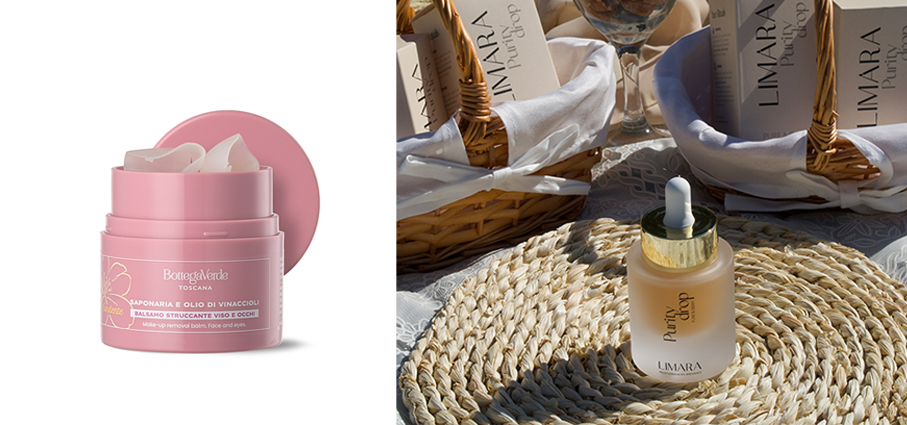

**Saponaria e Olio Di Vinaccioli - Balsamo struccante** di **Bottega Verde Toscana**. Con il 93% di ingredienti di origine naturale e una formula vegana, questo balsamo struccante deterge delicatamente il viso trasformandosi, con il massaggio, in un olio setoso che scioglie efficacemente trucco e impurità. Con oli e burri vegetali ed estratto di Saponaria di Tenuta Bottega Verde, di origine toscana, che assicura una detersione delicata. Completa la formula l’olio di Vinaccioli. 

**Purity Drop - Pure & Dewy** di **Limara** un siero multi-attivo che combina ricerca cosmetica e semplicità formulativa attraverso ingredienti che sostengono la barriera cutanea, migliorano l'uniformità dell'incarnato e donano un aspetto fresco, luminoso e naturalmente vitale. Gli acidi azelaico e mandelico purificano delicatamente la pelle rispettando la barriera cutanea. Contiene niacinamide (vitamina B3), aloe, estratti di mirtillo e di vite palla, vitamina C.

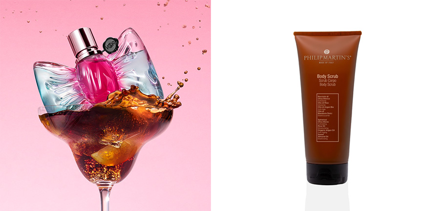

**Cola Fizz** di **Fragranze Viktor & Rolf**  Giocosa, ultra-sensoriale e audacemente moderna, la fragranza si trasforma in un vero e proprio accessorio di desiderio, capace di unire sensualità, colore e gourmandise. Traduce in fragranza la sensazione effervescente di una cola ghiacciata con una fetta di limone in una calda giornata estiva. Un cuore agrumato e brillante di limone che evolve in un fondo di muschio bianco delicato e persistente, per un risultato fresco, sparkling e addictive.

**Body Scrub** di **Philip Martin’s** trattamento dalla texture morbida e soffice ad azione emolliente formulato con granuli di nocciolo di olivo mediterraneo che rotolano sulla pelle del corpo, offrendo una esfoliazione efficace, e un mix di preziosi oli naturali: olio di riso, olio di argan bio e olio di mandorle dolci, dalle proprietà idratanti, nutrienti ed elasticizzanti. Lascia la pelle pulita, fresca, luminosa, più liscia e morbida.

