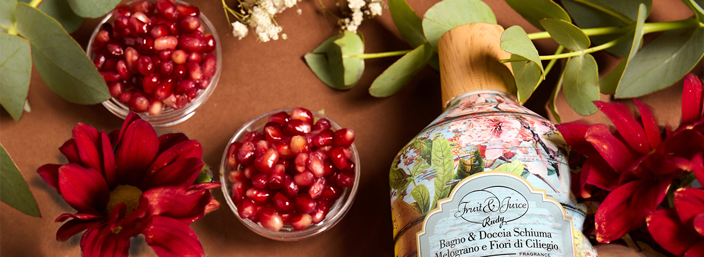
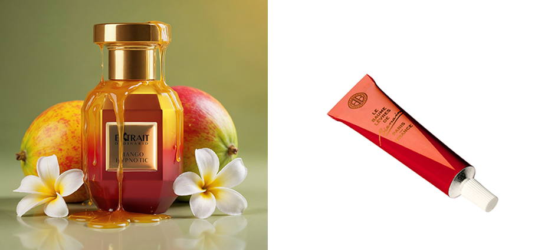
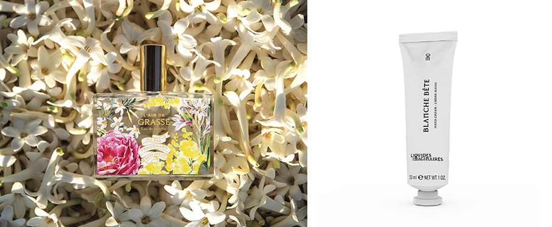
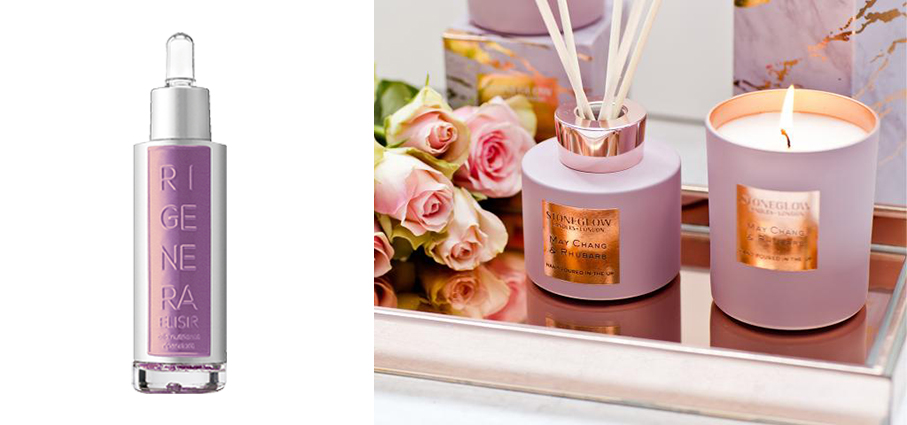
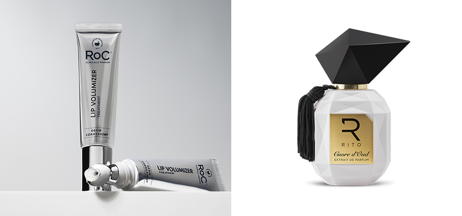
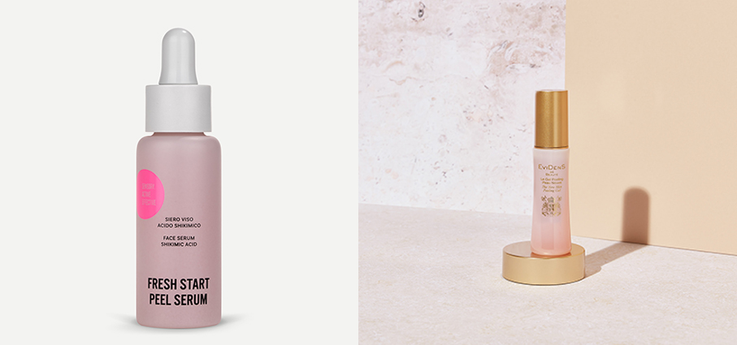
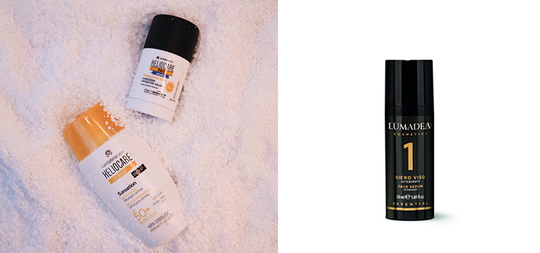
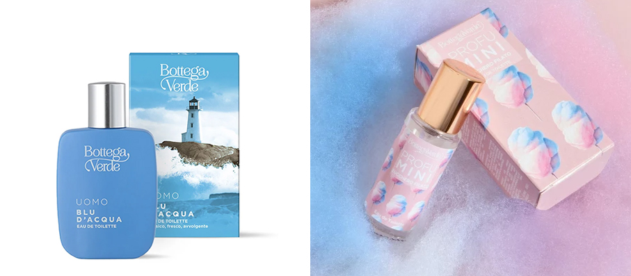

# Beauty proposte 2026

>Per il nuovo anno, per noi e per il nostro partner, tante **proposte beauty** da utilizzare da soli o in due 

**Ta'if - Ormonde Jayne** unisex è un inebriante e audace profumo di rosa proveniente dalla città di Ta’if, che si trova sopra le rive del Mar Rosso e che domina il deserto arabo. Questo profumo rifiuta la luce del giorno preferendo il crepuscolo, la notte, le feste, le promesse e gli appuntamenti. Un mix opulento di datteri e zafferano – frutto e spezia della stessa regione – con ginestra, pepe rosa, resine arboree e fava tonka. Dinamico, audace e follemente innamorato della vita. Fragranza: floreale, ambrata.

**Sequence – Amouage** una dichiarazione sul potere di ogni tramonto di trasformarsi in un’alba. 
Come ogni inizio, Sequence prende il volo con una scintilla luminosa: Litchi e Lampone offrono un’energia ottimista dai toni cremisi, mentre lo Zafferano introduce una nota cuoiata destinata a diventare centrale nel corso della fragranza. Il cerchio ruota poi rivelando Rosa e Fava Tonka, due materie prime lussuose che aggiungono romanticismo e solennità. L’Osmanthus, con la sua marcata sfaccettatura cuoiata, crea un legame diretto con lo Zafferano iniziale. Avvicinandosi alla conclusione inevitabile, Oud e Legni Ambrati spingono Sequence verso profondità ancora maggiori, trasformando la spensieratezza iniziale in un’espressione di autorevole saggezza. Infine, un Cuoio elegante.

**Mango Hypnotic - Extrait Ordinario** Profumo fruttato e speziato, un’esplosione sensuale di mango maturo e spezie dorate che si fondono a legni preziosi e oud, creando una scia calda, avvolgente e irresistibilmente ipnotica. Testa: Mango, Zafferano, Pepe Nero, Mandarino, Limone. Cuore: Mango, Gelsomino, Accordo Suede, Cypriol. Fondo: Oud, Choya Loban, Legno Cedro, Vetiver Haiti, Legno Cashmere.

**Lip Balm - Bienaime’** Composto per il 99,9% da ingredienti naturali la sua formula idrata profondamente le labbra, garantendo un’azione anti-età, anche grazie alla presenza di olio di nocciolo di prugna, ricco di Vitamina E. La sua texture cremosa e fondente lascia un film soffice e setoso sulle labbra, senza alcun effetto lucido. Il suo profumo di mandorla e il gusto leggermente dolce evocheranno teneri ricordi d’infanzia. 

**The Perfect Cream – Night Treatment – Lepo** Trattamento notte intensivo effetto slow-age con acido ialuronico a 3 pesi molecolari e collagene vegetale e burro di karité bio. Crema viso dalla texture ricca e ultra fondente, specificamente formulata per rigenerare e nutrire in profondità la pelle nel momento in cui risulta più ricettiva, ovvero durante il riposo notturno. Già dalla prima applicazione regala un’idratazione profonda e un effetto rimpolpante visibile, lasciando la pelle levigata, rivitalizzata e morbida al tatto. Può anche essere applicata come una maschera, per un’azione trattante ancora più intensiva.

**Cuir de R’Êve – David Jourquin** Edp. Un inno all’audacia, pensato per una donna di potere e passione. Celebra lo spirito libero e vibrante degli Anni Ruggenti, un decennio di trasformazioni e creatività. Vivace come un cappello cloche parigino sospinto dal vento, è un profumo che racchiude sogno, femminilità e coraggio. Un’esperienza intensa e sofisticata, perfetta per celebrare San Valentino con stile, poesia e un tocco di seduzione senza tempo. Famiglia olfattiva: Cuoiata, Floreale, Ambrata. https://davidjourquin.fr/en/product/cuir-de-reve-inspiration-automne-vf2/

**Lip Oil – Kimmidoll** la nuova collezione per il trattamento perfetto delle labbra, arricchito da colori seducenti e un gusto piacevole. Questo prodotto è realizzato in Italia, utilizzando ingredienti di alta qualità per garantire un trattamento delicato e nutriente. Perfetti per donare luminosità e morbidezza alle labbra.

**Melograno & Fiori di Ciliegio - Rudy Profumi** bagno e doccia schiuma e sapone liquido regalano un momento di rilassante dolcezza, dove le note succose di ciliegia, amarena e melograno incontrano il cuore intenso di liquore alla ciliegia e fior di lampone, per poi fondersi in un finale di vaniglia, musk e ambra bianca, caldo e avvolgente.

**L’Air de Grasse - Fragonard** In occasione del centenario della maison, un Fiore dell’Anno unico nel suo genere. Un vero e proprio bouquet olfattivo, in grado di catturare l’atmosfera della città. Una composizione luminosa, che riflette la ricchezza floreale della Provenza e rende omaggio a quell’aria mediterranea che per secoli ha ispirato profumieri e botanici. Si apre con note fruttate di mandarino ed evolve in un cuore floreale di rosa, peonia, gelsomino e mughetto. Alla base iris, patchouli e muschio, per rievocare il profumo dei giardini e l’inconfondibile luce del Sud della Francia. https://www.fragonard.com/it-int/l-air-de-grasse/l-air-de-grasse-p-3552.htm

**Blanche Bête Hand Cream  - Liquides Imaginaires** la fragranza pluripremiata Blanche Bête in un nuovo rituale di bellezza: una crema mani nutriente e sensoriale. Infusa di fiori bianchi e luce opalescente, presenta una texture ricca e setosa, a rapido assorbimento, che nutre intensamente la pelle grazie al burro di karité e al burro di babassu. Morbida e avvolgente, offre un comfort profondo senza risultare grassa, scivolando sulla pelle come il cashmere e lasciando le mani levigate, morbide e avvolte da una finitura vellutata che dura nel tempo.

**Luna – Stoneglow** La collezione si distingue per le candele e i diffusori dai design marmorizzati e i dettagli metallizzati che si fondono con fragranze avvolgenti creando un’atmosfera senza tempo. Una linea ricca e sofisticata che gioca con i chiaroscuri olfattivi delle fragranze create, come per i profumi per la persona, con le materie prime più preziose e ci sorprende con le texture mat e lucide delle confezioni.

**Elisir Olio Nutriente Riparatore - Rigenera**  Siero Viso che immerge la pelle in una sensazione di morbidezza e rigenerazione per le pelli secche. By Maison Group. Disponibile qui https://www.luxury-perfumes.net/prodotto/9362/

**Derm Correxion® Lip Volumizer - RoC® Skincare** trattamento volumizzante labbra che offre risultati straordinari e clinicamente provati in pochi minuti, migliorando sia i livelli di idratazione che di volume, per chi non ricerca trattamenti invasivi. Ispirato ai trattamenti di medicina estetica, questo volumizzante labbra è formulato con il 25% di ingredienti ispirati dalla medicina estetica, garantendo un effetto visibile istantaneamente e nel tempo. Adatta a tutti i toni e tipi di pelle, la sua formula innovativa contiene sfere di Acido Ialuronico, che donano un’immediata pienezza e un’idratazione profonda e duratura, e Peptidi ProCollagene, che migliorano l’elasticità nel tempo rivelando labbra più levigate e dall’aspetto più giovane. Dermatologicamente testato e ipoallergenico, presenta una texture leggera, cruelty free e senza fragranze aggiunte.

**Cuore d’Oud – Rito - Extrait de Parfum** L’Oriente in un profumo. Con la Rosa di Taif che si unisce con passione alla Rosa Damascena, dando vita a un intreccio di momenti intensi e occasionali disaccordi. Nelle note di fondo, l'Oud entra in scena, agendo insieme allo Zafferano come un mediatore in questa storia d’amore aromatica. Ciò che un tempo era un po’ turbolento trova un lieto fine: una fusione di profumi che si armonizzano splendidamente. Note Olfattive. Testa: Rosa di Taif, Zafferano. Cuore: Assoluta di Rosa Damascena, Labdano, Palissandro, Legno di Cedro. Base: Oud, Ambra, Vaniglia, Muschio Bianco.

**Fresh Start Peel Serum – Histomer** Siero viso fresco e leggero con Acido Shikimico, Vitamina B12 e Estratto di Mandarino Giapponese dall’effetto peeling esfoliante ma idratante e lenitivo che dona una pelle purificata e idratata e uno straordinario incarnato luminoso.

**Le gel peeling peau neuve – Evidens de Beauté** Una nuova soluzione per un’esfoliazione biologica adatta anche alle pelli più sensibili. La sua consistenza in gel libera un cocktail di 4 potenti enzimi in grado di eliminare le cellule morte e le impurità. La sua formula arricchita con Triplo Collagene® e con principi attivi esclusivi QAI stimola il processo di rinnovamento cellulare. Istantaneamente, la grana della pelle viene affinata, l’incarnato appare visibilmente più luminoso, soffice e il colorito, più radioso. https://perfumology.it/products/le-gel-peeling-peau-neuve

**Heliocare 360° Sport Stick SPF50+ - Cantabria Labs Difa Cooper** interpreta la fotoprotezione quotidiana con un approccio sensoriale e contemporaneo. La sua texture ultraleggera e oil-free si fonde sulla pelle con un tocco impalpabile, ideale anche sotto il make-up nei mesi più freddi. La formula combina Aspa-Fernblock®, Vitamina E ad azione antiossidante e Vitamina B5 lenitiva, garantendo protezione elevata e comfort. Il risultato è una pelle protetta e luminosa, anche durante le giornate sulla neve. 
la linea di fotoprotezione dermatologica.

**Siero Viso Aftershave - Lumadea  Linea Essential Uomo** è il trattamento perfetto per calmare, idratare e rivitalizzare la pelle dopo la rasatura. Grazie alla sua formula avanzata con bava di lumaca certificata Cosmos, cellule staminali di sequoia, acido ialuronico liposomiale e acque rinfrescanti di tè rosso e tè nero, questo siero dona un'immediata sensazione di freschezza e benessere. Ideale non solo come dopobarba, ma anche come trattamento anti-age per contrastare i segni del tempo e mantenere la pelle tonica ed elastica. https://www.lumadea.com/products/siero-viso-aftershave-50-ml?_pos=1&_psq=after&_ss=e&_v=1.0

**Uomo - Blu d'acqua – Bottega Verde** Edt classico, fresco, avvolgente. Suscita emozioni intense, fresco e coinvolgente al debutto, con le sue frizzanti note di bergamotto stemperate in coinvolgenti accordi marini, svela un cuore di erbe aromatiche e una calda scia di legni pregiati, che scaldano la pelle.

**ProfuMINI – Zucchero filato – Bottega Verde** Una nuvola rosa che profuma di dolcezza e di momenti felici. Basta una spruzzata per volare in un mondo morbido, leggero e spensierato. Candido, avvolgente, super cute: è la coccola perfetta per affrontare l’inverno con più dolcezza.⁣
⁣

