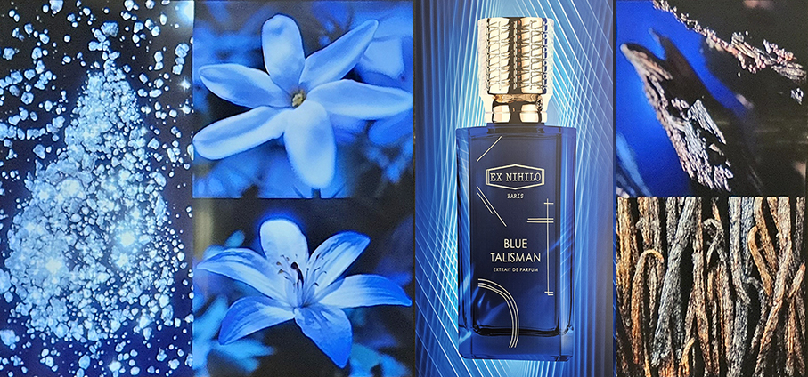
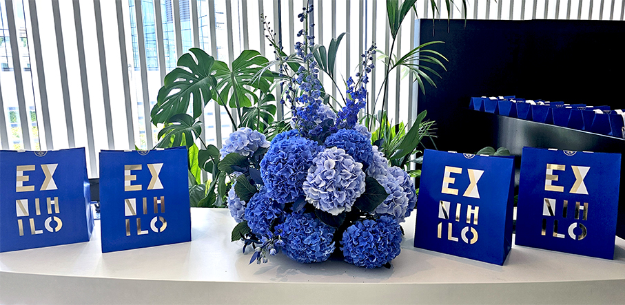
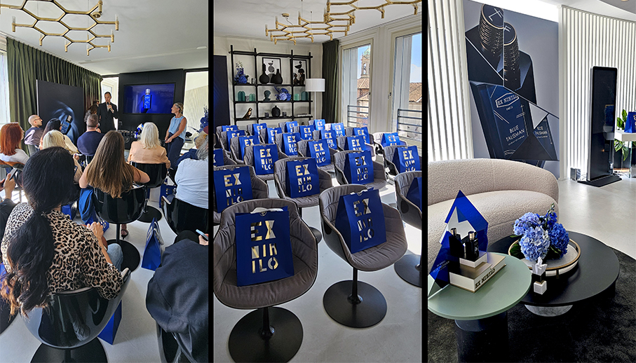
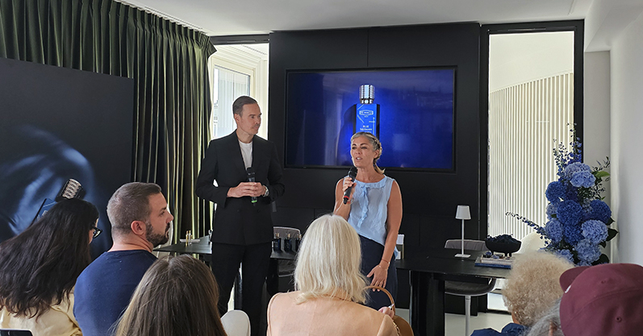
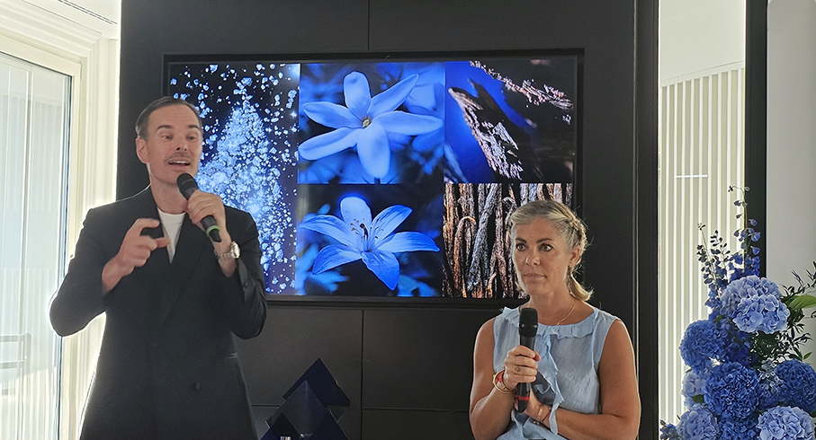
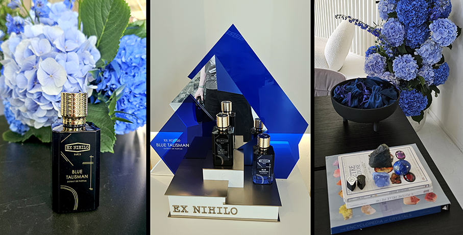

# Blue Talisman Extrait – Ex Nihilo

> Un viaggio olfattivo intenso e ipnotico, **Blue Talisman Extrait de parfum** è la versione più profonda e avvolgente dell’iconica fragranza di **Ex Nihilo Paris**

**Ex Nihilo**, espressione latina che significa "Creato dal nulla", è una **casa di profumi francese** fondata nel 2013 da un trio cosmopolita di Parigi. Il brand è stato lanciato dieci anni fa da **Sylvie Loday, Olivier Royère e Benoît Verdier**, tre esperti del mondo del lusso accomunati dalla passione per l'innovazione e le esperienze più esclusive. 

Fin dalla sua nascita, la Maison ha offerto carta bianca ai creatori di profumi, utilizzando solo i **materiali più esclusivi** e fondendo maestria artigianale e tecnologie avanzate, promuove una visione della profumeria senza compromessi, **senza vincoli creativi e di costi**. 

E’ proprio **Olivier Royère**, uno dei tre fondatori, che ci presenta **Blue Talisman Extrait de parfum** durante un evento dedicato alla stampa di settore. Esteta e collezionista, Olivier nutre un profondo sentimento per l'Alta Profumeria francese e apprezza in particolar modo le materie prime naturali provenienti da tutto il mondo.

Il **colore blu profondo** parte dal nome della nuova fragranza e continua nel flacone e nella confezione, diventando il tema trainante nella location e nella presentazione di Olivier. Arricchisce l’evento un workshop di **gemmologia**, dove vengono presentate pietre semipreziose nelle tonalità dell’azzurro e del blu, che spesso sono veri e propri **talismani energetici**. 

Del resto, Blue Talisman Extrait de parfum è concepito come **un viaggio immersivo, affascinante e poliedrico** in un gioiello prezioso. Una creazione del profumiere Jordi Fernàndez che incarna lo spirito d'avanguardia della Maison invitando a perdersi in un caleidoscopio di sensazioni. Una creazione **sfaccettata proprio come un cristallo**.

L'Extrait de Parfum intensifica la creazione originale con note più profonde e potenti. Il **Gelsomino Sambac** si fonde con il **Fiore d'Arancio** in un connubio sensuale, rivelando tonalità calde, rotonde e solari. Il fondo, arricchito da **Vaniglia** e **Sandalo**, diventa più materico e avvolgente, esaltando l'intensità della fragranza e creando una scia irresistibilmente magnetica. 

**Note olfattive**
Testa: Pera e Bergamotto
Cuore: Fiori d'arancio e Gelsomino
Base: Vaniglia, Sandalo, Muschi, Ambrofix™, Legni ambrati
