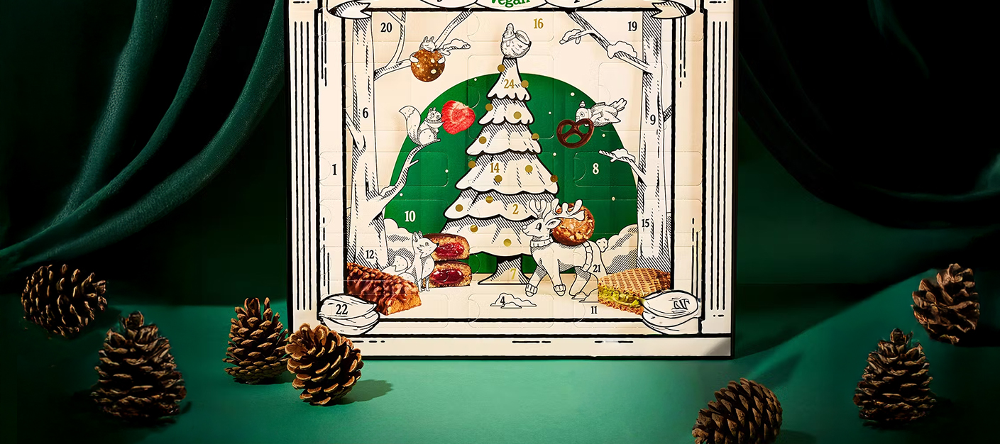
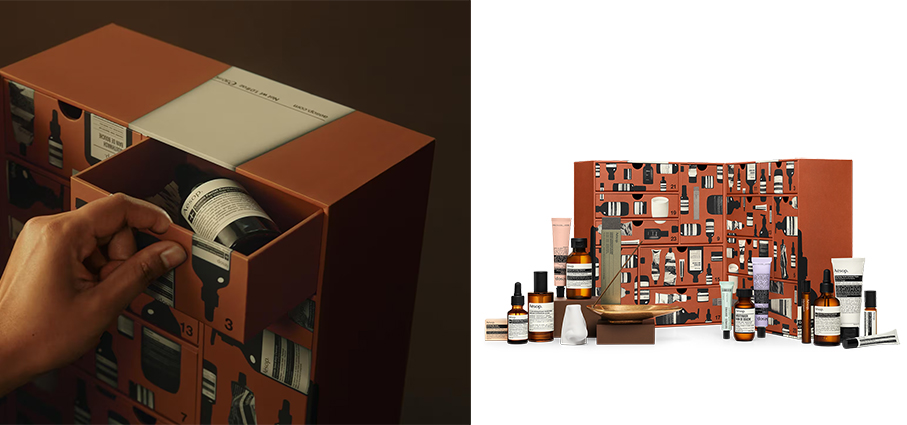
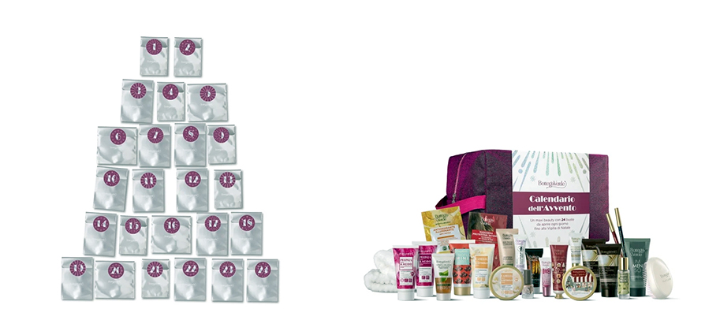
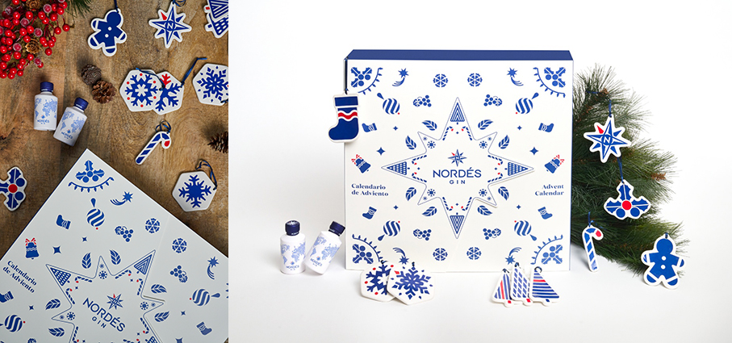
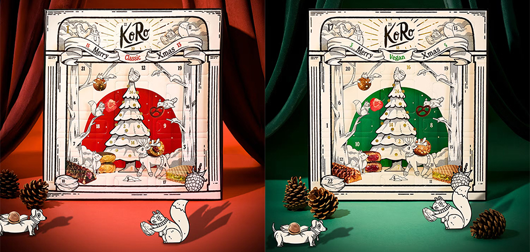
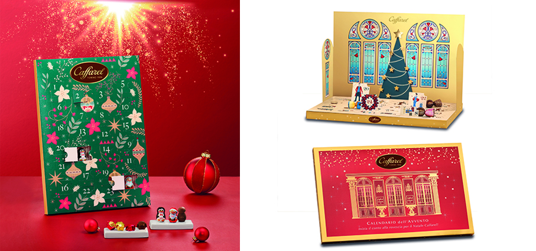
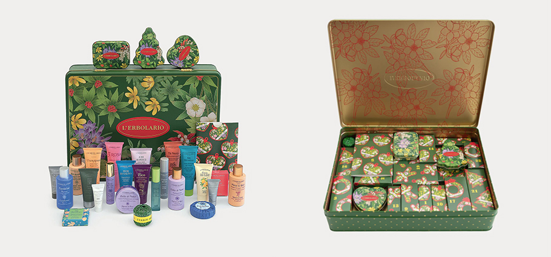
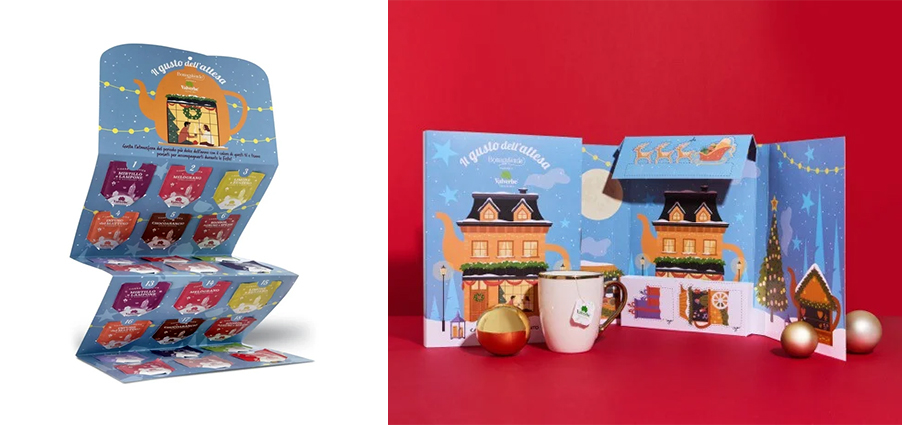
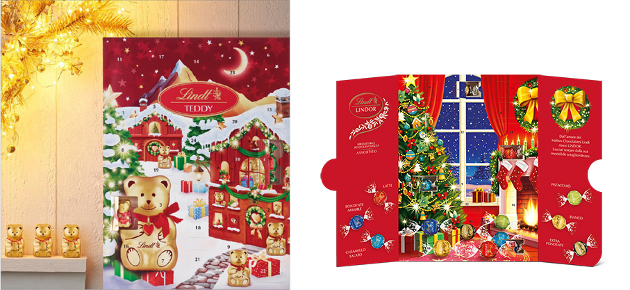

# Calendari dell'Avvento 2025

>I **Calendari dell’Avvento** sono **24 piccoli momenti** da condividere per accompagnare il conto alla rovescia verso il Natale, unendo tradizione e magia

Negli ultimi anni i **Calendari dell’Avvento** sono diventati perfetti **compagni giornalieri** verso la festa più sentita dell’anno: il Natale. Veri e propri oggetti del desiderio per gli amanti delle esperienze esclusive e addicted di brand particolari, sia nel campo della **Cosmetica**, sia del **Food & Beverage**. Questo formato è ormai sinonimo di attenzione ai dettagli e design ricercato, accompagnando i giorni dell’Avvento con un rituale che unisce emozione e piacere. 

**The Aesop Abode – Aesop** in edizione limitata, è il dono più generoso di sempre. Dietro ogni porta si cela un prodotto, ognuno con una storia da raccontare. Tredici segreti sensoriali in una casa astratta con tredici porte, un preludio ludico da sfogliare nell'attesa delle festività si apre rivelando piccoli ma robusti cassetti, finemente decorati. Una volta svuotati dei loro occupanti originali, possono essere riutilizzati come raffinati contenitori per i vostri preziosi ricordi.

**Calendario dell'Avvento 2025 – Bottega Verde** La magia del Natale inizia in anticipo con un mese di sorprese beauty da scoprire giorno dopo giorno. Un maxi beauty-case che contiene 24 buste in tre formati differenti. Puoi appenderle su una mensola o vicino al caminetto come una ghirlanda oppure puoi metterle sull'albero di Natale rendendo il tuo albero unico. Shampoo, gel struccante, bagnodoccia, maschera, smalto, creme, trucchi e tanto altro. Tra i vari prodotti, anche una confezione di ProfuMINI, polsini skincare e una mini spazzola bianca.

**Calendario dell’Avvento - Nordés** arrivato alla terza edizione, si è consolidato come un oggetto del desiderio per gli amanti del brand. Torna con un design rinnovato ispirato ai simboli più iconici del Natale: una collezione di oggetti decorativi in ceramica, pensati per addobbare l’albero e integrarsi perfettamente in qualsiasi casa durante le festività. All’interno si trovano 24 sorprese: 8 mini bottiglie di gin Nordés da 5 cl e 16 delicati ornamenti natalizi in ceramica per l’albero, ispirati alla stagione, come rose dei venti, alberi natalizi, fiocchi di neve, campanelle, omini di pan di zenzero, calze, bastoncini di zucchero e agrifoglio. 

**Calendario dell’Avvento 2025 - KoRo** un viaggio di 24 giorni tra snack dolci, salati e fruttati in due versioni, una classica e una vegana. Dal design super natalizio e con un tocco di ironia, il calendario si ispira a un vero e proprio “teatro natalizio”: ogni porticina è un piccolo atto di un grande spettacolo di sapori, che si conclude – con gusto – la sera del 24 dicembre. La versione classica contiene 24 delizie selezionate tra i best seller e alcune novità esclusive: mix di noci croccanti, frutta secca, palline energetiche e barrette proteiche. Per accontentare tutti i palati e tutte le esigenze, anche la versione vegana. Niente più caccia agli ingredienti: dietro ogni porticina si nascondono solo delizie vegetali. 

**Calendario Avvento 2025 – Caffarel** con praline assortite, è un viaggio nel gusto che combina tradizione, creatività e l’eccellenza del cioccolato torinese. Per vivere la magia del Natale con un tocco di dolcezza quotidiana:  ogni casella nasconde una pralina diversa, per un’esperienza di gusto sempre nuova.  

**Calendario Avvento 2025 Premium – Caffarel** Un calendario dell'avvento straordinario dal design elegante e prezioso, che custodisce sette deliziose praline artigianali. Le sue 24 caselle pop up, giorno dopo giorno, vanno a comporre l'emozione del Natale Caffarel. Tra le novità, spicca la storica collaborazione con THUN, che celebra l’anniversario di Gianduia con una speciale sorpresa all’interno.

**Festa dei Fiori – Bottega Verde** Calendario dell'Avvento 2025 che contiene 24 sorprese di bellezza all’interno della bellissima scatola in latta decorata: ogni giorno apri una delle scatoline e scopri un cosmetico selezionato tra i nostri prodotti bestseller e le ultime novità. I migliori trattamenti L’Erbolario in pratici formati per prendersi cura di viso, corpo e capelli. Puoi riutilizzare ogni scatolina di carta per creare deliziose decorazioni per il tuo albero di Natale passando il cordino nei fori presenti su ciascuna scatolina. Tre sorprese sono contenute in originali box in latta, da conservare insieme alla scatola grande per custodire bijoux o piccoli oggetti.

**Il Gusto dell'attesa - Calendario dell'Avvento** di tè e tisane – Bottega Verde Questo calendario dell'Avvento contiene 24 caselle con all'interno 1 filtro per un infuso al giorno. Sono 12 tipi di tisane differenti (2 bustine per gusto) da provare e da scoprire ogni giorno fino a Natale. Un regalo molto speciale, ricco di profumi, sapori e pensieri positivi. Dal Rooibos al Mirtillo, dal Melogrnao al Choco Arancio e, per finire, la Tisana di Natale.

**Calendario dell’Avvento - Maison Group** un’esperienza di bellezza senza pari: ogni casella svela un prodotto raffinato, scelto per offrire momenti di puro piacere incontrando eleganza e alta qualità nella cosmesi. All'interno 26 prodotti ricercati e di Lusso dei brand : Face+, Rigenera, Xaikonix; 12 Trattamenti Viso spiegati passo passo nella brochure creata per accompagnarti durante il tuo percorso di bellezza, giorno dopo giorno, attraverso i prodotti selezionati nel calendario. Ogni casella che apri è pensata per offrirti un momento di cura esclusivo e per rispondere ai bisogni specifici della tua pelle. 

**Calendario Avvento Orsetto  - Lindt** rende l’attesa della festa più dolce di tutto l’anno ancora più golosa. Ogni giorno scopri un nuovo cioccolatino, un ricco assortimento di dolci e golose praline e mini-orsetti, con una nuova esclusiva grafica.

**Calendario Avvento Lindor – Lindt** rende l'attesa del Natale più dolce con una nuova varietà delle ricette tanto amate: Lindor Latte, Fondente Amabile 45%, Bianco, Caramello Salato, Extra Fondente 70% e Pistacchio. all’interno 24 caselle con tutta l’irresistibile scioglievolezza delle iconiche praline Lindor. 

