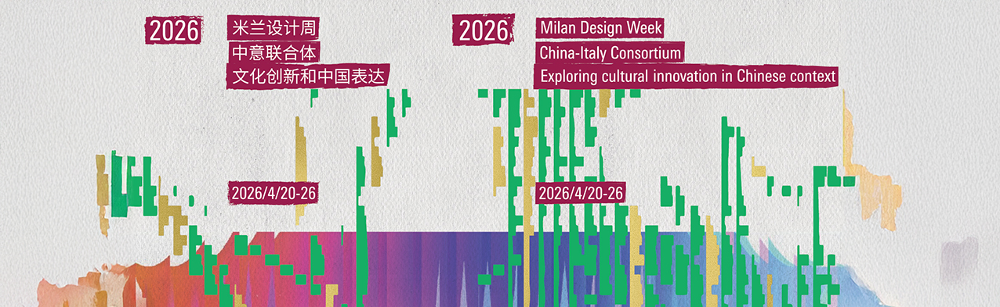
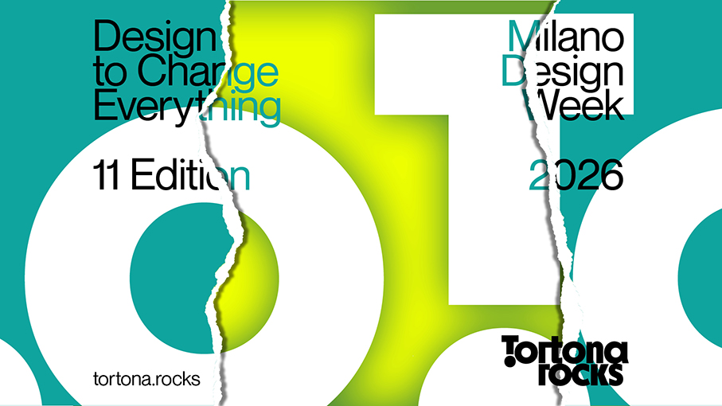
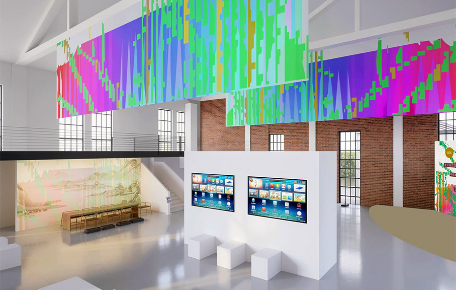
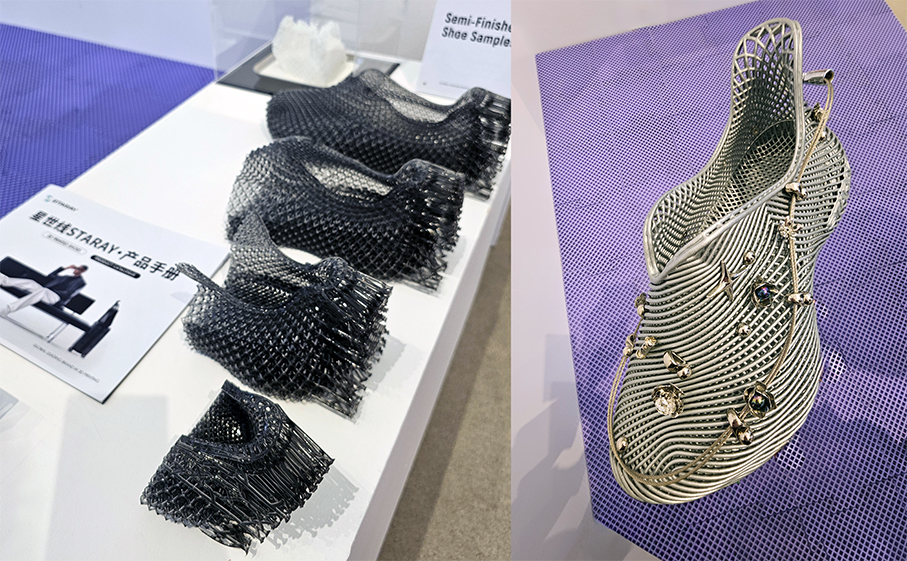
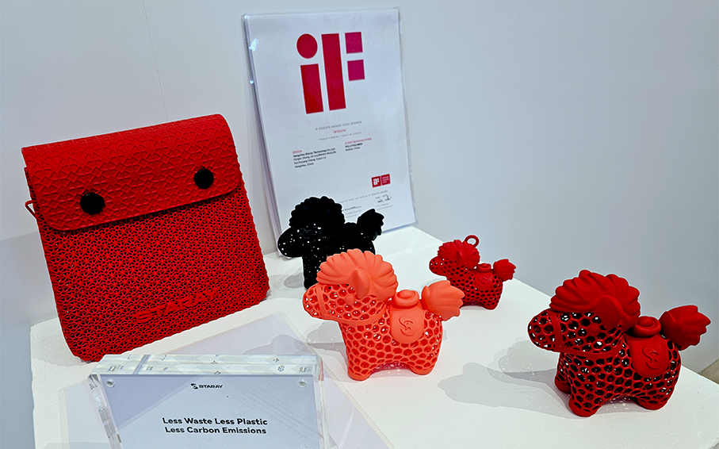
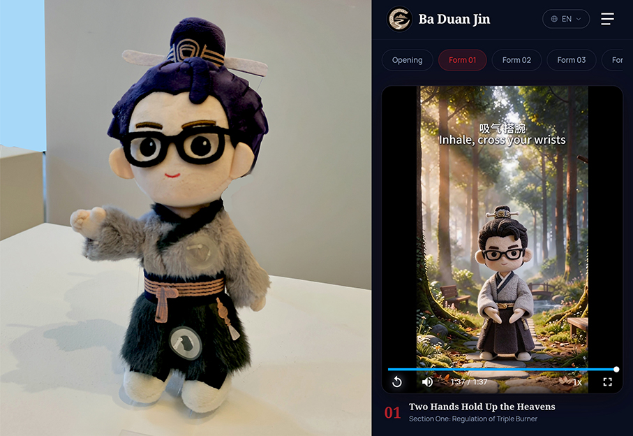
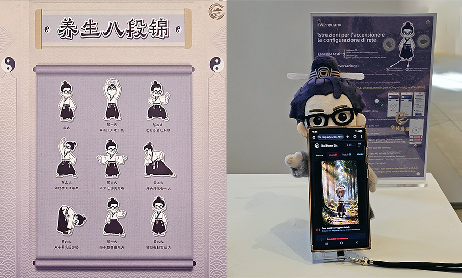
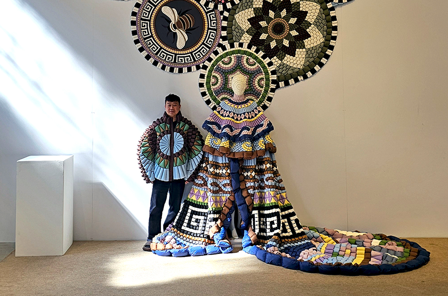
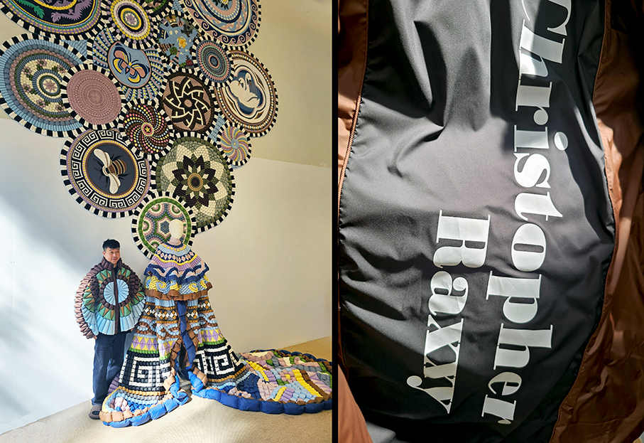

# China-Italy Consortium - Milano Design Week 2026

>**China-Italy Consortium** porta a **Tortona Rocks - MDW 2026** - un progetto che unisce il meglio delle realtà culturali e progettuali cinesi e italiane

di _Maria Rosa Sirotti_

Con undici edizioni all’attivo, Tortona Rocks si conferma una **piattaforma internazionale** dove installazioni, ricerca e nuove visioni creative ridefiniscono l’esperienza del **Fuorisalone**. L’edizione 2026, **Design to Change Everything**, esplora il design come forza capace di interpretare e trasformare il presente tamite **creatività, tecnologia e nuove visioni** del contemporaneo.

Se la realtà appare frammentata e opaca, il progetto risponde con energia trasformativa: propone alternative, apre **nuove prospettive sul ruolo del design** nel nostro tempo.
È la decisione di progettare il mondo non per adattarsi a ciò che è, ma per contribuire a ciò che può diventare.

**CHINA-ITALY CONSORTIUM/Exploring cultural innovation in Chinese context**

China-Italy Consortium è l’iniziativa che mette in dialogo le **istituzioni culturali e le realtà progettuali** dei due Paesi. Promosso da enti cinesi e italiani, tra cui la **Fondazione Culturale e Artistica Nazionale Cinese**, il **China International Culture Group** e il **Centro Culturale Cinese di Milano**, il progetto si sviluppa attorno al tema Innovazione culturale ed espressione cinese, indagando nuove prospettive del **design contemporaneo**.

La mostra riunisce oltre dieci tra imprese, istituzioni e organizzazioni, presentando un panorama articolato che spazia **dal patrimonio immateriale all’intelligenza artificiale, dai nuovi materiali alla moda, fino a installazioni artistiche** e contenuti visivi tra tradizione e innovazione.

“_Incontri, performance e momenti di scambio mi hanno inserito attivamente in un clima di scoperta, confronto e relazioni tecniche e umane di grande profondità. Grazie a questo rapporto osmotico tra le nostre due culture è nato un momento di significativo confronto internazionale, che mi ha portato a capire ancora una volta come il mondo appartenga a tutte le persone e a tutte le culture, indipendentemente da dove esse vivano e lavorino, perchè siamo tutti uniti e connessi_”. **Maria Rosa Sirotti**

**STARAY** 

Marchio cinese di **calzature premium stampate in 3D**, è focalizzato sulla combinazione di **produzione avanzata, design contemporaneo e sostenibilità**. Rappresenta una visione più ampia di come design, tecnologia e cultura possano fondersi in una nuova generazione di prodotti di consumo.
Grazie a tecnologia di stampa 3D ad altissima velocità HALS di nuova generazione, materiali flessibili polimerici di origine biologica,costruzione integrata monoblocco e una forte attenzione al comfort, alla traspirabilità e alla leggerezza, il brand si impegna a rendere le sue calzature più pratiche e significative per il mercato globale.

Semplificare la vita, ridurre gli sprechi e portare benessere delle persone attraverso prodotti sostenibili e innovative, è lo spirito che anima il marchio e dimostra come la tecnologia possa diventare parte di un futuro più umano e personale, rendendo i prodotti high-tech accessibili, indossabili e significativi.

**HUA ZHU SHENG JING (Beijing) Cultural Technology Co., Ltd.** 

Rappresenta un **ponte tra la cultura tradizionale cinese e l'innovazione tecnologica** moderna nel progetto "CHINA & DESIGN". Nell'ambito di "Design to Change Everything", l'azienda contribuisce a una piattaforma che ridefinisce il design attraverso la ricerca, l'innovazione e gli strumenti culturali in un contesto cinese, **fondendo l'estetica orientale con l'artigianato digitale contemporaneo**. 

L'azienda promuove i **prodotti culturali cinesi nei mercati europei**, intersecando industria, cultura e sperimentazione, utilizzando la **tecnologia per soddisfare i bisogni umani** e migliorare gli spazi abitativi. Il brand ha studiato e prodotto un personaggio dedicato all’insegnamento del **Qi Gong Baduanjin** (Gli Otto Pezzi di Broccato) ovvero l’Antica Arte Cinese per la Salute e la Longevità. Una **app per cellulare** è attivabile tramite una patch adesiva e si può iniziare l’**allenamento guidati dal personaggio** che ci insegna una sequenza di otto esercizi, caratterizzata da movimenti fluidi e armoniosi. 

**RAXXY**

Fondato nel 2020 dal designer William Shen, è un brand di **moda di lusso rinomato per i suoi innovativi piumini**. Il marchio fonde l'**artigianato tradizionale cinese con design 3D moderni e principi matematici**, creando capi scultorei e geometrici. Debuttando alla Shanghai Fashion Week, ha rapidamente attirato l'attenzione internazionale grazie alla sua estetica audace e futuristica.
Shen, genio della matematica e vincitore di premi alle Olimpiadi Nazionali di Matematica, ha trovato un equilibrio tra la sua **ricerca sulle leggi matematiche e l'arte, nonché il suo forte interesse per la moda**, ed è noto come un talentuoso designer matematico.

Il linguaggio culturale tradizionale cinese, combinato con algoritmi di intelligenza artificiale, ha ottenuto **numerosi brevetti nazionali per invenzioni tecnologiche**, dai numeri alle discipline umanistiche, e ha innovato tecniche artigianali uniche. Dall'esplorazione culturale giovanile all'esplorazione avanguardistica del futuro della moda, seguendo la teoria dei frattali geometrici, e utilizzando la logica dell'espressione matematica, ha creato uno **stile estetico parametrico**, creando un nuovo settore della moda globale.
