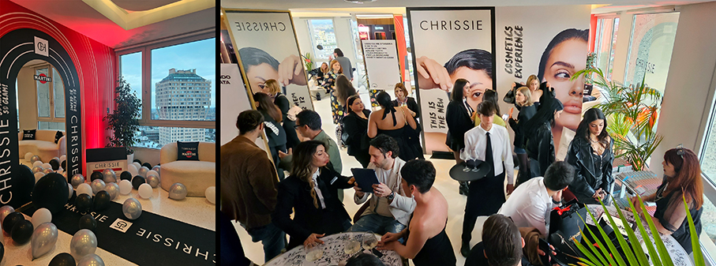
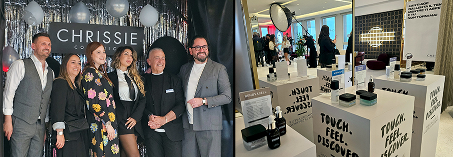
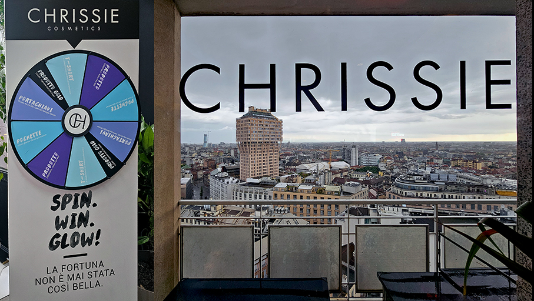
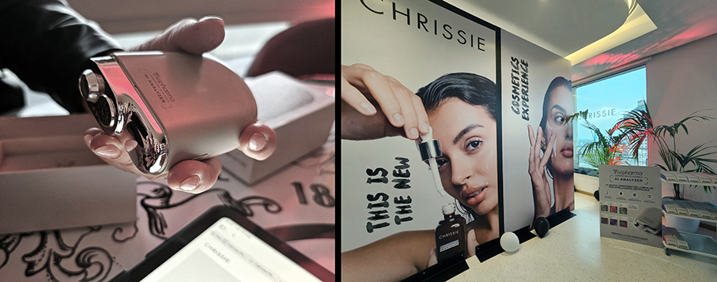
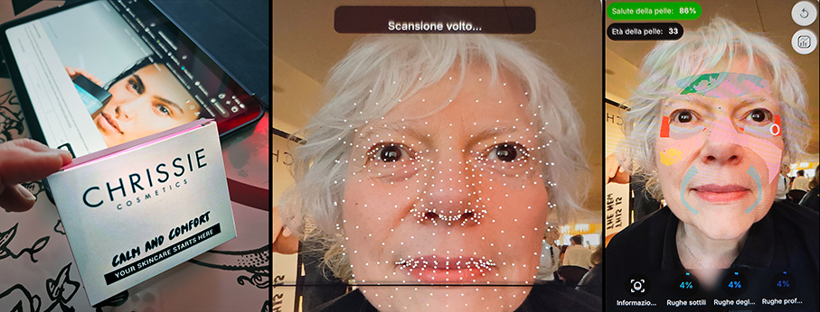
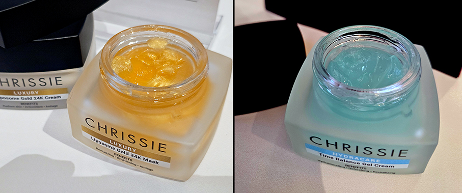
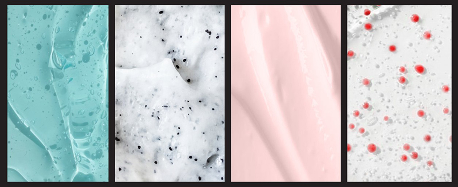

# Chrissie - The New Cosmetic Experience

>**Tra scienza e urban glamour** Chrissie ha presentato ufficialmente il suo rebranding con un evento esclusivo: **The New Cosmetic Experience** 

_di Maria Rosa Sirotti_

Non solo un lancio, ma un vero cambio di paradigma: **Chrissie Cosmetics, linea di Vivipharma**, ridefinisce il modo in cui vivere la cosmetica oggi nella iconica **Terrazza Martini a Milano**. 
Con una **nuova identità**, in un mercato affollato e sempre più competitivo, il brand sceglie di evolversi partendo da un equilibrio preciso tra un **approccio più scientifico e performante**, e un’estetica urban glamour, contemporanea, sofisticata e riconoscibile.

Chrissie Cosmetics nasce nel 2011 in **Vivipharma**, da un’esperienza già consolidata nel mondo della dermocosmesi. Oggi si evolve in un brand contemporaneo,capace di **rispondere ai bisogni reali della pelle**. Un percorso costruito nel tempo, fatto di ricerca, sviluppo e attenzione alla qualità, che oggi si traduce in soluzioni **skincare più efficaci, mirate e attuali**.

L’evento milanese è stato il lancio di questo nuovo universo attraverso un’esperienza immersiva pensata per coinvolgere tutti i sensi: dalle **experience sensoriali** dedicate alla scoperta della linea, alla presenza di influencer e professionisti del settore, fino allo speech del CEO che ha guidato gli ospiti nel racconto della trasformazione del brand. Una cosmetica che non parla solo di risultati, ma anche di percezione, esperienza e posizionamento. 

Un format che riflette perfettamente la nuova direzione di Chrissie, più vicino al **mondo delle esperienze** che a quello della semplice esposizione del prodotto. L’intento è quello di portare sul mercato una cosmetica capace di unire **credibilità scientifica e desiderabilità, performance e immagine, contenuto ed emozione**.

La scelta della Terrazza Martini non è casuale. Simbolo di una Milano dinamica, internazionale e sempre in evoluzione, diventa il luogo ideale per raccontare un brand che punta a distinguersi, parlando a un **pubblico contemporaneo e consapevole**. Un’evoluzione che riflette un cambiamento più ampio nel mondo Beauty, dove il valore di un brand unisce qualità dei prodotti e capacità di creare connessioni. 

Ogni prodotto Chrissie nasce nei **Laboratori Interni di Ricerca Vivipharma**, dove ricerca e controllo si incontrano per garantire **standard qualitativi elevati**. Formulazioni sviluppate con precisione, attenzione agli attivi e un approccio scientifico concreto, per garantire **efficacia e sicurezza**, offrendo **risultati visibili***e agendo in modo mirato  sui  bisogni della pelle.

Le materie prime sono standardizzate e scelte in base alla loro qualità sicurezza, funzionalità e sostenibilità. Un esempio è il **PDRN di origine vegetale**, sviluppato come alternativa a quello di derivazione animale, per un approccio più etico e innovativo.

Grazie all’ottimizzazione di texture e formulazioni, la **skincare risulta semplificata** e intuitiva:

**•**	Ogni famiglia di prodotti è caratterizzata da un colore;
**•**	Il nome della famiglia ne indica il campo d’azione;
**•**	Il nome del prodotto ne suggerisce le peculiarità;
**•**	In ogni prodotto sono indicati i 3 benefici principali;
**•**	La descrizione prodotto è strutturata per guidare le scelte del consumatore;
**•**	I simboli sul pack secondario identificano il tipo di pelle, la frequenza e modalità di utilizzo

_Ph. Credits: Maria Rosa Sirotti_
