# City Experiences nella Milano olimpica

>Un **calendario diffuso di iniziative** che porta l’energia delle competizioni nel cuore della città, coinvolgendo residenti, tifosi e visitatori
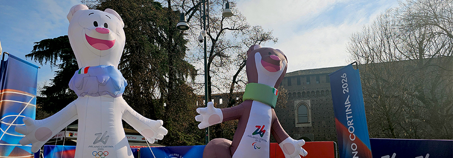

Durante i  **Giochi Olimpici e Paralimpici Invernali di Milano Cortina 2026**, nel capoluogo lombardo prende forma un ricco programma di **City Experiences** pensato per ampliare l’esperienza dei Giochi e renderla ancora più accessibile, partecipata e condivisa. Valorizzare **luoghi simbolo** offrendo occasioni di **incontro e intrattenimento** anche al di fuori degli impianti di gara.

Segnaliamo lo **Sport Village in Duomo**, con la torre verde per le tv internazionali e lo store ufficiale dei Giochi in Galleria. Altre installazioni sono presenti anche tra le vie del centro delle città tra **piazza San Carlo, piazza Santo Stefano, piazza Sempione e Darsena**, creando un percorso olimpico diffuso tra sport, tecnologia e spettacolo. 

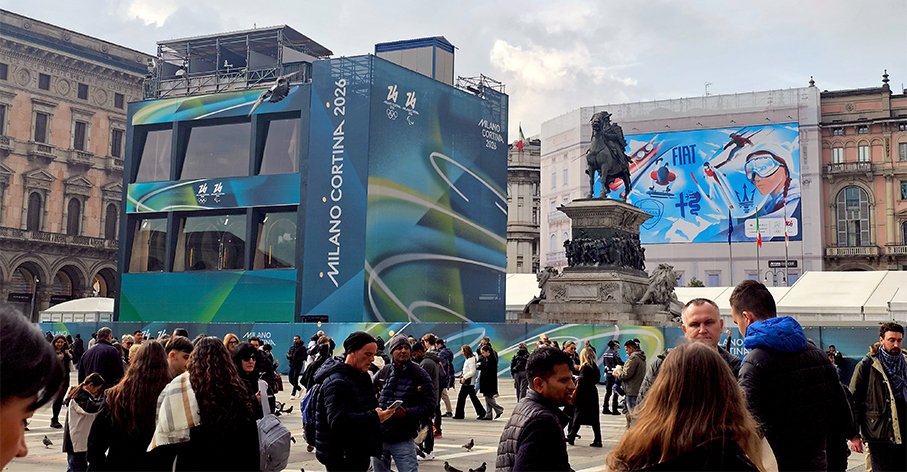

I numerosi **partner ufficiali** offrono ai fan un'opportunità unica di interagire direttamente nei **Fan Village**, veri e propri spazi di aggregazione e partecipazione. Ogni giorno propongono un **palinsesto continuo** che unisce live streaming delle competizioni e delle cerimonie, momenti di intrattenimento, attività sportive, laboratori esperienziali e incontri con atleti e campioni.

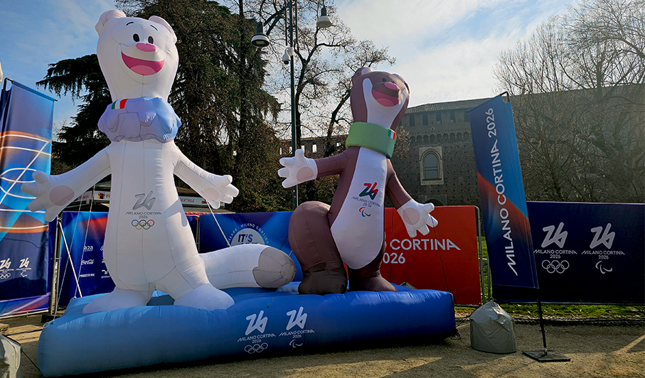

Nel **Cortile delle Armi del Castello Sforzesco** troviamo **Casa Esselunga**. All'inteno una installazione mobile interattiva, il **Banco dei Timbri**, una **photo opportunity al Superpodio** e il ritiro di un ricordo iconico presso Il Banco delle Sorprese: la focaccina Esselunga che diventa mascotte personalizzata dei giochi. 

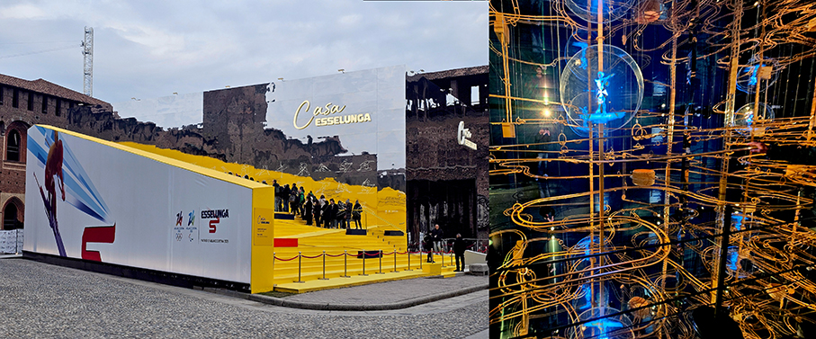

**Alfa Romeo, FIAT, Lancia e Maserati** presentano una nuova e spettacolare campagna di comunicazione outdoor come **Automotive Premium Partner ufficiali dei Giochi**. Al Castello Sforzesco troviamo un’installazione immersiva con superfici retroilluminate, pannelli verticali e percorsi tematici accompagneranno per un viaggio tra heritage, design e innovazione. Piattaforme dedicate per **scatti fotografici iconici**, ispirati ai manifesti sportivi d’epoca e un quiz finale con premi.

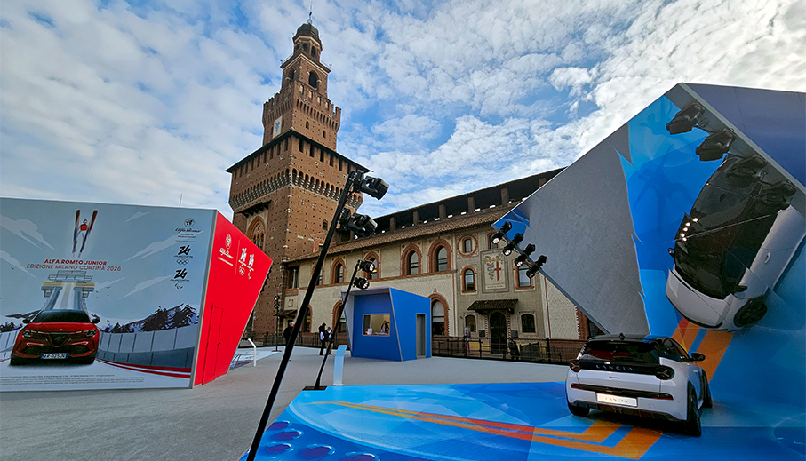

Negli **store ufficiali - Off Venue** i visitatori possono scoprire le collezioni ufficiali suddivise in aree tematiche, disegnate da **Salomon e Armani**,  insieme ai **gadget ufficiali**, agli iconici distintivi e alle **mascotte Tina e Milo**, accompagnati dai loro aiutanti, i Flo. Tutte le sedi:

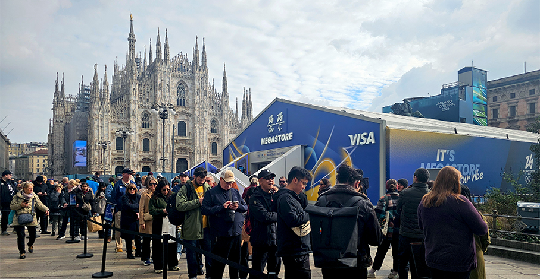

Completa l’offerta il programma dell’Olimpiade Culturale per promuovere i valori Olimpici e Paralimpici attraverso cultura, patrimonio e sport.
Alla **Triennale**, l'installazione **Triennale x Milano Cortina 2026** celebra i simboli olimpici e ai valori dei Giochi. Il percorso propone esperienze interattive che raccontano la **storia delle Olimpiadi invernali **attraverso video, fotografie e materiali d'archivio. 

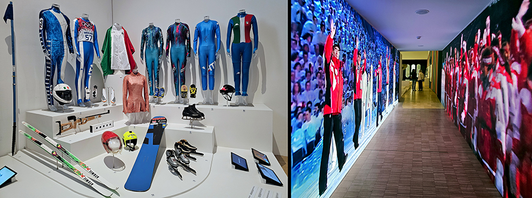

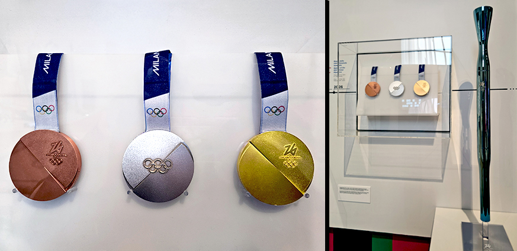

La mostra **White Out The Future of Winter Sports** mette design, architettura e tecnologie in dialogo con il cambiamento climatico. Focus su discipline, progetti, equipaggiamenti e tecnologie.
Grazie al design, lo Sport sviluppa un corredo di **oggetti, uniformi, infrastrutture, strumenti e apparati** dove la ricerca sui materiali, lo studio dei movimenti accompagnano la sfida dei corpi e si fondono nella performance della competizione. Non c’è settore merceologico che non sia coinvolto. 

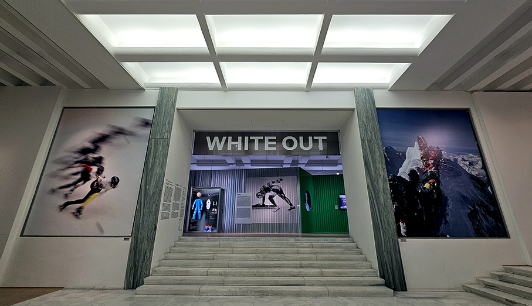

Grazie al design e alla ricerca, lo sport è un mondo che oggi include una moltitudine di donne e di uomini di ogni provenienza, di ogni tradizione e la cui fisicità, anche quando non conforme perché assoggettata a un’abilità compromessa, riesce a **esprimersi con grinta e sacrificio**, con gioia e **accessibilità**. 

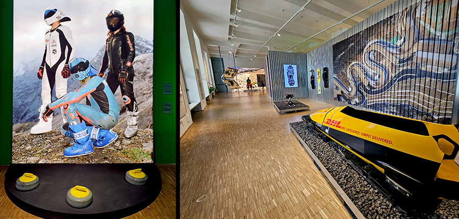

All'ingresso di Triennale una scultura monumentale: l’ **Orso** di **Jacopo Allegrucci**. Come le altre specie in via di estinzione già realizzate ed esposte dall'artista, l'animale incarna una condizione di vulnerabilità, abbracciando la sconfitta in modo giocoso e ironico; infatti, invece di rialzarsi dopo la caduta, l'orso si concede un gelato. 

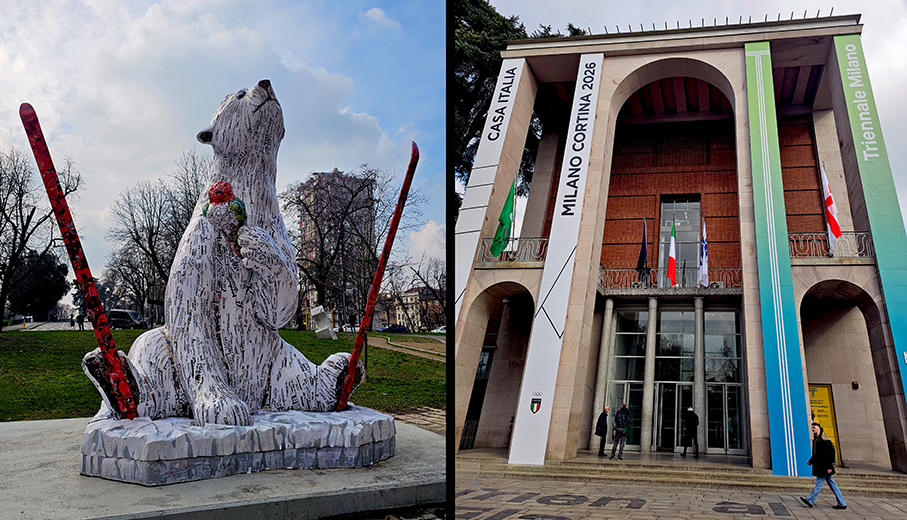

Il **Mudec** ,dal 12 febbraio al 28 giugno 2026, propone **Il Senso della Neve**, una lettura poetica, scientifica e culturale della neve. L'esposizione si apre con la grande installazione di **Chiharu Shiota**, una nevicata metaforica di fili e fogli sospesi. Oltre 150 opere - tra **manufatti etnografici, dipinti, fotografie, video e installazioni** dai temi chiave: sciamanesimo, adattamento ai climi estremi, overtourism, fragilità degli ecosistemi.

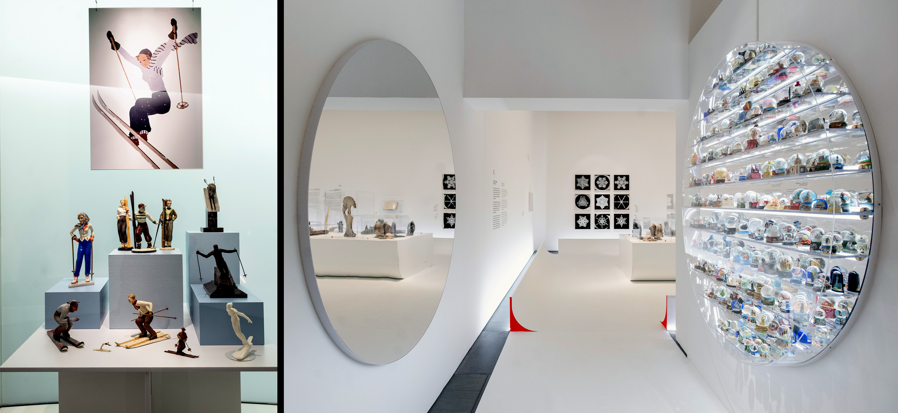

L'**Oasi life experience – Casa Lombardia 2026**, in **piazza Città di Lombardia**, è un luogo da vivere pienamente, con installazioni artistiche, percorsi sensoriali e contenuti culturali che raccontano le eccellenze italiane e lombarde, i valori dello sport e il legame tra uomo, territorio e futuro.

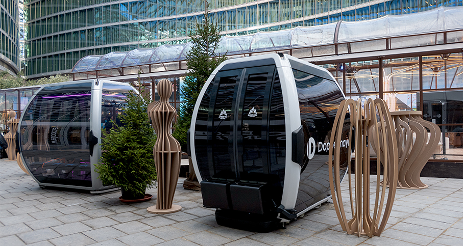

Molte le case degli altri comitati olimpici: **Casa Italia**, in Viale Alemagna 6, dove sono in mostra le divise ufficiali dei giochi, su disegno di Armani.

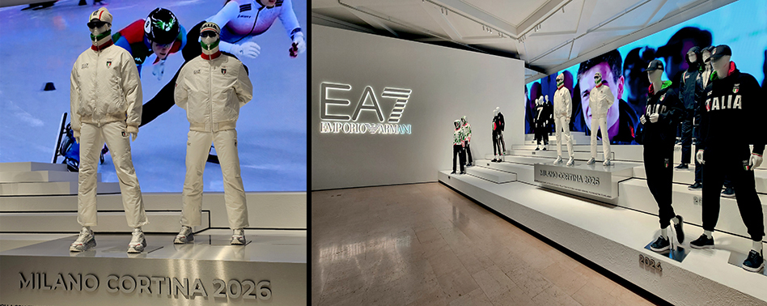

Seguono poi le altre case: **Brasile** (Via Agostino Betani 2), **Paesi Bassi** (Superstudio Events), **Slovacchia** (Galleria Meravigli), **Svizzera** (Centro Svizzero), gli **USA** (Palazzo Ralph Lauren). **China House** è ospitata a Villa Clerici e **Casa Corea (Korea House)** è aperta dal Comitato Sportivo e Olimpico Coreano a Villa Necchi Campiglio.

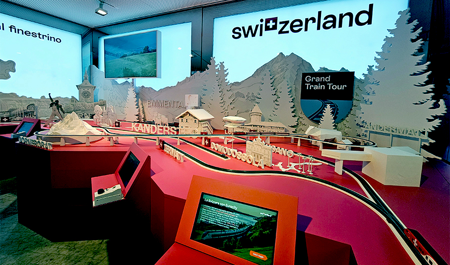

Tutte le informazioni, i programmi e gli appuntamenti sono disponibili sul sito ufficiale di Milano Cortina 2026.

