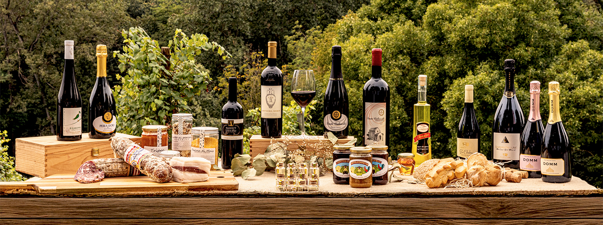
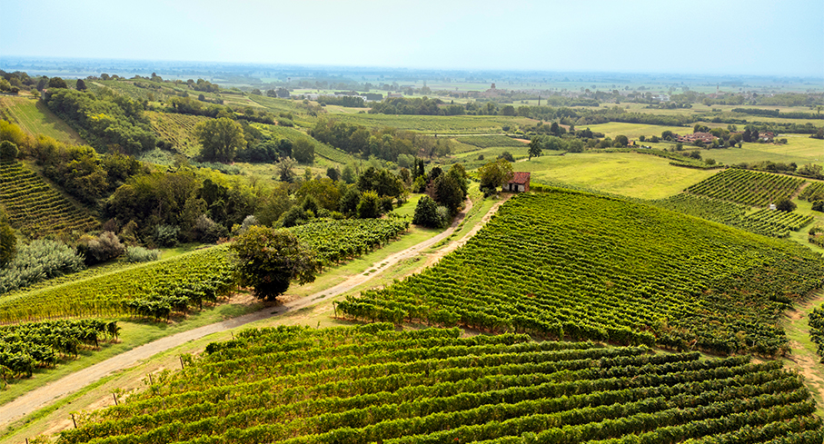
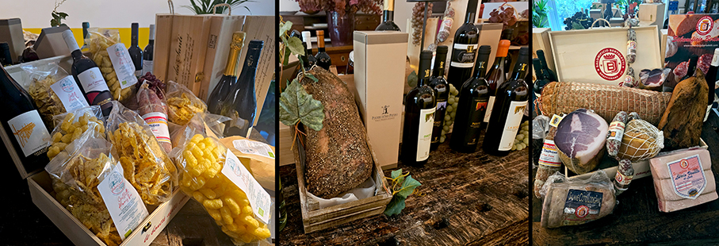
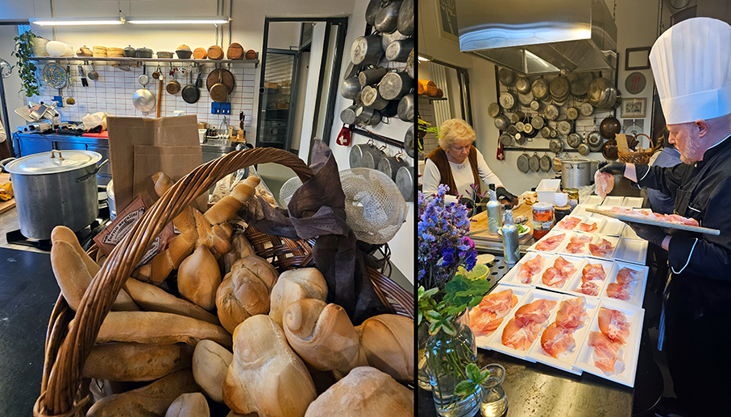
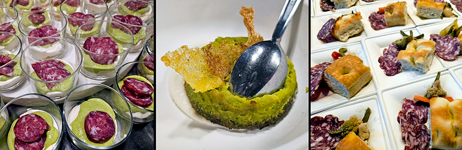

# Collina di San Colombano - Distretto Agroalimentare d’eccellenza

>Da **anomalia geografica padana** a distretto produttivo di **eccellenze Food & Beverage** riunite in cooperativa consortile

_di Maria Rosa sirotti_

Un territorio di **vigne, ciliegi e sentieri**, dove si produce **l'unico vino DOC di Milano** e dove il tempo ha un ritmo diverso: a quaranta chilometri a sud di Milano, nel centro della Pianura Padana, sorge la **Collina di San Colombano**. 
Collocata al centro di un triangolo tra Milano, Lodi e Pavia, la collina è **un'anomalia geografica** nel mezzo della pianura: si eleva fino a 147 metri sul livello del mare e offre, nelle giornate serene, un panorama che abbraccia le Alpi a nord e i primi rilievi appenninici a sud. 

Il suo cuore coincide con il territorio del **Parco Locale di Interesse Sovracomunale "Collina di San Colombano" (PLIS)**, che riunisce **cinque comuni** appartenenti a due province e a una città metropolitana: l'enclave di **San Colombano al Lambro (MI), Miradolo Terme (PV), Graffignana (LO), Inverno e Monteleone (PV) e Sant'Angelo Lodigiano (LO)**. Qui, dal 2022, un Distretto Agroalimentare lavora per tenere insieme tradizione, innovazione e cura del paesaggio.

 La presenza della **viticoltura** qui risale all'epoca romana, come confermano i ritrovamenti archeologici nella zona. Nel 1984 è arrivato poi il **riconoscimento DOC per il "San Colombano"**, che rimane ad oggi l'unico vino a Denominazione di Origine Controllata prodotto nei territori milanese e lodigiano.

Accanto al vino, la **ciliegia**, celebrata ogni maggio con una Festa che va avanti da oltre trent'anni. 
Il **pisello di Miradolo Terme**, conosciuto anche come erbion, un prodotto dell'Arca del Gusto di Slow Food che i contadini locali seminavano tra i filari di vite. E anche **zafferano, miele e ortaggi**. E la rinomata **struttura termale a Miradolo**.

 
Il **Distretto Agroalimentare della Collina di San Colombano** è nato il 4 maggio 2022, nella forma di società **cooperativa consortile** a responsabilità limitata, e riconosciuto da Regione Lombardia nello stesso anno. È uno strumento costruito per far lavorare insieme imprenditori agricoli, operatori dell'accoglienza, ristoratori e soggetti pubblici e privati attorno a obiettivi condivisi, attrarre investimenti e risorse, promuovere il territorio come destinazione di turismo di prossimità. 

I soci fondatori sono **23 aziende**, tra cantine vitivinicole, produttori di miele, di zafferano, di ortaggi e cereali, ristoratori, agriturismi, un'azienda di servizi termali e una di macellazione e trasformazione delle carni suine. Parte di loro svolgono attività di educazione ambientale, sostegno sociale e organizzazione di eventi culturali.

Con **AgriECO** il Distretto ha avviato una serie di interventi che oggi costituiscono la base del suo lavoro sul territorio:

**Vigneti e Natura**
Sviluppato con Fondazione Lombardia per l'Ambiente, ha portato il monitoraggio scientifico di uccelli e farfalle diurne, indicatori riconosciuti della qualità ambientale, in circa 150 ettari di vigneto classificati come Area Prioritaria per la Biodiversità dalla Regione Lombardia. Le aziende vitivinicole aderenti hanno sottoscritto un accordo volontario con un protocollo di gestione orientato alla biodiversità. 

**Il Giardino dei Ciliegi**
Il progetto ha trasformato un terreno incolto di circa 7.200 metri quadrati a San Colombano al Lambro, concesso gratuitamente al Distretto per dodici anni, in un laboratorio agricolo e sociale a cielo aperto: trecento ciliegi piantumati, uno spazio didattico per le scuole in collaborazione con l'ITS Agrorisorse di Lodi, percorsi di inserimento lavorativo attivati con la Rete di Agricoltura Sociale Lodigiana. 
Con "Adotta un Ciliegio" il progetto si è aperto al pubblico: chiunque può contribuire all'espansione dell'iniziativa e, dal terzo anno, ricevere parte dei frutti della propria pianta.

**La sentieristica della Collina**
Sul fronte della fruizione, il Distretto ha completato la mappatura dei percorsi escursionistici della Collina, con una carta dei sentieri disponibile in formato cartaceo e digitale.

La progettualità del Distretto guarda però oltre:

**Progetto Erbion**
Realizzato insieme all'Associazione Amici di Miradolo e al Comune di Miradolo Terme, punta al rilancio del pisello di Miradolo attraverso la coltivazione sperimentale nei campi del Distretto e l'avvio, nell'annata agraria 2025/2026, di una produzione strutturata presso le aziende agricole associate, nel rispetto di un disciplinare di qualità.

_Ph. Credits: Maria Rosa Sirotti_
