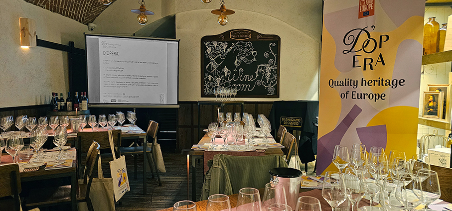
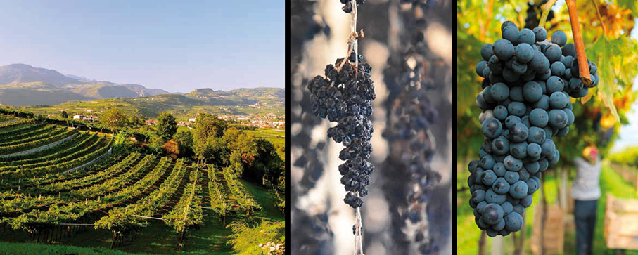

# D’Opera – Quality Heritage of Europe 

>Milano ha ospitato il progetto **D’OPERA – Quality Heritage of Europe**, promosso dal **Consorzio per la Tutela dei Vini Valpolicella** e dal **Consorzio del Parmigiano Reggiano**

D’OPERA – Quality Heritage of Europe è un **programma triennale** cofinanziato dall’Unione Europea, nato per **promuovere il patrimonio enogastronomico** italiano e rafforzare la consapevolezza dei consumatori su concetti chiave come la qualità certificata, la tracciabilità e la sostenibilità delle filiere. Le attività previste si concentreranno **sulla formazione e sulla conoscenza**, offrendo opportunità per approfondire i processi produttivi e le caratteristiche organolettiche dei vini Valpolicella e del Parmigiano Reggiano. La campagna è destinata al pubblico di **Italia, Francia e Germania**. Il nome richiama un doppio significato: “Opera” come insieme armonico di elementi (vino e formaggio in dialogo); “DOP” come riferimento diretto alla Denominazione d’Origine Protetta, simbolo di autenticità, legame con il territorio e garanzia di qualità.
 
Per questo, il progetto spiega il valore dei sistemi di certificazione europei che garantiscono origine, identità, responsabilità e tracciabilità: **DOP** (Denominazione d’Origine Protetta) – tutte le fasi produttive avvengono in un’area geografica delimitata; **DOC** e **DOCG** (per i vini) – riconoscimenti di qualità progressivamente più elevata, con la DOCG al vertice della piramide qualitativa.

Nella sede **Signorvino** di via Dante a Milano si è tenuta una **masterclass** dedicata a **Valpolicella DOC e Valpolicella DOC Superiore** riservata a stampa e operatori del settore e condotta dal giornalista e critico **Alessandro Torcoli**, direttore di Civiltà del Bere. L’abbinamento con **diverse stagionature di Parmigiano Reggiano** è stato curato dall’assaggiatore **Alessandro Stocchi**. E’ stato l’inizio di un percorso che porterà queste eccellenze italiane in contesti nazionali e internazionali, costituendo un’occasione di confronto tra addetti ai lavori, media e appassionati.

Il **Valpolicella DOC** è un vino giovane e versatile, perfetto per ogni occasione. Si distingue per il suo colore rosso rubino brillante, i profumi freschi di ciliegia e frutti di bosco, e un gusto vivace e armonioso.
La tipologia **Superiore**, che deve avere caratteristiche qualitative maggiori, viene prodotta con le uve
scelte dai vigneti migliori, talvolta con leggeri appassimenti che portano ad alcolicità e struttura più sostenute; prima di essere immesso sul mercato, è previsto un affinamento di almeno un anno.
Ideale da abbinare a piatti leggeri, carni bianche e formaggi giovani.
Le varietà principali includono la Corvina, che apporta struttura, aromi e morbidezza; il Corvinone, noto
per i sentori speziati di marasca e la complessità aromatica; la Rondinella, resistente e sapida, che dona
colore e freschezza; e - in misura minore - la Molinara, con la sua acidità equilibrata e le note fragranti che
arricchiscono il bouquet aromatico.

Il **Parmigiano Reggiano** è uno dei formaggi più antichi e rinomati al mondo. Le sue origini risalgono al Medioevo, quando i monaci benedettini e cistercensi, nelle abbazie dell’Emilia, cercarono di creare un formaggio capace di conservarsi a lungo. Fu così che nacque il Parmigiano Reggiano, grazie a una combinazione di tecniche avanzate per l’epoca e alle risorse naturali di un territorio unico.
Il legame con il territorio è essenziale e insostituibile. La zona di produzione si estende su cinque province: **Parma, Reggio Emilia, Modena, Bologna** (a sinistra del fiume Reno) e **Mantova** (a destra del fiume Po). Questo territorio, con la sua biodiversità e le sue condizioni climatiche ideali, fornisce le materie prime necessarie per un latte unico al mondo, ricco di flora microbica autoctona.
I pascoli della zona di origine, composti da erbe, foraggi e fieni locali, influiscono sulla composizione
del latte, che è alla base del formaggio. Le bovine destinate alla produzione di latte per il Parmigiano Reggiano seguono un’alimentazione regolamentata, con una dieta a base di foraggi non fermentati e prevalentemente di origine locale. La coagulazione del latte avviene lentamente e naturalmente grazie all’aggiunta di caglio e siero innesto, senza l’utilizzo di additivi o conservanti.
La **stagionatura minima è di 12 mesi**, ma può prolungarsi **fino a 36 mesi o più**, sviluppando così una complessità  di sapori e aromi unici.

Durante la masterclass, sono stati assaggiati e descritti 8 vini Valpolicella:

**Romiglia - Valpolicella DOC 2023** ha il 20% di uve passite che danno carattere più fruttato e di spessore. Frutti rossi e lampone, tannino vibrante perché vinificato solo in acciaio, 12 gradi.

**Mizzon - Valpolicella DOC 2023** ha profumo meno intenso ma sapore sfaccettato con sentore di pepe. 12 gradi. Solo uve fresche. Vino espressivo e croccante.

**Lavagnoli - Valpolicella DOC 2023** solo uve fresche, con nota di viola e ciliegia. 12,5 gradi. La pruna delle bucce dell'uva cattura tantissimo dal terreno e ci sino tante piante di ciliegia.

**Valentina Cubi - Valpolicella DOC Classico Iperico 2022** organic wine. Si sentono fiori macerati, frutti rossi maturi ma freschi, cominciano a sentirsi profumi di spezie e tabacco dolce. Tannino spigoloso, piccante sul finale, punge. 12 gradi. Vino organico.

**Corte Archi - Valpolicella DOC classico superiore Crualto 2023**. Non c'è la Molinara come accade spesso nei superiori, perché è uva chiara che dà freschezza che qui non si vuole. Botte di rovere francese. Lieviti autoctone. 13,5 gradi.

**Sartori di Verona - Valpolicella DOC classico superiore Montegradella 2022**. Hanno aggiunto 5% di Croatina rossa che da colore e struttura. Cemento e 1 anno in grandi botti di legno. Il cemento fa respirare il vino senza lasciare aromi. 13,5 gradi. Tannino forte presente ma mantiene vivacità, Spezia e piccantezza.
Finale di fiore macerato.

**Marchi  - Valpolicella DOC superiore 2022**. 13 gradi con Croatina e senza Molinara. Uva di collina calcarea 500 metri che dà più struttura al vino, ventilazione salubre, uve migliori e più intense. L'acqua scorre a valle e non si trattiene creando i pericolosi ristagni. Serbatoio in acciaio e poi tonneau. Da una parte sentiamo la freschezza, dall'altro le spezie, tocco di cannella, pepe, che è nel DNA della Croatina. Molto sfaccettato. Acidità di uve di collina molto importante. Tannino preciso e squillante di carattere. Un Valpolicella molto moderno che non fa pensare alle altre tipologie della zona. È un rosso secco anche da invecchiamento.

**Tenuta Santa Maria Valverde  - Valpolicella DOC classico superiore 2021**. Una annata non calda e arida. Equilibrata, non ha piovuto molto. Oseleta per il 10%. Alta collina 500 metri. Origine vulcanica del suolo. Acidità bassa. Un vino complesso. Andiamo verso il sottobosco e il tabacco. Un vino più classico.

Sono stati poi valutati e degustati 4 tipi di Parmigiano Reggiano:

**Parmigiano Reggiano Stagionatura 24 mesi**. Giallo paglierino dal molto tenue all'intenso. Il colore deve essere omogeneo. Punti e bolle bianche danno croccantezza ed è Tirosina una proteina del latte un amminoacido. Sentore ancora di latte, burro fuso e panna, compare sentore erbaceo. Componente dolce e saporita, spigolosa acida che ricorda lo yogurt. Friabilita, granuloma e solubilità so o le caratteristiche di riferimento per valutare un parmigiano. E ancora umido, elastico, e necessità di salivazione.

**Parmigiano Reggiano Stagionatura 48 mesi**.  colore più scuro, i puntini di Tirosina diventano piccole sfere più grandi. Non sa più di latte, cominciano sapore di spezie e noce moscata. Bella componente sapida si sente umani e un poco di amaro. Tendenze a sciogliersi in bocca.

**Parmigiano Reggiano Stagionatura 60 mesi**. Colore un poco più intenso, Tirosina ben presente. Sapore tostato e compaiono piccantezza, astinenza, amaro, asciugatura e aumento del grandezza dei granuli. Si ritrova il legnoso delle assi di stagionatura. 
