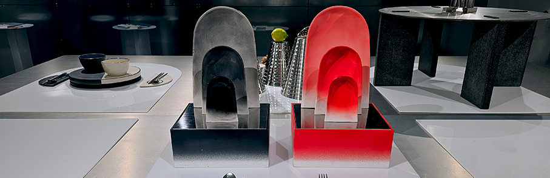
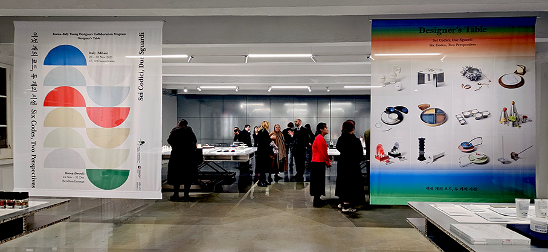
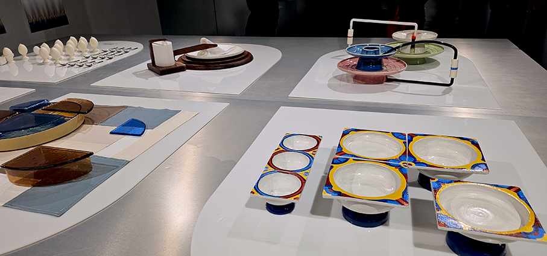
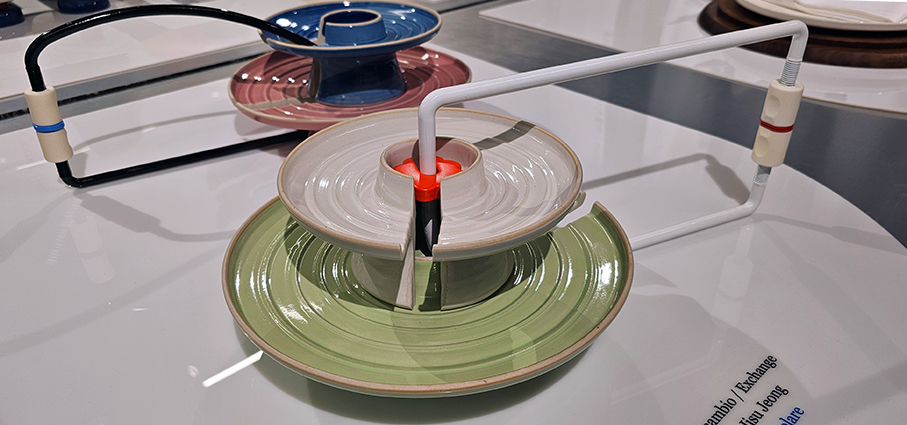
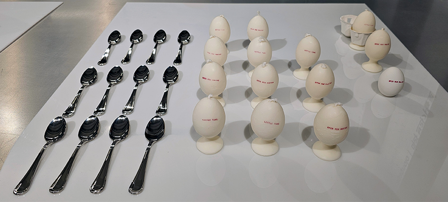
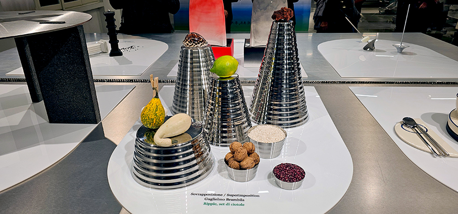

# Designer’s Table unisce Corea e Italia attraverso il design

>Inaugurata a Milano da 10Corso Como la mostra del progetto **Designer’s Table** che vede protagonisti sei giovani **designer coreani e sei italiani**

Piatti e stoviglie della tavola italiana reinventati da giovani designer coreani e giovani designer italiani che presentano la loro tavola coreana: è questo il link che unisce i **due paesi nel nome del design**. Le opere in esposizione in contemporanea in Italia e in Corea: **a Seoul** fino al 31 dicembre al Seoul Design Festival, Seochon Lounge e **a Milano** fino al 30 novembre presso l’iconico concept store 10 Corso Como.
Il programma è organizzato da **Kofice** (Korean Foundation for International Cultural Exchange) per celebrare la creatività e la **collaborazione** tra le nuove generazioni di designer dei due Paesi. 

L’obiettivo di “Designer’s Table” è promuovere uno **scambio culturale tra 12 giovani designer selezionati da Corea e Italia**, chiamati a esplorare ed esprimersi sulle **culture gastronomiche** dei due Paesi attraverso il linguaggio del design, con attività di mentoring e workshop della durata di circa cinque mesi. Il Ministero della Cultura, dello Sport e del Turismo della Repubblica di Corea (MCST) ha organizzato una cerimonia di lancio in diretta streaming per “Designer’s Table”, ospitato dalla Korean Foundation for International Cultural Exchange (KOFICE, presidente Park Chang Sik), per celebrare l’Anno dello Scambio Culturale Corea-Italia 2024-2025. 

I mentori italiani del progetto sono l’architetto **Ico Migliore**, fondatore dello studio di progettazione internazionale Migliore+Servetto e professore al Politecnico di Milano, e **Mario Trimarchi**, architetto e product designer, entrambi con sede a Milano. I mentor coreani sono **Yeo Miyoung**, CEO di Studio D3 e profondo conoscitore del design e della cultura italiana, e **Park Sungjae**, CEO della filiale coreana del marchio italiano di illuminazione Flos. 

**I designer italiani vincitori**

1.	Guglielmo Brambilla (Bergamo&Seoul) _Designer di oggetti attivo tra Bergamo e Seoul. Affascinato dalla cultura materiale, dal potere narrativo degli oggetti e dai rituali a essi legati, crede nell’importanza delle tradizioni così come nella necessità di ricontestualizzarle attraverso l’introduzione di nuovi artefatti e abitudini.

2.	**Marlisa Marasco** (CGimigliano&Pavia) _È una designer e architetta calabrese. Il suo lavoro nasce dall’incontro tra memoria, materia e narrazione: attraverso oggetti e spazi, reinterpreta il suo patrimonio culturale in chiave contemporanea, trasformando la tradizione in un linguaggio intimo e poetico.  

3.	**Mara Bragagnolo** (Genova) _È un Interior Designer dedicata alla creazione di spazi e progetti con un focus sul design inclusivo e accessibile. Originaria di Genova, ha completato la sua formazione laureandosi in Interior Design presso la Glasgow School of Art. Successivamente, si è anche specializzata in Olfactive Spatial Design e Architettura Inclusiva.

4.	**Giglia Vecchiato**, SURI studio (Venezia) _SURI Studio è un progetto indipendente legato al gioiello contemporaneo e alla scultura. Venezia è la sua città, la presenza costante dell’acqua è un fattore determinante che scandisce il ritmo della vita. È un’acqua lenta, costante, in leggero movimento, che gioca con la luce in un modo indescrivibile. Condiziona tutto.

5.	**Gianluca Sestini** (Firenze)_ Designer toscano, attivo sul territorio fiorentino. La mia ricerca si concentra sullo spazio urbano e sugli oggetti che lo abitano, indagandone il valore d’uso e la dimensione relazionale. Al centro del mio lavoro c’è la relazione tra persona e oggetto, intesa non solo in termini di consumo, ma di fruizione attiva e consapevole.

6.	**Giulia De Franco** (Milano) _Product Designer milanese con una profonda passione per l’innovazione e la sostenibilità. Crea soluzioni che uniscono estetica e funzionalità, con un particolare interesse per la Biomimetica e lo sviluppo di Bio-Materiali. Esplora nuove idee ed affronta sfide creative, aspirando ad un miglioramento continuo attraverso lo studio e la ricerca.

**I vincitori di Seoul**

1.	**Euna Lee** (Seoul &Sydney) _Designer e narratrice che vive tra Seul e Sydney. Con un background in architettura del paesaggio e illustrazione, esplora il modo in cui narrazioni visive e oggetti plasmano gli ambienti quotidiani. La sua attività spazia dalla creazione di libri illustrati all’insegnamento della programmazione, dalla creazione di prodotti alla vendita di strumenti software creativi.

2.	**Heeueon Rha** _ Designer con sede a Seul che crea esperienze giocose che incoraggiano il pubblico a vedere concetti familiari da nuove prospettive. Appassionata di esplorazione della materialità, esplora costantemente nuovi media, spaziando da mobili e oggetti all’intelligenza artificiale, al web e alle esposizioni.

3.	**Jisu Jeong** _Progetta oggetti che si possono toccare con mano, infondendo in essi esperienza, materialità e memoria sensoriale. Convinta che gli oggetti possiedano una silenziosa vitalità, esplora il sottile movimento strutturale nelle sue opere. Attraverso il design, immagina delicate connessioni tra persone e oggetti: un futuro intimo di presenza condivisa.

4.	**Junghyun Kim** _ Persegue un design d’impatto, come una storia che chiunque possa sentire e comprendere. Ogni prodotto è realizzato per suscitare curiosità, coinvolgere e lasciare un’impressione duratura. Progetto non solo per l’uso, ma per l’emozione, il ricordo e il significato.

5.	**Jungyeon Shin** _ Radicata nella progettazione spaziale, la sua pratica esplora una creazione senza confini tra discipline diverse. Affronta temi iperspecifici come tradizione, materialità, località e cultura del consumo, riformulandoli attraverso approcci sperimentali.

6.	**Subin Seol** (Seoul & London) _Crede che il design non sia solo una questione di estetica e funzionalità, ma anche un potente mezzo narrativo. La filosofia progettuale di Seol si concentra sulla trasmissione di esperienze e messaggi più profondi attraverso la fusione di artigianalità e narrazione.

_Ph. credits: Maria Rosa Sirotti_