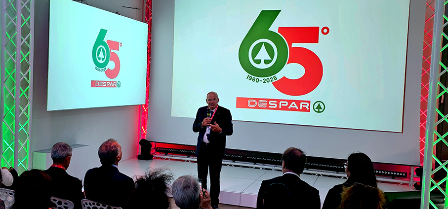
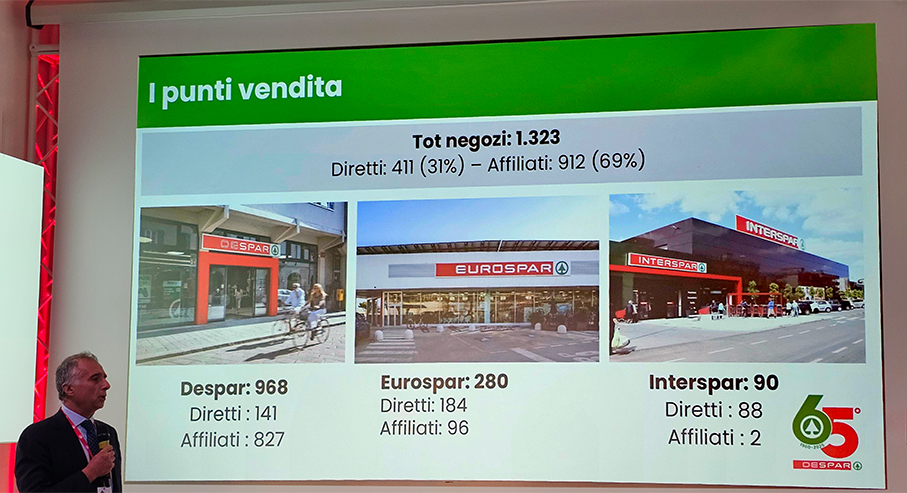
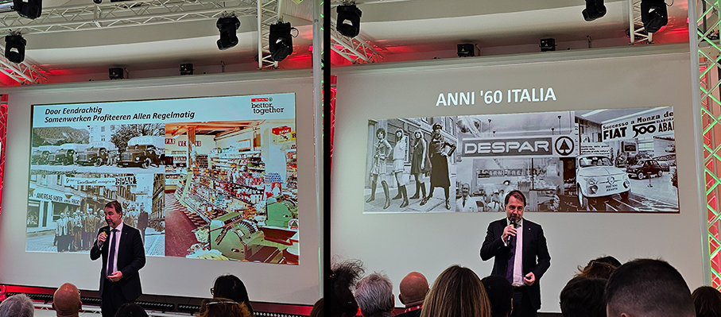
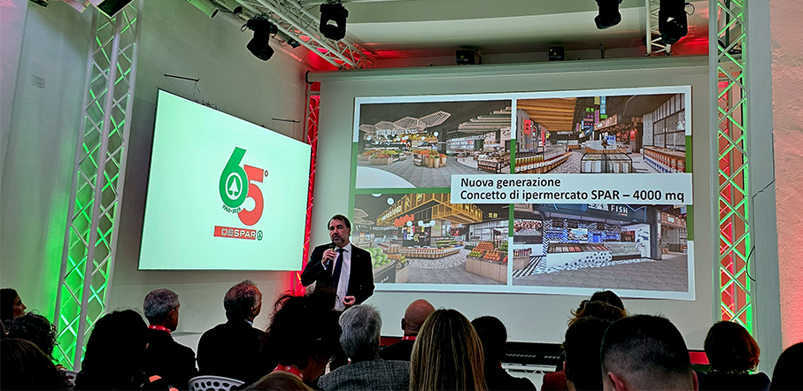
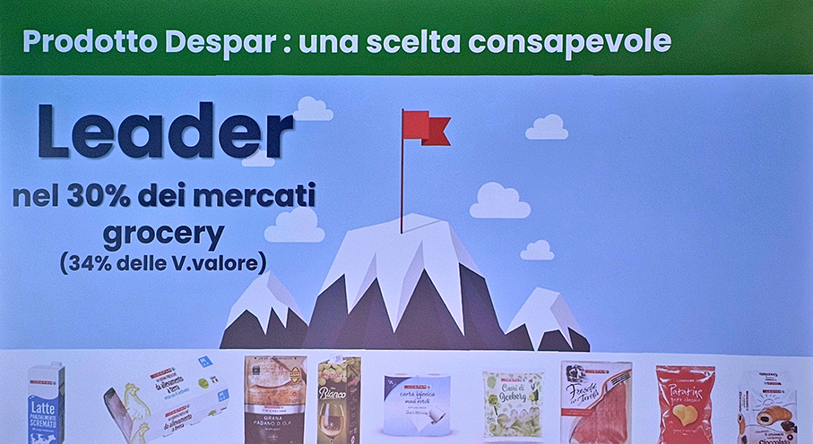
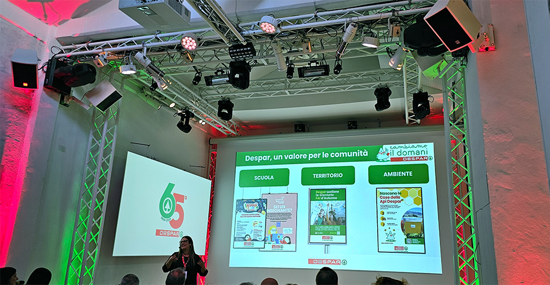
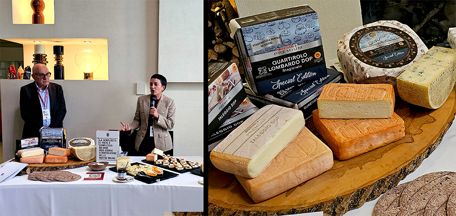
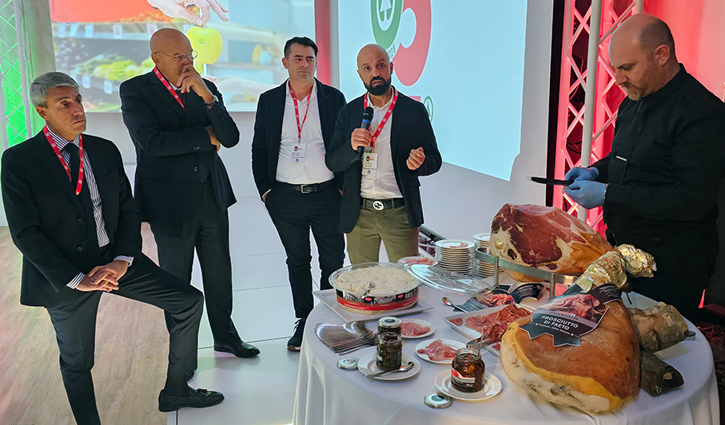

# Despar Italia: 65 anni di valori condivisi

>**Despar Italia compie 65 anni** di presenza e, per l’occasione, ha organizzato un **Press Day 2025** a Milano

L’evento ha celebrato i valori che da 65 anni uniscono Despar e i suoi soci: **prossimità, collaborazione, sostenibilità e legame con il territorio**, principi che continuano a guidare l’evoluzione dell’insegna nel panorama della grande distribuzione italiana.
All’incontro hanno partecipato, i vertici di Despar Italia tra cui il **Presidente Fabrizio Colombo**, il Direttore Generale Filippo Fabbri**, il **Direttore Generale di Spar International Tobias Wasmuht**. E’ stata l’occasione per fare il punto sui risultati ottenuti e sulle **strategie di sviluppo** di Despar, raccontare la centralità che il **prodotto a marchio** riveste per l’Insegna, presentare i **progetti di responsabilità sociale** e svelare le novità del prodotto a marchio e la **Special Edition 2025** che sarà disponibile nei punti vendita in occasione delle prossime festività natalizie. 

“_Celebrare 65 anni di presenza in Italia è un traguardo importante che racconta una storia di crescita, radicamento e capacità dell’Insegna di evolversi e adattarsi a contesti di mercato in continuo cambiamento_ – ha detto **Filippo Fabbri** – _Un percorso costruito nel tempo grazie all’impegno dei nostri soci, che, con passione e visione, hanno contribuito a far crescere Despar nei loro territori. Despar Italia sta continuando sulla strada del consolidamento: nel 2025 puntiamo a chiudere l’anno con un fatturato in crescita di circa il +3% rispetto all’anno precedente_”. 

Come ci racconta **Tobias Wasmuht**, da oltre 65 anni Despar è un punto di riferimento nella vita delle comunità italiane. Il nome nasce dall’acronimo olandese **“Door Eendrachtig Samenwerken Profiteren Allen Regelmatig”**, ovvero “Dalla collaborazione armoniosa tutti traggono vantaggio”. Il marchio **SPAR nasce nel 1932 nei Paesi Bassi** grazie ad Adriaan Van Well, che unì piccoli grossisti in una cooperativa per rafforzare la competitività commerciale. **Negli anni ’60 l’organizzazione arriva in Italia**: nel 1960 apre il primo supermercato Despar, e nello stesso anno nasce Spar Centrale Italiana, poi divenuta nel 1968 Consorzio Despar Italia.

Negli anni ’70 compaiono i primi prodotti a marchio Despar, destinati a diventare un elemento distintivo dell’insegna. Oggi Despar Italia è una società consortile che riunisce sei aziende della distribuzione e numerosi affiliati, con **oltre 1300 punti vendita in 17 regioni italiane**, suddivisi nei format **Despar, Eurospar e Interspar**. Riconosciuto come **Marchio storico di interesse nazionale**, Despar coniuga legami internazionali e forte radicamento locale.

Despar è oggi la **terza insegna della GDO non discount per quota MDD in Italia**, con una quota del 24,4% sul totale grocery, superiore alla media nazionale. Inoltre, la fedeltà dei clienti è in aumento: un prodotto su tre acquistati nei punti vendita è oggi a marchio Despar.
Tra le novità più significative del 2025 c’è il lancio nazionale della **linea S-Budget**, dedicata alla convenienza e nata da una collaborazione tra i sei soci del consorzio. La linea comprende oltre **250 referenze di prodotti alimentari e non alimentari**, con un **risparmio medio fino al 30%** sul carrello della spesa.

L’intera offerta Despar comprende **17 linee MDD, per un totale di circa 4.000 referenze**, sviluppate insieme a più di **500 fornitori, di cui il 97% italiani**. Nel 2025 si contano **170 nuovi lanci** di prodotto e **380 restyling** di referenze già esistenti.
Continua anche il successo della linea **Despar Premium**, cresciuta del 2,8% rispetto al 2024, che propone **ccellenze gastronomiche DOP e IGP** e specialità regionali italiane. Per le festività natalizie è stata presentata la **Special Edition 2025**, un’edizione limitata di salumi e formaggi che valorizza il patrimonio culinario italiano e i piccoli produttori locali.

Accanto alle strategie commerciali, Despar ha ribadito il proprio** impegno per la sostenibilità e la responsabilità sociale**. Tra i progetti più recenti figura l’iniziativa **“Case delle Api Despar”**, realizzata con PlanBee, che ha portato all’installazione di **35 nuovi alvear** in sette regioni italiane, contribuendo alla tutela di oltre **2 milioni di api **e alla promozione della biodiversità.

Tra i nuovi prodotti, segnaliamo **3 specialità locali** italiane:

**Quartirolo Lombardo DOP** 
(stagionato oltre 60 giorni)
Formaggio della tradizione lombarda, derivato dal “quarto taglio” d’erba estivo. La sua pasta varia dal bianco latte al giallo paglierino e il gusto evolve da delicato a intenso. Ottimo da solo, con miele o frutta, oppure in piatti al forno.

**Strachítunt DOP** 
(stagionato 100 giorni)
Tipico della Val Brembilla, nasce da una doppia cagliata (sera e mattina) con muffe naturali. Nella versione Premium, ha una stagionatura superiore e un gusto deciso, perfetto come formaggio da pasto.

**Prosciutto di Faeto**
Salume pugliese prodotto nel comune di Faeto (Monti Dauni), zona francoprovenzale. Ottenuto da maiali neri allevati semibradi, è caratterizzato da alta rifilatura, sapidità equilibrata e carni pregiate grazie al clima fresco e ai boschi di querce e faggi.
