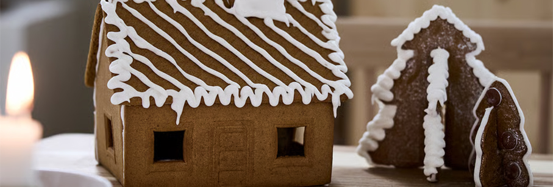
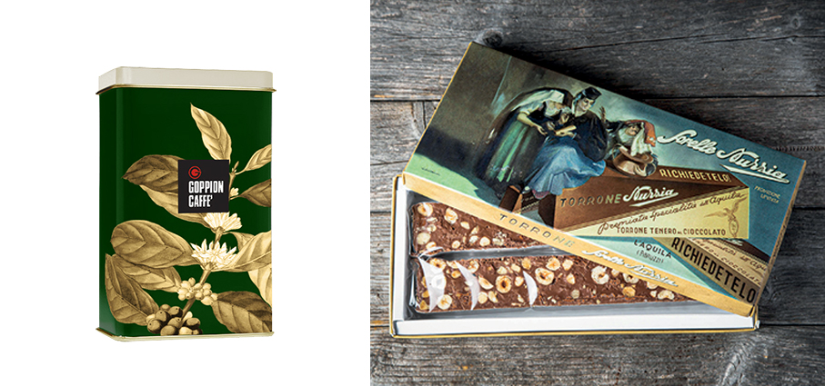
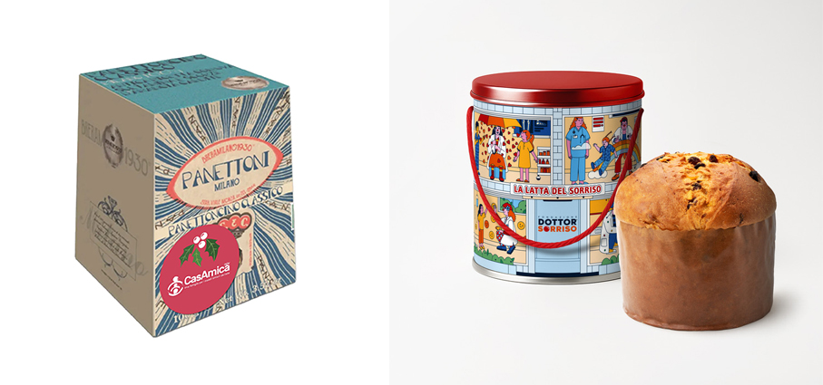
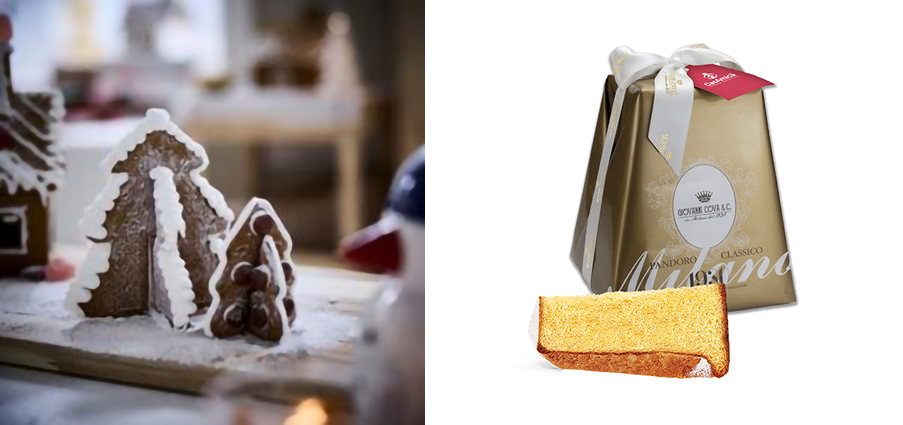
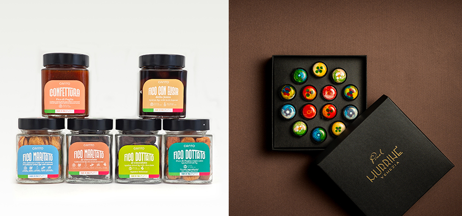
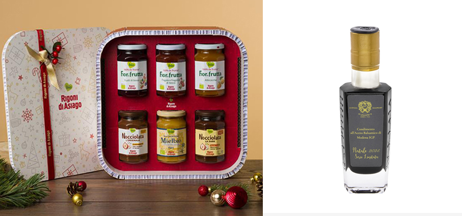
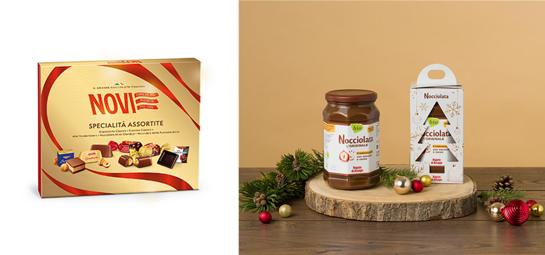
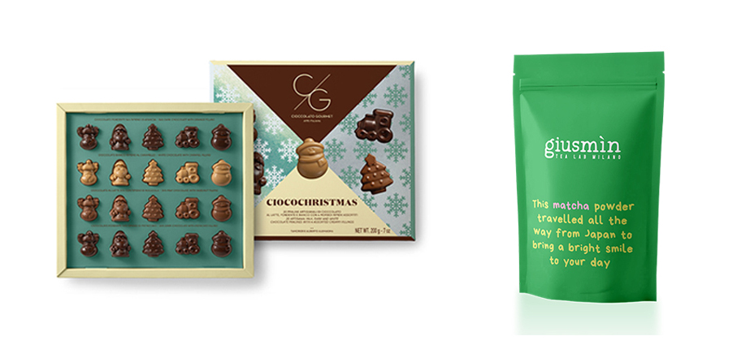
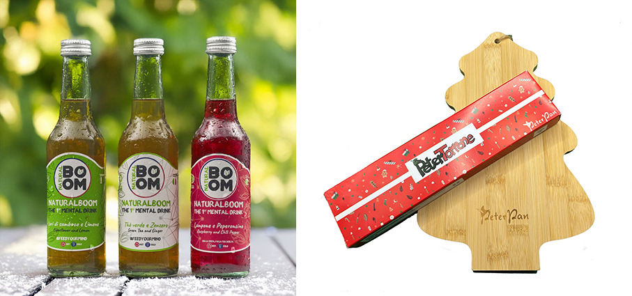
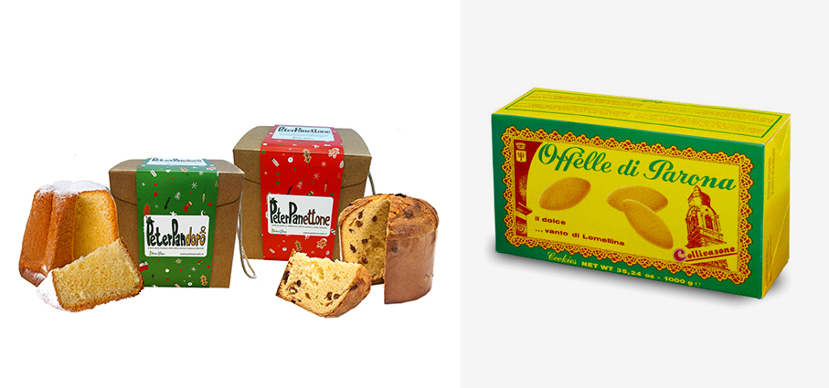

# Dolci e calde feste

>Qualcosa di **dolce** o qualcosa di **caldo** da bere, regaliamo ai nostri cari, oppure offriamoli agli amici in visita, magari facendo anche beneficienza

**Latta foglia verde – Caffè Goppion** design dal gusto retrò, per questa lattina, con linee morbide e un’immagine fresca da regalare ai tuoi cari in un’occasione speciale o da utilizzare per mantenere la freschezza del tuo caffè  macinato. Barattolo in latta rettangolare, 250 g di caffè macinato. Miscela di pregiate qualità arabica Brasiliane e Centroamericane. Gusto intenso e vellutato. Contenuto di caffeina molto basso.

**Scatola Vintage di CasAmica a marchio Sorelle Nurzia** dal 1835 sapori autentici e tradizione. Contiene 2 torroni teneri al cioccolato da 150 gr cad. Dolci solidali di CasAmica con cui aiutare l’organizzazione di volontariato a garantire a tanti malati e alle loro famiglie un Natale più sereno anche se lontani da casa. 

**Panettone di CasAmica a marchio Giovanni Cova & C - Linea Oro**, realizzato secondo la ricetta classica con uvetta e canditi (Incartato in un’elegante carta dorata) disponibile nel formato da 1 kg. Dolci solidali di CasAmica con cui aiutare l’organizzazione di volontariato a garantire a tanti malati e alle loro famiglie un Natale più sereno anche se lontani da casa.

**Latta del Sorriso di Dottor Sorriso**: il tradizionale panettone di Natale con uvetta e canditi. I dolci natalizi proposti da Dottor Sorriso per il Natale 2025, racchiusi nelle preziose latte illustrate da conservare e riutilizzare.

**Vintersaga – Ikea** set di alberi di pan di zenzero che è un invito a divertirsi in cucina: basta assemblarli, decorarli con glassa e zuccherini e condividerli con amici e famiglia. Un dolce rituale che unisce creatività, convivialità e il piacere delle tradizioni natalizie.

**Pandoro di CasAmica a marchio Giovanni Cova & C - Linea Oro**, incartato in un’elegante carta dorata. Formato 1 kg. Dolci solidali di CasAmica con cui aiutare l’organizzazione di volontariato a garantire a tanti malati e alle loro famiglie un Natale più sereno anche se lontani da casa.

**Box Degustazione - Ganto** una raffinata selezione di idee regalo a base di fichi, perfetti per chi vuole sorprendere con eleganza, qualità e gusto. L’azienda, con sede nel cuore del Salento, coltiva i propri alberi di fico seguendo un processo di raccolta manuale, essiccazione naturale al sole e lavorazioni artigianali che rispettano la terra e la tradizione mediterranea. Il catalogo natalizio comprende fichi essiccati artigianali, confetture di fico e varianti al cioccolato, oltre a una limited edition pensata per i regali aziendali. Box degustazione con la possibilità di scegliere quali prodotti inserire.

**Le Murrine - Pasticceria Pinel** una collezione di sette cioccolatini che fondono il saper fare dolciario con la magia del vetro veneziano. Le nuove praline trasformano la degustazione in un’esperienza estetica e sensoriale, tra ricordi, sapori e tradizioni del territorio. Ogni Murrina ha un guscio di cioccolato fondente finissimo, reso unico da quattro tecniche di decorazione a mano. Al cuore, sette diversi ripieni racchiudono i sapori autentici del territorio veneziano: dallo Zaeto al Bussolà, dal Tiramisù alla Pera del Veneziano e Noce Lara. Ombra di Rosso, con note di vino rosso, Spritz, l’iconico aperitivo veneziano in versione pralina; e Miele di Barena, ricavato dall’unico miele prodotto negli habitat delle barene lagunari.

**Confezioni Regalo - Rigoni di Asiago** una selezione esclusiva di idee regalo pensate per soddisfare ogni palato e ogni esigenza, disponibile nello shop online all'indirizzo shop.rigonidiasiago.it. Sono 26 sono i gusti di Fiordifrutta tra cui spaziare, da quelli più tradizionali a quelli più originali, per personalizzare una confezione regalo perfettamente in linea con la festa più attesa dell’anno. Per gli amanti delle creme spalmabili, Nocciolata in quattro deliziose varianti: l'Originale, cremosa e golosa; La Dark, intensa e vegana, perfetta per chi è intollerante al lattosio; La Bianca, ricca ma delicata; e La Crunchy, croccante e irresistibile.
Non manca poi Mielbio, il miele biologico.

**Condimento all'Aceto Balsamico di Modena IGP Limited Edition di Natale – Acetaia Malpighi** un condimento invecchiato per almeno dieci anni in pregiate botticelle di legno di ciliegio, essenza che gli conferisce profumi morbidi e delicati e caratteristiche organolettiche uniche: aspetto limpido, colore bruno carico, sapore agrodolce denso, pieno e vellutato, una densità elevata pari a 1,34. Il nuovo prodotto è il primo di una Collezione ricorrente: tutti gli anni, sotto le festività natalizie, un nuovo Aceto di Natale selezionato a seconda dell'invecchiamento e della tipologia di legno. Contenuto in una bottiglia da 100 ml rigorosamente di vetro, con i colori del Natale (tappo e scritta oro, etichetta argento), è racchiuso in un elegante cofanetto Limited Edition Natale 2025.

**Confezione regalo Specialità Assortite – Novi** racchiude una selezione dei prodotti più iconici di Novi — Gianduiotto Classico, Cremino Classico, Mini Fondentenero, Nocciolato Minis Gianduja e Nocciolato Minis Fondente Extra — per un’esperienza di degustazione varia, equilibrata e raffinata, che esalta la qualità e la tradizione. Le nuove confezioni si distinguono per finiture di stampa pregiate che le rendono perfette per un dono raffinato e per celebrare con stile la magia del Natale.

**Nocciolata - Rigoni di Asiago** per gli amanti delle creme spalmabili, Nocciolata rappresenta un'eccellenza irrinunciabile. La crema al cacao e nocciole si presenta in versione natalizia: Nocciolata Originale, cremosa e golosa, è proposta in confezione singola con un vasetto da 835 grammi.

**Ciocochristmas - Cioccolato Gourmet** proposte in quattro varianti di gusto e altrettanti abbinamenti con il cioccolato le venti praline racchiuse nella box sorprendono a ogni morso. Il cioccolato fondente svela un fresco e aromatico cuore all’arancia, il cioccolato bianco conquista con i sentori dolci e avvolgenti del caramello, il cioccolato al latte con ripieno alla nocciola è un grande classico e, infine, il fondente abbinato al pistacchio, intenso e sorprendente, è pensato per chi ama i contrasti decisi.

**Matcha - Giusmìn** non un prodotto fisso e immutabile, ma un percorso in evoluzione: origini e blend potranno variare con le stagioni, sempre nel rispetto di una promessa precisa — offrire un matcha autentico, di alta qualità, fedele alla tradizione ma aperto alla contemporaneità. Giusmìn è la boutique del tè di Milano dedicata a tè e tisane di qualità. Nata per raccontare il tè in chiave contemporanea, unisce competenza, passione e un’estetica curata nei minimi dettagli. Sulle confezioni del matcha compare una frase che ne racchiude lo spirito.

**PeterTorrone e tagliere abete – Peter Pan ODV**  Il tagliere a forma di albero è realizzato in legno di bambù (30x20 cm), con pratico cordino per appenderlo , un’idea originale e utile per rendere la tavola delle feste ancora più speciale. Perfetto da usare come vassoio per servire dolci, formaggi o per accompagnare il PeterTorrone. Disponibile in due varianti, cioccolato extrafondente con nocciole o gianduia con nocciole, lavorato a mano .

**NaturalBoom** è la prima bevanda al mondo che puoi bere sia calda che fredda: perfetta come bibita per contrastare il caldo estivo, è ottima calda come una tisana o un infuso perché il calore esalta il profumo naturale degli ingredienti e offre un piacevole effetto rigenerante. Con meno di 30kcal, senza taurina, caffeina, anidride carbonica, alcol, zuccheri raffinati, coloranti o conservanti. La sua ricetta sfrutta le proprietà benefiche dei nootropi, sostanze reperibili in natura che favoriscono la concentrazione mentale, come l'Ashwagandha, l'Olivello Spinoso, il Mate, la Papaya, il Maca e il Ginseng. Pensata per chiunque abbia bisogno di un alto grado di concentrazione: sportivi, professionisti, studenti, giovani e giovanissimi. Ed è adatta anche a celiaci e vegani.

**PeterPanettone - Peter Pan ODV** è l’imperdibile novità 2025, “soffice come un abbraccio che fa sentire a casa, sempre!”. Panettone artigianale da 1 kg, confezionato in un'elegante scatola di cartone rigido. PeterPandoro: il classico pandoro diventa simbolo di speranza. Dorato come il colore che richiama la lotta al cancro infantile, è realizzato artigianalmente (1 kg, in elegante confezione). 

**Offelle di Parona - Forno F.lli Collivasone** delicati biscotti di pasta frolla dal sapore unico. Le sue origini risalgono alla fine dell’800. Consigli per la degustazione: le Offelle sono buonissime al naturale, accompagnate con una cioccolata, un cappuccino, caffè e tè. Possono essere un dessert sfizioso se intinte in uno spumante/vino dolce, secco o liquoroso oppure accompagnate da una deliziosa crema inglese.

