# Estate – Tante novità belle, utili e colorate

>La stagione estiva permette di vivere in completa libertà, **in casa e all’aria aperta**, da soli e in compagnia, con **tante novità**

_di Maria Rosa Sirotti_
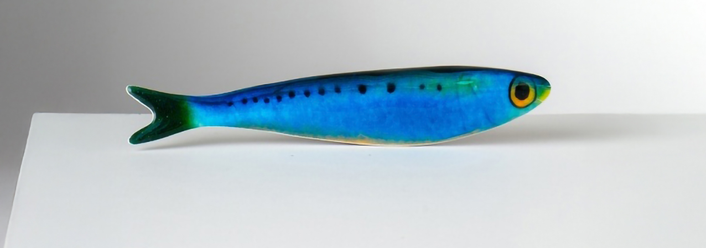

**Boetta - Hiro Design** nuova lampada dal chiaro riferimento nautical disponibile in versione da tavolo e da terra. Un oggetto compatto, pensato per ambienti diversi (dalla scrivania al soggiorno), dove la luce diventa presenza disponibile solo nei colori più bold del brand: terracotta, rosso Frida, verde fossile e blu mezzanotte. 

**Gioia - Toscanini**  portabiti dai colori delicati, dettagli creativi e atmosfere poetiche trasformano il guardaroba dei bambini in uno spazio pensato per accompagnare la loro quotidianità con immaginazione e fantasia. I portabiti Gioia contribuiscono a definire un ambiente accogliente e intimo.

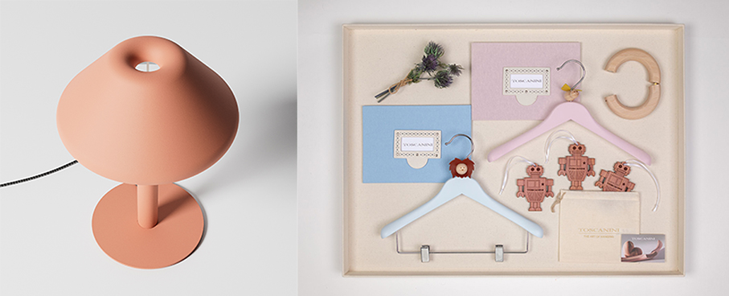

**Righe Cielo - Dalfilo** completo lenzuola in percalle.: Include: 1 lenzuolo sopra (Righe Cielo) + 1 lenzuolo sotto con angoli (Cielo) + 2 federe (Righe Cielo), 2 federe con chiusura a bottoni. Ampio lenzuolo sopra. Lenzuolo sotto con angoli elastici, ideale per materassi alti fino a 30 cm.

**HushJet™ Mini Cool Fan - Dyson** ventilatore portatile e compatto progettato per essere portato sempre con sé. Un dispositivo multifunzione utilizzabile al collo, sulla scrivania o in modalità handheld. Con un peso di soli 212 g e una batteria a lunga durata fino a 6 ore, garantisce freschezza continua ovunque e in qualsiasi momento. Dotato di cinque velocità e di una modalità Boost per una potenza extra, permette di regolare il flusso d’aria in base alle esigenze.

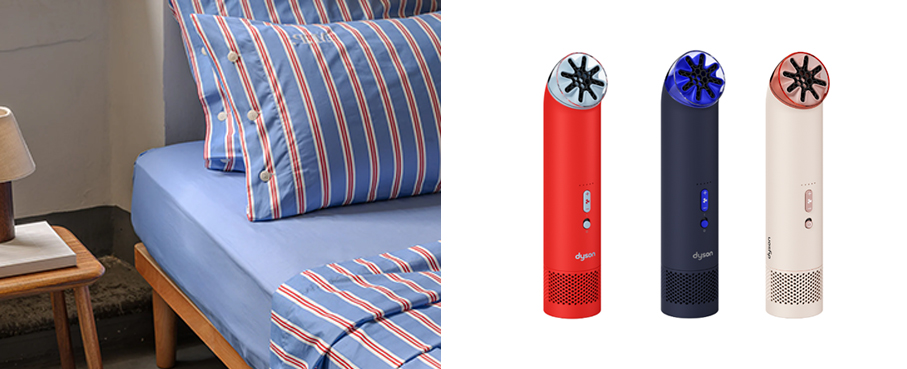

**Andria - Ultra Limited** occhiali da vista in un’esplosione di colore e design con una forma rotonda unisex, perfetti per chi desidera distinguersi. Ogni occhiale è realizzato a mano con 12 lastre di acetato di cellulosa, trattate in oltre 41 giorni di lavorazione. La cornice monocolore in acetato incornicia gli incollaggi con eleganza, creando un accessorio esclusivo. Ogni occhiale è unico.

**Esperluette Bold - Morel** edizione Limitata in collaborazione con Constance Guisset. Curve e forme arrotondate, tratti spessi e sottili ispirati alla calligrafia. Concepita come un pezzo da collezione,  un'opera d'arte da indossare. La linea sembra essere stata tracciata come un ciclo infinito, che non smette mai di condurci in un viaggio attraverso gli occhi.

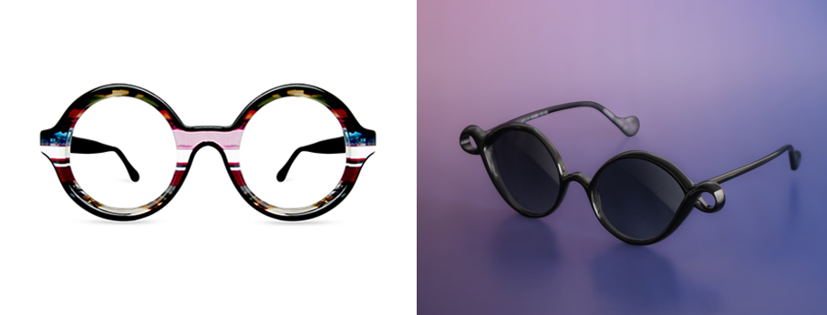

**Lifestyle Collection - Pantone** basta poco per creare un’atmosfera vivace, fresca e irresistibile all’aria aperta all’insegna del colore: le mug diventano elementi coordinati per un picnic vivace e contemporaneo. Da Moroni Gomma.

**Palmina - Hiro Design** la sedia porta il linguaggio progettuale del brand anche negli spazi outdoor: una struttura in acciaio verniciato, solida ed essenziale, pensata per terrazze, giardini e contesti contract, ma facilmente integrabile anche negli interni.

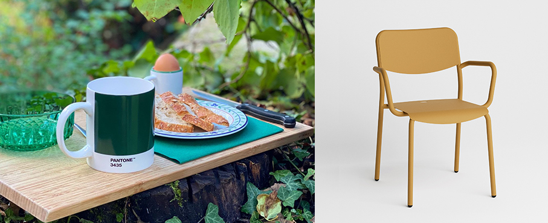

**Parmelan Hybrid Hoodie M – Millet** giacca con cappuccio che combina un materiale antivento sul petto e sulla parte superiore delle maniche con un tessuto in pile micro-grid ultra traspirante. Una delle due tasche sul petto con zip consente di ripiegare la giacca al suo interno.

**Bauletto - Blim Plus** la lunch box compatta nelle dimensioni ma sorprendentemente capiente, è progettata per accompagnare gli spostamenti con leggerezza e funzionalità. Il sistema è composto da due recipienti in polipropilene riciclabile che consentono di trasportare alimenti diversi. Coperchio a chiusura ermetica e fascia elastica per una presa sicura.

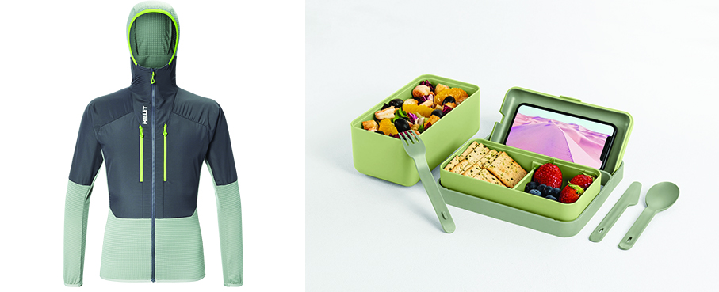

**Mareterra - Alessandro Bini** ispirata ai colori del mare e della costa, unisce filati bouclé e textures raffinate. Una palette naturale, una versatilità che porta armonia tra arredi esterni e interni. La collezione è composta da tre disegni coordinati che dialogano fra loro. Perfetta per arredi indoor e outdoor.

**Cepeda – Kaleos** occhiali da sole geometrici senza montatura. Ponte, terminali e aste sostengono le lenti attraverso una struttura minimale quasi invisibile, dove le lenti diventano protagoniste. Aste in acciaio inossidabile dorato con terminali in acetato havana. Lenti sfumate verdi base 2 con protezione UV 100% antiriflesso. Naselli rimovibili in titanio. Fatti a mano.

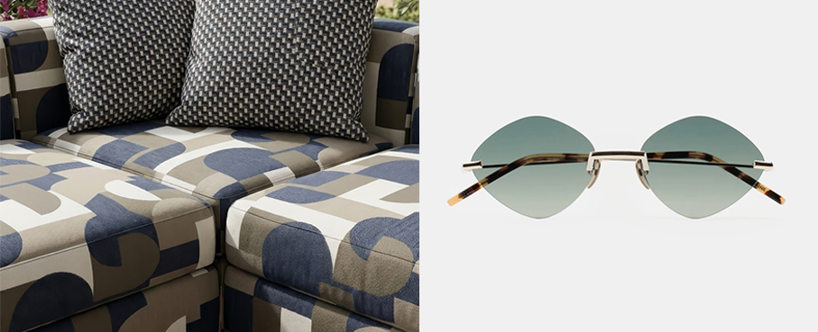

**Stampo da ghiaccio - Zoku** più grande è il ghiaccio, meno velocemente si scioglie: utile per non annacquare cocktail e bevande. Motivi floreali per chi ama la botanica. Tutti gli stampi sono in silicone BPA e ftalati free. Distribuito da Kunzi.

**Svane – Jysk** lampada da tavolo ricaricabile con base a coste color sabbia. Il design senza fili permette di posizionarla ovunque, creando una piacevole atmosfera all'interno o all'esterno. Include funzione timer integrata. Ø21 x H25 cm

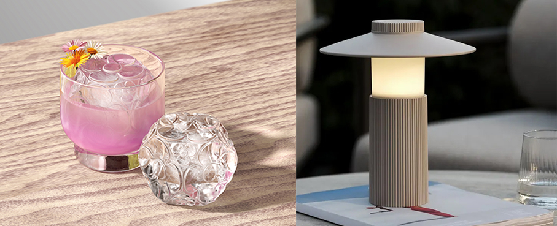

**Stem - Draga & Aurel** vasi scultura. La serie nasce dai campioni sviluppati per esplorare le possibilità espressive della lucite — la resina acrilica utilizzata in alcuni pezzi della collezione Transparency Matters — attraverso uno studio su trasparenze, stratificazioni cromatiche, rifrazioni e interazioni tra luce e materia.

**Kilim - Eccentrico** collezione ceramica in gres porcellanato che reinterpreta in chiave ceramica l’estetica dei tappeti kilim e delle zellige della tradizione araba. Un alfabeto ceramico modulare, disponibile in due formati (11,5×11,5 cm e 5,7×11,5 cm) e in nove varianti cromatiche, per infinite combinazioni. Doppia finitura matt e lucida.

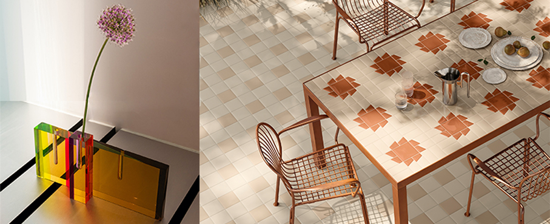

**Confezione regalo nascita/ricordi – Thun** appartiene alla line Baby questa scatola regalo elegante e curata, ideale per celebrare l’arrivo di un neonato. Perfetta per custodire piccoli ricordi preziosi come braccialetti, prime scarpine o oggetti simbolici dei primi momenti di vita.

**Sweet Pal - Baulificio Italiano e Trudi** per una linea completa di valigeria pensata per i piccoli grandi esploratori. Ogni valigia diventa così molto più di un oggetto: è un custode di storie, un vero e proprio compagno di viaggi e di giochi da portare sempre con sé. 

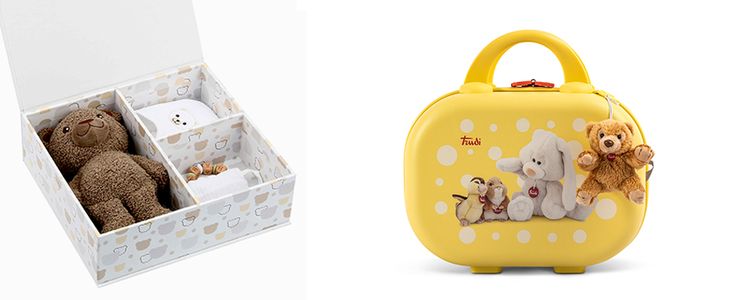

**iGreen Hi Tech – Thema Optical** IGV10.50/07M  occhiali da vista color Havana. Struttura ultra-leggera per l’utilizzo di tutti i giorni senza appesantire. Materiali di alta qualità e flessibili che mantengono forma e resistono nel tempo. Opzioni personalizzabili: forme, colori, misura, finiture e dettagli.

**Trendology - Remington** il primo styler dotato di ben cinque accessori intercambiabili per ricci definiti o scompigliati, morbide onde da sirena o aggiungere volume. Tecnologia antistatica con tormalina all’interno della ceramica che aggiunge ioni proteggendo i capelli dall’elettricità statica. 

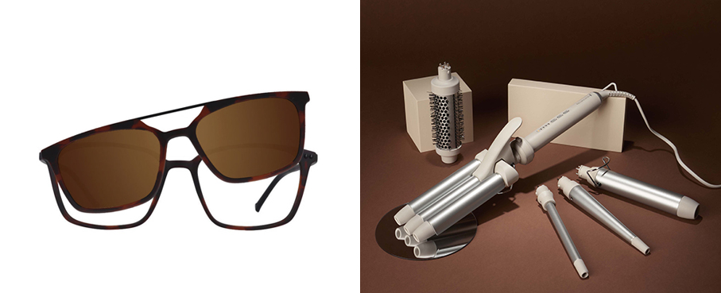

**Iike – Villeroy & Boch** nuovo bicchiere che reinterpreta il design Confetti. Con allegri pois danzanti in diverse sfumature di blu, richiama il luccichio del mare sotto il sole, permettendo di creare combinazioni raffinate e contemporanee
per la tavola. 

**Brontë Soft Navy - Russell Hobbs** tostafette di design, con texture e finiture opache e dettagli metallici colore champagne e satinati. Due elementi di estrema eleganza in grado di rendere la cucina un ambiente di carattere. Per svegliarsi sempre con la giusta determinazione di voler fare una grande colazione.

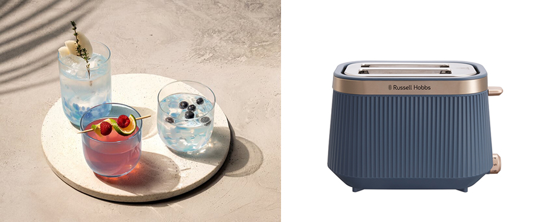

**Parmelan 17-  Millet** zaino leggero e resistente, con tasca supplementare da fissare sulla parte anteriore. Sistema di chiusura rapida nella parte superiore con cinghia e gancio per comprimere o aggiungere materiale. Tasche elasticizzate e dettagli funzionali per garantire la massima leggerezza, spallacci minimalisti e una cintura a nastro rimovibile.

**Map – World Traveller** case per passaporto con grafica di mappamondo. E’ in grado di contenere, oltre al passaporto, anche la boarding pass, carte di credito e altri documenti importanti, mantenendoli al sicuro. Distribuito da Moroni gomma.

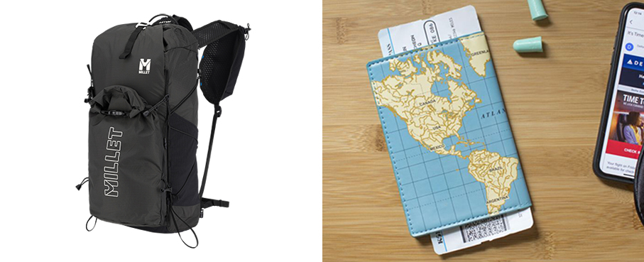

**Icechef Compact - Caso Design** macchina per  ghiaccio compatta, elegante, può produrne 500gr all’ora in formato piccolo e grande. Funzione per l’autopulizia e una serie di funzioni selezionabili da display come la scelta del formato, l’indicatore de livello di acqua. Distribuito da Kunzi.

**Caleido – Pinti** ceste a rete alte, esibiscono la struttura in metallo a maglia romboidale che crea un effetto visivo arioso per far intravedere il contenuto. Ideali come centrotavola porta frutta o contenitori. In 4 tonalità (nero carbone, verde salvia, marrone caffè e tortora burro).

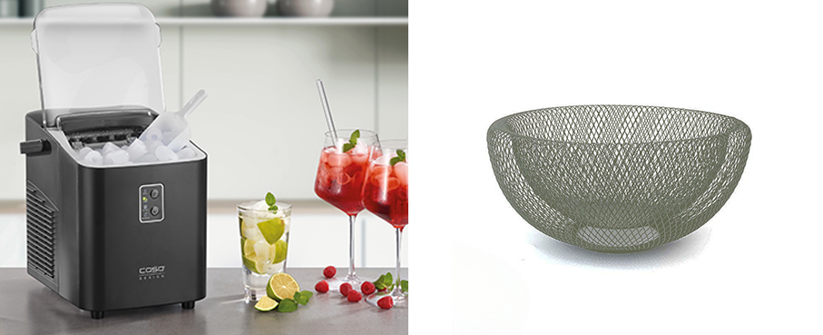

**Matteo – Mario Luca Giusti** è un originale e giocoso set di 6 segnaposto magnetici per arricchire la tavola con personalità e leggerezza. Realizzati in melamina di alta qualità, diventano ideali sia per l’utilizzo quotidiano sia per tavole conviviali più scenografiche.  

**Cedarwood & Ocean Mossu - Woodwick®** candela con una fragranza fresca e pulita che unisce legno di cedro, muschio oceanico e minerali marini, evocando una rigogliosa foresta costiera. Esperienza multisensoriale dello stoppino in legno, che ricrea il caratteristico suono scoppiettante del fuoco.

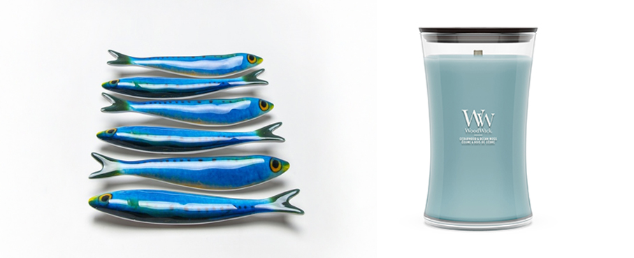

