# Esxence 2026 – The Art Perfumery Event

>Si è svolta a Milano la sedicesima edizione dell’evento di riferimento a livello internazionale dedicato alla **profumeria artistica di alta gamma**

_di Maria Rosa Sirotti_
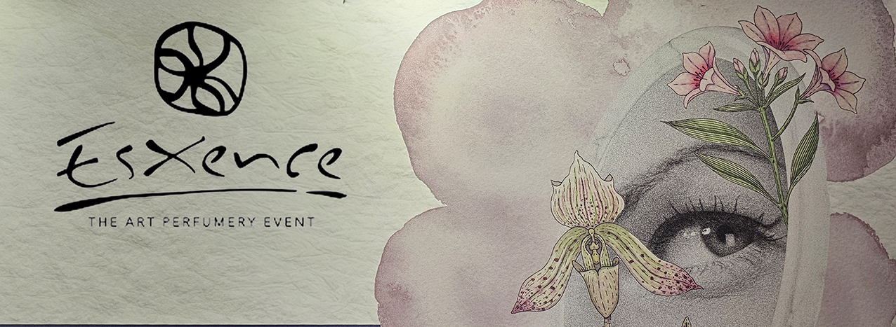

**Esxence**, l’appuntamento di punta della profumeria artistica a livello mondiale, ha proposto per il 2026 il concept **Sensing The World**, esplorando le nuove frontiere dell’**olfatto come ponte tra emozione e memoria**. Un profumo non descrive un ricordo ma lo risveglia con le emozioni e il peso del momento vissuto. La missione di Esxence è **diffondere la cultura olfattiva** e aiutare le persone a scegliere la propria **fragranza distintiva**.

_Visitando Esxence 2026, ho potuto identificare chiaramente i_ **trend attuali**: _la vocazione_ **Gourmant** _che si era cominciata a vedere nel 2025 è esplosa quest’anno con un tripudio di frutti dolci come_ **banana, ciliegia, fico e fragola** _si sono ulteriormente addolciti con aggiunta di_ **burro, panna e vaniglia**. _Si sono poi uniti:_ **popcorn, caramello, burro di arachidi, caffè, cola, riso, mandorle, pepe e zafferano**. 
**Limone e agrumi** _hanno stemperato spesso le note dolciastre esagerate mentre, dall’estremo Oriente, sono arrivati_ **osmanthus e matcha**, _che ha invaso anche il mondo del Food & Beverage_. 
_Una dinamica particolare riguarda l’_**oud**: _sempre meno presente nei profumi che arrivano dal Medio Oriente e che tendono ad accontentare maggiormente i gusti occidentali, ma sempre più presente nelle fragranze europee, che lo utilizzano anche per profumazioni estive_.

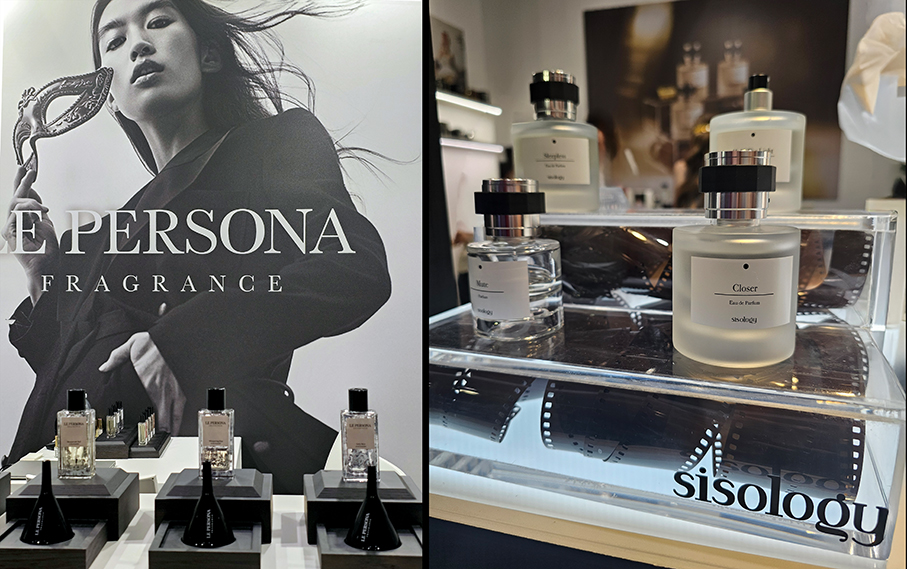

**Le Persona**

Questo brand sud coreano che si ispira all’antica  Grecia, dove gli attori indossavano maschere che chiamavano "persona". Le maschere hanno il potere di far emergere una persona nuova dal profondo dell'anima come queste fragranze che rivelano il fascino che si cela in noi con una diversa esperienza, facendo emergere la nostra nuova maschera. Design e packaging sono curati in collaborazione con Calicot Paris. Design e packaging sono curati in collaborazione con Calicot Paris. **Whispering Kiss** Deciso, grintoso e inaspettato con  un cuore di Pasta di Fagioli Rossi unita a Rum, Cognac, Tabacco Biondo e Salvia. Le note di testa sono Cardamomo, Elicriso, Zenzero e Pepe; le note di fondo sono Vaniglia, Ambra, Note Legnose, Patchouli e Vetiver.

**Sisology**

Una maison coreana che produce in Francia. Secondo Sisology,le nostre vite assomigliano a una macchina fotografica analogica. Non poter modificare o cancellare le parti che non ci piacciono, non poter tornare indietro e rivivere lo stesso momento quando si preme il pulsante di scatto.Solo in seguito, dopo che le foto sono state sviluppate, possiamo custodire gelosamente questi ricordi incarnandoli attraverso i profumi. Usare un profumo Sisology è come catturare un momento premendo il pulsante di scatto di una macchina fotografica. Il packaging, infatti, riprende il motivo di una macchina fotografica. **Blossom Noir** incarna il fascino enigmatico di un fiore che sboccia nell'oscurità, simbolo di una bellezza misteriosa e audace. Lo zafferano si intreccia alla delicatezza dei sakura e un accordo intenso e persistente di cuoio dona profondità e carattere.

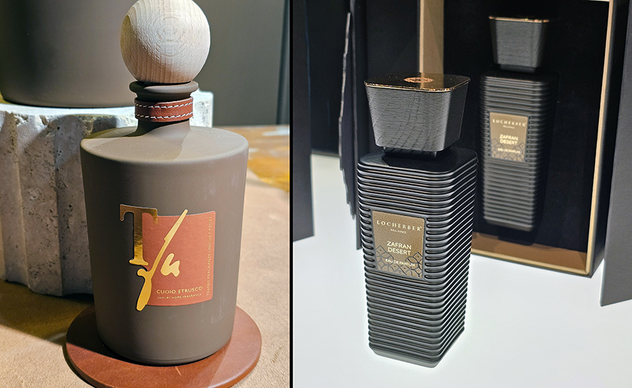

**Teatro Fragranze Uniche**

L’arte del cuoio tra essenza e memoria: **Cuoio Etrusco Luxury Perfume** nasce da un’eredità antica, radicata nella Toscana più autentica, nelle lavorazioni artigianali del cuoio e nel valore attribuito al tempo. Una firma olfattiva che accompagna con naturale eleganza, lasciando una traccia distintiva. Indossato, diventa stile: equilibrio, carattere e una scia persistente ed elegante. Piramide olfattiva: Note di testa Lampone Glassato, Zafferano, Timo Bianco. Note di cuore Suede, Iris, Gelsomino. Note di fondo Cuoio, Legni Ambrati, Iris.

**Locherber Milano**

Locherber Milano presenta una nuova collezione di Eau de Parfum caratterizzate da una concentrazione del 30%, racchiuse in un packaging premium. Comprende alcune delle creazioni più iconiche e una inedita: **Huaca**, termine quechua che indica un luogo sacro, uno spazio carico di energia primordiale e di connessione tra umano e divino. Si distingue per una composizione intensa e avvolgente, in cui sfumature speziate, ambrate, legnose e muschiate si intrecciano in un equilibrio sofisticato. Le note di testa si aprono con pepe rosa, limone e pompelmo, evolvendo in un cuore di elemi e vetiver, fondo caldo e persistente di ambra, vaniglia, legno di cedro e muschi bianchi.

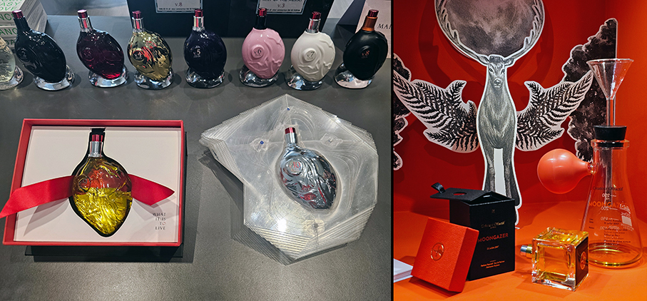

**Map of the Heart**

Tutto viene dal nostro cuore, è la nostra essenza pura, il bene e il male. È quello che siamo. Map of the Heart è il battito del profumo. Fatto in Francia ma nato in Australia con Sarah Blair e Jeffrey Darling. **Gold heart v.4** Prezioso, Sensuale. La lucente scintilla metallica delle note di testa di cardamomo, pepe rosa e cannella si immergono nel cuore caldo del latte, sovradosato dallo zafferano. Una calda brezza esotica che avvolge, protegge e nutre. **Clear heart v.1** Fresco, energizzante, per i cuori liberi selvaggi e prorompenti. Ispirato all'infinita estate australiana: surf, nuoto, giornate calde, brezze fresche e il sale che aleggia nell'aria.

**Createur Olfactif**

La maison svizzera ha presentato la sua prima collezione creata dal profumiere, direttore creativo e fondatore Mustafa Moneir. Cinque storie olfattive molto particolari e suggestive: **The Opera is Burning, Les Femmes du Khédive, Première Mer, Moongazer e Stolen Notes**.
Un nuovo concetto di packaging, ideato dallo stesso Moneir, ripensa il rapporto tra profumo e contenitore: una volta aperta, la scatola diventa un piedistallo per il flacone, trasformandosi in
un oggetto di design e introducendo un nuovo gesto nell’uso del profumo. Un universo in cui precisione svizzera, immaginazione e design narrativo si incontrano.

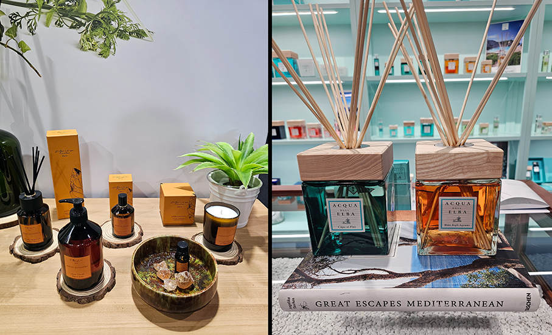

**Christian Tortu** 

Christian Tortu è un celebre fiorista e floral designer parigino, noto per aver rivoluzionato l'arte floreale. La sua linea di profumi è incentrata sulle fragranze per l'ambiente e trae ispirazione direttamente dalla natura e dai vegetali. **Jardin Alhambra** è una fragranza per la casa ispirata ai giardini orientali dell'Alhambra e all'atmosfera dell'Andalusia. Zafferano, ambra e incenso si fondono con un aroma caldo, ambrato e speziato che avvolge delicatamente qualsiasi ambiente con una fragranza elegante e incredibilmente sensuale. Sullo sfondo si percepiscono note di legni secchi e una sottile affumicatura resinosa, che conferiscono alla composizione un carattere eccezionalmente elegante e raffinato.

**Acqua Dell’Elba**

I nuovi profumatori per l’ambiente **Baia degli Agrumi** e **Capo ai Pini** sono veri e propri itinerari sensoriali del Mediterraneo. Ogni ambiente si trasforma in un rifugio di natura e bellezza, dove la luce vibrante delle baie profumate e il respiro balsamico delle pinete a picco sul mare diventano un'esperienza quotidiana da vivere ogni giorno. 
**Baia degli Agrumi** In apertura, un bouquet fresco e avvolgente di bergamotto, limone e arancia bianca. Nel cuore, i giardini mediterranei di zagara e neroli, con assoluta di lentisco. Sul fondo, legni marini, cashmeran e musk. **Capo ai Pini** Un accordo verde e resinoso intenso. In apertura, bergamotto, cardamomo e zenzero piccante, uniti alla delicata freschezza della lavanda di campo. Nel cuore, eucalipto e mughetto e, nel fondo, muschio di quercia, resina di pino e legno di cedro.

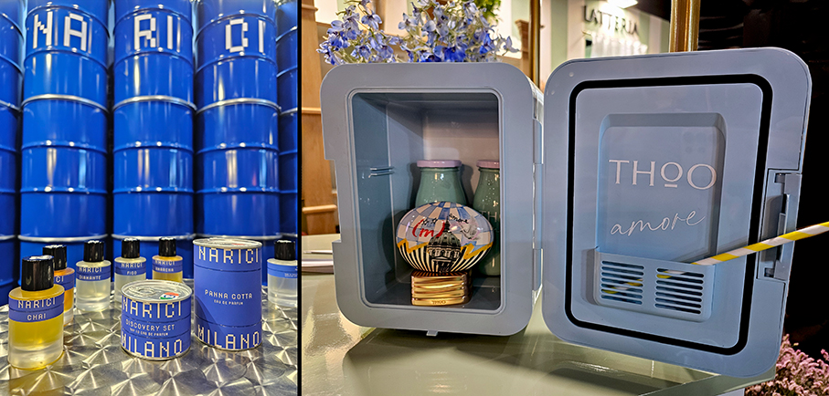

**Narici**

Brand italiano che seleziona e sviluppa oli essenziali e assolute naturali ottenuti da ingredienti italiani monorigine. I lanci si basano sul calendario agricolo e la filiera si fonda su agricoltori e coltivatori. Ogni mese nasce un nuovo profumo, man mano che vengono raccolte e lavorate nuove materie prime. Le produzioni sono limitate e riprendono con il raccolto successivo. **Panna Cotta** Una sorprendente fragranza alla vaniglia con un ingrediente inaspettato: l’iris pallida toscana, coltivata da uno dei rari produttori italiani che effettuano internamente anche l'estrazione, sulle colline del Chianti. Panna dolce addensata, una nuvola di zucchero a velo, cipria vintage. Assoluta di vaniglia tahitiana, assoluta di tuberosa, rizomi di iris toscano. Cristalli d'ambra, muschio bianco vegan, molecole lattoniche.

**THoO**

Il motivo per cui amiamo l’Italia? Il suo caos che emoziona, l’eccesso che travolge, la bellezza che sfugge alle regole. **Amore** è un omaggio a questo spirito: imperfetta, fresca, giocosa, indimenticabile. Un profumo che cattura l’essenza dei momenti spontanei e autenticii. In Italia, l’imperfezione è bellezza, è l’intreccio tra eleganza e dissonanza a rendere unico ogni angolo, trasformando il caos in fascino e l’unicità in perfezione. Latte ghiacciato e menta si incontrano: non è solo una fragranza, è l’Italia stessa, raccontata attraverso il profumo della sua spontaneità, della sua energia e della sua bellezza unica. Imperfetta, libera, indimenticabile.

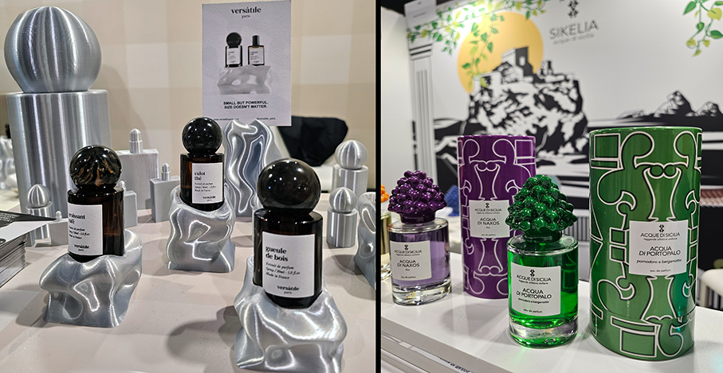

**Versatile Paris**

Brand francese di profumeria indipendente che reinventa il gesto del profumarsi con estratti di profumo in olio. Celebrando l’indecisione come libertà creativa, si pone come alternativa audace alla profumeria tradizionale. Il nome racconta un’identità in continuo movimento, aperta al cambiamento e alla sperimentazione. Cuore del progetto è il roll-on sensoriale con estratti di profumo in olio, senza alcol. Le fragranze si distinguono per formule pulite, trasparenti e sostenibili. Propone nuove fragranze in versione spray senza alcol come **God Bless Cola** Le note di testa sono Popcorn e Coca Cola; le note di cuore sono Burro, Caramello e Arachidi; le note di base sono Vaniglia, Accordo Gourmand, Dolciumi e Note Boschive.

**Sikelia**

Sikelia, in antico greco Sicilia, nasce da un’idea di Salvo Scarpaci, designer siciliano, di intrecciare il mondo delle fragranze con la cultura, la ceramica e l’identità mediterranea. I tappi in ceramica sono modellati e dipinti a mano a Caltagirone, le nappine sartoriali e i packaging si ispirano alle maioliche siciliane. Ogni profumo racconta una storia dall'anima siciliana. **Triskelè, Nikos e Atma** Un trittico di fragranze ispirate agli elementi primordiali mare, fuoco e terra. Profumi intensi che evocano leggende profonde come quelle di Colapesce, Encelado e la Trinacria, simbolo delle molteplici culture che hanno plasmato l’isola. Ogni essenza è una storia, ogni profumo una leggenda.

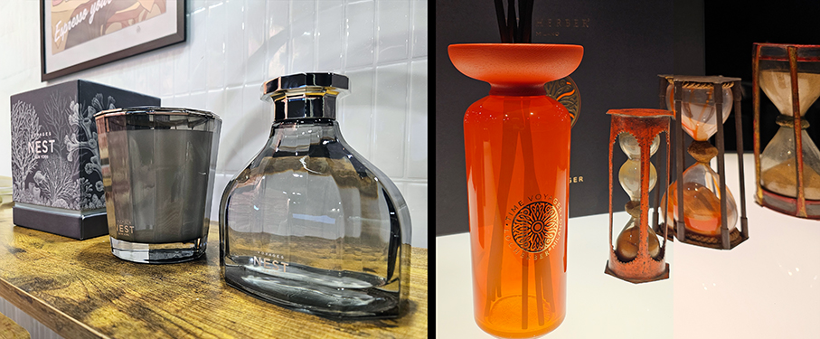

**Nest New York** 

NestNew York fonde fragranze di lusso, design moderno e narrazione sensoriale per creare esperienze olfattive coinvolgenti per la casa e per la persona. Ispirato all'arte, alle atmosfere e allo stile di vita moderno, il marchio crea candele, diffusori, profumi e collezioni benessere che coniugano esperienze sensoriali e un'estetica ricercata. **Vanilla Bourbon Eau de Parfum** è una seducente e calda fragranza gourmand che evoca il piacere di indulgenze senza fretta con il sontuoso profumo dell'assoluta di vaniglia bourbon, una sofisticata miscela di bitter all'arancia e ricco zucchero di canna, e una scia invitante di gelsomino notturno e muschio delicato.

**Locherber Milano**

Locherber Milano presenta **Time Voyager**, un diffusore di design che trascende la funzione per diventare una vera e propria esperienza sensoriale legata al tempo. Uno degli elementi distintivi del progetto è la possibilità di personalizzare completamente l’esperienza olfattiva, selezionando la fragranza desiderata tra le esclusive creazioni del catalogo. Ispirato alle antiche clessidre, ne offre una reinterpretazione contemporanea, trasformando un oggetto iconico in una narrazione visiva e olfattiva. Elemento distintivo è il colore arancio, intenso e vibrante, che richiama energia e trasformazione.

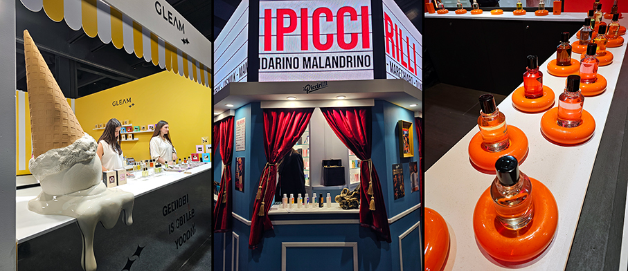

**Gleam**

Ludovica e Matilde Gritti sono le fondatrici di Gleam, per spiriti liberi, brillanti e indipendenti. Nato tra il Mediterraneo e Londra, è una combinazione di profumi, colori e storie quotidiane: dall’aroma del caffè del mattino italiano alle autentiche miscele di spezie fino alle ombre verdi e grigie di Kensington. Collezione Villeggiatura è il diario dei ricordi più cari: l’aria fresca del mattino, il caldo umido di un pomeriggio estivo, una fuga romantica, tutto trasformato in fragranze. Comprende: **Cocco Bello, Camporella, Domenica, Scottatura, Afa e Gelatino**. Quest’ultimo, perfetto per l’estate ha note olfattive gourmand: Wafer, Vaniglia, Accordo di Gelato, Nocciola, Muschio Bianco.

**iPiccirilli**

Il nome iPiccirilli, che fonde il cognome Piccirillo con il termine napoletano che sta per "piccolo", riflette la filosofia del marchio: celebrare la magnificenza nascosta nelle piccole cose. Per tutti gli amanti del profumo del cocco, una fragranza che incarna lnon solo la sua dolcezza esplosiva, ma anche la sua forza vitale, propone **Coco Bay**: un inno alla gioia di vivere. Note di testa: Latte di Cocco, Sale, Limone. Note di cuore: Cocco, Ylang-Ylang, Cacao Amaro, Caramello. Note di fondo: Cocco, Legno di Sandalo, Assoluta di Vaniglia di Thaiti, Legno di Cedro, Ambra, Legno di Guaiaco, Cera d’api.

**Fugazzi**

Fugazzi è un marchio di fragranze dei Paesi Bassi. Il fondatore Niessink ha visto una nicchia per una casa di profumi di nuova generazione, con personalità, che non ha paura di rischiare e che si sta espandendo a livello globale per esperienze di profumo significative e memorabili. **Pomegranoudh** parla di cosa succede quando il controllo e l’impulso si incontrano. Si apre in modo netto e luminoso con il melograno. Man mano che si evolve, grazie all’oud, diventa più profondo e caldo. È un profumo da indossare di notte, quando tutto sembra intenso, e poi di nuovo al mattino, quando le cose rallentano e si azzerano. Stessa fragranza, momento diverso.

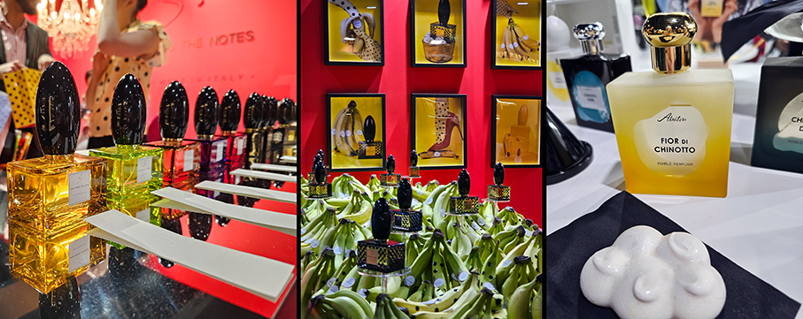

**Esse Strikes the Notes** 

Un progetto interamente pensato e prodotto in Italia che incarna i valori dell’unione della famiglia, combinati alla moda e al moderno design italiano, una linea di fragranze raffinate e innovative con un inclinazione originale, dinamica e accattivante. **Naked Bänänä** una composizione olfattiva ricercata e raffinata. Una banana senza filtri che si intreccia alle sfumature frizzanti del pompelmo e al calore speziato dei chiodi di garofano. Cuore cremoso di vaniglia e delicati accordi floreali, per chiudersi infine su un fondo intenso di sandalo, patchouli, vetiver e ambroxan. Il risultato è una fragranza ironica ma ricercata, capace di catturare l’attenzione e trasformare la leggerezza in carattere. 

**Abaton**

Un brand di Savona che cattura il profumo del Chinotto, uno straordinario agrume. Il suo profumo è così affascinante che Abaton ha deciso di creare una propria coltivazione. Dalla sua ricca fioritura, dalle foglie e dalle scorze, si ricavano estratti profumatissimi. **Fior di Chinotto** Una fragranza della Riviera Ligure di Ponente, con le sue delicate e avvolgenti note fiorite del bocciolo del chinotto, gelsomino, tuberosa, ambra e legni preziosi. Simile ad un fiore d’arancio ma con l’anima di un gelsomino, un profumo unico ed inebriante. Note di testa: fiori di arancia amara, rosa damascena, note fruttate, gelsomino Note di cuore: mandarino, patchouli, fior di chinotto, tuberosa, miele Note di fondo: legno di cedro, ambra, muschio bianco, legni preziosi. 

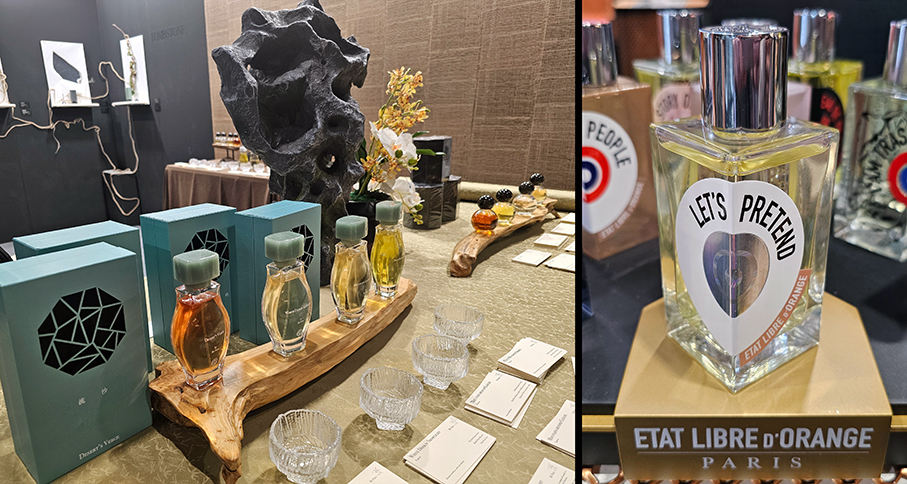

**Bu Feng**

La filosofia e la sensibilità legate al vento definiscono l'approccio creativo di Bu Feng: il lusso discreto e senza tempo dell'Asia, una ricerca raffinata di artigianalità e materiali. La forma ottagonale della scatola, una delle più iconiche del design cinese, simboleggia il vento e la fortuna provenienti da ogni direzione cardinale. **Personae**: ogni fragranza di questa collezione è un extrait de parfum ispirato a una storia del folklore cinese che narra di un individuo straordinario, il cui spirito era espressivo ma composto, personale ma influente.
**Orizzonte**: ogni fragranza di questa collezione è ispirata a un luogo conosciuto solo attraverso il folklore: geograficamente indefinito o introvabile, eppure contraddistinto dal modo in cui la vita si svolgeva al suo interno.

**Etat Libre d’Orange**

Fragranze realizzate attraverso una sottile alchimia di materie prime eccezionali, contrasti audaci e accordi olfattivi inaspettati. Profumi a lunga durata pensati per suscitare emozioni, esaltare i rituali quotidiani e lasciare una scia indimenticabile. **Let's Pretend** Una fragranza giocosa, fruttata e speziata, in cui la succosa pesca si fonde con lo zafferano e le calde note legnose. Affascinante, elegante e irresistibilmente espressiva, diventa un abito invisibile, rivelando nuove sfaccettature della personalità.

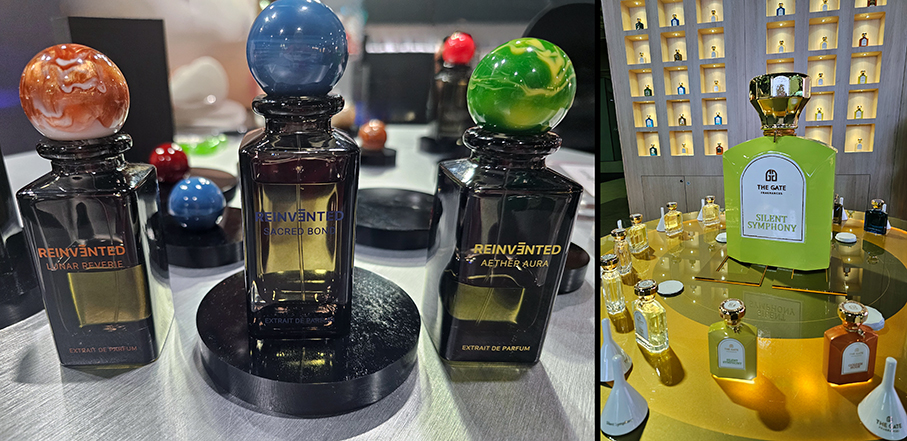

**Reinvented Parfums**

Fragranze incentrate su stati d'animo, emozioni e immersione sensoriale. **Aether Aura** è la nuova fragranza con una composizione più luminosa ed elettrizzante, pur rimanendo fedele alla narrazione emozionale che contraddistingue il marchio. Si apre con bergamotto e limone frizzante, ravvivati da accenti di pepe rosa e zenzero. Nel cuore, iris, kiwi, ananas e geranio creano una composizione floreale-fruttata ricca di texture, pensata per essere luminosa, fluida e vibrante. La fragranza si assesta su una base calda di vetiver, ambra e muschio, lasciando una scia morbida e radiosa vicino alla pelle. Oscillando tra freschezza e calore, chiarezza e delicatezza, esplora l'energia interiore che si manifesta attraverso il profumo.

**The Gate Fragrances Paris**

Il marchio persegue con coraggio la diversità culturale producendo fragranze uniche con formule esclusive. Mira a connettere l'umanità, la cultura, la musica, le arti e il patrimonio del mondo attraverso i suoi odori. Per provare le emozioni bisogna passare dalle Porta dell'Amore, della Musica e dell'Arte. **Golden Hour** è una fragranza floreale-fruttata che dona calore, luce e gioia catturando l’essenza più magica del giorno: quel breve istante in cui il sole bacia l’orizzonte e ogni cosa si tinge d’oro. Note di testa: Mango, Frutti Esotici, Cocco, Frutti di Bosco Misti, Limone, Bergamotto. Note di cuore: Gelsomino, Peonia, Sandalo, Cedro. Note di fondo: Ambra, Note Muschiose, Baccelli di Vaniglia, Muschio Bianco.

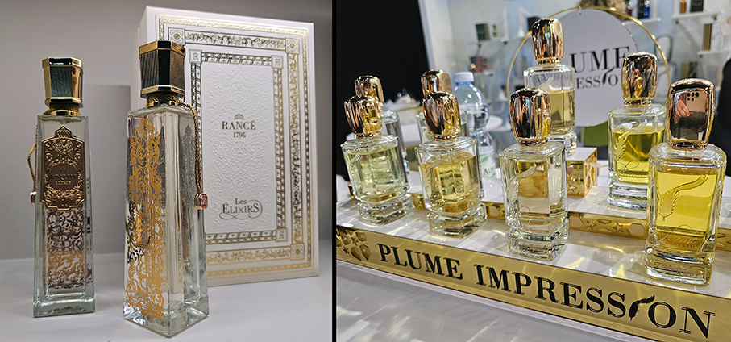

**Rancé 1795**

Maison inaugura un nuovo capitolo della propria storia olfattiva con **Les Elixirs**. Reinterpreta due fragranze emblematiche in una forma più intensa: grazie a concentrazioni più elevate di essenza profumata, ogni nota si espande con maggiore potenza e profondità, mentre gli accordi si arricchiscono. Anche il design riflette questa evoluzione: un flacone in vetro impreziosito da un’etichetta metallica scolpita che riflette la luce come un gioiello inciso. Sul retro, un delicato ramage si rivela come un dettaglio prezioso e discreto. Il tutto completato da tocchi dorati e un packaging concepito come uno scrigno, decorato con motivi ispirati all’arte imperiale.

**Plume Impression**
 
Cattura con maestria lo spirito della piuma: delicata ma resistente, raffinata ma espressiva. Ogni fragranza è attentamente composta per riflettere una personalità audace con una discreta sicurezza, mai invadente, ma capace di lasciare sempre un'impressione sofisticata e duratura. **Love no Shame** incarna passione e intensità, fondendo rose rosse, ciliegia e cioccolato con crema di fragole montata, cannella e mandorle dolci. L'oud affumicato aggiunge un tocco di mistero, completando la calda e muschiata base di sandalo. Un accattivante contrasto di sensualità e profondità, che persiste a lungo, evocando un amore puro in un profumo indimenticabile.

**EXPERIENCE LAB - Beauty Nostalgia**

All’interno degli spazi di Esxence si è svolto contemporaneamente Experience Lab 2026, l’appuntamento dedicato al **beauty di ricerca**, giunto alla sua sesta edizione che ha come titolo Beauty Nostalgia.

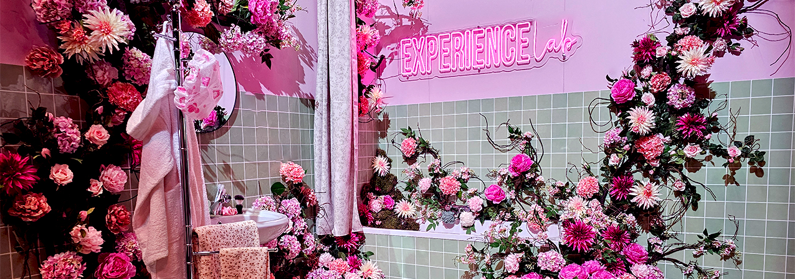

Una vera e propria piattaforma creata per incentivare la crescita e la promozione di **brand di nicchia e indie del beauty**. Un’occasione unica per scoprire nuovi prodotti e la filosofia di ogni marchio insieme a chi l’ha creato e per rinnovare le proprie abitudini di beauty routine, testando nuovi prodotti, scoprendo la filosofia e il concept dietro ogni marchio.

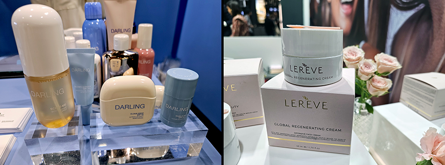

**Darling**

Brand Made in Italy di prodotti solari premium nato per rendere i prodotti SPF più cool e attraenti e sensibilizzare i consumatori sull'importanza della protezione della pelle. Solari dall'aspetto glamour, piacevoli da indossare. **Scent-Me Body & Hair Mist Positano Vanilla** Una mist profumata corpo e capelli water-based, idratante, leggera per un rituale di bellezza estivo sensoriale, fresco e avvolgente. **Cloud Drop Spf 50 Ultrafluid Daily Moisturizer** Protezione solare quotidiana idratante ultra-fluida con SPF50 ad ampio spettro, leggera, invisibile. Idrata, protegge e rinforza la barriera cutanea in un unico gesto.

**Le Rêve Beauty**

Si ispira alla nutricosmesi con creme viso abbinate a integratori ricchi di principi attivi naturali. **Global Regenerating Cream** trattamento globale e intensivo ridurre i segni del tempo, migliorare la compattezza cutanea e l’iperpigmentazione. La formula estremamente ricca, corposa e nutriente, contiene: estratto di Caesalpinia Spinosa (Tara); Sodio Retinil Ialuronato (innovativo derivato di Vitamina A) che la rende sicura e non fotosensibilizzante; Resveratrolo, forte schermo antiossidante; Acido Ialuronico a diversi pesi molecolari e Olio di Canapa.

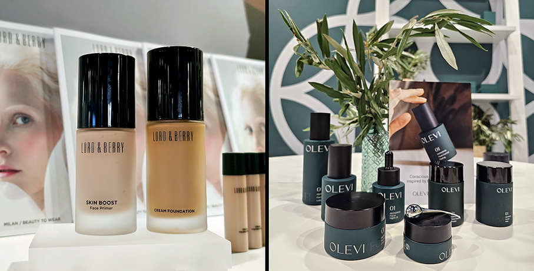

**Lord & Berry**

Texture moderne e colori contemporanei in prodotti di alta qualità realizzati con materie prime selezionate e sviluppate nei laboratori di Milano. Prodotti per il trucco multitasking che combinano principi attivi benefici per la cura della pelle. 
**Fondotinta in crema** A copertura medio-alta con eccezionale sfumabilità, per creare un incarnato uniforme e levigato con un finish naturale e radioso senza seccare. Arricchito con squalano, olio di avocado, olio di argan e ialuronato di sodio, offre idratazione e nutrimento a lunga durata. Disponibile in nove tonalità.

**Olevi Biotech**

Precisione biotecnologica per migliorare la resistenza della pelle, senza alterarne il naturale equilibrio grazie all'Olea Vitae, un principio attivo estratto dall'ulivo. **Olevi Cleansing Powder** detergente viso di nuova generazione: polvere ricca di ingredienti attivi naturali, che si attiva a contatto con l'umidità, trasformandosi in una leggera schiuma, ideale per rimuovere impurità, sebo in eccesso e tossine senza seccare la pelle. Grazie a vitamina C, argilla bentonitica e sodio cocoilisetionato, riequilibra la pelle e lenisce le infiammazioni senza alterare il microbiota cutaneo.

_Ph. Credits: Maria Rosa Sirotti_
