# Euphoяia - art is in the air

>La tappa milanese 2025 del **Balloon Museum** offre al pubblico un’esperienza culturale che celebra l’**arte inflatable** come forma espressiva capace di dialogare con la contemporaneità

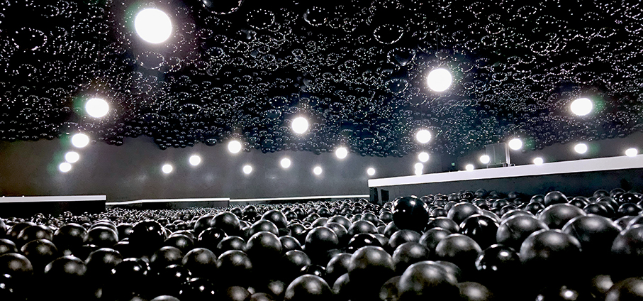

Dopo il successo mondiale delle passate edizioni, a **Milano** torna **Balloon Museum** con **Euphoяia - art is in the air**, mostra itinerante dedicata al balloon e alla inflatable art: un viaggio sensoriale tra le visioni di artisti internazionali che trasformano lo spazio in **un’esperienza condivisa con lo spettatore**.

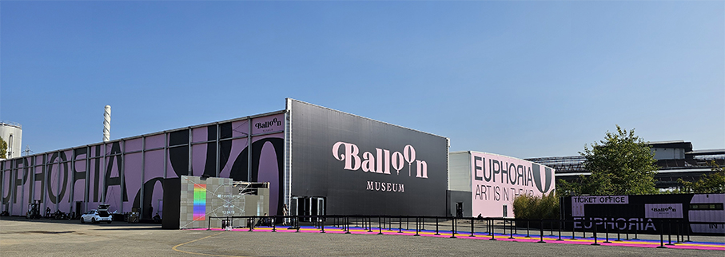

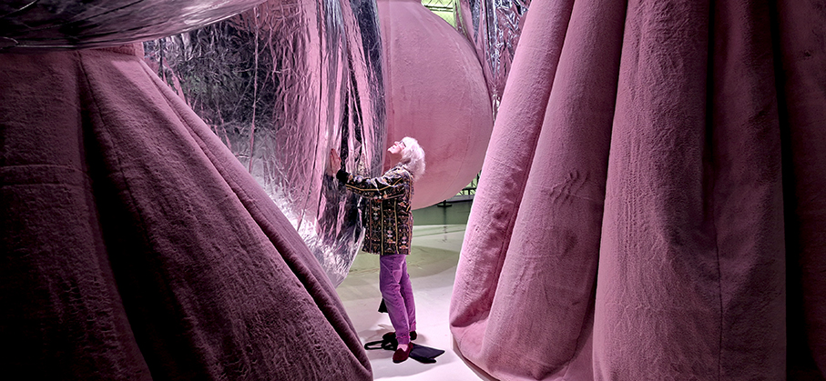

Con oltre 7 milioni di visitatori e 17 edizioni ospitate in diverse città tra cui Roma, Parigi, New York, Singapore, Londra e Miami, la tappa **in Italia** sarà **dal 18 ottobre 2025 al 22 febbraio 2026**  presso **Area MilanoSesto** a Sesto San Giovanni accoglierà opere di sedici artisti e collettivi internazionali.

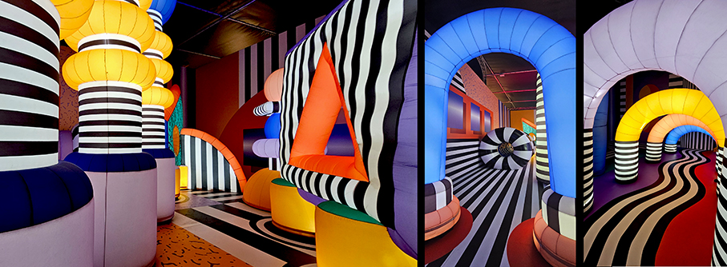

"_Dopo tre anni torniamo a Milano con una nuova mostra che raccoglie l’energia e la sperimentazione delle tappe internazionali del Balloon Museum. Euphoяia – Art is in the Air propone al pubblico un nuovo modo di vivere l’arte, trasformando lo spazio in un ambiente dinamico e partecipativo, dove l’incontro tra opere e visitatori genera meraviglia, riflessione e condivisione"_, dichiara **Roberto Fantauzzi, founder di Lux Entertainment**.

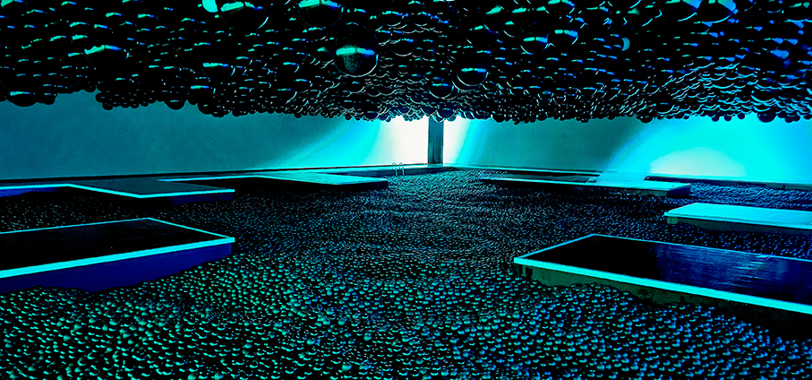

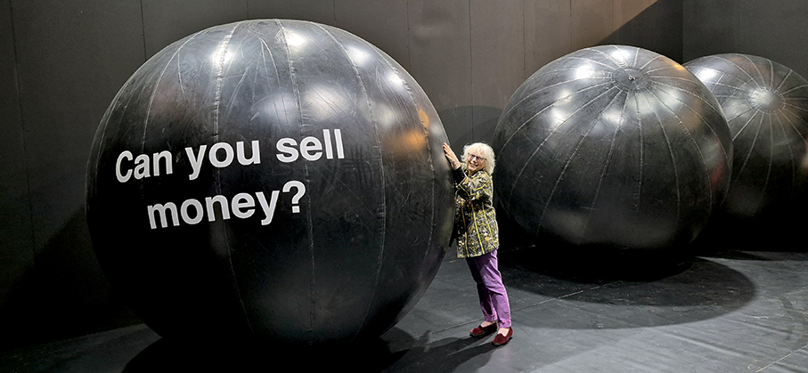

**Euphoяia - Art is in the Air**- concepita dai team di **Lux Entertainment**, con il supporto e la collaborazione di **Valentino Catricalà**, tra i curatori della mostra - invita a riflettere sul potere trasformativo dell’arte, celebrando la leggerezza, l’interazione e la forza comunicativa del gonfiabile, attraverso un allestimento volto a creare un dialogo emotivo tra spettatore e opera d’arte in un ambiente di oltre 5000 mq.

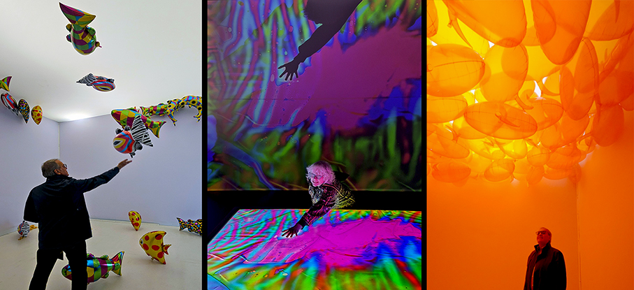

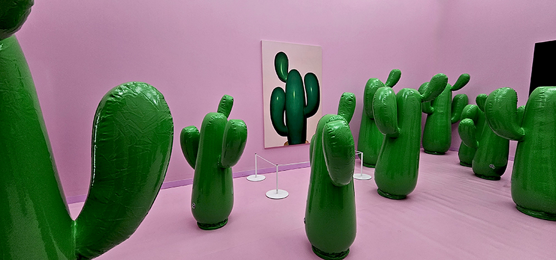

_"Sono davvero felice che il tour della mostra Euphoria arrivi a Milano dopo il successo al Grand Palais. Milano è una delle capitali europee dell’arte, e portare qui la più grande mostra dedicata al rapporto tra arte e gonfiabile può offrire alla città un'esperienza artistica e culturale del tutto nuova"_, racconta **Valentino Catricalà**.

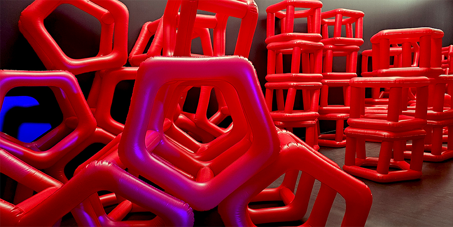

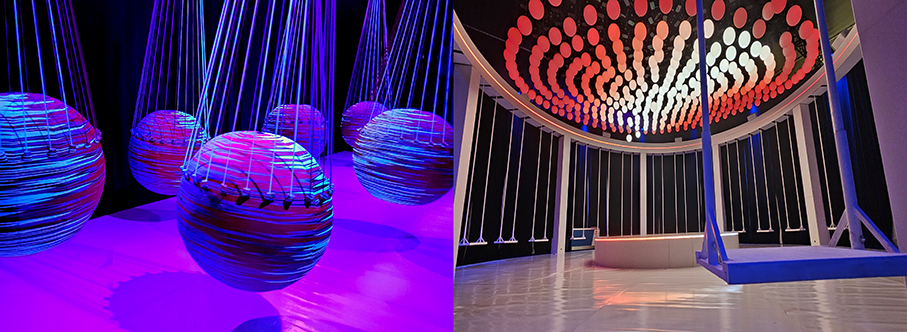

L’esposizione esplora l’emozione che gli artisti intendono suscitare nel pubblico, facendo dell’**opera inflatable**, con la sua leggerezza e monumentalità, l’espressione di una **nuova estetica contemporanea**. Le opere diventano così non solo strumenti artistici, ma veri e propri veicoli di interazione, spettacolo e scoperta, capaci di riflettere su tematiche della **contemporaneità** e sul potenziale creativo di materiali apparentemente semplici, creando nuovi **spazi di socializzazione** fisica, digitale e culturale. Il termine “Euphояia” racchiude l’essenza dell’esperienza e del progetto, richiamando l’**elemento che dà vita alle installazioni: l’aria**.
 
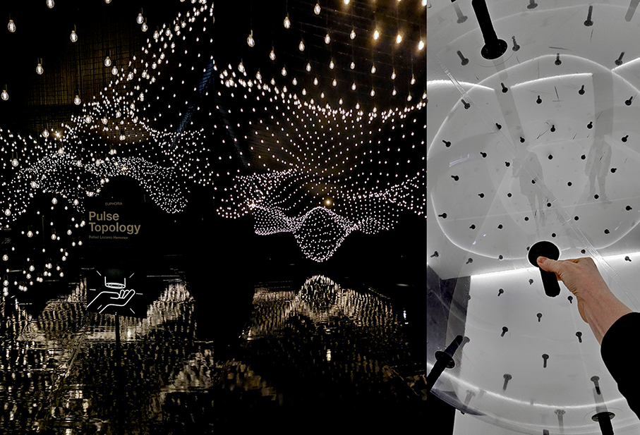

Tra gli artisti internazionali in mostra, si distinguono il francese **Philippe Parreno**, noto per il suo approccio allo spazio espositivo dinamico e in evoluzione, che rende la visita un’esperienza unica giocando con i confini spaziali, temporali e con la percezione sensoriale del visitatore e il duo **A.A.Murakami** che intreccia natura e tecnologia dando forma all’immateriale e invitando il pubblico a riflettere su fenomeni effimeri.

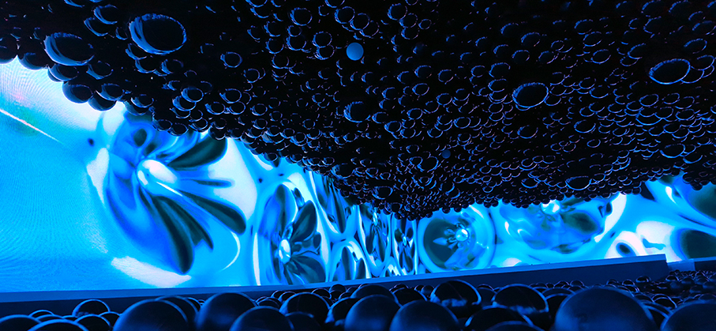

Il collettivo multidisciplinare italiano **Hyperstudio** crea installazioni che combinano arte, design e intrattenimento in universi narrativi sorprendenti, dove luce, colore e prospettive insolite generano ecosistemi capaci di stimolare immaginazione e meraviglia; l’artista britannico **Martin Creed** adotta un approccio multidisciplinare che trasforma oggetti e materiali quotidiani in opere artistiche, combinando minimalismo, ironia e sperimentazione.

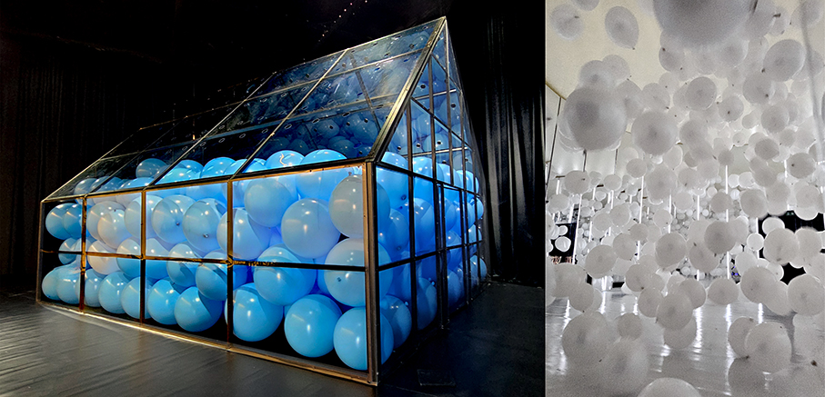

All’interno del percorso espositivo si inseriscono, inoltre, le opere di: **Ryan Gander, Hyperstudio con Quiet Ensemble & Roman Hill, Hyperstudio con Mauro Pace, Cyril Lancelin, Motorefisico, Alex Schweder, Karina Smigla-Bobinski, SPY, Nils Völker, Camile Walala e Sun Yitian**.

**BALLOON MUSEUM** Euphoяia - Art is in the Air

18 ottobre 2025 - 22 febbraio 2026
Area MilanoSesto, Viale Italia, 576, Sesto San Giovanni
**https://balloonmuseum.world/**
