# Eyewear – nuovi trend a MIDO 

>**MIDO 2026**: tre giorni dedicati all’eyewear mondiale come **punto di riferimento globale** per l’intera filiera a Fieramilano
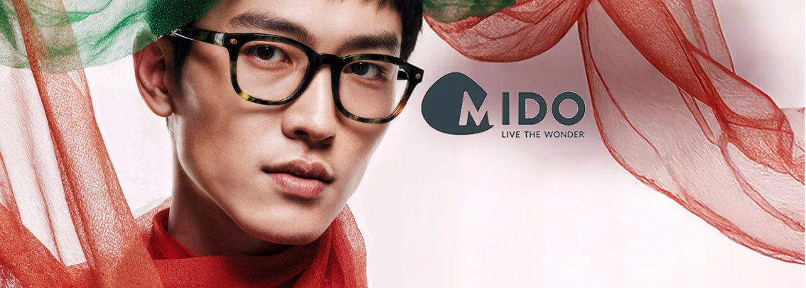

Con circa **1.200 espositori (di cui 930 stranieri provenienti da 50 Paesi)** e oltre 40.000 visitatori, qui **si incontrano domanda e offerta, creatività e tecnologia**. MIDO 2026 racconta un eyewear sempre più **espressivo e identitario**, in equilibrio tra heritage e innovazione. uno dei **settori simbolo del Made in Italy** e di cui il nostro paese è leader globale.

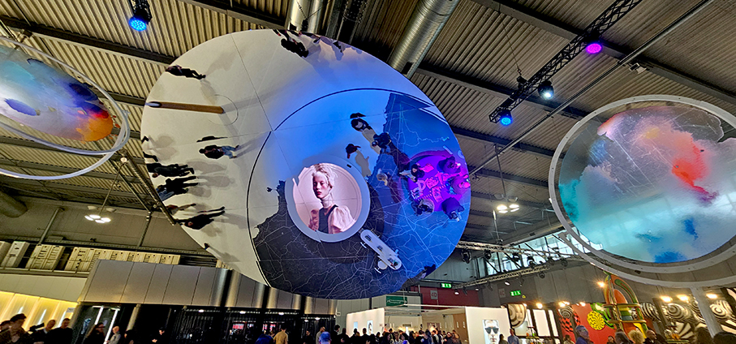

**Materiali sostenibili e performanti** (bioacetati, riciclati, metalli leggeri), **forme classiche reinterpretate** (pilot, cat-eye, panto, navigator) e **palette sofisticate** definiscono le collezioni. Tornano **montature grandi e spesse**,anche con **barra superiore**, trionfano i colori, tra cui **verde acido e fucsia**, insieme al**nero matt**; grande attenzione viene data allo studio delle **cerniere** che diventano oggetto di design per estetica, performance e resistenza.
L'integrazione dell’**intelligenza artificiale** nella progettazione aumenta le soluzioni di personalizzazione e comfort.

Come ogni edizione, segnalo alcuni brand che ripropongo per la loro costante **ricerca tecnica ed estetica**. Ad essi si aggiungono **new entry** che mi hanno colpito particolarmente per colori, forme, materiali e offerta variegata.

**TAVAT**

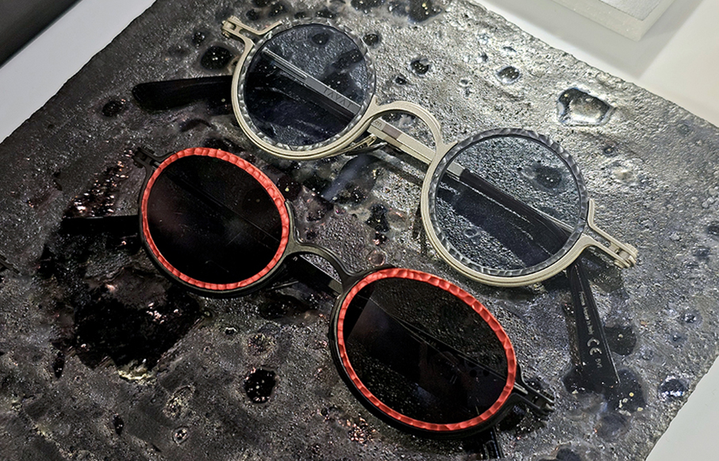

Progettati in California, realizzati a mano in Italia applicando tecnologie innovative. I prodotti **Tavat**sono curati nei minimi dettagli, realizzati in piccoli lotti, con dettagli unici e un tocco personale. Le lenti degli occhiali da sole Tavat sono arricchite con melanina sintetica per garantire la massima protezione degli occhi, migliorando la chiarezza e il contrasto, senza alcuna distorsione del colore. Funge da scudo contro i raggi UV e fino al 97% della luce blu-violetta dannosa (HEV). ****https://tavat-eyewear.com/**

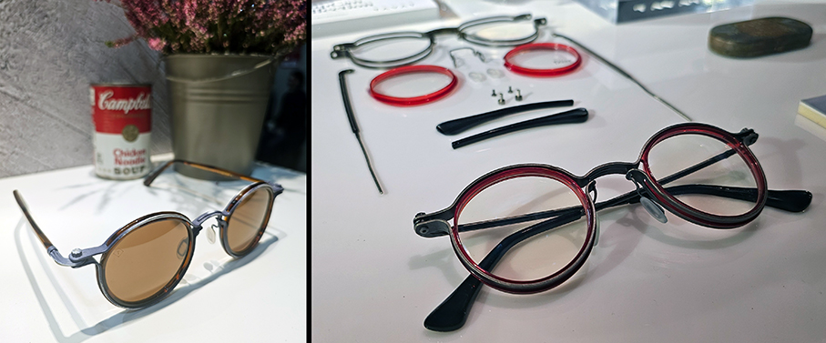

**ULTRA LIMITED**

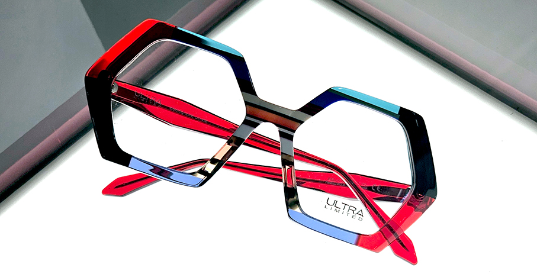

La nuova collezione **Ultra Limited** 2026 introduce linee inedite pensate per chi cerca occhiali che raccontano una storia diversa. Ogni modello rappresenta un’interpretazione unica della artigianalità italiana. Mai uguali, sempre unici. Tutto nasce da un principio chiaro: ogni montatura deve essere irripetibile come chi la indossa, ma con design studiati per durare nel tempo. Materiali premium selezionati con cura, colori che si intrecciano in armonie irripetibili. Lavorazioni artigianali che richiedono ore di lavoro manuale: ogni occhiale è numerato, certificato e unico. **https://ultralimited.it/**

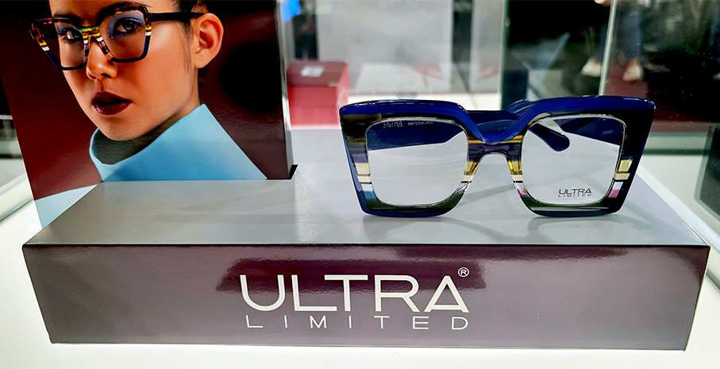

**KALEOS**

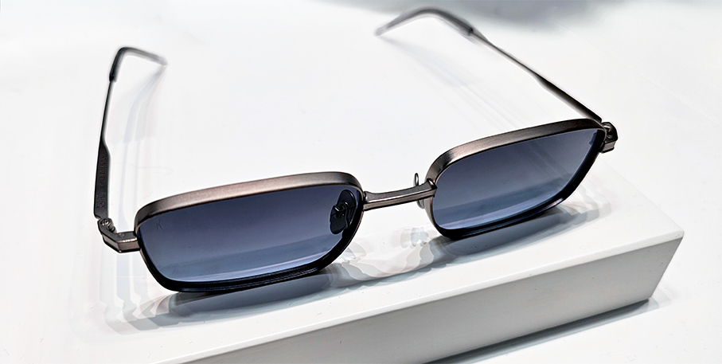

**Kaleos** abbraccia l'inaspettato, lasciando che le torsioni di forma e design guidino l'occhiale che diventa un'estensione dello sguardo. Modelli in acciaio inossidabile (nero opaco, argento lucido e argento opaco), caratterizzati da leggerezza e precisione tecnica; montature piccole dal carattere forte, a dimostrazione che l'impatto nasce dal design, non dalla grandezza, ma anche occhiali da sole in acetato dove volumi audaci e linee scultoree trasformano la forma in una dichiarazione di stile. **https://kaleoscollection.com/it_IT/**

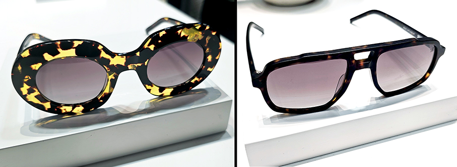

**MOREL**

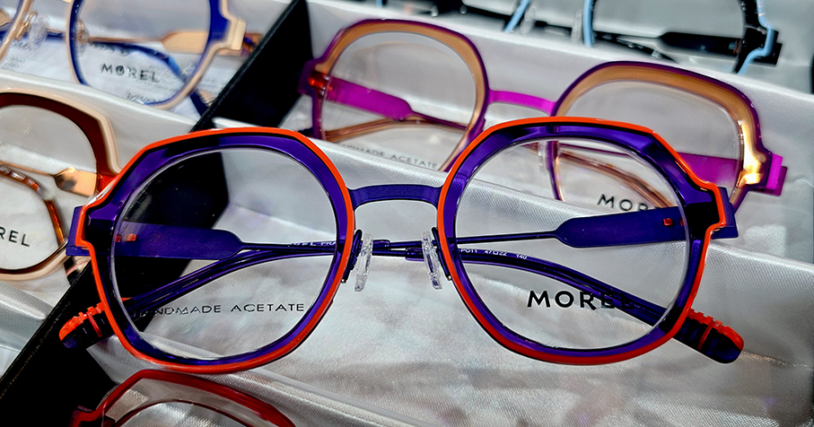

**Morel** presenta Enigma, una collezione concepita come un'esplorazione infinita, con libertà assoluta di creazione. Le montature sono disponibili in una palette elettrizzante, audace e vibrante, in cui ogni modello è caratterizzato da un esclusivo design bicolore. Questo contrasto materializza il delicato confine tra immaginazione e realtà: un universo onirico in cui sogno e realtà si sfiorano, si intrecciano e si fondono. La trasparenza degli acetati rafforza questa sensazione di fluttuazione tipica dei momenti in cui si emerge da un sogno, mentre i colori pieni svolgono il ruolo di ancoraggio, richiamando la materia, il tangibile. **https://morel.com/**

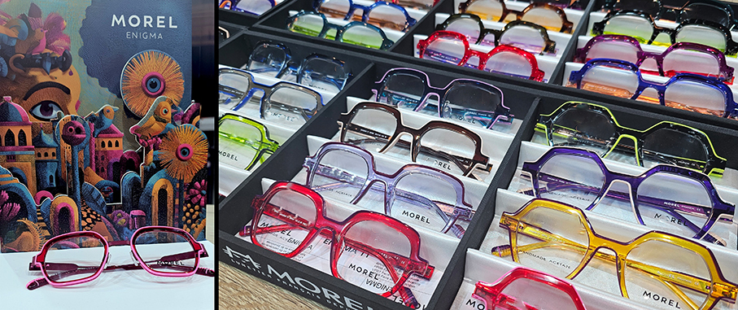

**MYKITA**

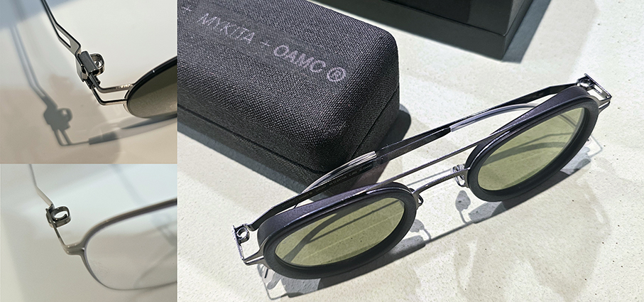

**Mykita** è una casa di design che produce occhiali all'avanguardia. Realizzati a mano a Berlino, hanno uno spirito contemporaneo: audaci ed espressivi o con un raffinato understatement, si distinguono per leggerezza e resistenza, oltre che per la raffinata composizione cromatica e superficiale. Non avendo nessuno che realizzasse questi modelli originali di occhiali, il brand ha deciso di avviare la produzione internamente. Sviluppare strumenti e processi interni per soddisfare i requisiti di design è da allora diventato un principio Il cuore della moderna manifattura è la combinazione di artigianato specializzato e nuove tecnologie adattate.   **https://mykita.com/**

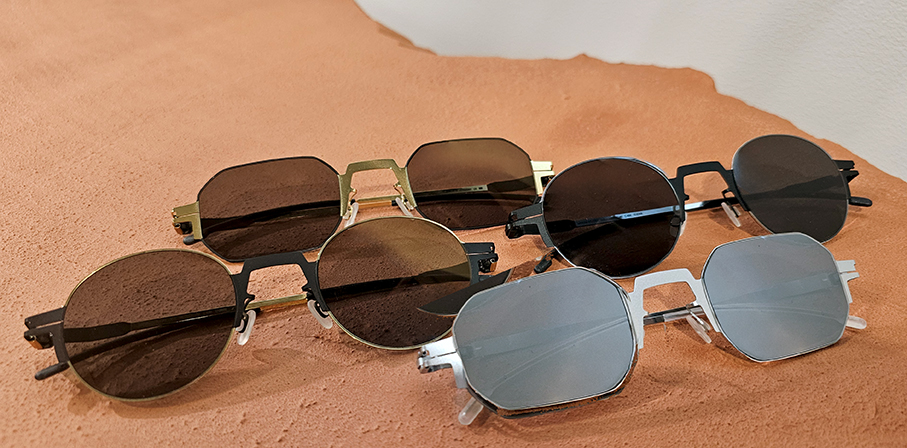

**SPECTAFUL**

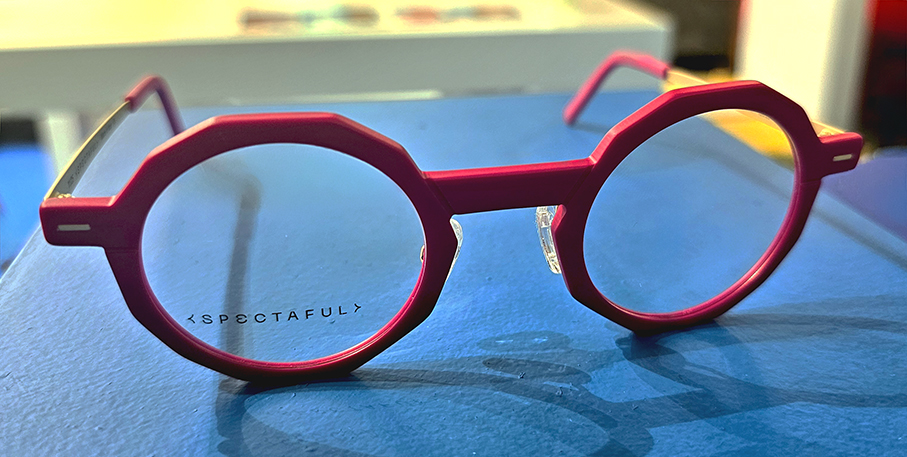

La resistenza dell’acciaio unita alla flessibilità del polimero per creare occhiali dal comfort assoluto e dal design sorprendente. **Spectaful** nasce dalla convinzione che le montature devono essere leggere, colorate e flessibili, per vivere ogni momento: il lavoro, lo sport, una serata fuori, una corsa al parco. Il colore non è decorazione, è identità pura: il pigmento non si vernicia ma viene inserito direttamente nella pasta del polimero. Risultato? Tonalità vive e profonde, zero usura, 8 grammi di assoluta leggerezza, tanto che ci si dimentica di indossarle, rese indistruttibili da acciaio e polimero tecnologico. Zero pressioni sul naso, zero fastidi, zero paura di romperle. Perché un occhiale deve stare addosso come una seconda pelle. **https://spectaful.com/**

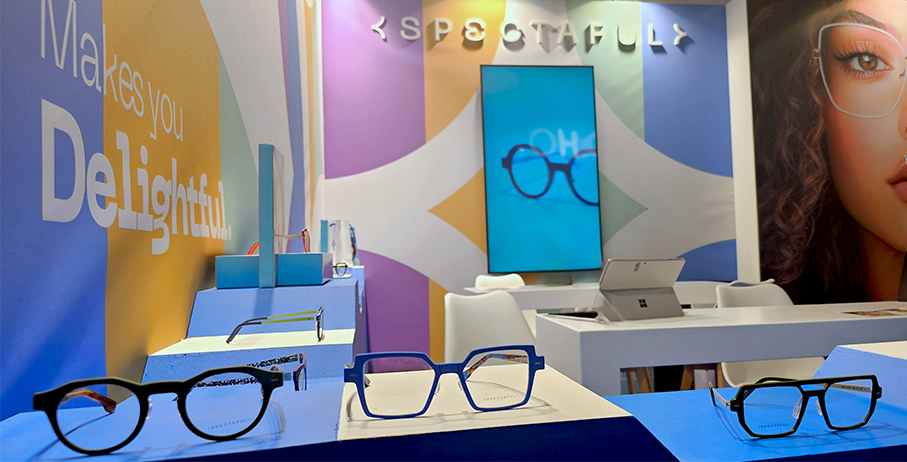

**THEO**

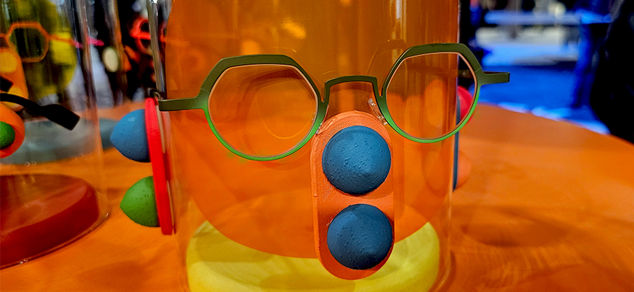

**Theo Eyewear** è un marchio indipendente di occhiali noto per il design eccentrico, colorato e di tendenza. Tutti gli occhiali sono progettati nella sede di Anversa e realizzati in Belgio e in Francia, secondo elevati standard qualitativi. Ha scelto di distinguersi nel settore eyewear, trasformando gli occhiali da semplice ausilio ottico a vero accessorio di moda. Montature stravaganti, ispirate all’arte, caratterizzate da forme audaci, palette vivaci e Pieno di colore e sempre pronto a sorprendere, mescola divertimento, design dalle forme audaci, influenze artistiche e materiali di alta qualità. La filosofia del brand è portare felicità e valorizzare l’individualità di chi indossa i suoi occhiali, un concetto riassunto nello slogan “Theo Loves You”, presente su prodotti e confezioni. **https://www.theo.be/**

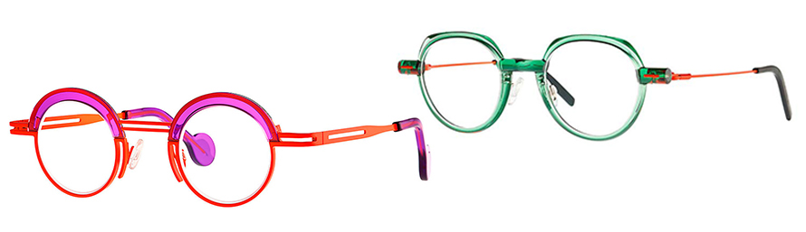

**THEMA - OPTICAL**

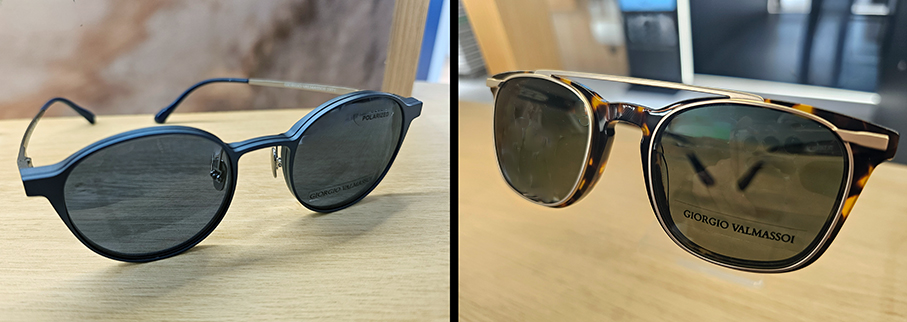

L’azienda ha investito pesantemente in ricerca e sviluppo per creare macchine agili, flessibili e brevettate, con tecnologia all'avanguardia che permette a ogni cliente di personalizzare il proprio stile, colore, finitura e tocchi unici, il tutto a partire da un modello 3D. **Thema - Optical** ha sviluppato internamente un configuratore che, attraverso un nuovo processo di vendita digitale, permette ai clienti di creare le proprie montature uniche e sostenibili. Ogni occhiale personalizzato viene realizzato solo una volta confermato l'ordine. Questo consente di massimizzare l'utilizzo delle risorse, ottenendo prodotti garantiti e eco-friendly. Con un magazzino virtuale a zero impatto e zero sprechi, offre soluzioni sostenibili per gli occhiali. Attraverso una scansione tridimensionale del viso, un algoritmo raccomanda le migliori forme di montatura in base alle misurazioni e alle dimensioni del viso, consentendo ai clienti di visualizzare la montatura scelta. **https://thema-optical.com/**

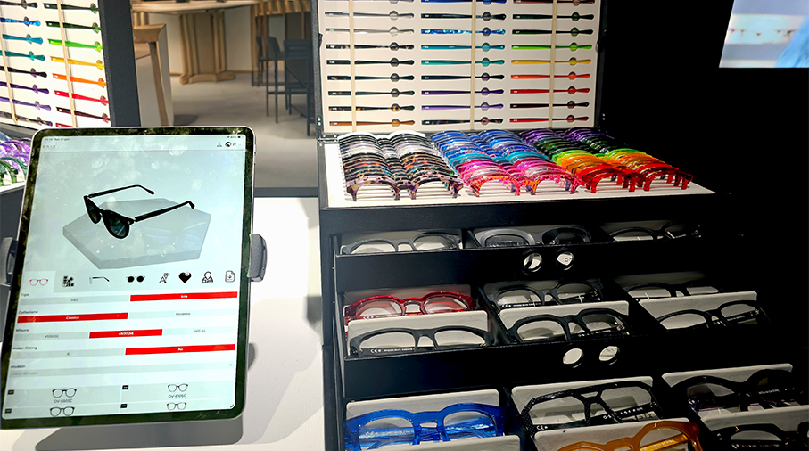

**ENOX**

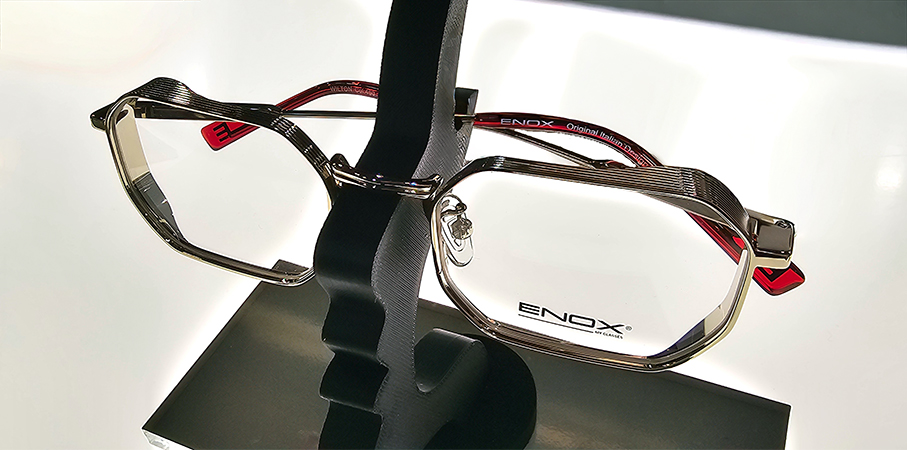

L’azienda valorizza i suoi prodotti attraverso la ricerca, il design, l’originalità stilistica, senza mai mettere in secondo piano l’essenza fondamentale della sua filosofia: il benessere e il comfort, sempre nel rispetto dell’ambiente. La perfetta sinergia di design e materiali di altissima qualità genera un must di estetica e moda. **Enox** è proprio arte, colore, luce e design. Uno degli aspetti fondamentali è l’ergonomia, risultato di un’attenta fase di progettazione, creando occhiali per ogni esigenza: montature da vista e da sole, in acetato, in metallo, miste, specifiche per bambini, attraverso lo studio delle forme affinché il comfort garantisca altissimi livelli di benessere. Questo perchè, per il brand, l’ergonomia è sinonimo di leggerezza – flessibilità –  stabilità e comfort. **https://www.enoxglasses.com/it/** 
  
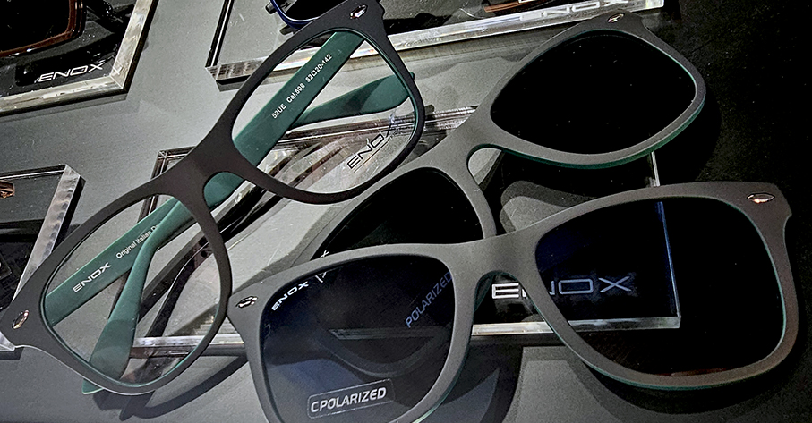

**MATTTEW**

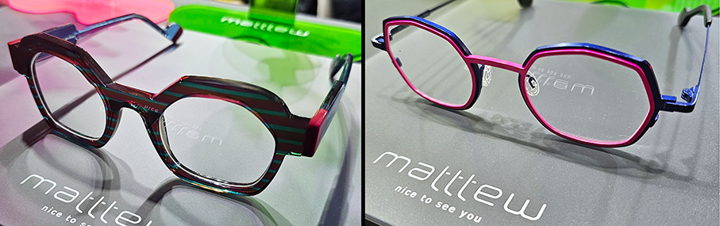

Gli occhiali devono distinguersi per il loro carattere estetico, originale, creativo e colorato e devono far venire voglia di averne diversi paia. Vorrai quindi cambiare gli occhiali in base ai tuoi abiti, proprio come sceglieresti gli orecchini  da abbinare al tuo abito o la cravatta giusta per il tuo completo. Poiché il colore è fondamentale nella scelta della montatura giusta, **Matttew** dedica tempo ed energie infinite per fornire la gamma di colori di ogni collezione. La montatura è il risultato di un enorme lavoro tecnico, di un design preciso e di una ricerca cromatica per ottenere il prodotto di alta qualità per illuminare il viso. Ma Matttew è anche un cittadino belga e come tale mantiene sempre un grande senso dell'umorismo. **https://www.matttew.com/en/matttew/**

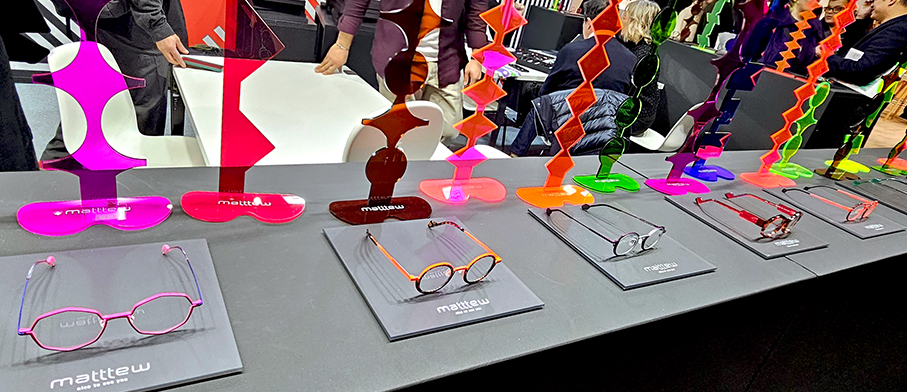

**CORE MIO***

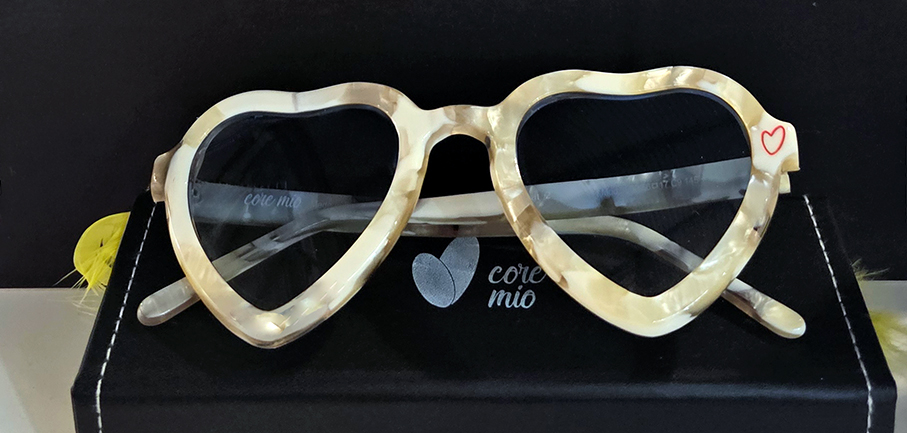

Leggerezza, consapevolezza e tanta, tanta ironia: Core mio non solo semplici occhiali da sole, sono un qualcosa di più profondo e intimo. Sono un messaggio forte per chi li indossa e per chi li guarda indossati, sono uno strumento di forza e coraggio, sono una dichiarazione d’amore. Ecco il vero senso di **Core mio**. Ali invisibili che abbracciano e proteggono. Indossare occhiali a cuore diventa la terapia per sopravvivere, guarire e risorgere. Fanno bene, fanno stare bene, fanno del bene e stanno bene. Fanno sorridere e aiutano a vedere le cose da un’altra angolazione mettendoci direttamente in connessione con l’altro, senza filtri né sovrastrutture. Ogni colore ha un significato ed un’energia precisa. Quello che una persona sceglie, sussurra al suo inconscio un messaggio per lei. **https://www.coremio.it/**

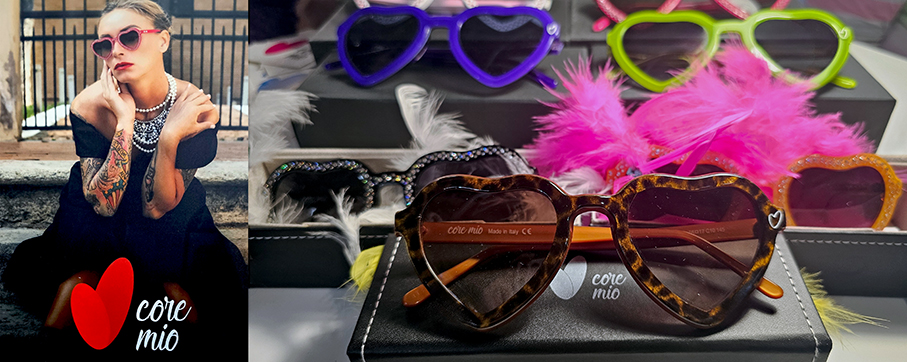

**GLARE**

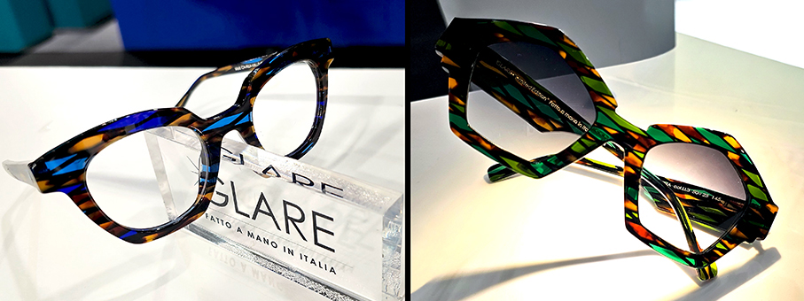

Gli occhiali **Glare Eyewear** sono fatti a mano in Italia, con processi che includono la lucidatura manuale e la sagomatura artigianale dell'acetato, con alcune varianti che presentano inserti in alluminio. I colori sono uno degli elementi distintivi del brand, caratterizzati dall'uso di acetati stratificati e tonalità brevettate create esclusivamente per le loro collezioni.  Patchwork & Technobright sono linee che utilizzano "esplosioni di colore" e accostamenti vivaci. Crystal si focalizza, invece, sulle trasparenze e tonalità luminose che giocano con la luce naturale. Edge propone un contrasto tra finiture lucide e opache (gloss and matt), spesso in tonalità scultoree come nero profondo, avana (tartarugato) o colori pieni come il "Rosso Glare".**https://www.glare.it/**

**IZIPIZI**

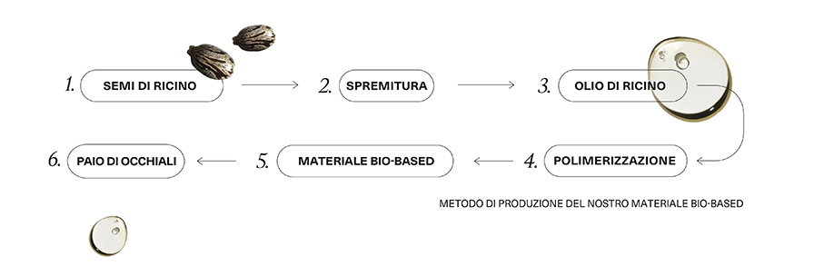

Il brand si impegna a offrire prodotti accessibili e durevoli, agendo in modo responsabile verso l’ambiente, la società e le persone che rendono possibile l’azienda. Certificati B Corp dal 2023, il 2024 ha segnato una tappa importante: le emissioni per un paio di occhiali **Izipizi**  si sono dimezzate. E dal 2025, tutta la produzione è realizzata interamente con materiali di origine biologica. La ricerca di un ambiente di lavoro inclusivo e rispettoso è un impegno quotidiano verso il team che si riflette nella certificazione Great Place To Work, ottenuta per il quinto anno consecutivo. Una delle novità 2026 è #ROAD Golden Canyon, occhiali da sole che simboleggiano il viaggio e gli spazi aperti. La montatura lucida, in una tonalità sabbia calda e avvolgente, e la forma rettangolare oversize uniscono eleganza e protezione. Le lenti sfumate riprendono le stesse tonalità della montatura, per un look armonioso e raffinato. Le montature sono realizzate con il 45% di poliammide organica ricavata dall'olio di ricino.
**https://www.izipizi.com/ww_it/**

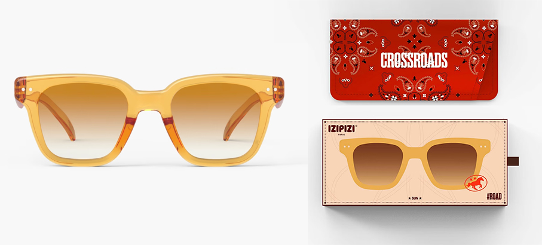

**MAZZUCCHELLI**

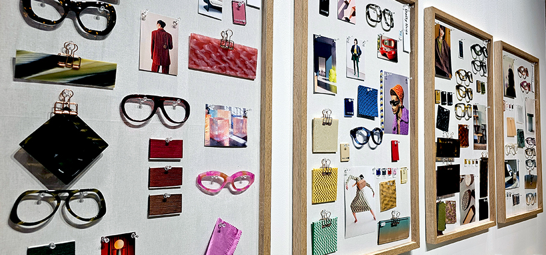

Ogni foglio di acetato di cellulosa, ogni colore e ogni fantasia creati nell'azienda riflettono un'attenta combinazione di ricerca, creatività, know-how e visione. Per condividere questo processo creativo ed esplorare le tendenze future dei materiali per l'occhialeria, ha collaborato con Peclers Paris, agenzia leader nella consulenza e nello studio di tendenze, per creare il **Mazzucchelli & Peclers Paris Trend Book**. Progettato specificamente per il settore dell'occhialeria, è uno strumento unico dedicato all'analisi delle tendenze per il 2027. Riunisce ricerche su tendenze culturali ed estetiche emergenti, colori e pattern, tradotti nei materiali Mazzucchelli. Organizzato in quattro temi principali, ciascuno sviluppato attraverso tre scenari distinti, presentano i materiali ricercati e selezionati dal catalogo attuale, dalle nuove collezioni e dai riferimenti d'archivio. **https://www.mazzucchelli1849.it/**

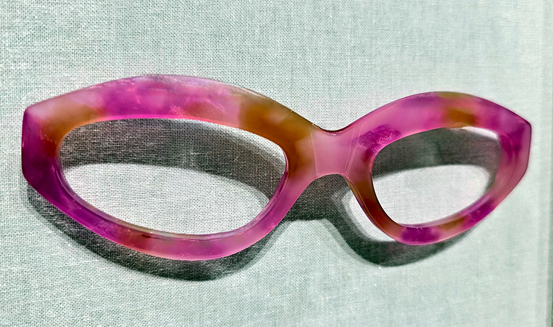

