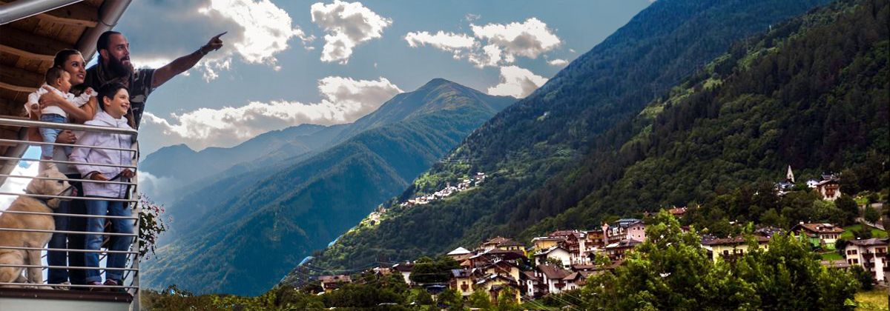
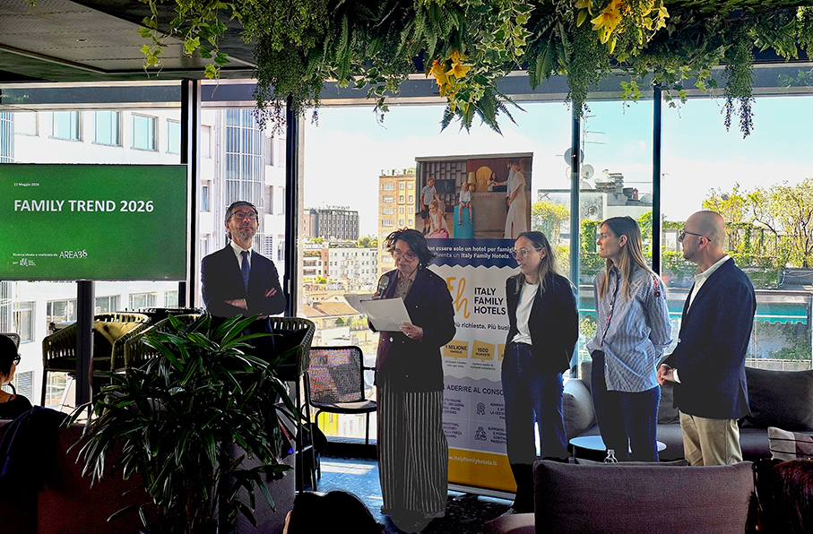
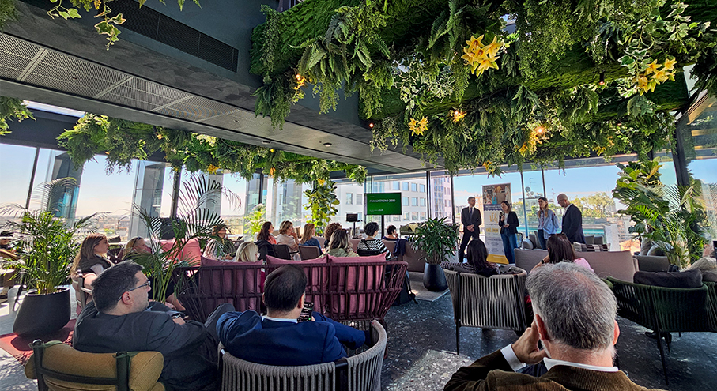
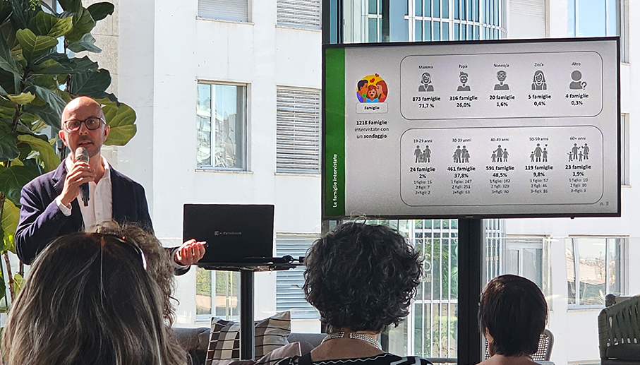
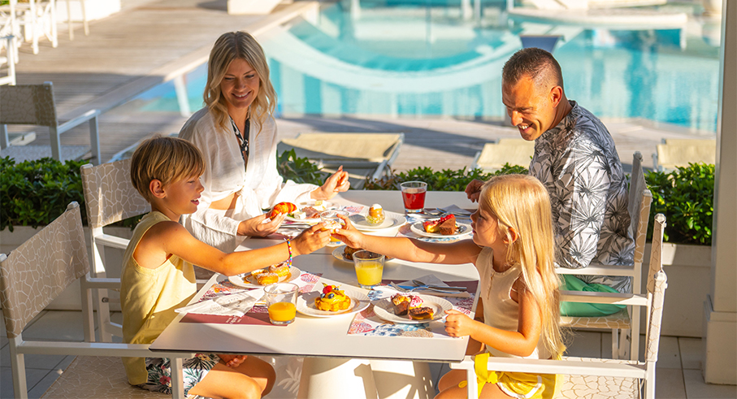

# Family trend 2026  by Italy Family Hotels 

>**Viaggi, benessere e nuove destinazioni**: presentati i trend 2026 che stanno ridefinendo **la vacanza in famiglia** secondo Italy Family Hotels

di _Maria Rosa Sirotti_

**Family trend 2026 è un’indagine di mercato** sui family travel condotta da Hospitality Marketing, agenzia di marketing che coordina e gestisce le attività di **Italy Family Hotels**, insieme a Area38, che gestisce la strategia web del gruppo.

E' il primo **consorzio alberghiero** in Italia interamente dedicato alle famiglie, con più di **155 hotel specializzati** in vacanze con bambini in destinazioni italiane di mare, montagna, lago e collina. E' **un portale** che promuove un’ospitalità certificata, di standard elevati e servizi su misura per il **mercato nazionale e internazionale**.

Lo studio ha raccolto i **desideri di oltre 1.200 famiglie** dove il viaggio non è più solo svago, ma una necessità emotiva e un’occasione di crescita dove la vacanza si conferma un bene immateriale e irrinunciabile.

**Un solo viaggio all’anno non basta più**

Il 2026 vedrà **famiglie sempre più in viaggio**: la vacanza diventa un momento di necessità ricorrente di benessere, relazione e qualità familiare e non solo un appuntamento all’anno durante l’estate. 

**Vacanze tutto l’anno, ma soggiorni più brevi**

Oggi le famiglie preferiscono **frazionare le ferie durante l’anno** a scapito della singola vacanza lunga. Il budget resta resiliente: il 73,5% spenderà più o meno come nel 2025, mentre il 15,7% intende investire di più.

**Obiettivo vacanza: dal divertimento dei bambini al benessere di tutti**

Le aspettative principali riguardano il **divertimento dei bambini** che rimane la priorità assoluta con il 95%, ma anche il **ritrovare serenità** (78,7%) e il **relax per i genitori** (73,3%). Ma non più solo baby club, ma progetti educativi per intrattenere e far divertire e anche educare, stimolare e coinvolgere in modo intelligente. Questo include **laboratori artistici, corsi in lingua, lezioni sportive**. I genitori cercano momenti di relax per sé, il servizio più desiderato è la **SPA**, seguono **escursioni** o attività per soli adulti, yoga/meditazione, spazi adult-only e zone silenziose.

**Il family hotel diventa destinazione**

Il vero Family Hotel si conferma la sistemazione ideale per le famiglie italiane, **preferito a villaggi, case e appartamenti** o hotel senza servizi specifici. È un dato molto alto, che conferma la forza del posizionamento Italy Family Hotels: non solo una struttura in cui soggiornare, ma anche il **motivo stesso per scegliere una destinazione**. Non è più solo la destinazione a generare domanda per l’hotel: può essere l’hotel a generare domanda per la destinazione.

 In questo scenario, il family hotel non è solo un luogo dove dormire, ma diventa il cuore dell’esperienza, capace di guidare le scelte della famiglia e **trasformare ogni viaggio in un’occasione di crescita**, connessione e piacere condiviso.
