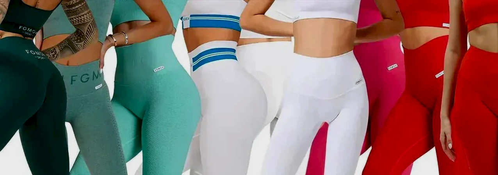
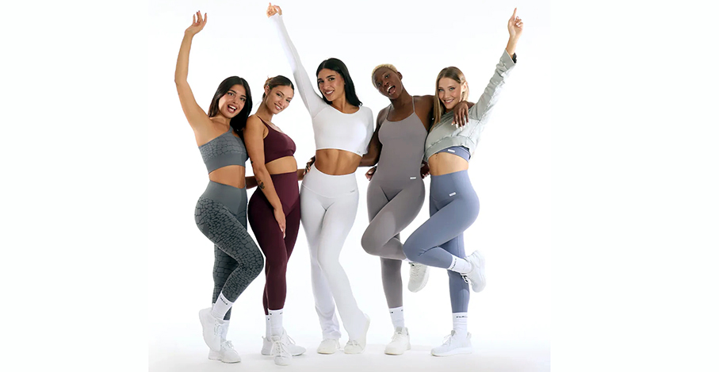
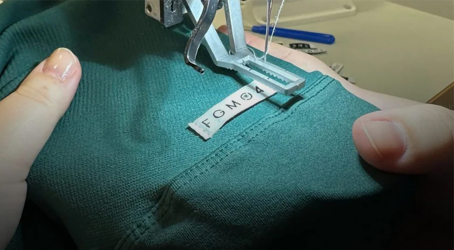
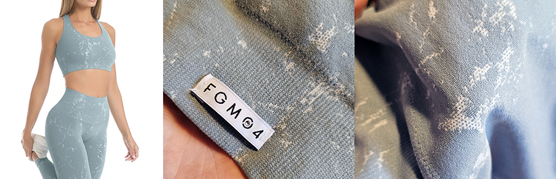
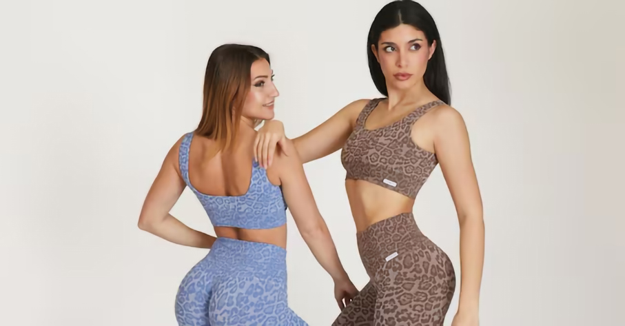

# FGM04 – Leggings e Top con tecnica e stile

>**FGM04 è un'azienda italiana** fondata nel 2004 che si distingue per un approccio olistico alla bellezza, unendo **cosmetica professionale, abbigliamento tecnico e integrazione alimentare** 

**Specializzata in capi sportivi femminili** (leggings, top, jumpsuit), l'azienda li realizza con **tecnologia seamless** (senza cuciture) e **tecnologia FIR** (Far Infrared Rays). 
Nel campo della **Cosmetica Funzionale**, l’azienda produce creme specifiche per il contrasto degli inestetismi della cellulite, adipe localizzato e prodotti anti-age per il viso. Completano il catalogo **Integrazione e Nutrizione**: una linea completa di integratori per il benessere (depurativi, drenanti, controllo del peso) e per la nutrizione sportiva. 

Tutti i prodotti, sia cosmetici che tessili, sono interamente **progettati e realizzati in Italia** con tessuti certificati OEKO-TEX®. Il brand si oppone al modello del fast fashion, puntando su filiere trasparenti, **materiali di qualità e lavorazioni durature**. 

Tra i capi più amati troviamo **leggings e top** così versatili, da poterli utilizzare in ogni momento della giornata: durante l’attività sportiva, al lavoro o per viaggiare.
Lo speciale **Design Modellante** dei leggings è studiato per aiutare a riattivare la micro circolazione, a contrastare la ritenzione idrica e sono un ottimo rimedio per chi soffre di gambe e caviglie gonfie. 

Tutti i leggings FGM04 utilizzano la **tecnologia F.I.R.**: al DNA del filato vengono aggiunti minerali naturali che consentono di convertire il calore del corpo umano in raggi infrarossi lontani (F.I.R.) e rifletterlo sui tessuti cutanei, permettendo di energizzare delicatamente le cellule. I vantaggi che ne derivano sono: miglioramento del recupero muscolare dopo l’attività atletica, riduzione degli odori, maggiore elasticità muscolare, aspetto della pelle migliorato e durevolezza nel tempo.I lavaggi ripetuti non ne diminuiranno le prestazioni.

Per il massimo dei benefici si consiglia di indossarli per almeno 6 ore al giorno per 30 giorni consecutivi.

Il marchio distribuisce i propri prodotti principalmente attraverso il sito FGM04, ma è presente anche in farmacie, parafarmacie e centri estetici selezionati. 

