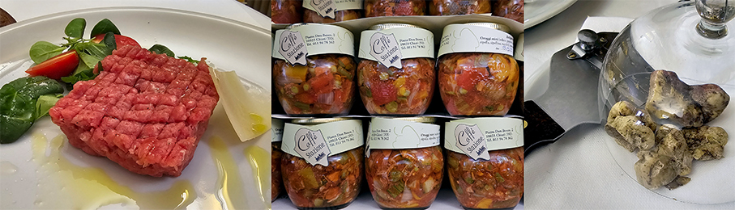
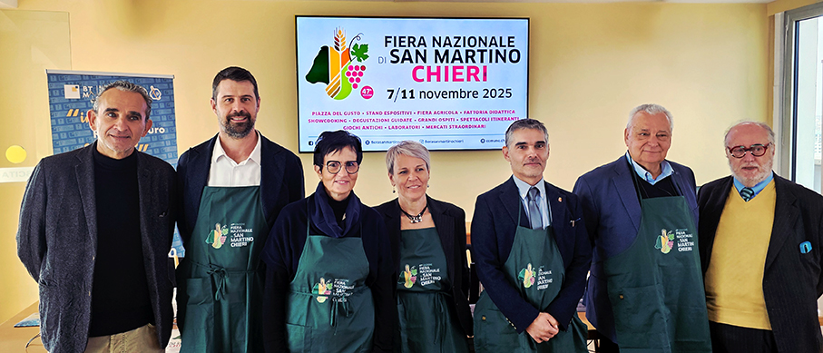
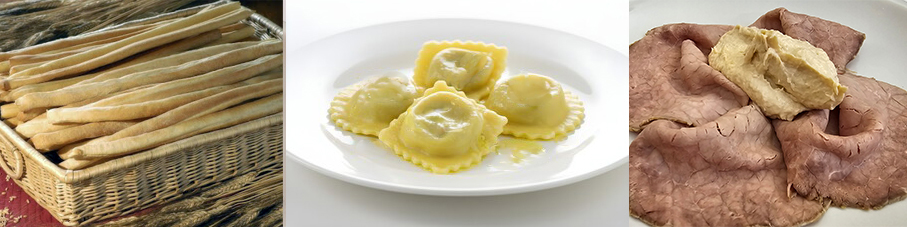
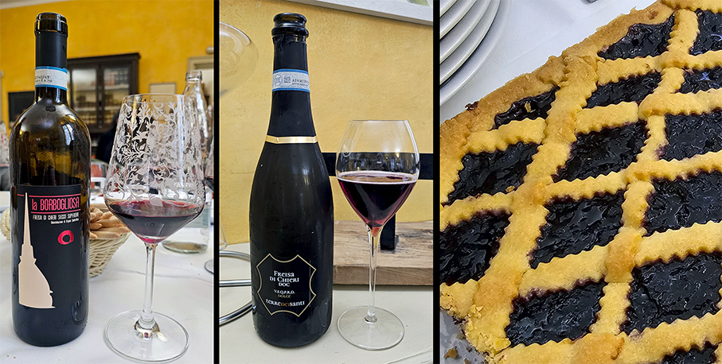
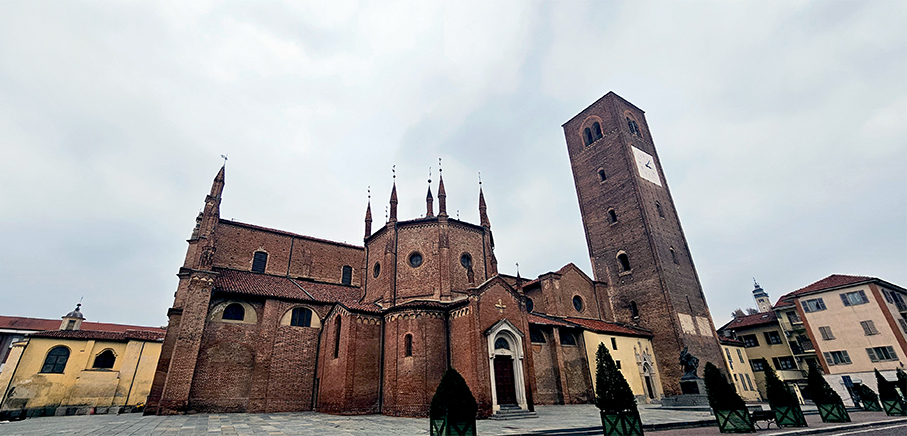
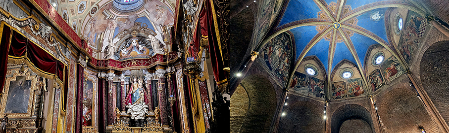
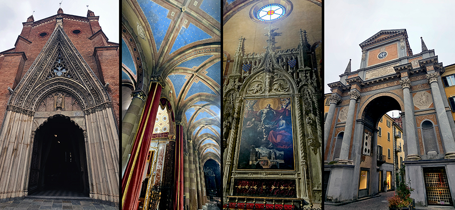
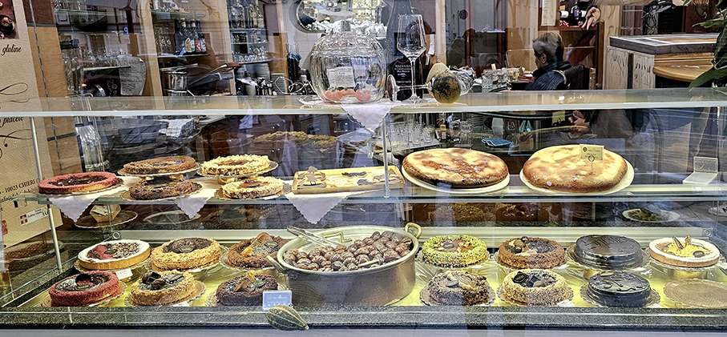

# Fiera di San Martino di Chieri 2025

>La **Fiera di San Martino di Chieri**, giunta alla sua **47ª edizione**, si terrà dal **7 all’11 novembre 2025** e si preannuncia come un’edizione particolarmente ricca e rinnovata 

Promossa dal **Comune di Chieri** e organizzata da **SGP Grandi Eventi**, la **Fiera di San Martino di Chieri** è ormai un punto di riferimento per il mondo dell’**agricoltura, del commercio e dell’artigianato locale**, oltre che una vetrina d’eccezione per la valorizzazione delle **eccellenze enogastronomiche e culturali** del territorio piemontese.

La cittadina annovera fra le sue specialità la focaccia dolce, **Focaccia di Chieri**, consumata a fine pasto. Oggi la versione tradizionale dal peso di mezzo chilo si trova in vendita nelle pasticcerie.

 Situata sulle colline torinesi, Chieri presenta un nucleo urbano più antico con **tipica impronta medievale** dove medioevo e barocco convivono con rara armonia. Vanta ben **17 chiese** e innumerevoli palazzi nobiliari, oltre a una biblioteca e un archivio molto forniti. La città ebbe un ruolo importante nella formazione del giovane **Giovanni Bosco**. Il **Duomo** (Chiesa di Santa Maria della Scala) è la più grande Chiesa della città, un misto fra gotico e romanico. Venne edificato nell’alto Medioevo e vi si possono ammirare bellissimi dipinti barocchi e fiamminghi e il Battistero dalla pianta ottagonale con le sue pareti affrescate.

Promossa dal **Comune di Chieri** e organizzata da **SGP Grandi Eventi**, la **Fiera di San Martino di Chieri** presenta l'edizione 2025 che si distingue per la presenza di ospiti di rilievo nazionale, come i noti giornalisti gastronomici **Edoardo Raspelli e Paolo Massobrio**, che guideranno incontri e dibattiti sul tema del cibo di qualità e sull’importanza della **tradizione piemontese** nell’attuale panorama enogastronomico italiano.

Tra i momenti più attesi spicca la presentazione della **maxi installazione “Chieri”**, una grande scritta lunga 4,5 metri e alta 1,5 metri, realizzata interamente **in focaccia dolce artigianale**. L’opera, composta da oltre 30 focacce per un peso complessivo superiore ai 30 chilogrammi, sarà un omaggio alla tradizione panaria chierese e al lavoro dei maestri pasticceri locali, simbolo di convivialità, artigianalità e orgoglio comunitario.

Non mancherà il tributo al celebre **grissino Rubatà**, nella sua inconfondibile **versione chierese**, considerato uno dei simboli gastronomici del Piemonte nel mondo. Durante la Fiera, il pubblico potrà assistere a **dimostrazioni dal vivo**, partecipare a **degustazioni guidate** e incontrare **produttori locali** che racconteranno la storia, la lavorazione e le caratteristiche di questo prodotto unico per croccantezza e forma. Sarà un’occasione per celebrare la manualità e la cura artigianale che da secoli contraddistinguono i panificatori chieresi.

Altro protagonista dell’edizione sarà la **Freisa di Chieri DOC**, vino storico e autentico ambasciatore delle colline torinesi. Gli esperti del settore condurranno il pubblico in **degustazioni tematiche** alla scoperta delle diverse interpretazioni di questo vitigno, raccontandone il legame profondo con la terra, la vite e la cultura contadina. Non mancheranno incontri e laboratori dedicati a esplorare la sua storia, il suo carattere e le nuove forme di valorizzazione.

La festa si estenderà anche all’interno del nuovo **Pala San Martino**, cuore pulsante della Fiera, che ospiterà un ricco calendario di eventi tra **masterclass di mixology piemontese, degustazioni di prodotti tipici, laboratori per adulti e bambini**, e curiose sperimentazioni gastronomiche come il **gelato al Freisa**, nato dall’incontro tra tradizione vitivinicola e innovazione culinaria.

In un clima di festa e partecipazione, la Fiera di San Martino di Chieri 2025 si conferma così **un evento completo e poliedrico, capace di unire cultura, artigianato, gusto e intrattenimento**. Musica, spettacoli, laboratori e momenti di approfondimento renderanno la città un grande palcoscenico a cielo aperto, dove il pubblico potrà riscoprire sapori autentici, incontrare i protagonisti del territorio e riconoscere il valore di chi ogni giorno mantiene viva la tradizione chierese con passione, competenza e senso di appartenenza.

In definitiva, l’edizione 2025 rappresenta un vero **omaggio al patrimonio enogastronomico del Piemonte**, unendo memoria, innovazione e convivialità in una celebrazione che racconta l’**anima di Chieri** e la sua capacità di far convivere storia, gusto e identità locale.

_Ph. Credits: Maria Rosa Sirotti_

Si ringraziano: Comune di Chieri, SGP Grandi Eventi, Ristorante Enoteca Caffè della Stazione, Cantina sperimentale del centro Bonafous, Dolci & Dolci.  
