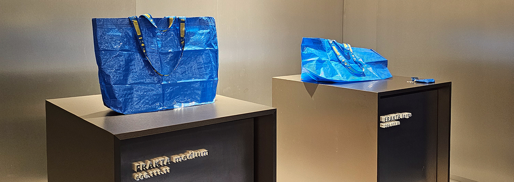
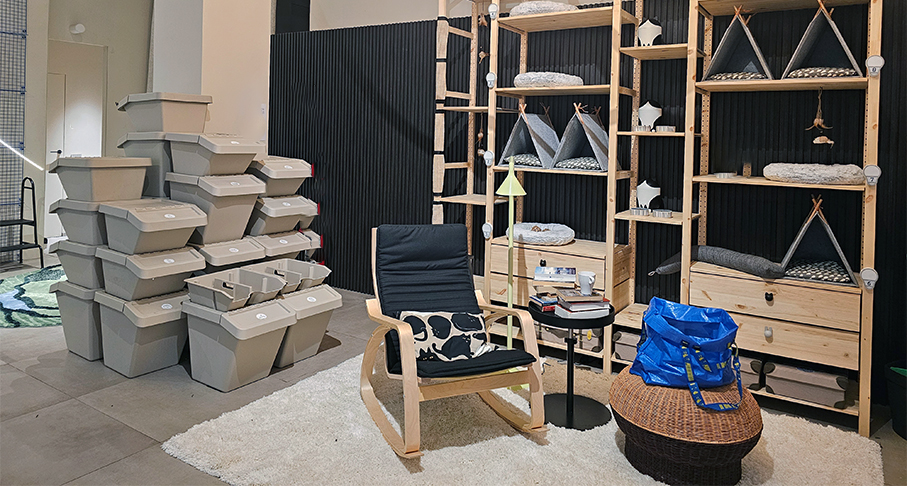
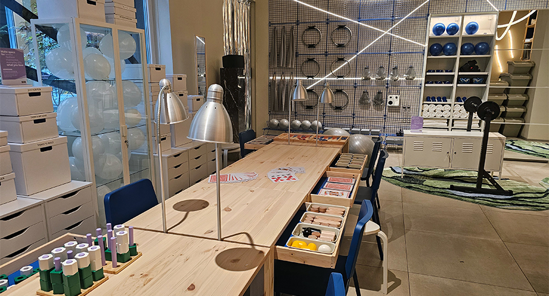
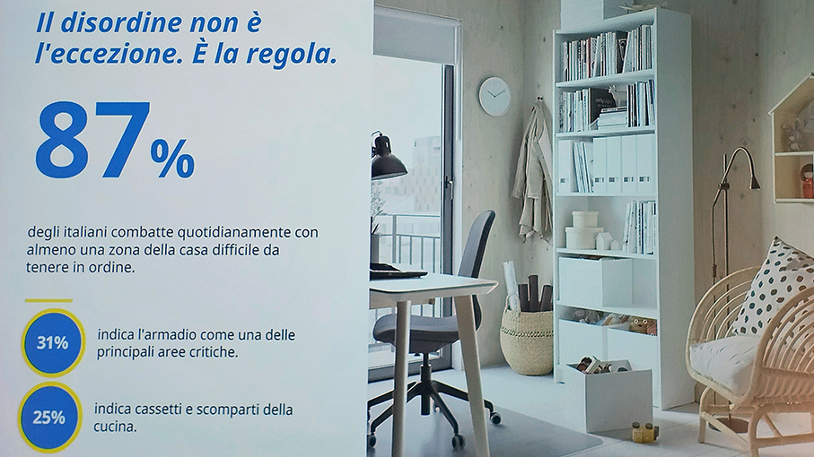
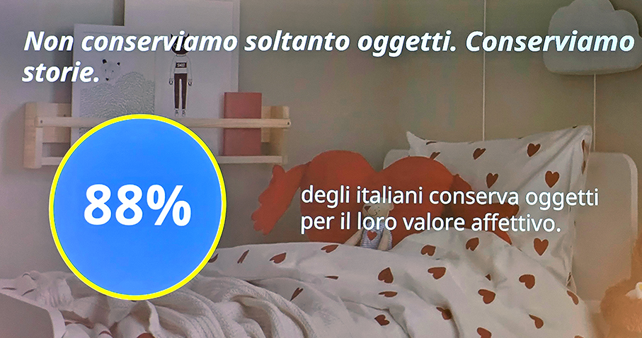
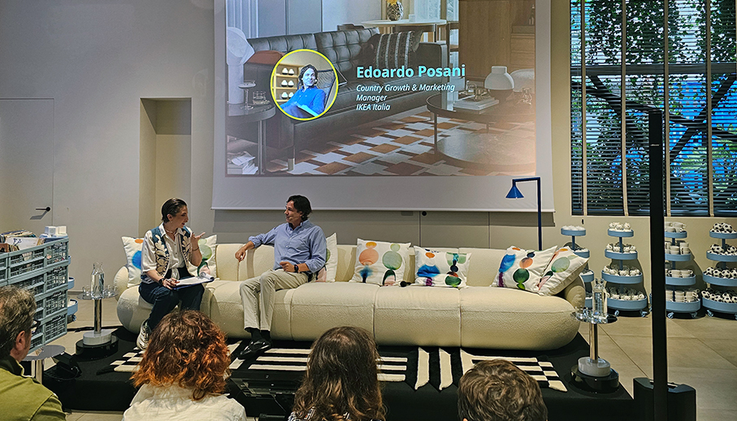
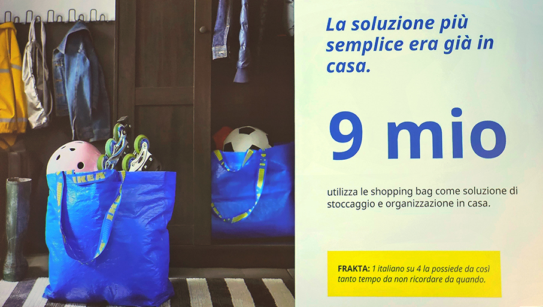
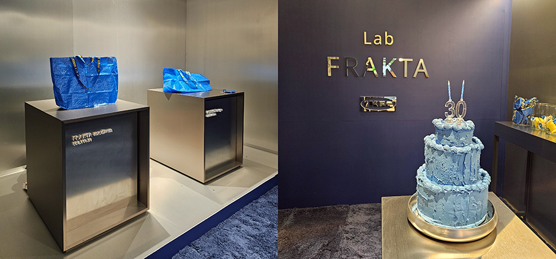
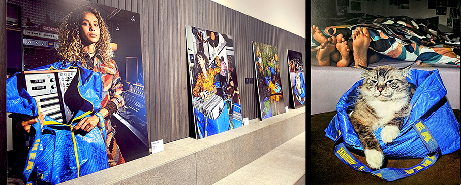

# Frakta di Ikea compie 30 anni

>**“Belli organizzati”** è il progetto fotografico Ikea dedicato a **Frakta**, l’iconica borsa blu che compie 30 anni

_di Maria Rosa Sirotti_

Una nuova **ricerca Ikea** rivela che gli italiani non aspirano a case perfette, ma a **spazi capaci di accogliere la complessità della vita reale**. Tra ricordi, passioni e vita quotidiana, il nuovo significato dell'organizzazione in casa ha un messaggio chiaro: **fai spazio a ciò che ami**.

C'è un luogo in cui si intrecciano ricordi, passioni, relazioni e abitudini quotidiane: **la casa. Un ambiente in continua evoluzione**, che cambia insieme alle persone e accoglie le loro storie. Eppure, in un'epoca dominata da un’estetica che privilegia la perfezione, la realtà racconta altro. **Gli italiani non cercano case impeccabili**, ma modi intelligenti per far convivere ciò che conta davvero. 

È quanto emerge dalla **ricerca Store & Organize** di **Ikea**, che interpreta l'organizzazione domestica come una leva concreta di benessere quotidiano.
La sfida è comune a molti. 
L'**87% degli italiani** dichiara infatti di avere almeno una zona della casa difficile da mantenere in ordine. Un dato che racconta come **il disordine non sia un'eccezione**, ma una condizione condivisa della vita contemporanea. Non si tratta di mancanza di organizzazione o di attenzione: spesso è semplicemente il risultato di case che devono accogliere **interessi, attività, relazioni e oggetti accumulati nel tempo**.

Non è un caso che, immaginando di avere più spazio a disposizione, il 39% degli italiani dichiari che lo utilizzerebbe semplicemente per sentirsi più libero. Una risposta che racconta con chiarezza un bisogno profondo: **non possedere di più, ma avere più margine per le proprie passioni** e per la propria quotidianità. 

Allo stesso tempo, il desiderio di perfezione sembra perdere terreno. Più di un italiano su due preferisce **una casa vissuta e informale**, capace di riflettere la vita reale anziché aderire a standard estetici irraggiungibili. Una tendenza che conferma come l'ordine oggi venga interpretato sempre meno come un obiettivo fine a sé stesso e sempre più come uno strumento per **vivere meglio il proprio spazio domestico**.

La ricerca evidenzia che il 59% conserva una sorta di **"cassetto del non so dove metterlo"**, un luogo familiare a molte case italiane dove finiscono temporaneamente oggetti in attesa di una collocazione definitiva. 

Ma il dato forse più significativo riguarda ciò che scegliamo di conservare. **L'88% degli italiani sceglie gli oggetti da tenere per il loro valore affettivo**. Vecchie fotografie, ricordi di viaggio, collezioni, strumenti musicali, oggetti ereditati o semplicemente legati a momenti importanti continuano a occupare spazio nelle case perché rappresentano qualcosa di più di una funzione pratica. In questo contesto, **organizzare significa trovare una forma di equilibrio tra funzionalità ed emozione**, tra esigenze pratiche e dimensione personale.

«_La ricerca ci restituisce il sentito degli italiani che non stanno cercando la casa perfetta, ma spazi capaci di adattarsi alla loro vita_», commenta **Edoardo Posani, Country Growth & Marketing Manager di Ikea Italia**. «_Os_serviamo ogni giorno come gli spazi domestici siano chiamati a fare molto di più che in passato e ad accogliere cambiamenti e nuove abitudini. Per questo il nostro obiettivo è offrire soluzioni accessibili e ben progettate che semplifichino la quotidianità senza che si debba rinunciare a personalità ed autenticità della vita in casa_».

È da questa idea che nasce **“Belli organizzati”**, il **progetto fotografico Ikea dedicato a FRAKTA**, l’iconica borsa blu che compie 30 anni e che, una volta uscita dal negozio con dentro gli acquisti, diventa in casa e fuori uno strumento per organizzare dei più versatili. Dalla spesa ai traslochi, fino agli utilizzi più creativi, continua a essere reinterpretata: il 65% di chi l'ha posseduta o utilizzata dichiara infatti di averle attribuito almeno una volta una funzione diversa da quella originaria.

**“Fai spazio a ciò che ami”** è il concept che accompagna il lancio del nuovo anno di Ikea dedicata allo **Storage & Organizing – Organizzazione e Sistemazione**. 

A guidare il progetto è lo sguardo di **Salvatore Matarazzo**, street photographer che racconta la quotidianità con colori vivaci e un uso deciso della luce, portando nell’immagine anche il linguaggio della fotografia fashion. 

