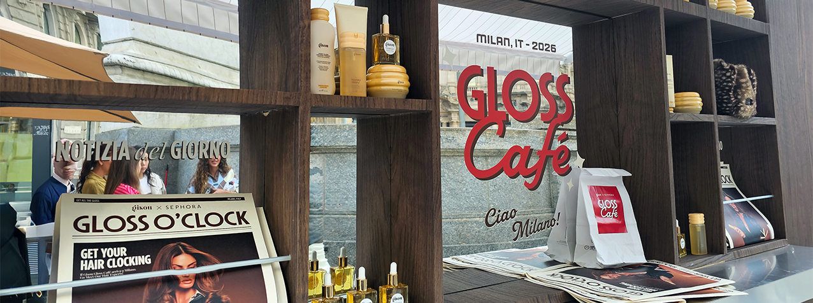
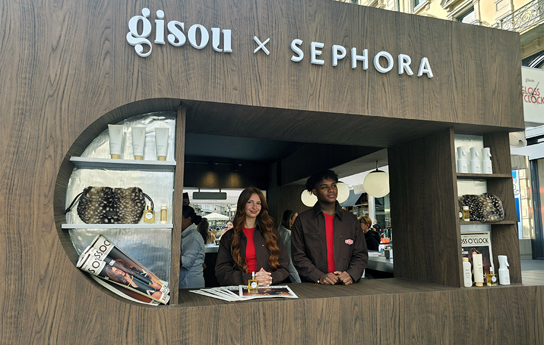
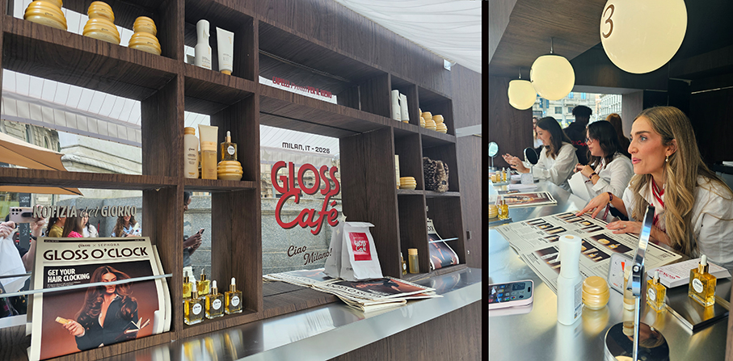
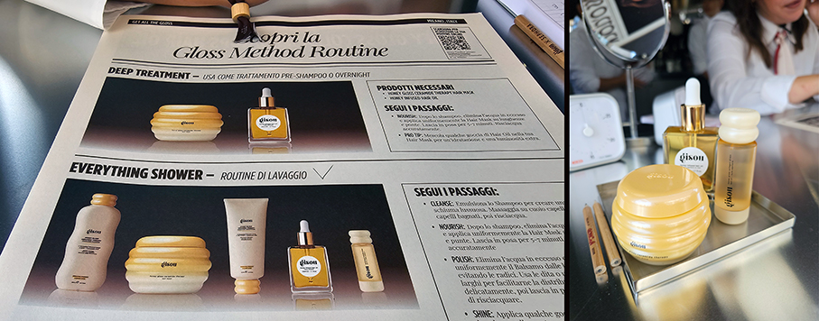
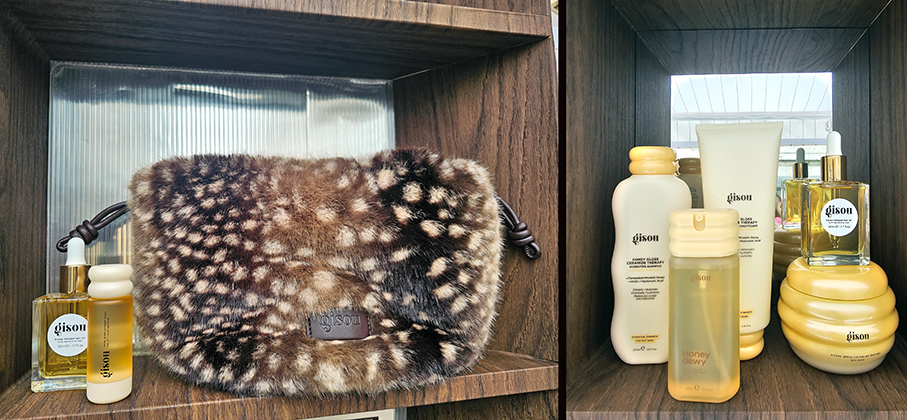
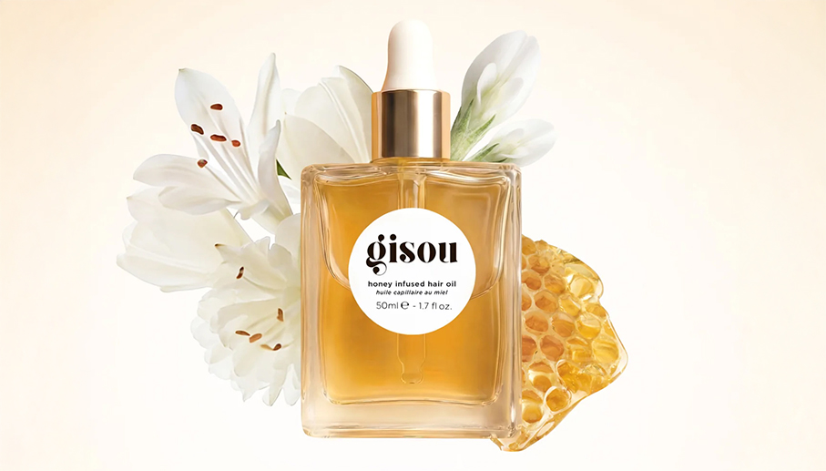
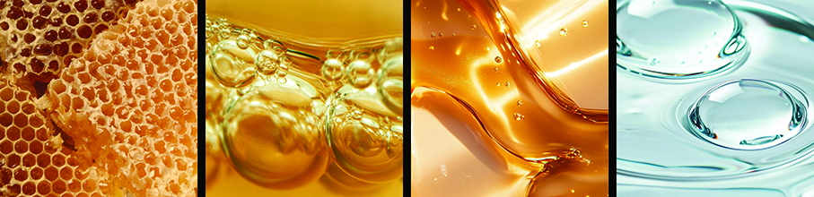
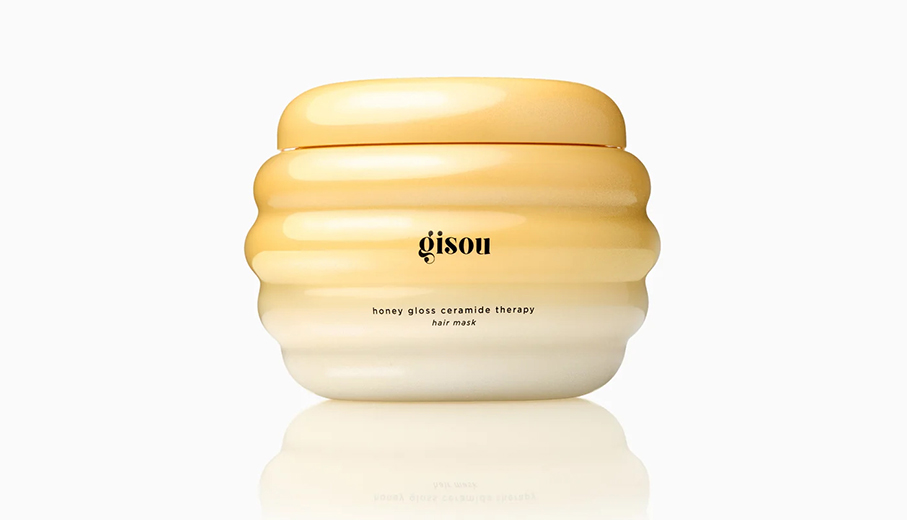
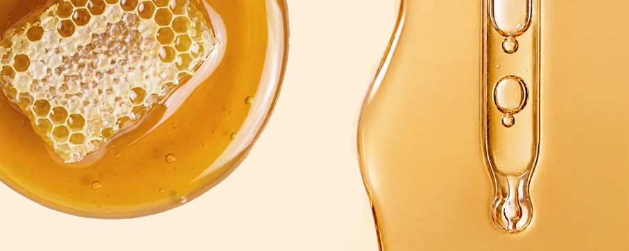

# Gisou x Sephora Gloss Café 

>**Gisou inaugura a Milano la sua prima brand activation** con un’esperienza per capelli sani, idratati e luminosi

_di Maria Rosa Sirotti_

Con la fine dell’estate, il **Gloss Café** accompagna gli ospiti alla riscoperta della **corretta routine haircare**, il **Gloss Method di Gisou**, attraverso consulenze personalizzate e consigli sui prodotti più adatti alle esigenze individuali, con il piacere di gustarsi un delizioso affogato al caffè nel cuore di Milano.

Ispirato alla tradizione italiana e al ritmo che scandisce le nostre giornate, il Gloss Café è un invito a dedicare il **giusto tempo alla cura dei capelli** e a ritrovare, dopo l’estate, il proprio **rituale haircare**, un rituale settimanale perfezionato negli anni per donare ai capelli intensa **idratazione, forza e luminosità**.

Grazie all’esclusivo **Mirsalehi Honey**, ogni fase del rituale è studiata per prendersi cura dei capelli, proteggerli e mantenerne più a lungo la bellezza, ravvivandone luminosità e morbidezza e rendendo la routine semplice e veloce, qualunque sia il ritmo della giornata.

"_Aprire a Milano la nostra prima brand experience è per noi un'emozione incredibile. Volevamo creare un'esperienza capace di aiutare la nostra community a ritrovare, dopo l'estate, la propria routine per capelli, facendo al tempo stesso scoprire il Gloss Method che ho perfezionato negli anni. Milano ci è sembrata il luogo perfetto per dare vita a questo concept_". — **Negin Mirsalehi, Founder di Gisou**.
 
Durante i tre giorni dell’attivazione, gli ospiti potranno usufruire gratuitamente di una **consulenza personalizzata sul Gloss Method**.
Gli esperti Gisou analizzeranno le esigenze dei capelli e suggeriranno un **Programma Gloss su misura**, pensato per ritrovare dopo l’estate capelli sani, idratati e luminosi. Al termine della consulenza, sarà possibile concedersi un **momento di relax con un affogato al caffè gratuito e scoprire le formule a base di Mirsalehi Honey che caratterizzano ogni fase del rituale Gisou.

Per celebrare il primo pop-up di Gisou a Milano, **Sephora** offre ai propri clienti la possibilità di ricevere esclusivi **omaggi firmati Gisou con l’acquisto di prodotti** del brand presso i punti vendita **Sephora Duomo, Via Torino e Via Dante**.

Nata da una **tradizione familiare di sei generazioni di apicoltori**, Gisou è stata fondata da **Negin Mirsalehi** nel 2015 con lˇobiettivo di condividere la passione della sua famiglia per il **miele** e la sua beauty routine, tanto amata dalla community. Quello che è iniziato nel **Mirsalehi Bee Garden** con una sola formula realizzata in casa _ l'iconico **Honey Infused Hair Oil** _ si è trasformato in un brand globale, fortemente orientato alla propria community e riconosciuto per le sue innovazioni cosmetiche a base di miele. 

Alla base di Gisou ci sono un profondo rispetto per la tradizione, un impegno concreto verso la sostenibilità e la volontà di esaltare la naturale luminosità dei capelli e della pelle attraverso **formule performanti a base di miele**.
Tra i prodotti Gisou, **l’iconico olio per capelli al miele** e la pluripremiata **maschera per capelli lucida al miele**.

**Olio per capelli al miele**

Un olio pluripremiato, arricchito con miele di Mirsalehi proveniente da fonti sostenibili e oli di Bee Garden, è scientificamente provato che offre un'idratazione intensa, una lucentezza immediata e un controllo dell'effetto crespo ad ogni goccia. 

Da usare prima o dopo lo styling, oppure come trattamento notturno. Capelli fino a 2 volte più lucenti, controllo dell'umidità e anticrespo fino a 3 giorni, idratazione fino a 3 giorni, protezione dal calore fino a 230 °c/450 °f.

**Maschera per capelli Honey Gloss Ceramide Therapy**

Scientificamente provata, la nostra maschera per capelli Honey Gloss Ceramide Therapy unisce ceramidi rinforzanti, acido ialuronico idratante e miele di Mirsalehi per restituire ai capelli un aspetto più sano. Con una formula composta al 97% da ingredienti di origine naturale, questa maschera per capelli ricca ma leggera leviga, ammorbidisce e dona lucentezza, trattenendo l'idratazione per un trattamento immediato. 

Capelli più lucenti dell'85%, capelli 4 volte più forti, 19 volte più capelli lisci, riduzione dell'effetto crespo in 72 ore
Olio per capelli al miele

_Ph. Credits: Maria Rosa Sirotti_
