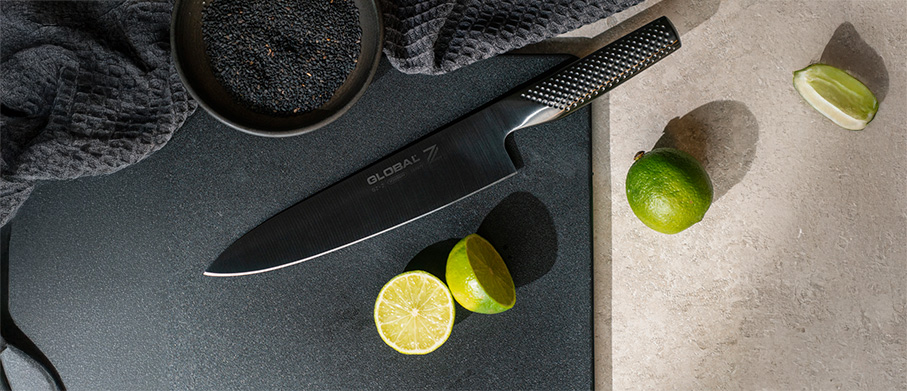
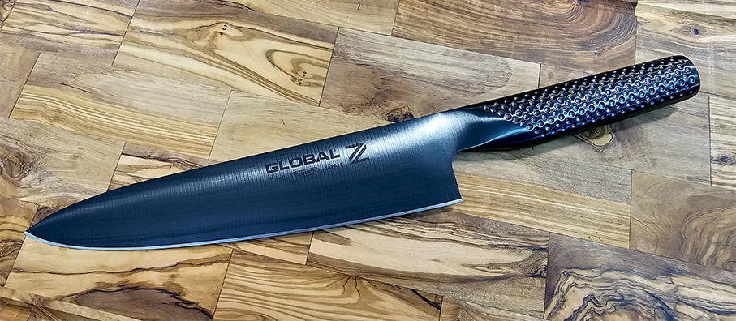
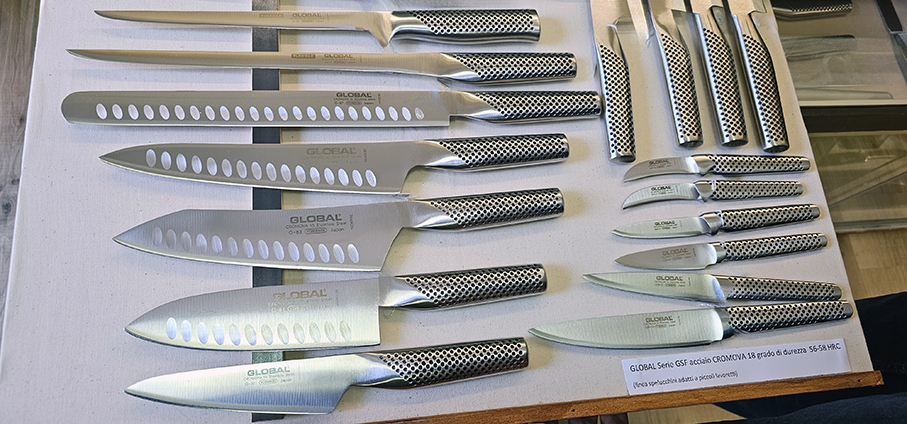
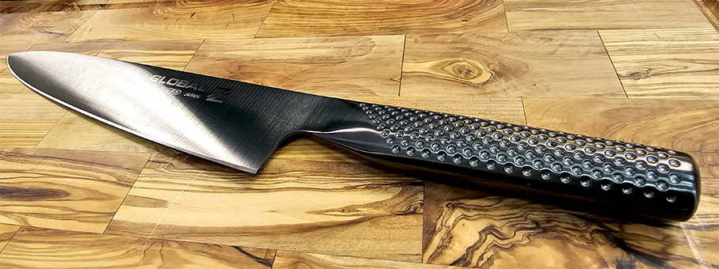
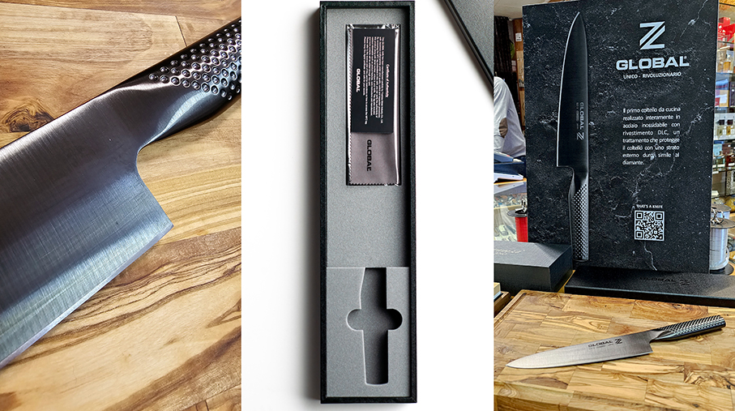
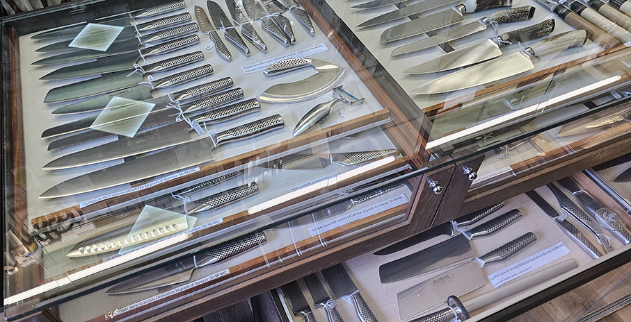

# Global presenta Global Z 

>L’edizione limitata che celebra il **40° anniversario** del marchio giapponese che ha fatto del coltello **un’icona di design**

Quarant’anni di storia sono un traguardo importante e il brand Global ha scelto di celebrarlo con **Global Z**, un coltello **in edizione speciale e super limitata** che sin dal nome, essenziale e affilato, esprime tutta la sua esclusiva perfezione: affilato come la spada di un samurai, resistente come il diamante.

È nel 1985, infatti, che **in Giappone** dalla creatività di Komin Yamada nascono i primi coltelli Global, realizzati utilizzando i migliori materiali e seguendo le tendenze più innovative. Una lunga storia di ricerca, sperimentazione e design che ha portato, oggi, alla creazione dell’esclusivo Global Z. Una Limited Edition di **pochissimi pezzi numerati** che verranno prodotti annualmente per diventare gli iconici protagonisti delle cucine di una ristretta cerchia di amanti dell’eccellenza nel mondo. 

A rendere speciale ed esclusivo Global Z, il **rivestimento in Diamond-Like Carbon (DLC)** che conferisce al coltello un’**elegante superficie nera**, rendendolo un oggetto dal design contemporaneo, ma anche uno strumento dalle **performance straordinarie**. 

Evoluzione del classico coltello da cucina G-2 di Global, come per tutte le lame del marchio, anche questo modello da collezione è realizzato in **acciaio inossidabile CROMOVA 18**, temperato con ghiaccio e indurito a 56°- 58° C mediante un processo che mantiene la lama affilata più a lungo di qualsiasi altro acciaio, e la rende **resistente alla ruggine, alle macchie e alla corrosione**. A questo si aggiunge il rivestimento in DLC, che protegge il coltello con uno strato esterno rendendo la sua superficie estremamente resistente, al pari di quella del diamante. 

**Materiale biocompatibile**, utilizzato anche nelle apparecchiature mediche e nella progettazione di motori ad alte prestazioni per l'industria aerospaziale e automobilistica, il DLC utilizzato per il rivestimento di Global Z garantisce una lama non solo **più durevole, resistente agli acidi e all’usura, ma anche estremamente liscia e affilata**, consentendo un taglio più fluido e preciso, senza alcun attrito, per un risultato netto e pulito, di livello davvero superiore. 

Come per tutti i modelli Global, ogni lama di questa prestigiosa Limited Edition è sottoposta a severissimi test che assicurano il **perfetto bilanciamento del coltello**. Il profilo morbido e la **struttura senza giunture** impediscono la formazione di depositi di cibo e sporcizia, assicurando la massima sicurezza e igiene del coltello.

Ogni pezzo della Limited Edition è un oggetto esclusivo, preservarne l’eccellenza è fondamentale. Tuttavia, la manutenzione richiesta è estremamente semplice: è sufficiente utilizzare un **detersivo delicato per piatti e acqua calda**, assicurandosi che il coltello sia perfettamente asciutto prima di essere riposto. L’apposito panno in dotazione consente, infine, di eliminare impronte digitali e ombre residue sulle superficie, restituendole il suo lucente splendore.
In vendita nei migliori coltellinai e negozi di articoli casalinghi. 

Global è distribuito in Italia da **Schönhuber**.
