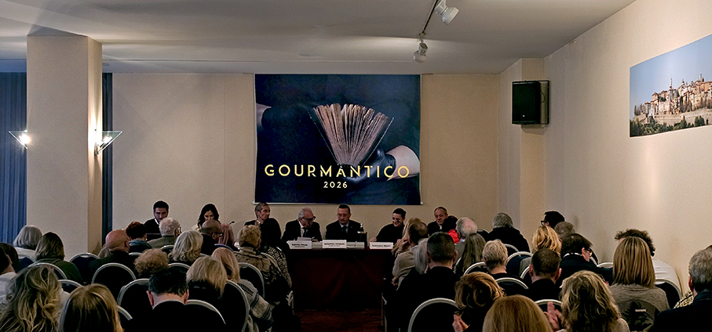
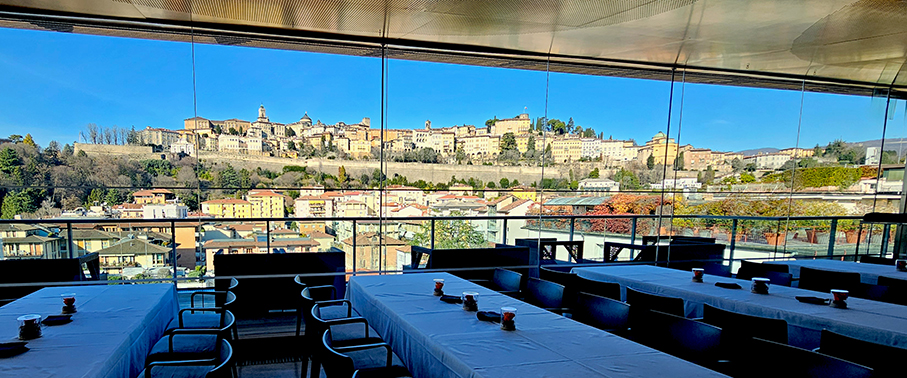
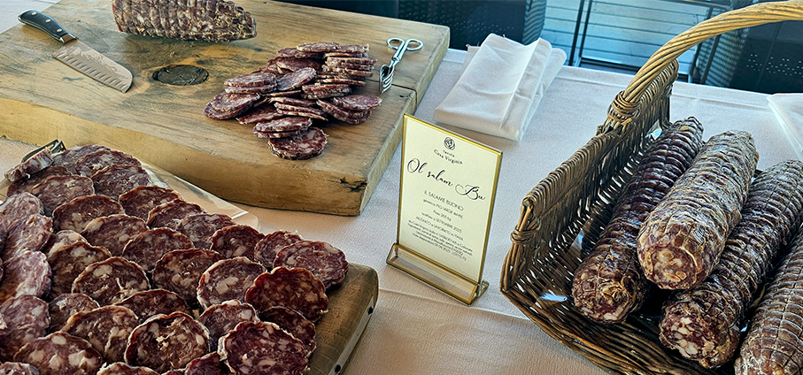
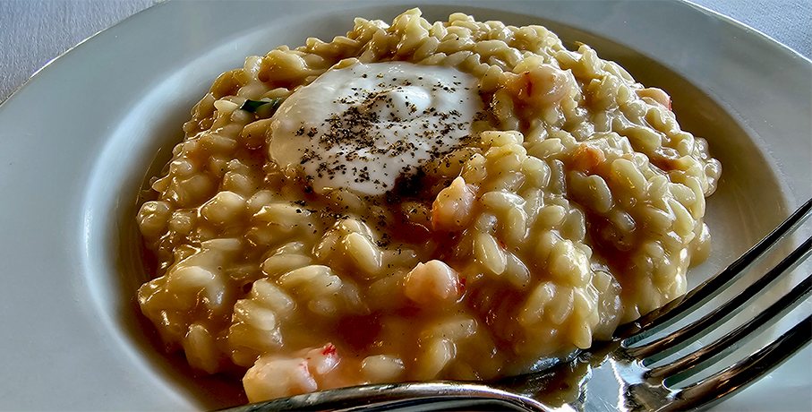
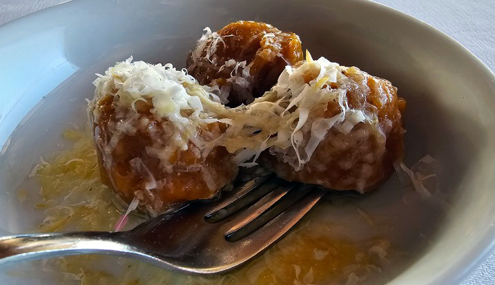
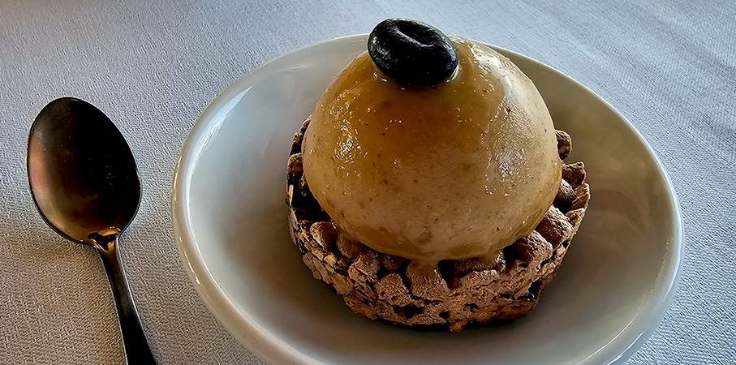
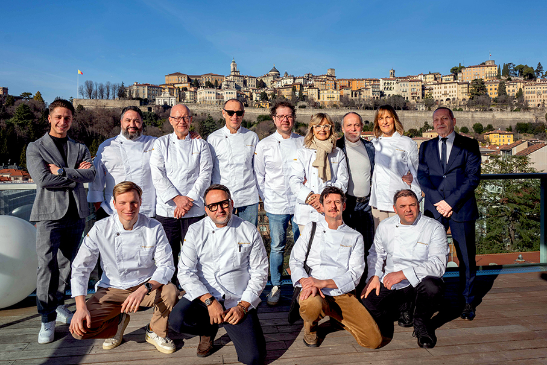

# Gourmantico 2026 - Un racconto da gustare

>Dal 12 gennaio al 2 aprile 2026 torna **Gourmantico**, l’appuntamento dedicato all’**alta ristorazione** e alla valorizzazione della **cultura enogastronomica locale** 

Gourmantico 2026 è un’iniziativa dell’**Associazione Culturale Enogastronomica “Insieme**, che da anni promuove il territorio attraverso la qualità, la creatività e l’eccellenza. Un progetto culturale che mette al centro il **valore del cibo come espressione di storia, tradizione e innovazione**. Un’occasione per scoprire e riscoprire i migliori **ristoranti del territorio** attraverso un’esperienza accessibile, curata e di alto livello. 

"_Siamo felici di essere qui per la terza edizione e che l’associazione stia crescendo anche per i soci membri della nostra associazione_- afferma **Camillo Rota**, Antica Osteria de Camelì e presidente Associazione Insieme - _questo dimostra l’impegno di tutti nella promozione della cucina italiana di qualità patrimonio dell’umanità_".

Durante il periodo dell’evento (San Valentino escluso), i ristoranti aderenti proporranno un **menu degustazione completo al prezzo fisso di 80 euro**, ciascuno con una proposta unica e distintiva, pensata per raccontare l’identità dello chef e del luogo (unica eccezione di prezzo il ristorante Villa Elena, 2 stelle Michelin).

Il progetto nasce con un obiettivo chiaro: aprire le porte dell’alta cucina a un pubblico più ampio, mantenendo standard qualitativi elevatissimi. Per questo l’Associazione Insieme ha definito **criteri rigorosi di partecipazione**, tra cui anzianità dell’attività, riconoscimenti da guide nazionali, qualità dell’offerta e una politica di prezzo trasparente e coerente con la filosofia dell’evento. 

L’edizione 2026 di Gourmantico si arricchisce di una nuova e significativa presenza: entra per la prima volta nell’Associazione Insieme il **ristorante Gaudio dei Fratelli Papa**, che amplia i confini della rassegna portando con sé l’eccellenza e l’identità gastronomica del **territorio bresciano**. Un nuovo racconto di gusto che si intreccia con quelli già presenti, ampliando il dialogo tra culture, tradizioni e visioni della cucina contemporanea.

Il tema di Gourmantico 2026 è: **Racconti da gustare**: un invito a vivere la cucina come linguaggio narrativo. Ogni piatto diventa una storia da assaporare, capace di evocare ricordi, emozioni, viaggi e visioni. Profumi, consistenze e colori si trasformano in parole non dette, in frammenti di memoria e immaginazione.

“_La tavola diventa un luogo di relazione, racconto e condivisione_ - sottolinea **Francesca Mauri** del ristorante Impronte e consigliere dell’Associazione - _In un contesto culturale sempre più orientato alla velocità, Gourmantico rivendica il valore del tempo dedicato all’esperienza gastronomica: non solo cucina, ma accoglienza, dialogo, memoria e territorio. Gli chef non sono chiamati a inventare storie, ma a raccontare la propria identità attraverso piatti che parlano di stagionalità, tradizione e visione personale_”.

Il racconto diventa così corale e circolare: **parte dalla cucina, passa attraverso la sala e si completa con il cliente**, che non è semplice spettatore ma parte attiva dell’esperienza. La tavola si afferma come spazio vivo, dove la cucina italiana – oggi patrimonio culturale – continua a evolversi senza perdere autenticità.

Info e ristoranti aderenti:
**www.gourmantico.it**

**I ristoranti e gli chef protagonisti**

•	Al Vigneto – Chef Vito Siragusa (Grumello del Monte, BG)
•	Antica Osteria dei Camelì – Famiglia Camelì (Ambivere, BG)
•	Bolle Restaurant – Chef Andrea Rota (Lallio, BG)
•	Ristorante Collina – Chef Mario Cornali (Almenno San Bartolomeo, BG)
•	Cucina Cereda – Chef Giuseppe Cereda ★ Michelin (Ponte San Pietro, BG)
•	Frosio Ristorante – Chef Paolo Frosio (Almè, BG)
•	Gaudio – Chef Diego Papa (Barbariga, BS)
•	Il Cantinone – Chef Stefano Masanti (Madesimo, SO)
•	Il Cantuccio – Chef Mauro Elli (Albavilla, CO)
•	Il Saraceno – Chef Roberto Proto ★ Michelin (Cavernago, BG)
•	Impronte – Chef Cristian Fagone ★ Michelin (Bergamo)
•	La Caprese – Chef Roberto Donadoni (Mozzo, BG)
•	LoRo – Chef Pierantonio Rocchetti ★ Michelin (Trescore Balneario, BG)
•	Osteria della Brughiera – Chef Paolo Cortinovis ★ Michelin (Villa d’Almè, BG)
•	Osteria Tre Gobbi – Chef Marco Carminati (Bergamo)
•	Pomiroeu – Chef Giancarlo Morelli (Seregno, MB)
•	Roof Garden Restaurant – Chef Gianpietro Semperboni (Bergamo)
•	Tenuta Casa Virginia – Chef Antonio Lecchi (Villa d’Almè, BG)
•	Florian Maison – Chef Umberto De Martino (San Paolo d’Argon, BG)
•	Villa Elena – Chef Marco Galtarossa ★★ Michelin (Bergamo Alta)
•	Zù Ristorante – Chef Angelo Bonfitto (Riva di Solto, BG)
