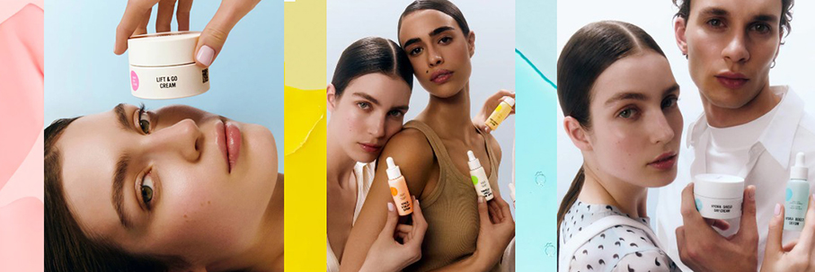
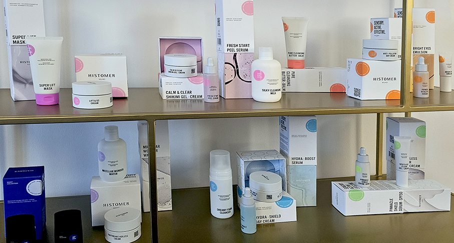
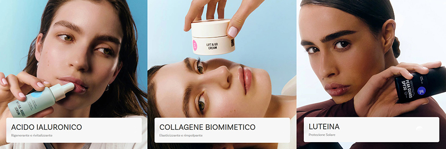
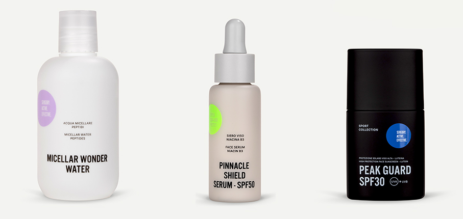
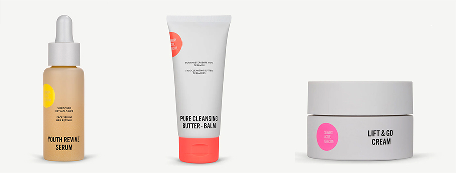

# Histomer Milano - Skincare efficace e appagante

>**Histomer Milano** è il nuovo brand di skincare nato dall’expertise di Valetudo: **scienza, innovazione e piacere sensoriale** per una bellezza avanzata e sostenibile

Lanciato da **Valetudo Dermocosmetic HUB**, realtà italiana con oltre 40 anni di esperienza nella dermocosmesi, il brand Histomer Milano ha come obiettivo quello di trasformare la cura della pelle in un **rituale di puro piacere**, grazie a **texture rivoluzionarie** e ingredienti altamente efficaci, ideali per ogni tipo di pelle. 

Fondata nel 1982 a Bergamo, Valetudo è un **hub dermocosmetico** specializzato nella produzione per conto terzi, con un forte focus sulla qualità, l’innovazione e la sostenibilità. Grazie a questa expertise,  oggi  il  Gruppo compie  un passo strategico ampliando il proprio portfolio con un **brand proprietario**: Histomer Milano.

Pur posizionandosi come un brand beauty, eredita l’**approccio scientifico** alla formulazione di Valetudo,  producendo prodotti accompagnati da **test di efficacia** condotti in laboratori esterni certificati. Questo garantisce una **skincare avanzata**, supportata da evidenze scientifiche, che si rivolge non solo al benessere estetico, ma anche alla salute della pelle.

 
Alla base di tale innovazione, troviamo le **SensActional Formulas** che coniugano sensorialità e performance: altamente efficaci, semplicemente pure e incredibilmente appaganti. Quest’esperienza si rivela appieno nell’incontro con **texture innovative e curiose**, leggermente colorate in base alla naturale e **alta concentrazione** dell’ingrediente principale, e nell’efficacia dermocosmetica delle sue formule. 

Per i vari tipi di pelli ed esigenze ci sono **6 linee dedicate**, ciascuna riconoscibile dalla **colorazione del principio attivo**:

**Acido Ialuronico** – azzurro – Rigenerante e Rivitalizzante

**Collagene Biomimetico** – rosa – Elasticizzante e Rimpolpante

**Luteina** – bianco – Protezione Solare

**Niacina B3** – verde – Purificante e Schiarente

**Peptidi** – viola – Ristrutturanti e Ridensificanti

**Vitamina C** – giallo – Illuminante e Perfezionante

Nella formula la Vitamina C è combinata con l'**Astaxantina**, estratta dall’alga Haematococcus pluvialis che non è solo il segreto del colore rosso-arancio del prodotto, ma anche un **super antiossidante**, fino a 6000 volte più potente della vitamina C nel combattere i radicali liberi.
Tutte le linee si dividono in **sieri, creme, detergenti  e maschere**. 

Tra questi **ne ho provati 3** all’interno della mia beauty Routine e in montagna:

**Micellar Wonder Water** _un'acqua micellare delicatissima, pulisce in profondità ma lascia la pelle fresca e veramente morbida e idratata_.

**Pinnacle Shield Serum SPF 50** "_questo siero unisce un fattore di protezione SPF50 alla Niacina B3 ed è perfetto per mantenere la pelle pura, combattere i pori dilatati e garantire un'ottima protezione solare. Esattamente quello di cui ho bisogno! La consistenza è liquida ma cremosa e, soprattutto, non unta. Risulta così facile da distribuire sul viso e si assorbe subito, lasciando la pelle morbidissima, con la massima sensazione di comfort_". 

**Peak Guard SPF 30** "_perfetta per l'esposizione al sole, nel mio caso di alta montagna. Arricchita con Luteina, che filtra la luce blu, Ectoina, che assicura un’idratazione prolungata e un effetto calmante, e proteine di Mandorla Dolce, dalle proprietà emollienti e protettive, è anche particolarmente utile in condizioni di freddo intenso. Anche in questo caso, una texture cremosa, facile da spalmare e di rapido assorbimento che non lascia tracce sgradevoli, ma solo una pelle liscia al tatto e nutrita. La combo Pinnacle Shield Serum SPF 50 e Peak Guard SPF 30 è vincente in tutti gli aspetti, dalla super protezione solare allo scudo antifreddo, dall'effetto emolliente a quello lisciante. Super consigliata!_". 

Tra gli altri prodotti, **vi segnalo questi Highlights**:

**Youth Revive Serum**, Face serum - Retinol HPR
Un siero cremoso ma fluido dalla consistenza lattiginosa, con Retinolo HPR, Coenzima Q10 e Olio di Carota. Rigenera in profondità la pelle con le sue proprietà leviganti, rivitalizzanti, illuminanti e anti-invecchiamento.un siero con Retinolo HPR, coenzima Q10 e Olio di Carota. Rigenera in profondità la pelle con le sue proprietà leviganti, rivitalizzanti, illuminanti e anti-invecchiamento.

**Pure Cleansing Butter-Balm**, Face cleansing balm - Ceramides
Un'emulsione fondente ricca di ceramidi, burro di karité e burro di mango, studiata per coccolare la pelle rimuovendo delicatamente trucco e impurità, lasciandola morbida e purificata.un balsamo detergente ricco di ceramidi burro di karité e burro di mango, studiato per rimuovere delicatamente trucco e impurità.

**Lift & Go Cream**, Face cream - Biomimetic Collagen
Un'emulsione ricca e avvolgente con collagene, pullulano e alghe rosse, note per i loro effetti rassodanti, tensori e lifting. Dona alla pelle un aspetto tonico e giovanile per una bellezza senza pari.una crema arricchita con collagene pullulano e alghe rosse, note per i loro effetti rassodanti, tensori e lifting.

Histomer ha una piattaforma **e-commerce** avanzata e già funzionante, che verrà supportata dalla presenza dei prodotti in **punti vendita fisici multi-brand**, offrendo un’esperienza d’acquisto personalizzata.

**https://histomer.com/**
