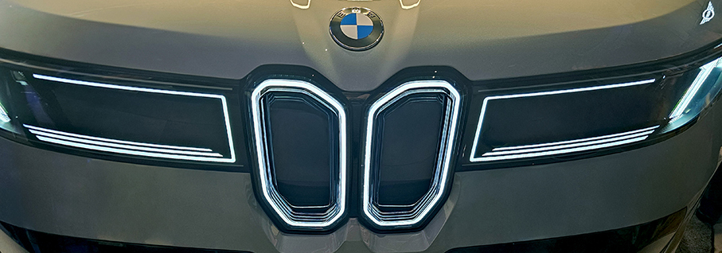
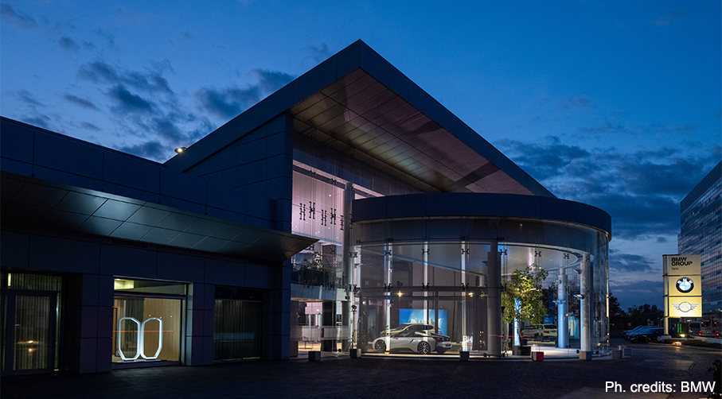
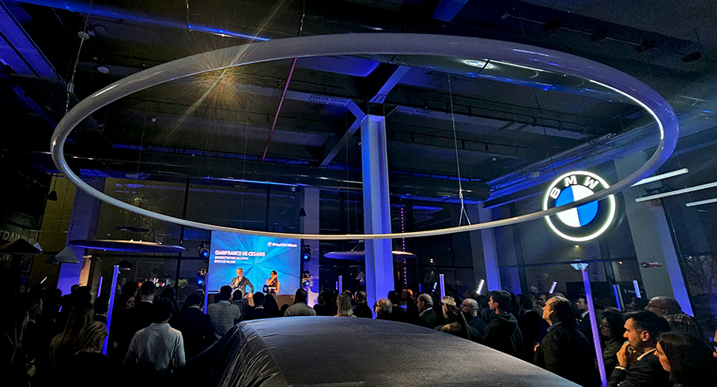
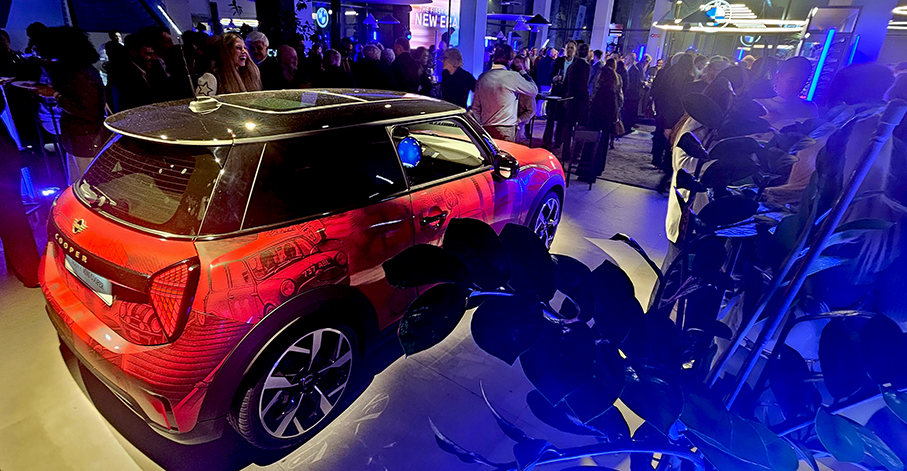
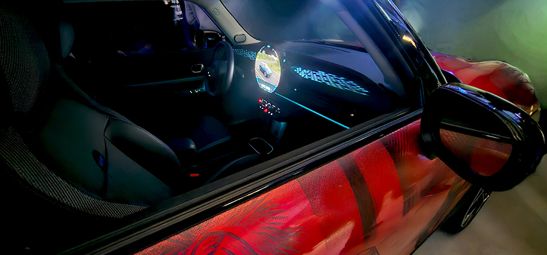
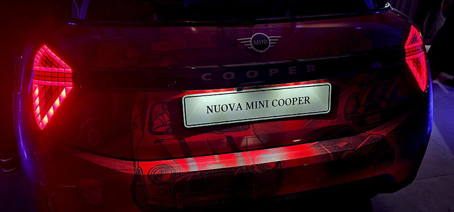
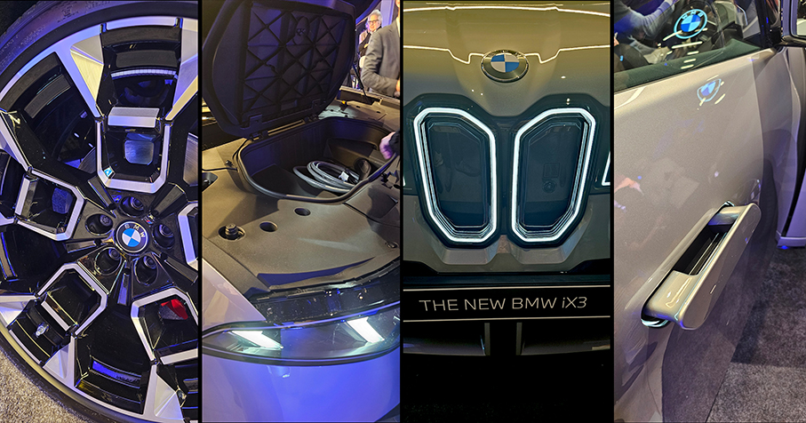
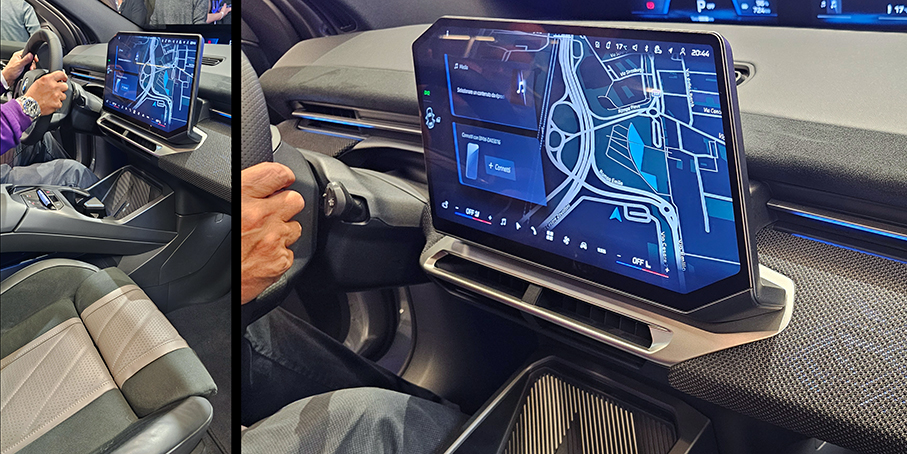
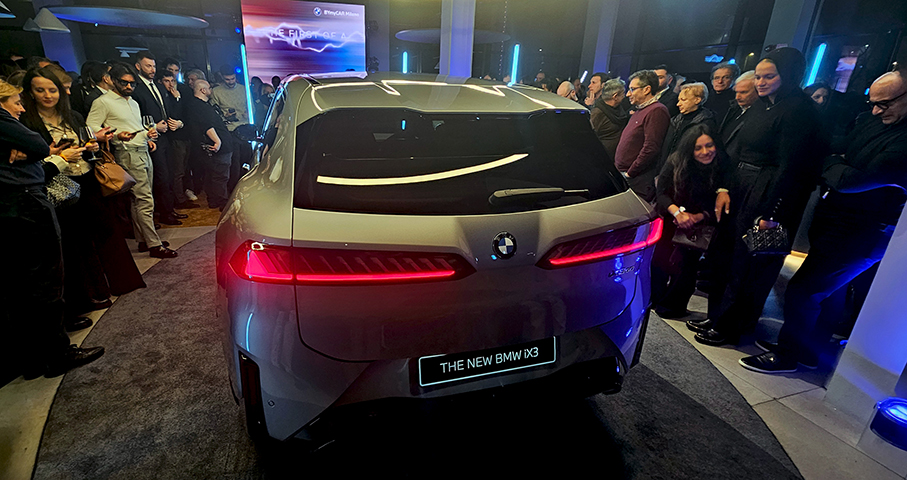
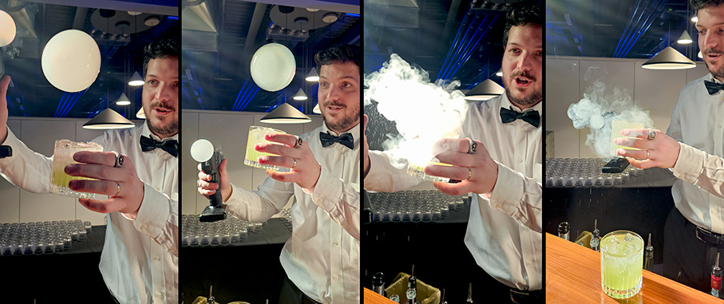

# House Of BMW di BYmyCAR - San Donato Mil.

>Inaugurata la nuova **House Of BMW di BYmyCAR Milano a San Donato Milanese**: un luogo “human centric” che celebra il ritorno alle origini della sede progettata da **Kenzo Tange**

Nella storica sede di BMW Italia a San Donato Milanese è stata inaugurata la nuova House of BMW Italia contemporaneamente alla **presentazione della Nuova BMW iX3**. Un progetto rinnovato che trasforma gli spazi al piano terra dell’edificio progettato da Kenzo Tange in un ambiente accogliente e lifestyle, pensato per collaboratori, visitatori, media, amici dei brand e tutti gli stakeholder dell’azienda. Uno spazio dedicato ai **brand BMW, MINI e Motorrad**.

**Massimiliano Di Silvestre, Presidente e Amministratore Delegato di BMW Italia S.p.A.**, ha dichiarato: “_La nostra sede non è solo un quartier generale, ma un ambiente dove collaborare, ispirarsi e condividere valori. Siamo orgogliosi di poter offrire ai nostri visitatori e al nostro team un luogo che rappresenta la nostra storia, la nostra cultura e il nostro futuro. L’edificio definito ‘la porta sud di Milano’ dall’illustre critico estetico Gillo Dorfles si conferma un simbolo identitario per chi arriva in città dall’autostrada A1, mentre la nuova House of BMW Italia rappresenta un passo importante per rafforzare la cultura aziendale, l’aggregazione e la condivisione dei valori che hanno portato l’azienda a raggiungere importanti traguardi sul mercato italiano_”.

Per la **serata inaugurale**, nell’ideale percorso temporale realizzato nella House of BMW Italia, sono state esposte **cinque vetture emblematiche** che raccontano la storia e il futuro del brand: la **prima Neue Klasse**, la **BMW 1500** disegnata dal celebre designer italiano Giovanni Michelotti negli anni Sessanta, la **BMW M1** di Giorgetto Giugiaro, la **BMW X5** del 1999 che diede origine al segmento degli Sport Activity Vehicle, la **BMW i8 Roadster** antesignana delle ibride plug-in sportive e la **nuova BMW iX3**, ossia la nuova versione della famiglia Neue Klasse.

La **BMW 1500**, vera pioniera delle berline sportive, ha segnato il rilancio globale di BMW negli anni Sessanta, elevando il piacere di guida a caratteristica distintiva del brand, mentre la BMW iX3 rappresenta oggi l’avanguardia della mobilità sostenibile, con soluzioni innovative in termini di digitalizzazione, tecnologia, elettrificazione, design ed esperienza di bordo.

Con i suoi quattro marchi BMW, MINI, Rolls-Royce e BMW Motorrad, il BMW Group è il costruttore leader mondiale di auto e moto premium e offre anche servizi finanziari premium. Il BMW Group comprende oltre **30 stabilimenti di produzione nel mondo ed ha una rete di vendita globale in più di 140 Paesi**.

Il concetto di **House of BMW Italia** è stato ideato e lanciato da BMW Italia nel 2021, con le prime sedi in via Verri, via Monte Napoleone e più recentemente in via Manzoni a Milano, con l’obiettivo di creare un luogo dove **bilanciare l’approccio hi-touch con le tecnologie hi-tech**, riportando le **relazioni umane di alto livello al centro** della strategia aziendale. 

Sulla base di questo successo, la filosofia della House of BMW Italia ha ispirato anche il progetto Retail Next, che entro la fine del 2025 porterà alla **trasformazione del 70% delle concessionarie italiane** in spazi caldi e accoglienti, più simili a showroom di moda che a tradizionali saloni dell’auto. Questi luoghi offriranno un **customer journey di altissimo livello**, combinando tecnologia digitale e ambienti curati nei dettagli, capaci di interpretare la cultura locale, con sfumature uniche ma sempre intense.

_Photo Credits: Maria Rosa Sirotti_