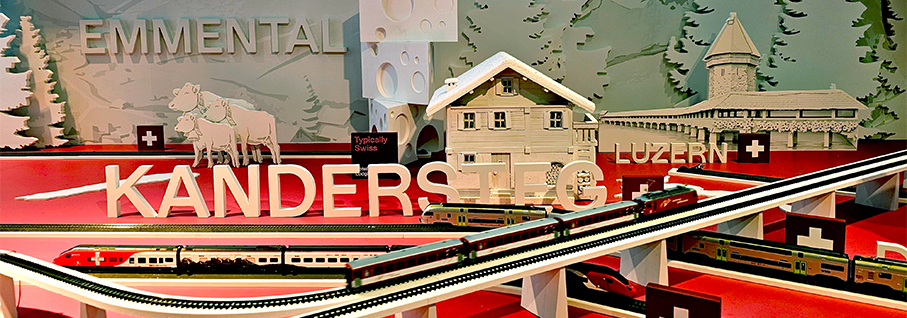
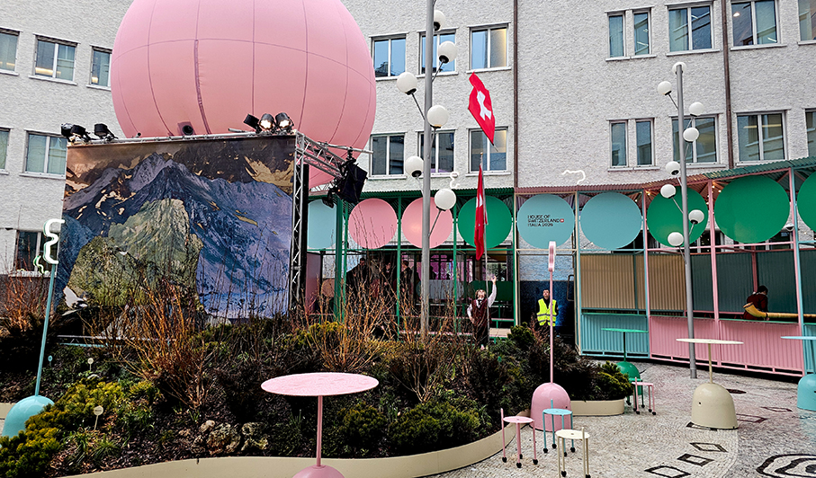
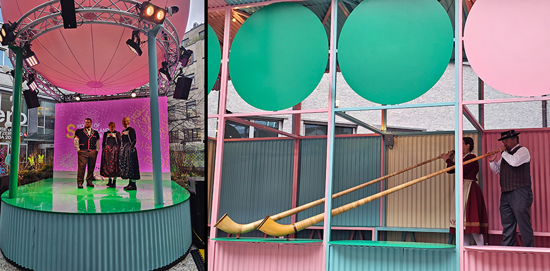
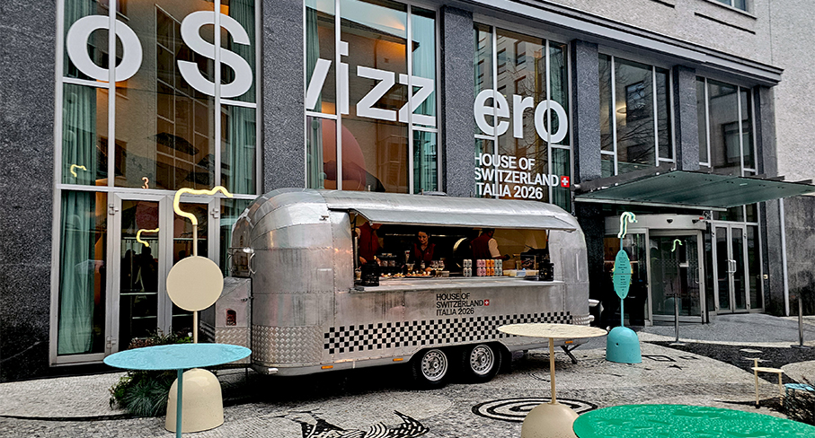
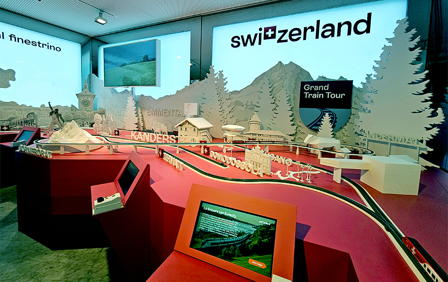
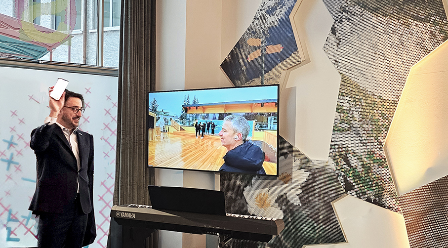
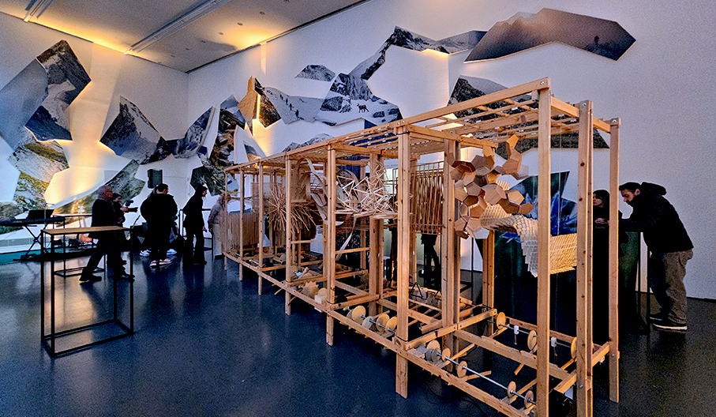
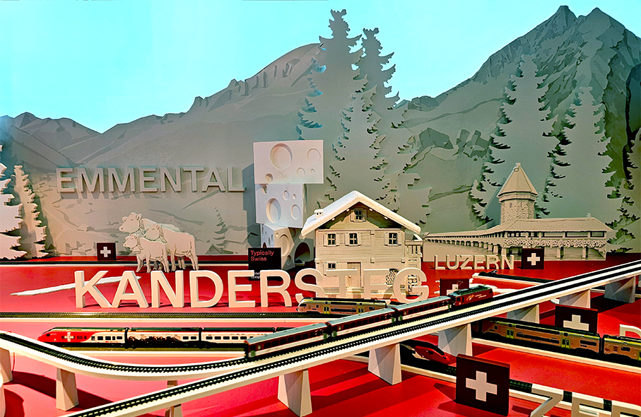

# House of Switzerland Italia 2026

>Inaugurata la **House of Switzerland presso il Centro Svizzero a Milano**: la piattaforma della Svizzera ai Giochi Olimpici e Paralimpici 2026 Milano - Cortina

Durante i Giochi Olimpici, la House of Switzerland, situata nel Centro Svizzero in Via Palestro 2/4 a Milano, trasforma il cortile e il ristorante Swiss Corner in **uno spazio colorato grazie a Flora Alpina**. Una esposizione che porta lo spirito alpino in città e offre una fuga dall’inverno urbano. Un’esperienza di **ospitalità svizzera**, dei Giochi e dello Spirito Alpino.

Ideata dai rinomati studi svizzeri Bureau e Base Design, trae ispirazione dal **ruolo fondamentale che i fiori rivestono** nello sport, nella medicina e nella cultura, creando un'esperienza estetica, coinvolgente e in continua evoluzione che risponde all'ambiente circostante. Flora Alpina è sia una reazione a un contesto globale difficile sia un invito a fare una pausa, a lasciare spazio alla poesia, alla luce e alla **bellezza attraverso una natura onirica**.

Un’ode al **paesaggio e all'artigianato popolare tradizionale svizzero**: il design grafico si ispira infatti al ricamo a **punto croce dei Grigioni**, un motivo tradizionale che rappresenta sia la resilienza che l'eleganza della cultura svizzera. Celebra i Giochi come un raduno popolare secolare e un momento di unità tra le nazioni. La resistenza e la resilienza delle piante e dei fiori alpini riecheggiano lo **spirito degli atleti e delle atlete**. Il loro uso storico nei rimedi curativi li rende un potente simbolo di forza e rinnovamento. E nella cultura, incarnano la **bellezza, la tradizione e la connessione, collegando il passato e il presente**.

**A Milano** questa visione prende vita sotto forma di un **giardino alpino effimero** nel cortile, un santuario ispirato alla natura per celebrare gli atleti e le atlete svizzeri e internazionali e offrire un luogo dove ricaricarsi, rilassarsi e riconnettersi. All'esterno e all'interno del ristorante, vetri a specchio riveleranno una collezione di miniature alpine, invitando i passanti di Milano a vedersi riflessi in questo universo. **A Cortina d'Ampezzo** plasmerà l'esperienza dell'ospitalità svizzera, ispirando talvolta il **concetto culinario e l'atmosfera accogliente**.

La House of Switzerland Italia 2026 inviterà a celebrare insieme lo spirito alpino attraverso un **ricco programma di eventi e incontri gratuiti** per tutti i visitatori. Ognuno avrà modo di scoprire il forte **legame tra Svizzera e Italia** e di esplorare le idee e gli approcci – inediti e condivisi – per il futuro delle nostre Alpi.

**L'Ambasciatore Alexandre Edelmann**, Capo di Presenza Svizzera, sottolinea: “_La House of Switzerland è più di uno spazio espositivo, è una vera e propria casa di dialogo e amicizia. In un ambiente rilassante e conviviale, racconteremo un Paese che è continuamente impegnato nello sviluppo dell’innovazione e della cooperazione. Tutti valori che trovano la loro massima espressione nelle nostre amate Alpi, vero ponte e trait-d’union con l’Italia. Venite a trovarci!_”.

I Giochi Olimpici e Paralimpici Invernali di Milano Cortina 2026 rappresentano un’occasione straordinaria per rendere visibile la **capacità di unire le persone, di creare ponti** e di far nascere nuove alleanze tra istituzioni, comunità e cittadini. **Valori condivisi dall'Italia e dalla Svizzera**.

La House of Switzerland Italia 2026 sarà uno dei luoghi simbolo di questa alleanza: un **laboratorio di idee, di scambi e di relazioni** che arricchirà non solo la presenza svizzera a Milano, ma anche il cammino della nostra città verso i Giochi, nel segno della sostenibilità, dell’inclusione e della cooperazione internazionale.

_Ph.credits: Maria Rosa Sirotti_

**House of Switzerland Italia 2026 / Milano**
Centro Svizzero
Via Palestro 2 e 4
20121 Milano
4.2.2026: 17-22h
5.-22.2.2026: Lu-Do : 10-22h
Eccetto 10 febbraio, apertura alle 13h

