# I Pop up di Milano-Cortina

>Prosegue **a Milano** una ricca offerta di **pop up esperienziali** in occasione dei  Giochi Olimpici e Paralimpici Invernali di Milano Cortina 2026
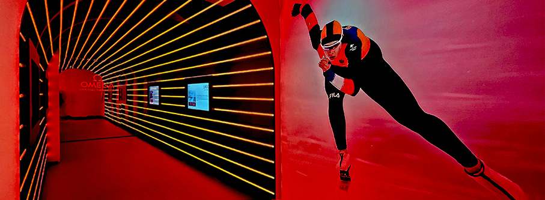

Per ampliare l’esperienza dei Giochi, coinvolgendo i **residenti, i turisti e anche gli atleti**, a Milano è stato creato un percorso olimpico diffuso tra sport, tecnologia e spettacolo. 

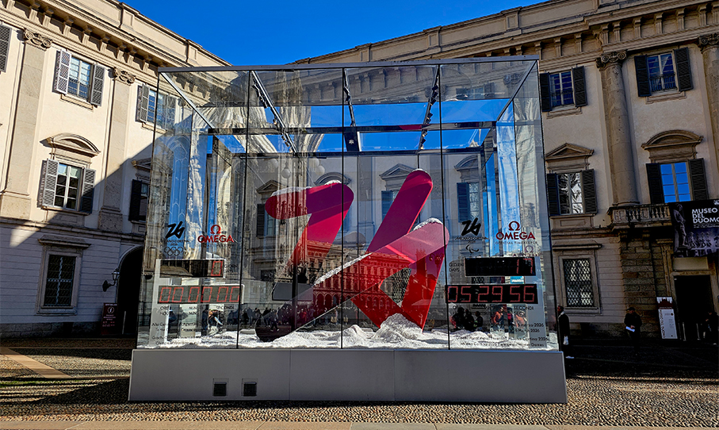

L’esperienza è arricchita dalle **installazioni lungo l’Olympic Boulevard**, un percorso che attraversa alcuni dei luoghi più iconici della città collegando, ad esempio, Corso Venezia, Piazza San Babila, Piazza San Carlo, Corso Vittorio Emanuele, Piazza Palazzo Reale e Piazza Duomo. Da qui, Via Orefici e Via Dante ci portano in Piazza Castello e in Piazza del Cannone.

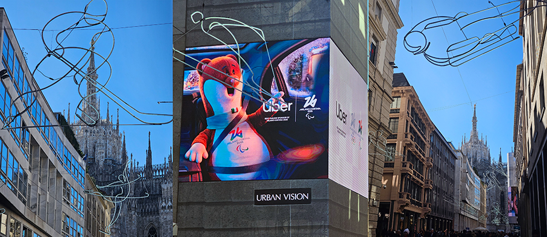

**TCL Edelweiss Land**, lanciando la campagna “It’s Your Greatness”, offre uno spazio esperienziale di 500 metri quadri in **Piazza Duca d’Aosta**, di fronte alla Stazione Centrale. Un punto d’incontro dedicato a utenti e consumatori per raccontare la TCL di oggi: un marchio globale con una forte identità nel **mondo dei display, dell’elettronica di consumo e delle soluzioni smart** per la casa. 

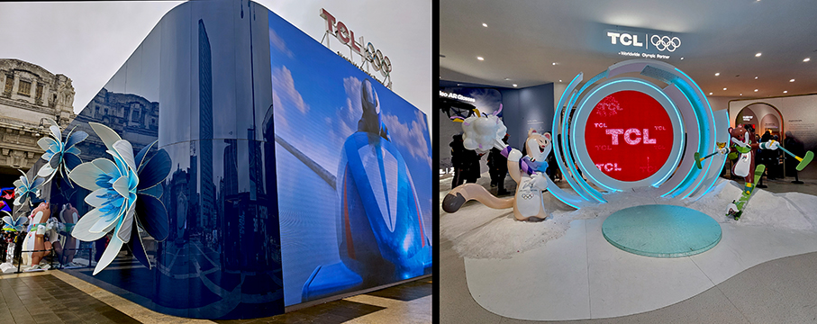

I visitatori potranno scoprire da vicino le più recenti innovazioni TCL, vivere **esperienze immersive, scattare foto** e lasciarsi ispirare. Progettato secondo principi di sostenibilità ambientale e guidato dalla creatività, lo spazio riflette l’impegno verso un’innovazione responsabile. Diverse le aree tematiche dedicate alle più recenti innovazioni del brand, inclusa l’ultima generazione di tecnologie display. All’interno dello spazio è possibile scoprire anche una selezione di elettrodomestici smart e gli **occhiali TCL RayNeo AR**, che integrano le più avanzate soluzioni di realtà aumentata.

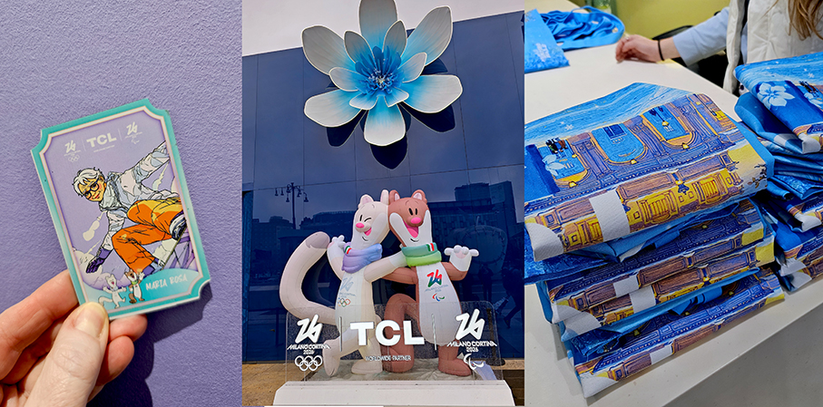

**EA7 Emporio Armani** è l'Official Outfitter per le divise dell'Italia: l'eleganza unita alle performance. In **Piazza Duca d’Aosta** è possibile vedere le versioni bianco neve e grigio. Una scelta controcorrente e raffinata, che riflette con precisione la visione di **Giorgio Armani per l’Italia Team**: un’eleganza silenziosa, essenziale, capace di dialogare con il paesaggio alpino e con l’idea stessa di rispetto, valore fondante dello sport. 

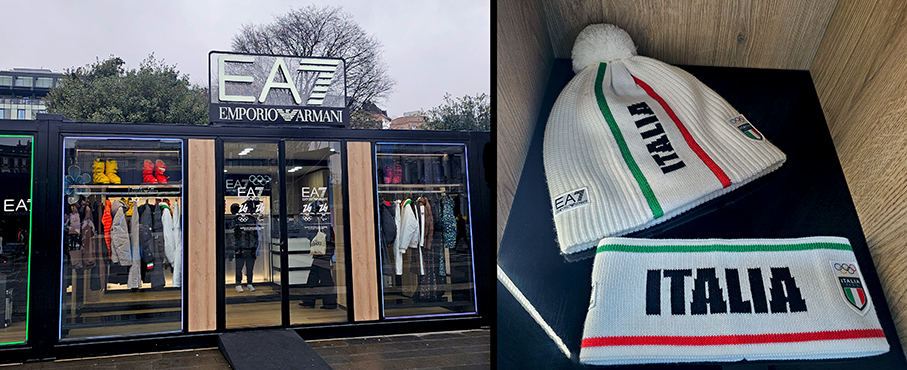

L’**outfit per le sfilate e le premiazioni** è invece un **twill grigio in pura lana** resa impermeabile. Un pantalone cargo che coniuga un tessuto tipico maschile con forme non convenzionali, dove il tricolore è appena accennato nelle bordure in maglia elastica e all’interno del cappuccio. 

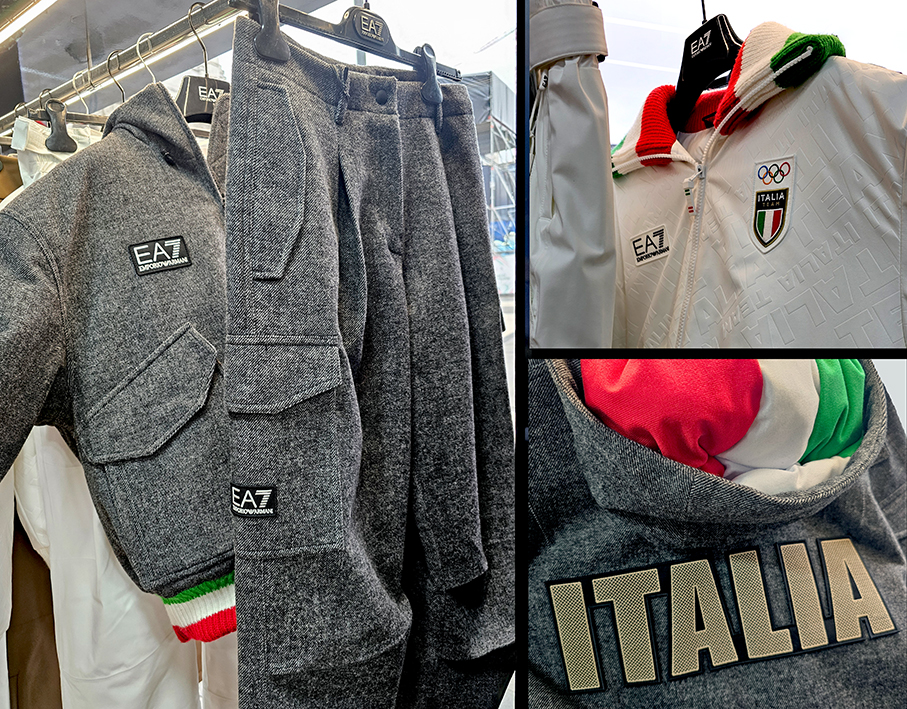

E’ in **Piazza del Cannone** che troviamo **The Peak by Coca-Cola**,  uno spazio immersivo e gratuito di 900 mq dedicato a Milano Cortina 2026. L'esperienza celebra lo storico legame tra Coca-Cola e le Olimpiadi, nato nel 1928, attraverso cimeli e torce iconiche. 

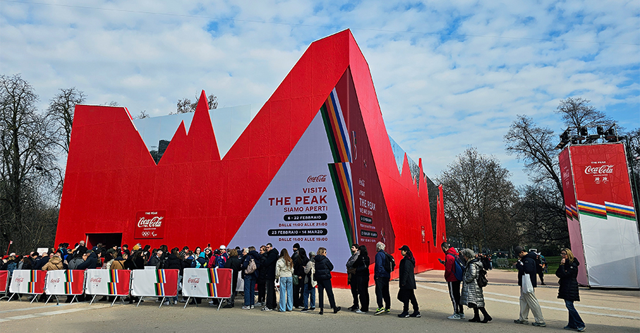

All'interno, è possibile **personalizzare lattine** e vivere un viaggio sensoriale che culmina in una stanza specchiata dove l'intelligenza artificiale rende i consumatori protagonisti dei Giochi.  
Un viaggio narrativo ed emotivo con l'opportunità unica di **scattare una foto con la Torcia Olimpica**, ricordi indelebili che potrai portare a casa.

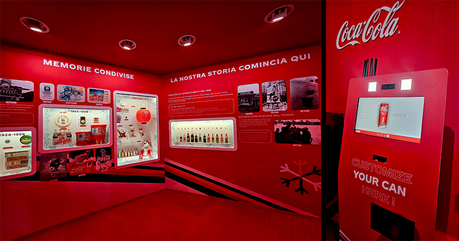

**Moncler Grenoble**: La Mostra **Beyond Performance 1952–2026** è al **Milano Portrait** di Corso Venezia 11.
La storia di Moncler nasce nel cuore maestoso delle Alpi, nella neve incontaminata, nella roccia aspra e nel ghiaccio cristallino. Un viaggio che prende forma tra le montagne, dove tutto ha avuto inizio. Un percorso lungo **tre vie** che scorrono da un passato epico a un presente straordinario:

**The Blue Trail**: La Spedizione e le Origini
Nata nelle Alpi nel 1952 e successivamente messa alla prova in occasione della prima spedizione mondiale verso la vetta del K2. Segui le tracce sulla neve fresca di una storia audace, plasmata dallo spirito autentico della montagna.

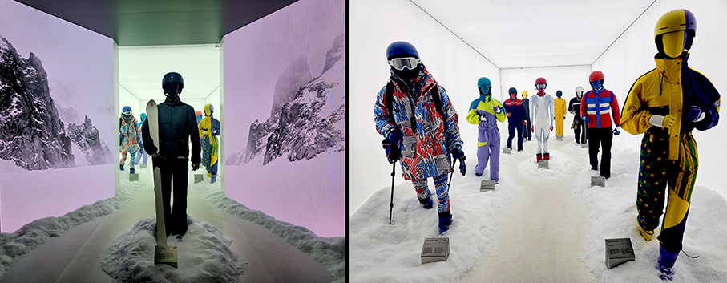

**The White Trail**: La Performance e le Piste
Potenza, precisione e poesia in movimento. Scopri un’eredità segnata dall’adrenalina negli sport invernali, dall’equipaggiamento della squadra francese di sci a Grenoble nel 1968 fino alla sponsorizzazione della squadra brasiliana nel 2026.

**The Red Trail**: Il Presente e il Futuro
Esplora i nostri archivi viventi. Ripercorri l’evoluzione ad alta performance e ad alto stile dell’unico brand di lusso nato in montagna, dalle passerelle ai capi che stanno definendo il futuro del design alpino.

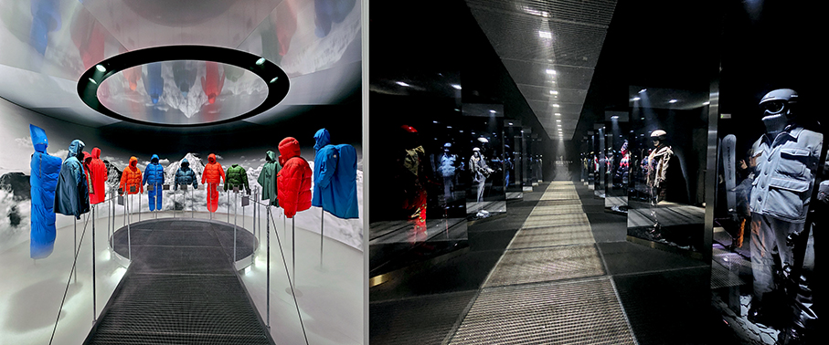

Il **Padiglione Omega** in **Piazza San Babila** permette di esplorare l’universo immersivo del **cronometraggio dei Giochi Olimpici e Paralimpici Invernali**. Il percorso celebra la lunga tradizione del brand come Cronometrista Ufficiale dei Giochi Olimpici e Paralimpici, ruolo che ricopre dal 1932. I visitatori possono esplorare uno spazio dinamico e interattivo ricco di installazioni che rendono l’emozione dello sport ancora più accessibile. Una breve introduzione ai 94 anni di tradizione cronometrica del brand, con una panoramica sulle rivoluzionarie innovazioni sviluppate nel corso del tempo. 

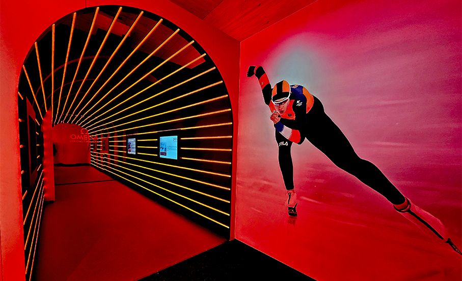

L’esplorazione prosegue con racconti, filmati, profili degli atleti, esposizioni tecnologiche e photo opportunity. Corona l'esperienza la possibilità di **sedersi all’interno di un vero bob olimpico** e vivere l’adrenalina dello sport attraverso un’esperienza in realtà virtuale. Questa attrazione unica nel suo genere mette in risalto la natura ad alta velocità della disciplina e mostra come la tecnologia Omega viene utilizzata per misurare ogni singolo secondo.

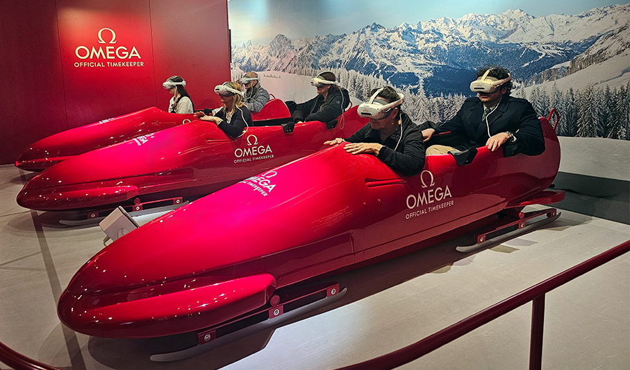

**ITA Airways**, in qualità di Official Airline Sponsor, ha il proprio **spazio Skyway** in **Piazza San Carlo**. Lo showcasing si articola attraverso due padiglioni caratterizzati dal **colore azzurro**, elemento distintivo della Compagnia, capaci di esprimere l’identità di ITA Airways e il suo legame con Milano Cortina 2026. 

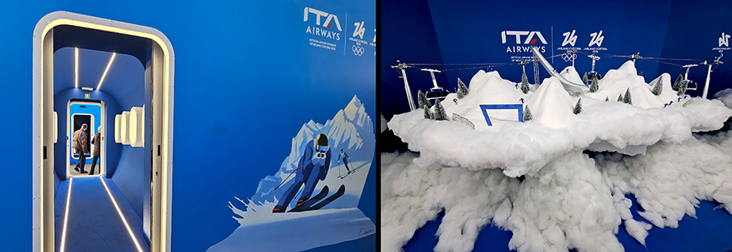

I padiglioni integrano superfici bianche e inserti in legno naturale che richiamano le forme delle montagne, dando vita a un’architettura di grande impatto visivo ma al tempo stesso armoniosa coniugazione di identità nazionale, spirito sportivo e sensibilità ambientale; il secondo padiglione riproduce la **fusoliera di un aereo**, con oblò affacciati su un paesaggio montano che contribuiscono a rafforzare l’illusione del volo e il legame con l’ambiente alpino.

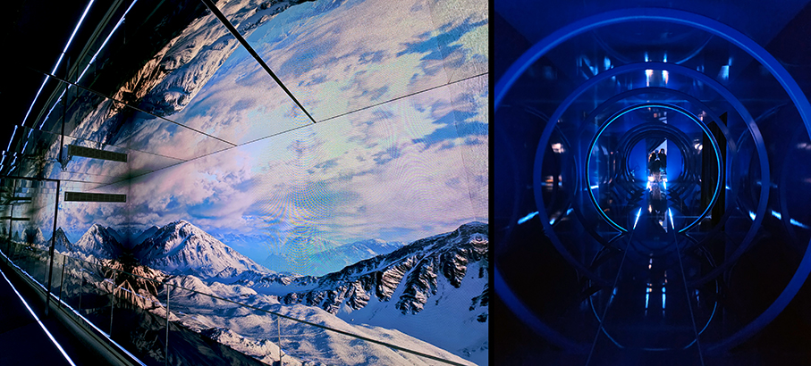

_Ph. credits: Maria Rosa Sirotti_

