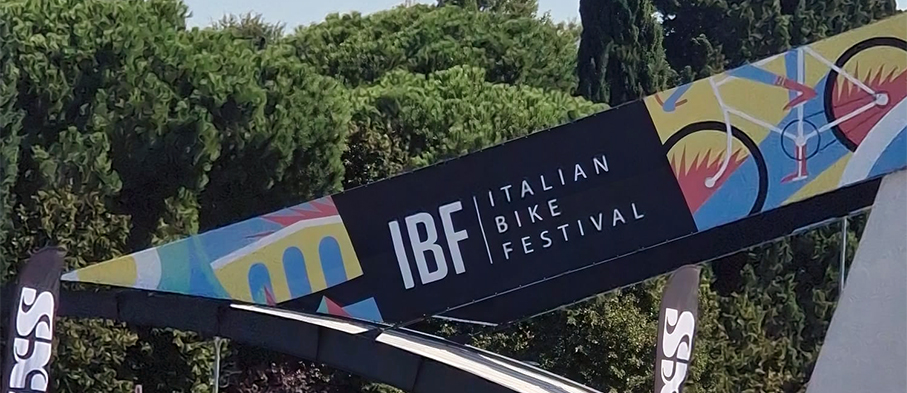
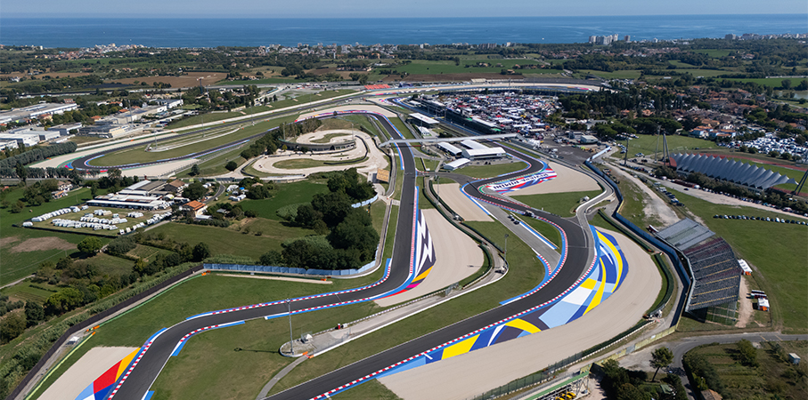
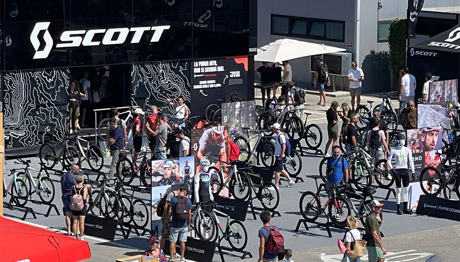
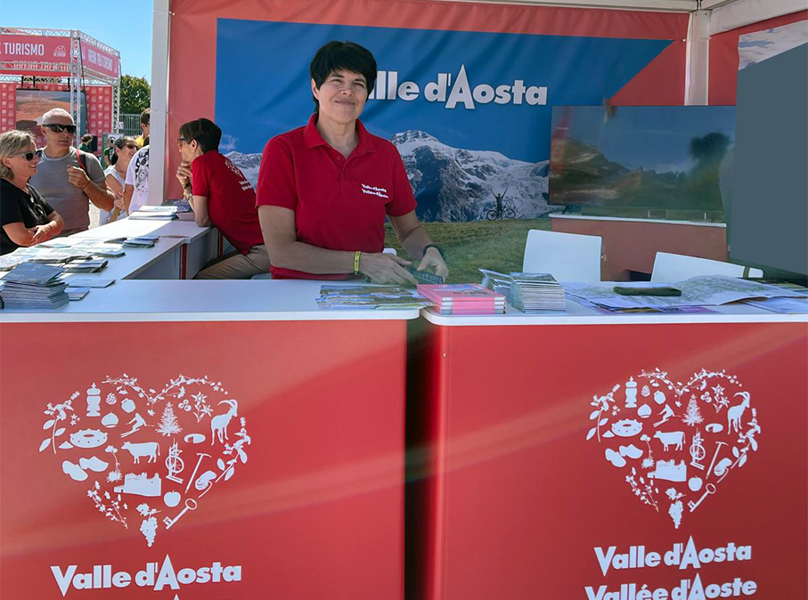
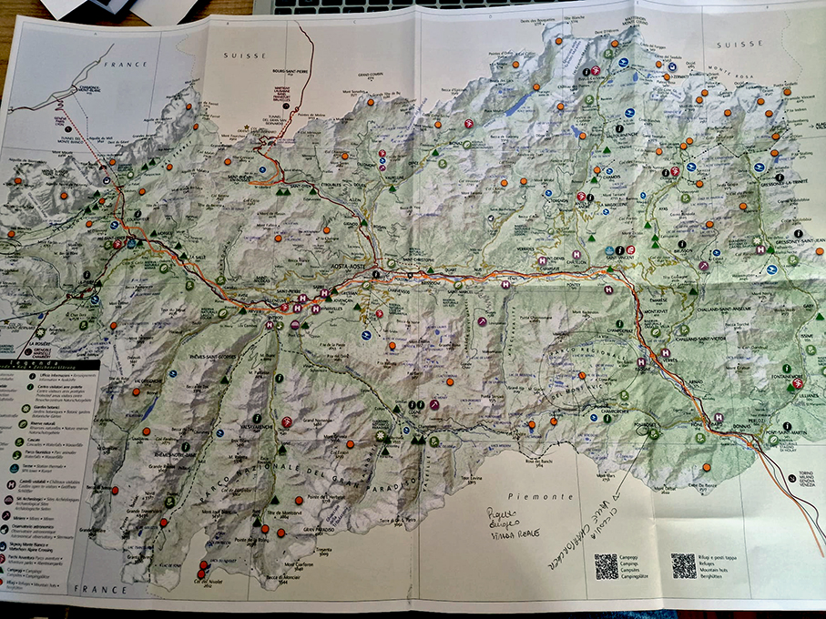
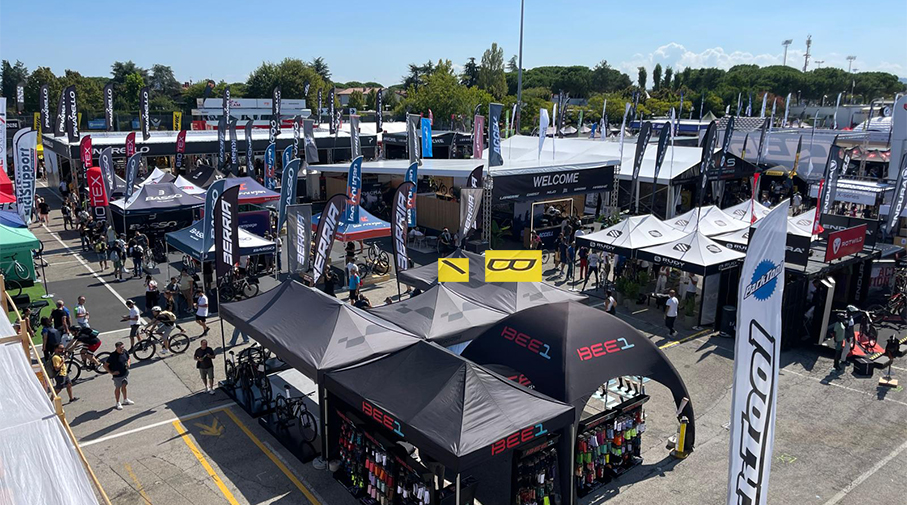
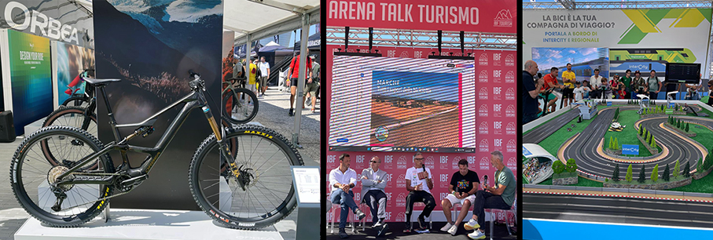
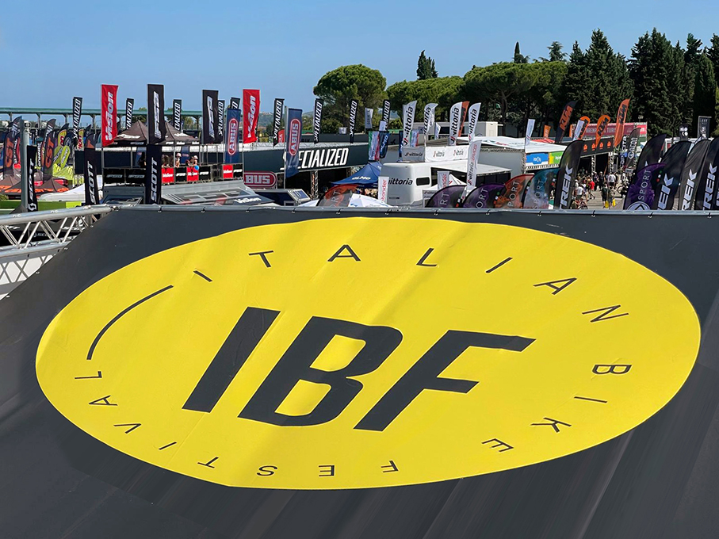

# IBF – Italian Bike Festival 2025 

> **IBF – Italian Bike Festival 2025**, il più grande evento bike d'europa, si è svolto nella cornice del **Misano World Circuit “Marco Simoncelli”**

_a cura di Elena Braschi_

La Riviera romagnola è diventata la capitale europea della bici e della mobilità sostenibile, con **tre giorni di bike test, alk, workshop** e la presenza di oltre **600 brand espositori**. L’evento a ingresso gratuito, ha voluto offrire un’esperienza completa e immersiva: dalla scoperta delle novità del mercato alla possibilità di provarle direttamente, fino al confronto con visioni, storie e prospettive sul futuro della bici.

**Italian Bike Festival** è il **Salone internazionale della bici** che dal 2018 richiama l’attenzione del mercato europeo. Ad oggi è la piattaforma leader in Europa per il settore della bici e della mobilità dolce. 

Tre giorni in cui l’industria, rappresentata da oltre 600 brand, ha avuto l’occasione di connettersi con **consumatori finali, partner commerciali e media**. Qui vengono presentate le **nuove tendenze e l’innovazione**, un’occasione per generare network, confermare la propria leadership con il grande pubblico e presentare al mercato le novità. Non mancano tavole rotonde e momenti di workshop finalizzati al concreto arricchimento di pensiero o di direzione su temi estremamente attuali quali la mobilità dolce sostenibile e il cicloturismo.

Presente anche la **Valle d’Aosta** che, negli ultimi anni, ha abbracciato con convinzione la mobilità sostenibile, facendo dell’e-bike non solo un’opportunità sportiva, ma anche un volano per la **valorizzazione del territorio**. 

Proponiamo ai nostri lettori un approfondimento in merito in quanto, a seguito della pandemia Covid, si è registrato un enorme incremento di presenze turistiche in montagna, soprattutto in Val d’Aosta, dove numerosi sono anche gli investimenti esteri.
Parliamo con **Sabina Vagneur dell’Assessorato al Turismo della Regione Autonoma Valle d’Aosta**, che racconta come la bici elettrica stia contribuendo a rendere la **montagna più accessibile e sostenibile**.
Uno dei comprensori più noti, **Cervinia – Valtournenche**, punta su un’offerta rivolta a **biker esperti**. Qui i dislivelli sono importanti, i percorsi impegnativi, e il territorio non si presta a itinerari facili.

_”Cervinia non rientra nei circuiti e-bike per principianti_, spiega Vagneur, _ma offre ottime infrastrutture per gli appassionati più allenati, con Bike Park di livello internazionale, che vengono manutenzionati quotidianamente e garantiscono sicurezza e divertimento agli amanti del downhill e del freeride”_.

Per chi cerca invece esperienze più accessibili, la **Valle di Champorcher**, alle porte del **Parco naturale del Mont Avic**, è una delle mete ideali. Qui si snoda la suggestiva **Strada Reale**, un’antica mulattiera trasformata in sentiero ciclabile e di trekking, che collega Champorcher con la conca di Dondena, tra pascoli, laghi alpini e panorami incontaminati.

_”È uno dei percorsi più adatti a famiglie e ciclisti meno esperti_- aggiunge Vagneur - _Un ottimo esempio di come l’e-bike possa rendere fruibili luoghi un tempo accessibili solo a pochi”_.

La Valle d’Aosta è anche terra di confine e di connessioni. Alcuni tra i **percorsi più suggestivi sono quelli transfrontalieri**, nati grazie a progetti realizzati con contributi europei, pensati per unire territori e culture attraverso la bicicletta.

A **La Thuile**, il percorso **MTB Frontalier collega Italia e Francia**, snodandosi tra boschi e vallate alpine. Può essere percorso interamente in sella oppure sfruttando le seggiovie, che riducono il dislivello e rendono l’esperienza più accessibile.

Da **Courmayeur**, si può risalire la **Val Veny fino al Col de la Seigne**, in un itinerario più impegnativo ma reso più agevole dalla possibilità di combinare bici e impianti di risalita. Un'esperienza intensa, in uno scenario naturale di rara bellezza.

_”Questi progetti europei ci permettono di costruire non solo infrastrutture, ma anche una narrazione comune con i territori oltreconfine. La bici diventa così un mezzo per unire e valorizzare le nostre montagne_ - sottolinea Vagneur - _lavoriamo per offrire esperienze di qualità, con itinerari pensati per ogni tipo di ciclista, dai più esperti a chi pedala per la prima volta, ma sempre con una visione chiara: rispetto del territorio, sostenibilità e sinergia tra pubblico e privato”_.

Per pianificare al meglio l’esperienza in e-bike, il portale ufficiale del turismo **www.lovevda.it** offre una sezione dedicata ai percorsi ciclabili, con mappe, livelli di difficoltà e punti di interesse.

Passiamo alla regione che ospita il Festival, l’Emilia –Romagna, la regione più ciclistica d’Italia.

_“A testimoniare la profonda vocazione cicloturistica dell’Emilia-Romagna_ - sottolineano congiuntamente **l’Assessore Regionale a Sport, Turismo e Commercio Roberta Frisoni** e **il Presidente di Apt Servizi Emilia-Romagna, Davide Cassani** - _non ci sono solo oltre 9.000 km di tracciati ciclabili, 10 Ciclovie, centinaia di Bike Hotel e tantissimi appuntamenti agonistici, ma anche la presenza sul nostro territorio, da ormai 8 anni, della più prestigiosa e aggiornata “vetrina” sul mondo delle due ruote a pedali, l’Italian Bike Festival. Un evento che arricchisce, completandolo, il calendario di appuntamenti settembrini sulla Riviera Romagnola, generando presenze turistiche e rendendo la Riviera per un intero weekend il baricentro del mondo bike internazionale. Negli anni abbiamo creduto e investito nella vacanza attiva in bici ed oggi il cicloturismo in Emilia-Romagna è un prodotto turistico a tutti gli effetti che vogliamo continuare a far crescere in tutti i territori della nostra regione”_. 
_” L'Italian Bike Festival è ormai un appuntamento fisso, un luogo dove business, innovazione e passione per la bici si incontrano, un'opportunità per dare slancio al mondo della bici_ - aggiunge **Fabrizio Ravasio, Managing Director Movestro Srl** – _e l’edizione 2025 ha segnato un passo in avanti importante: non solo test e novità di prodotto, ma anche formazione, dibattito e ospiti di rilievo, perché la bici oggi è cultura, economia e futuro delle nostre città”_.

Il cuore dell’esperienza IBF sono stati i **test organizzati direttamente dai singoli espositori**: durante l’evento bastava recarsi allo stand del marchio di interesse e coordinarsi con l’azienda per ricevere una bici da provare. Due i circuiti dedicati, **Shimano Off-Road Arena** e **Campagnolo Road Circuit**, pensati per entrare in sintonia con il mezzo e testare modelli differenti. L’evento di punta del programma sportivo è stata **La Gialla Cycling**, che nel 2025 si rinnova abbracciando il mondo del cicloturismo: non più solo competizioni, ma anche social ride e percorsi strada, gravel e family, per vivere la bici come esperienza inclusiva e condivisa.

Il programma dell’**Arena Talk Turismo** proponeva oltre 16 incontri, dal cicloturismo alla bike economy, fino ai temi dell’accessibilità, diventando uno spazio di confronto e ispirazione. La giornata di sabato si è chiusa con la **Festa IBF**, un momento di incontro e divertimento aperto a tutti. 

**Maggiori informazioni**

_IBF - Italian Bike Festival_  https://italianbikefestival.net/ 

_La Gialla Cycling_  https://giallacycling.com/

_Italian Bike Festival_  https://italianbikefestival.net
