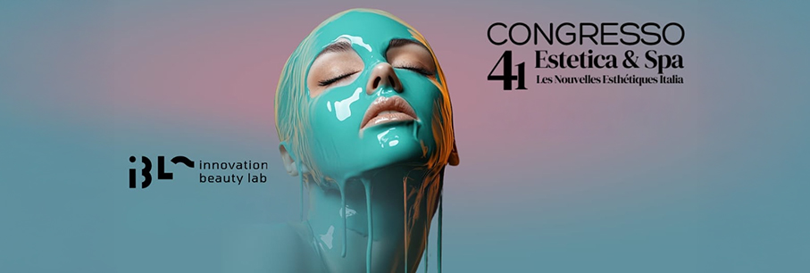
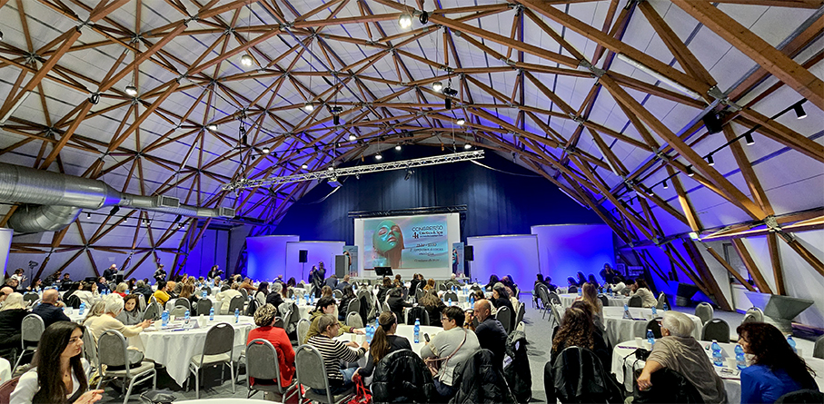
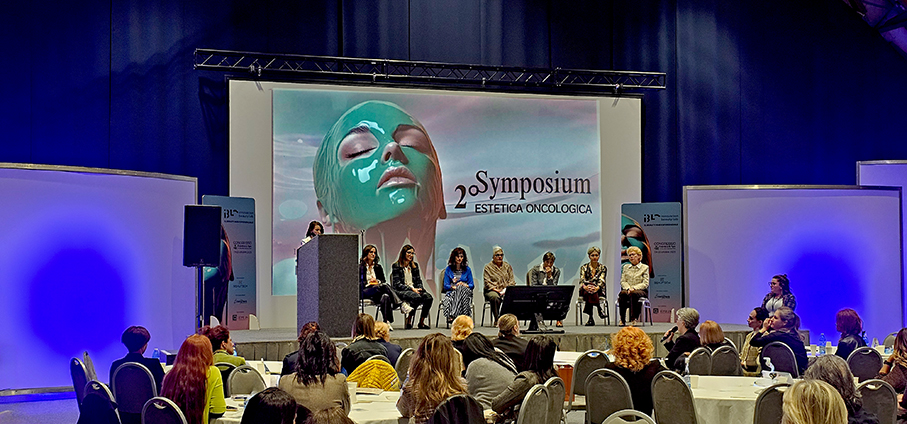
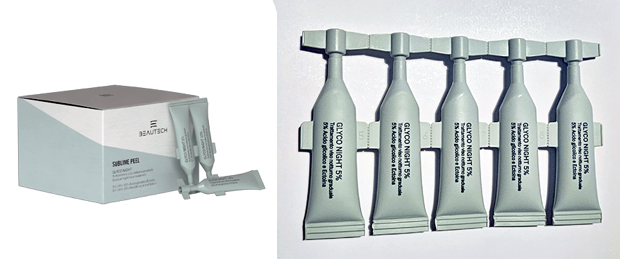
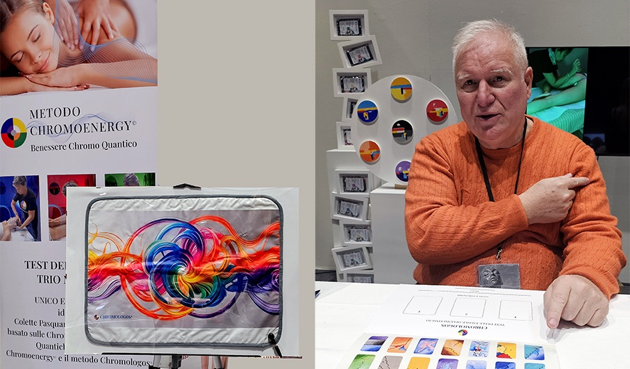
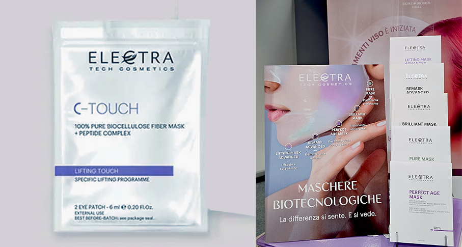
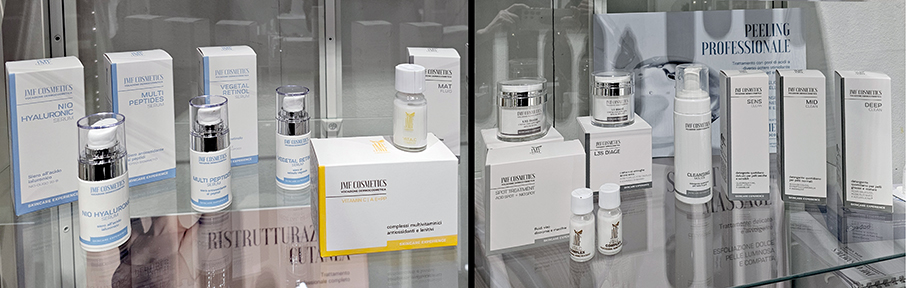
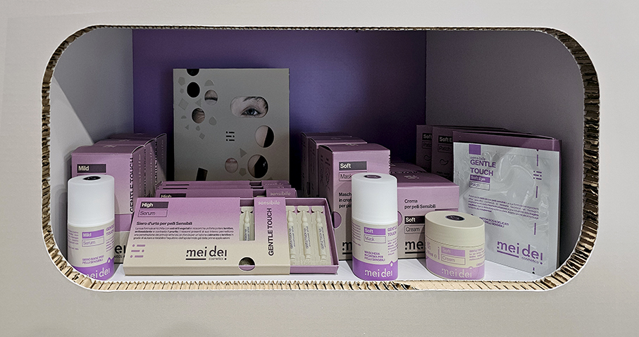
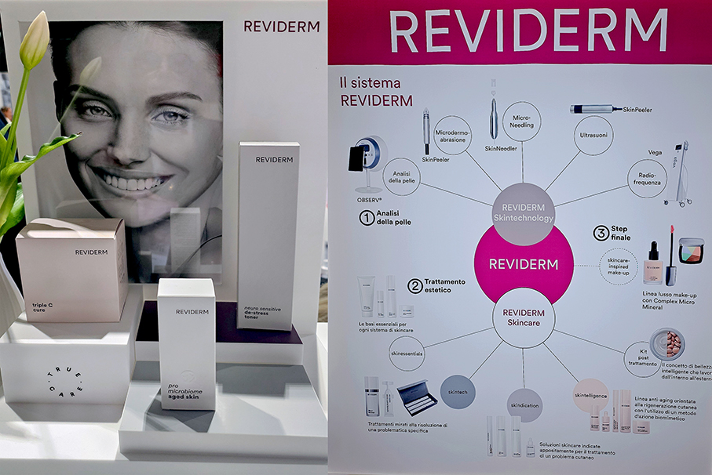
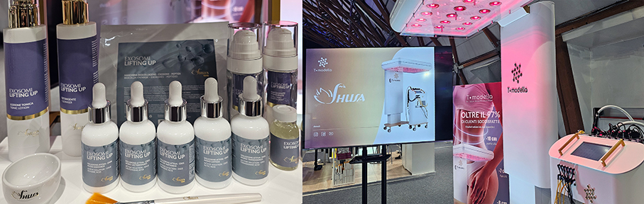

# IBL -  Innovation Beauty Lab 2025

>Si è svolto a Milano il **beauty hub esperienziale** dove il futuro dell’estetica prende vita 

Un evento esclusivo per l’**estetica professionale, beauty & wellness**in un’edizione ancora più esclusiva e innovativa, quella di **IBL Innovation Beauty Lab 2025**, riservata ai protagonisti dell’estetica professionale, della bellezza e del benessere. La manifestazione è pensata e creata per le aziende e i professionisti che non si accontentano di esserci, ma vogliono lasciare il segno.
Secondo i dati di **Cosmetica Italia**, nel 2025 il fatturato del comparto cosmetico supererà i 17 miliardi di euro. Un dato che testimonia la solidità, l’evoluzione e l’impatto economico e culturale del settore.

IBL non è una fiera di massa, ma è un **evento mirato, selettivo**, progettato per favorire connessioni strategiche e incontri ad alto valore. Promosso da **Esthetimedia Group** e **Les Nouvelles Esthétiques Italia**, è l’hub esperienziale strategico dedicato alla cultura dell’innovazione nel settore beauty & wellness. Mette in connessione brand, professionisti, enti formativi e aziende per accelerare lo sviluppo del comparto attraverso ricerca, formazione, eventi e consulenza. Crede nel potere della contaminazione tra scienza, creatività e visione imprenditoriale.

_“IBL Innovation Beauty Lab è pensato per chi, in un mercato denso di sfide, pensa alla crescita e all’evoluzione come a un cardine irrinunciabile. I numeri contano ma non raccontano l’intera storia e non sono l’intera storia. Relazioni vere, contenuti solidi, esperienze che lasciano il segno, opportunità di business concrete, crescita. Questo è l’obiettivo di IBL 2025”_. **Stefano Pennati, founder & direttore generale Esthetimedia Group**.

**Business, formazione & networking** grazie a un programma ricco, di alto livello costruito per un selezionato pubblico di brand, aziende, professionisti della bellezza ed estetiste che credono che **l’eccellenza sia lo standard, non l’eccezione**. Un progetto nato per **anticipare i trend**, valorizzare il talento e costruire nuove opportunità di crescita sostenibile per il settore.
Un appuntamento di riferimento per il mondo dell’estetica e del benessere, che riunisce **imprenditori, brand, professionisti, scuole, operatori, associazioni e istituzioni** per due giornate dedicate a formazione, salute, innovazione, business.

Oltre al celebre **Congresso Estetica & Spa by LNE Italia** – giunto alla 41° edizione – con oltre 20 speech di alto livello e all’area espositiva che ospita oltre 70 marchi, si è svolto il secondo Symposium Estetica Oncologica: _“Il valore dell’estetista nel percorso oncologico”_
La bellezza non è solo estetica: è cura, ascolto, dignità. Alcentro del dibattito il valore dell’estetista come **figura di supporto** nel percorso di vita e di cura dei pazienti oncologici. Un confronto a più voci tra esperti, estetiste specializzate e rappresentanti istituzionali, per riconoscere e valorizzare una professionalità che unisce competenza, empatia e responsabilità sociale. Sono intervenute la **Dott.ssa Carolina Ambra Redaelli**, Presidente APEO, e **Nicoletta Balzarotti**, estetista specializzata, che racconteranno esperienze e protocolli applicativi. 

**EXPERIENCE HUB** 

Un’area espositiva dedicata alle **novità del settore**, un ponte tra innovazione e business che completa l’esperienza. Una selezione accurata di **brand, aziende del settore cosmetico, servizi professionali, start-up e progetti editoriali** dedicati all’estetica e al wellness. Un ambiente dinamico e ispirante, pensato per favorire connessioni reali, sinergie commerciali e confronti diretti tra aziende e operatori del settore. Un’area pensata per valorizzare l’incontro tra domanda e offerta qualificata, creare sinergie commerciali e mettere in luce le realtà più dinamiche e innovative del mercato. 

**BEAUTECH**

Beautech è un laboratorio di ricerca e sviluppo per la produzione di **Cosmetici professionali, Arredamenti sartoriali e Tecnologie innovative** puramente made in italy. Nasce per soddisfare tutti i professionisti di centri estetici, centri benessere e SPA che vogliono fare la differenza. I cosmetici sono dermatologicamente testati, formulati senza l’aggiunta di petrolati, conservanti, parabenici, coloranti chimici, allergeni da fragranza, tensioattivi sles, sls e nichel.

**Glyco Night** è un trattamento viso notturno graduale che fa parte della **Sublime Peel**, la linea dedicata al rinnovamento cutaneo attraverso l’efficacia mirata dei peeling acidi Glicolico, Lattico, Bio-Succinico e Mandelico. Formulazioni intelligenti che agiscono in profondità per esfoliare con precisione, stimolare il turnover cellulare e rivelare una pelle più liscia, uniforme e luminosa. Grazie alla sinergia tra acidi selezionati, attivi lenitivi e tecnologie dermo-affini, ogni trattamento affina la grana cutanea, libera i pori, attenua imperfezioni e discromie, restituendo vitalità e freschezza anche alle pelli più spente o irregolari. 

**CHROMOENERGY**

Il **Metodo Chromologos** di Giuseppe Quartieri si basa sulla capacità dei colori e dell'espressione artistica astratta di poter dialogare con il nostro inconscio scoprendo cosa, in realtà, lui desideri per la nostra vita, in un dato momento della nostra esistenza. Il tutto emerge dal test e successiva lettura delle **Tavole dell'inconscio**. E’ un metodo unico ed esclusivo che aiuta a scegliere i colori non con gli occhi ma con il subconscio, partendo da ciò che conta davvero: noi stessi. Con il test si scoprono i colori specifici da riequilibrare e armonizzare e relative caratteristiche emozionali e psicologiche. 

Con la creazione dei dispositivi, realizzati in partnership con l'azienda **Bioenergy**,  e prodotti **Chromoenergy**, il metodo amplia le possibilità vibrazionali dei colori e la loro possibile applicazione nei trattamenti personali, per trovare il giusto equilibrio energetico, vibrazionale e chromatico, apportando armonia a corpo, mente, spirito e nei  luoghi di vita o di lavoro. L’Esperienza sensoriale Chromologos si avvale di colori, luci, profumi e musica vibratoria Io-In, **stuoia chromoquantica e cerotti chromoenergy**, per sollecitare attraverso i sensi una profonda interiorizzazione e il rilassamento mentale.

**ELECTRA**

Electra Tech Cosmetics rappresenta una linea cosmetica di alta qualità, pensata per offrire **prodotti professionali innovativi ed efficaci** con soluzioni all’avanguardia. I prodotti combinano ricerca avanzata e tecnologie di ultima generazione, garantendo prestazioni eccellenti e sicurezza in un mix perfetto di sensorialità ed efficacia per prolungare e mantenere i risultati ottenuti con i trattamenti professionali. Detergenti, sieri, creme, perfetti alleati per la qualsiasi prodotto sia necessario **per la beauty routine a casa**.

**Eye Patch C-Touch** è una maschera occhi in pura biocellulosa per ridurre rughe, borse e occhiaie, dall’azione lifting immediata. Grazie alla forma a “C” che la caratterizza, questa maschera aderisce perfettamente al contorno occhi e non copre solo la parte inferiore dell’occhio, ma anche la palpebra mobile, veicolando in modo ottimale gli ingredienti funzionali contenuti nel fluido di cui è imbibita. Il trasferimento degli attivi presenti è molto rapido e prosegue per tutto il tempo di posa. Contiene Carnosina e Glucosyl Hesperdin.

**JMF**

I Dermocosmetici JMF, 100% Made in Italy, nascono **direttamente nel laboratorio aziendale**. Questo significa poter scegliere le materie prime, poter garantire un prodotto sempre fresco e poterne seguire tutte le fasi, dalla formulazione al confezionamento. Nella formulazione vengono rispettate le vere percentuali per ottenere la miglior efficacia del risultato e questo è ciò che fa la differenza. I peeling chimici (viso e corpo) si trovano solo nei migliori istituti, mentre altre linee sono disponibili per l’acquisto per continuare la beauty routine anche a casa.

**Vita.C Complex**  è un Kit Vitamin C | AE+PP, un complesso multivitaminico antiossidante e lenitivo che contiene: **Vitamina C**: illuminante, schiarente, antiossidante, normalizzante la pigmentazione; **Vitamina E**: antiossidante, lenitiva; **Complesso di Ceramidi**: componenti base della barriera cutanea epidermica, aiutano a mantenere l’idratazione della pelle; **Insaponificabile di olio di Oliva**: antiossidante, idratante, lenitivo, nutriente.

**MEI DEI**

Secondo Mei Dei, la pelle non vuole più essere sovraccaricata di prodotti che non servono. Non richiede filtri o perfezione. A volte ci comunica il suo stato di malessere con **macchie, arrossamenti, secchezze e inestetismi** della pelle visibili ad occhi. E come rispondiamo a questa chiamata di aiuto della pelle? Con metodo e pochi gesti chiari e semplici, con ingredienti attivi pensati per gli inestetismi più diffusi e con formule che sono pensate per essere modulate e combinate per trovare il miglior trattamento da proporre alle clienti.

La Linea **Gentle Touch** nasce per tutte quelle pelli sensibili e delicate che hanno bisogno di una particolare attenzione. Gli ingredienti attivi inseriti al suo interno hanno forti **proprietà antinfiammatorie e lenitive** che agiscono in profondità grazie alla presenza di **cellule niosomali** che permettono di arrivare in profondità. Un tocco delicato, per tutte quelle pelli che soffrono di iperreattività con screpolature, arrossamento, couperose ed eczemi e che hanno bisogno di essere trattate con prodotti non aggressivi. 

**REVIDERM**

Unisce l’innovazione della **ricerca sui principi attivi** con le conoscenze della **moderna dermatologia**. Il fenomeno della cicatrizzazione e le similitudini con i processi di rigenerazione naturale della pelle hanno fornito spunti di ispirazione per percorrere nuove strade. Con successo. Prodotti per trattamenti estetici strumentali e preparatori, tutti di “qualità made in Germany”, sviluppati e realizzati in stretta collaborazione con scienziati e ricercatori. Leader di mercato a livello internazionale nel campo della skinpeeling.

**Hyaluron hydro balance HD**, ad intenso effetto idratante e rimpolpante, e **ECM repair cream**, crema rigenerante 24-ore fanno parte della linea **Skincare – skintelligence**. Formule preziose che ostacolano l'invecchiamento della pelle e donano elasticità, freschezza e lucentezza alla pelle invecchiata. La linea combatte in modo precoce e preventivo i primi segni visibili dell'invecchiamento della pelle grazie all'intelligente combinazione di principi attivi

**SHUSA**

Propone una cosmesi professionale e da usare a casa per prolungare il trattamento fatto in istituto. **Tecnologie e cosmesi viso e corpo** sono in sinergia per risultati unici. La linea viso** Diamante Giallo** si distingue da tutte le altre linee perché è ricca di **tutte le vitamine** che servono alla pelle per mantenersi attiva e ricettiva. Le vitamine aumentano la vitalità cellulare ed agiscono su tutti i processi vitali della pelle, potenziando l’effetto di altre linee cosmetiche. Sono  in grado di regolare le delicate reazioni biochimiche cellulari connesse con la cute: rigenerazione dei tessuti, loro nutrizione, elasticità, invecchiamento e protezione nei confronti dei radicali liberi.

**T•Modella** è la nuova **piattaforma tecnologica corpo** di Shusa, con 5 tecnologie in 1, per trattare in sinergia e massimizzare i risultati su tutti gli inestetismi del corpo: cellulite, adipe, ritenzione idrica, ipotonia muscolare e rilassamento cutaneo. Offre soluzioni per gli inestetismi corpo ai massimi livelli, ulteriormente potenziati da un **software intelligente e personalizzato** per ogni morfologia. Il primo step per ottenere risultati in estetica è fare un check up della cliente preciso e attento. Con il supporto della bioimpedenziometria del T•Modella, uno strumento altamente affidabile, puoi misurare la composizione corporea del cliente e rilevare dati come massa grassa, massa magra, massa muscolare, acqua intra ed extracellulare e moltissimi altri dati.

