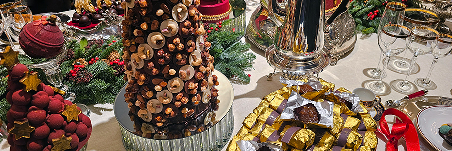
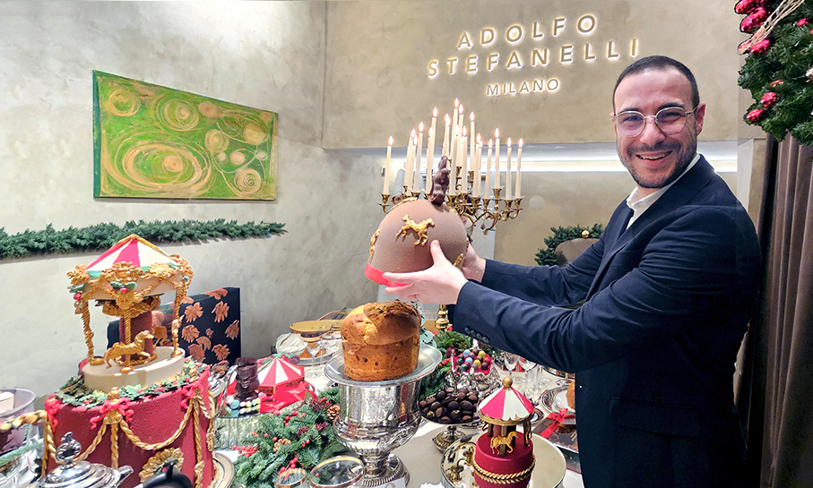
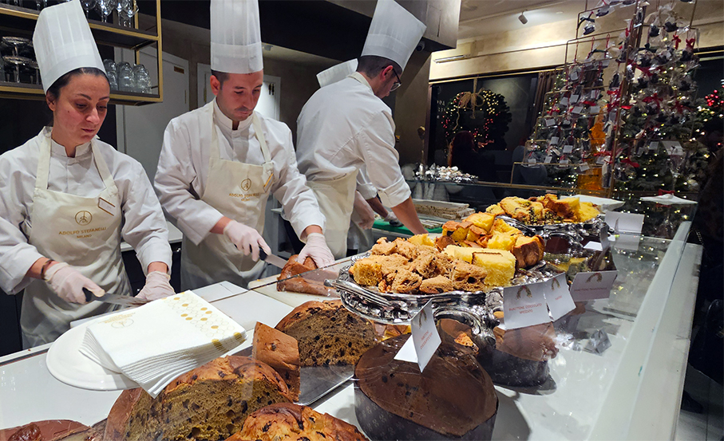
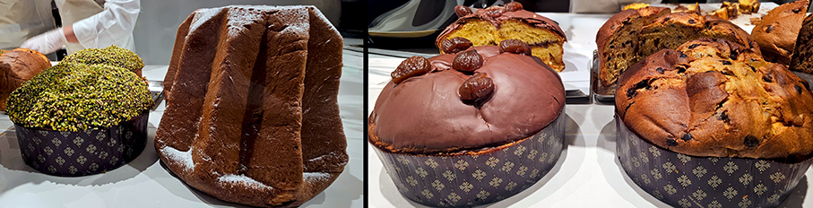
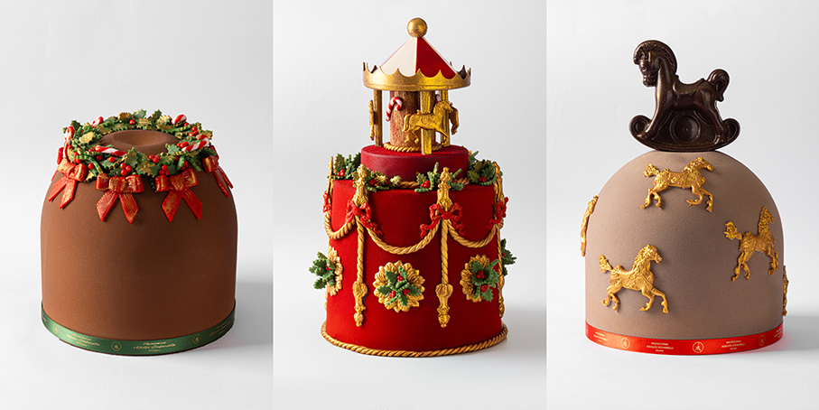
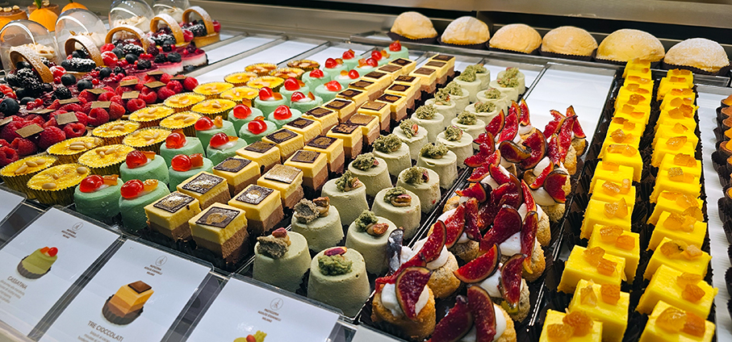

# Il dolce Natale di Adolfo Stefanelli 

>Sembra il laboratorio di Babbo Natale ma è la **Pasticceria di Adolfo Stefanelli**, dove candidi elfi vestiti da pasticceri ci invitano all’assaggio di **strepitosi panettoni, pandori e torroni**

**Nel 2018** Adolfo Stefanelli apre la sua **prima Pasticceria** in viale Premuda a Milano, proponendo i dolci pugliesi di casa. Ma si accorge che la città chiede altro e allora ascolta, osserva, studia e inizia a preparare **Veneziane con la crema, cornetti in stile francese, torte, gelatine di frutta, pasticceria mignon e preparazioni al cioccolato**. Con quest’ultimo ingrediente sperimenta e progetta fino a creare le **praline** che oggi sono una delle sue golosità distintive.

Il suo cioccolato è prodotto nel **Salento**, da una famiglia di artigiani che da quattro generazioni lavora le fave di cacao per creare un preparato eccellente. Anche le **ciliegie** per i boeri arrivano da casa: le raccoglie a mano suo padre e gliele manda. I **fichi**, invece, sono essiccati da sua madre. Il **latte** è di Milano, il **burro** arriva dalla Francia. Per ogni materia sceglie il meglio e si approvvigiona da produttori fidati. Come ci racconta **Adolfo Stefanelli**: “_Quello che creo rappresenta la coccola a fine serata, la magia delle feste, il sollievo delle tristezze. Se il cliente apre un sacchetto e sorride, ho fatto il mio dovere_”.

E poi c’è il **Panettone**, la cui preparazione è considerata da Stefanelli un atto sacro: “_La lavorazione segue la tradizione e ogni volta che viene sfornato e rigirato su se stesso per farlo raffreddare è un’emozione: restiamo tutti per un attimo con il fiato sospeso_”, continua il pastry chef. **Basso, milanese, senza glassa** e con scarpatura tradizionale; canditi semi-canditi, burro, uvetta morbida. Il panettone di Stefanelli profuma, prima ancora di essere assaggiato.

Qui il Natale ha il profumo avvolgente dei **lievitati d’eccellenza**. Ogni impasto racconta una storia di gesti pazienti, lunghe lievitazioni naturali e materie prime scelte con cura assoluta. **Burro bretone, uova freschissime, scorze d’arancia e cedro candito, bacche di vaniglia del Madagascar, miele, nocciola** e zucchero leggero: ogni ingrediente è calibrato per donare un piacere che dura nel tempo, fetta dopo fetta. La mollica si apre in **alveoli regolari, umidi e ariosi**; il morso è carezza, lieve e avvolgente. 

Sono dolci pensati **per gratificare i sensi**, facendo risuonare lentamente la memoria del Natale. Portarli a tavola significa gustare un prodotto straordinario e rinnovare un rito di **gioia, calore, tempo condiviso**.
Tra i lievitati delle feste c’è solo l’imbarazzo della scelta e, durante la **presentazione** delle sue specialità nella **Pasticceria di Via Molino delle Armi** a Milano, Stefanelli ci fa assaggiare **panettoni, pandoro e torrone**, in un negozio addobbato con grande eleganza, come eleganti sono i suoi dolci e i suoi pasticceri.

**Il Panettone Classico** è come tradizione vuole, uvette umide e ciccione, arancia semi-candita morbidissima che si scioglie in bocca, cedro profumatissimo, burro di latte metodo francese, vaniglia Bourbon e miele delle nostre api. Rigorosamente basso come chiede la tradizione milanese

**Gli Speciali** hanno alla base la stessa eccellenza del Classico, arricchita da consistenze e golosità diverse: la morbidezza dell’impasto si intreccia con i sapori della frutta, del cioccolato, del pistacchio o marroni dei canditi. Ogni variante racconta un desiderio di golosità: **Albicocca, Cioccolato spezzato, Cioccolato e pere, Veneziana, Crema Pistacchio**, senza canditi, con crema al pistacchio e fleur de sel, glassato di cioccolato fondente e pistacchi; **Marron Glacé**, con crema di marroni, marroni canditi e glassa al cioccolato.

**I Decorati** sono panettoni tradizionali vestiti a festa per portare a tavola un incanto, svelandosi sotto una cupola di cioccolato finemente decorata, che non intacca la consistenza e i sapori dell’impasto. Sotto la scocca il cuore resta intatto, panettone fragrante, dolce e pieno, avvolto in un manto lucido e compatto, cioccolato che splende come un velo sereno. Proposti in due varianti:

**Il Clichè** si veste di sogno dorato, cavallucci che danzano intorno al candore, un giro di luce sul gusto velato, tra note di zucchero e tocchi di amore.

**La Ghirlanda di Natale** si posa leggera, tra intrecci di pasta che imitano il verde, un cerchio di festa che invita a la sera, dolce corona che il cuore non perde.

**Il Gioiello**, come dice il nome, è il fiore all’occhiello, il re della festa. Un sogno invernale che diventa scultura ed emozione. Il Panettone Gioiello è un’opera di alta pasticceria che rivela maestria e sogno nella danza di un carosello ornato di intrecci, oro e piccoli dettagli fatti a mano. È un dolce maestoso e scenografico che celebra il senso più profondo del Natale. 

**Il Pandoro** è candido come neve appena posata, morbido come una nuvola calda. Il suo profumo è quello di una festa lenta e luminosa. Si scioglie sul palato lasciando una nota rotonda di vaniglia, burro e zucchero a velo che diventa neve. 
Non manca poi la **classica pasticceria, dolci di ogni tipo, il cioccolato, il torrone e anche proposte salate**.

Come modello d’impresa Stefanelli ha scelto di non centralizzare la produzione, ognuna delle sue pasticcerie ha il **proprio laboratorio** dove ogni mattina si monta la panna, si infornano i croissant, si tira la crema, si lucida la frutta fresca. E quando le porte dei negozi aprono, inizia la magia. Le sue pasticcerie non sono solo luoghi di quartiere, sono teatri dell’infanzia che mettono in scena il senso di Stefanelli per il dolce: **consolare, accarezzare, trasmettere gioia**.

_Ph. credits: Maria Rosa Sirotti_