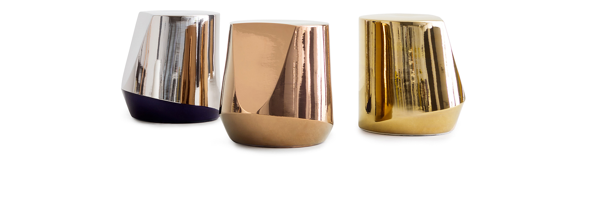
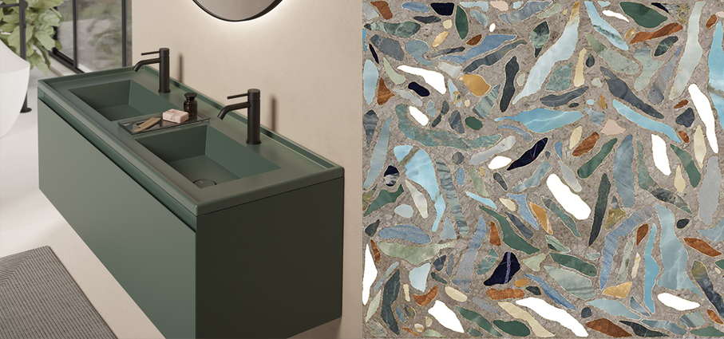
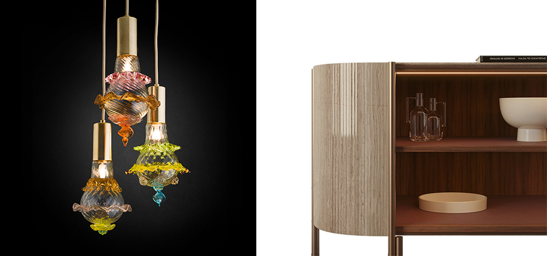
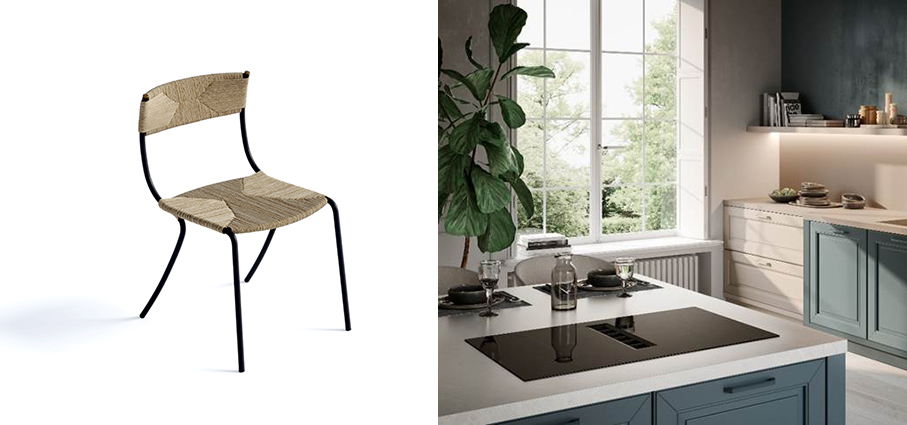
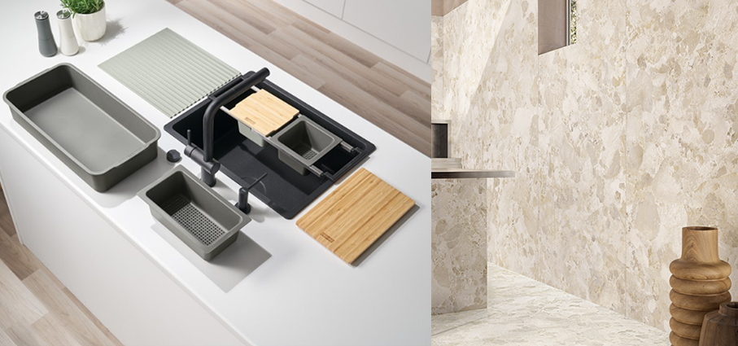
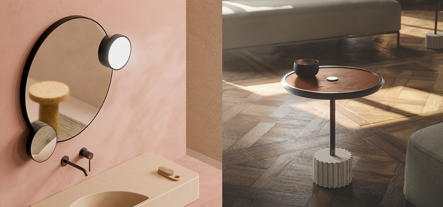
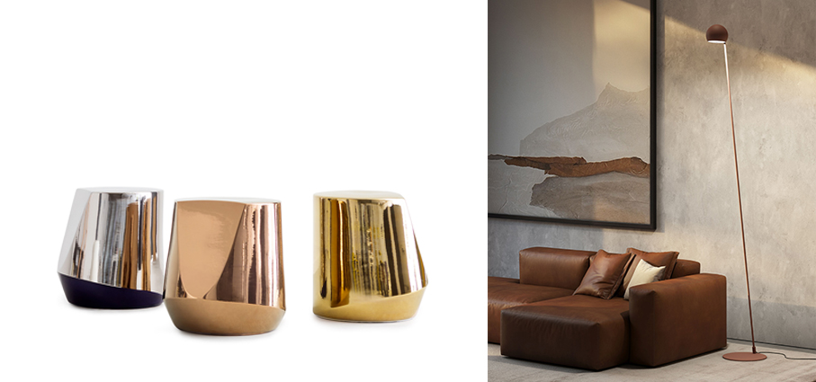
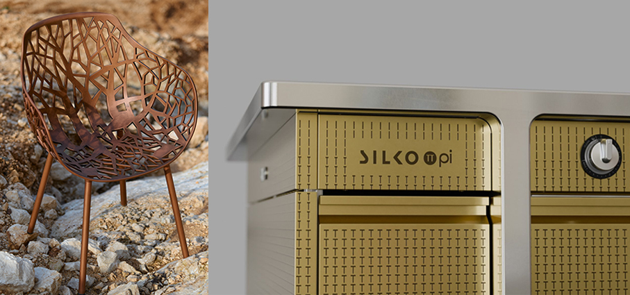

# Il Natale dell’Architetto

>Indecisi sui regali? Tante proposte di **complementi e arredi speciali** per una casa sempre attuale

**Platea - Alice Ceramica** lavabo a incasso verde alpi matt. Una collezione di lavabi a incasso soprapiano dalle linee geometriche e dotati di una pratica doppia profondità. I lavabi sono disponibili in quattro dimensioni differenti e nelle venti soluzioni colore Alice e sono abbinabili con i mobili della linea UNI senza top.

**Precious – Gruppo Bardelli** fa parte della Collezione Colorama linea Decor. Una collezione di piastrelle in grés porcellanato rettificato con finitura opaca, ad impasto colorato nel formato 60x120 cm, spessore 9,5 mm. Realizzate con nuova tecnologia di stampa digitale a freddo. La collezione viene impreziosita da un effetto rilievo delle texture decorative. Utilizzabile a pavimento e rivestimento. 

**Murano Bulb - Multiforme** l’arte del vetro di Murano incontra la forma classica della lampadina che acquista un nuovo valore grazie al linguaggio creativo del designer Marcantonio. Il suo progetto per Multiforme trasforma un’idea semplice in una lampada preziosa e allo stesso tempo pop, piccola nelle dimensioni ma ricercata nei dettagli, che celebra la storia e la simbologia della luce. Ogni Murano Bulb è un pezzo unico realizzato in vetro soffiato decorato a mano con abbinamenti cromatici raffinati e lavorazioni tridimensionali che arricchiscono la superficie, combinando l’antica eccellenza del vetro veneziano con la visione contemporanea e innovativa del design.

**Era – FantiBozzettiMenegon** La forma della madia Era sottolinea l'alta qualità della lavorazione artigianale. Le ante, un marchio di fabbrica, sono costituite da sottili doghe di marmo che scorrono fluide lungo il binario tagliato con precisione, richiamando la sensazione di una scrivania roll-top ma senza gli inconvenienti del delicato vintage. Una volta aperti gli interni sono realizzati in raffinato noce canaletto e pelle bordeaux. Le particolari ante scorrevoli permettono di lasciare la credenza semiaperta trasformandola in un espositore a giorno. Disponibile in otto diverse varianti di marmo.

**Elide - Pianca** è una sedia leggera e funzionale, disponibile in versione con o senza braccioli. La struttura in metallo verniciato nero epossidico si distingue per il profilo sottile e continuo, terminante in due dettagli in ottone. Schienale e seduta sono intrecciati a mano in corda di carta resistente all’umidità, esprimendo un equilibrio tra artigianalità e rigore industriale. Pensata per ambienti indoor combina materiali e finiture in una forma sobria ma distintiva.

**Galileo Ring e Galileo Slim Ring – Faber** due nuovi modelli di piani cottura aspiranti  introducono una serie di innovazioni: nuove griglie per un’aspirazione più efficiente; nuovo filtro antigrasso migliorato e facilmente removibile;  gamma rinnovata di filtri purificatori accessibili dall’alto;  serbatoio d’acqua ridisegnato con doppia valvola e svuotamento rapido; motore di nuova generazione ad alte prestazioni, che consente un flusso d’aria più potente e un funzionamento ancora più silenzioso. Sono pensati per unire prestazioni d’eccellenza e estetica contemporanea in un unico gesto tecnologico, con il Frameless Design in vetro lucido con serigrafia nera opaca. 

**All-In – Franke** il Kit Completo per chi ama cucinare con stile e organizzazione. Un regalo pensato per chi vive la cucina come un vero laboratorio creativo. Il kit All-In include otto accessori intelligenti che trasformano il lavello in una postazione multifunzionale: guida telescopica, tagliere in legno, vaschette di diverse dimensioni e tappetino in silicone arrotolabile. Un alleato impeccabile per organizzare ogni fase della preparazione e per ottimizzare lo spazio con eleganza.

**Levante Pure - Pastorelli** una nuova collezione di superfici diventa una vera e propria esperienza visiva e tattile. Le superfici, in gres porcellanato evoluto, assumono le sembianze di paesaggi vivi che si lasciano attraversare dalla luce e dall’aria, portando negli spazi un dinamismo misurato ed elegante. Dietro la collezione di pavimenti e rivestimenti Levante c’è la rivoluzionaria tecnologia 3D Studio, che Pastorelli, dopo anni di perfezionamento e investimenti ha sviluppato internamente con una tridimensionalità frutto di una perfetta coincidenza tra grafica e struttura. Antiscivollo, è ideale per applicazioni sia residenziali che in aree ad alto traffico.

**Lunaris - Alice** uno specchio dalla forma ispirata – come la stessa collezione – alle fasi lunari: la cornice in acciaio inossidabile verniciato a polveri con finitura nero matt o bianco matt e il profilo curvo e continuo disegnano un oggetto luminoso e contemporaneo. È corredato da due “satelliti” di 20 cm di diametro, che scorrono lungo la mezzaluna superiore e inferiore dello specchio e possono avvicinarsi tra loro. Da un lato, un’illuminazione a luce bianca naturale 4000 K, dall’altro, uno specchio concavo con effetto zoom, ideale per le fasi di trucco o rasatura.

**Roma- Kico** la serie Roma comprende tavolini e servomuti. Questi ultimi sono accomunati da uno specifico particolare: la base tondeggiante che caratterizza le due collezioni: Roma e Roma Antica. Nel primo caso la base è costituita da un cilindro liscio e solido, mentre nel secondo la base rievoca il caratteristico fusto romano segnato da profonde scanalature in pietra. Si tratta di volumi scultorei ed accessori studiati per semplificare i piccoli gesti della quotidianità.

**Haik - Pianca** si presenta come un’armoniosa integrazione di forme geometriche, capace di riflettere e giocare con la luce delle sue bellissime finiture metalliche. L’artigianalità del processo di realizzazione rende ogni pezzo unico. La forza innovativa di questo oggetto per costruzione, forma, materiale e finiture, lo rende un complemento d’arredo fortemente caratterizzante, adatto ad ogni ambiente dentro e fuori casa. Eclettico nella sua interpretazione può essere usato come comodino, tavolino, sgabello.

**Atrax – Zava** nasce come lampada decorativa a sospensione e si sviluppa ulteriormente anche come applique e lampada da terra, caratterizzata da un profilo metallico e una sfera come diffusione. Un design filiforme ed essenziale, racchiude una luce orientabile morbida ideale per creare un ambiente raccolto. Disponibile nei colori, nero, bianco, verde salvia, sahara, grigio seta, rosso mattone

**Forest Limited Edition - Fast** una riedizione della seduta disegnata da Robby Cantarutti & Partners nel 2007, per celebrare trent’anni di storia e di ricerca nel mondo del design outdoor. Per questa edizione speciale, realizzata in 1000 pezzi numerati, la seduta viene proposta in un'inedita finitura effetto rame metallizzato frutto di un meticoloso processo di spazzolatura manuale.

**Pi - De Castelli e Silko**  Una collaborazione che vede  insieme per unire eccellenza artigianale, design e innovazione Made in Italy, con l'obiettivo di valorizzare attraverso i metalli e le finiture firmate De Castelli i prodotti altamente performanti del brand Silko, riconosciuto a livello internazionale per le cucine professionali e le attrezzature per la ristorazione. La superficie non è semplice rivestimento: le speciali lastre frontali in ottone De Castelli, lavorate con una finitura custom a erosione, danno vita a una texture esclusiva ispirata al simbolo del PiGreco, che diventa segno distintivo di un design unico e raffinato

