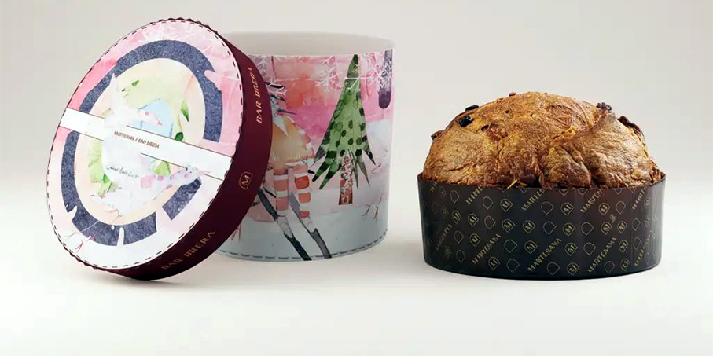
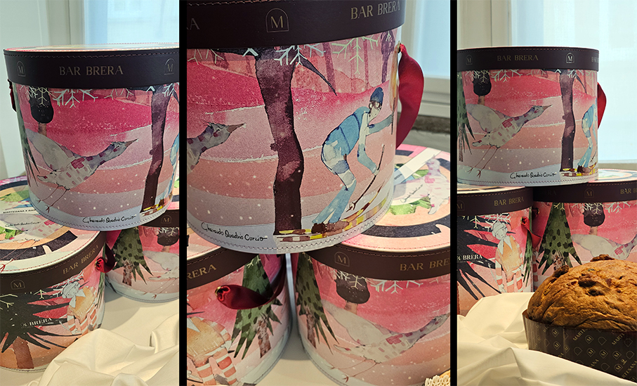
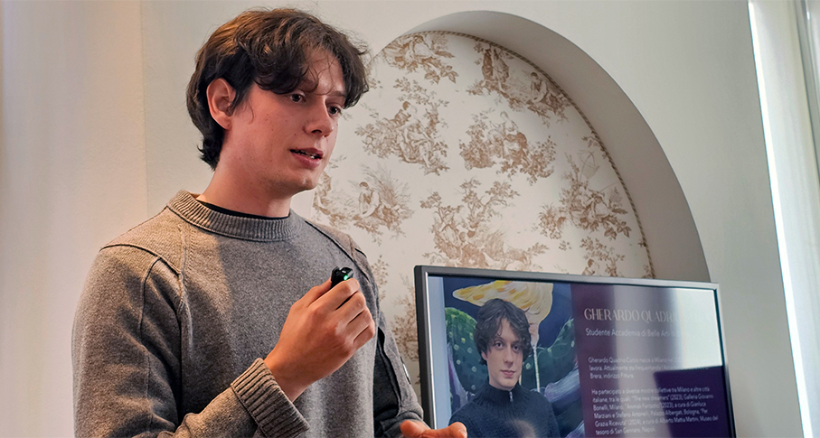
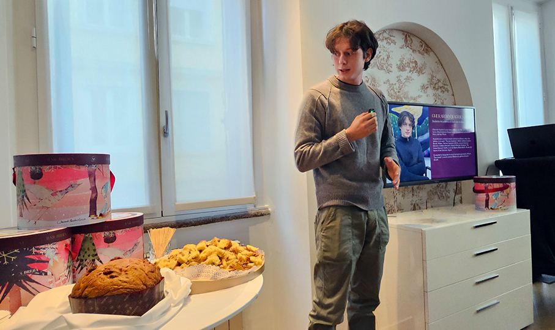
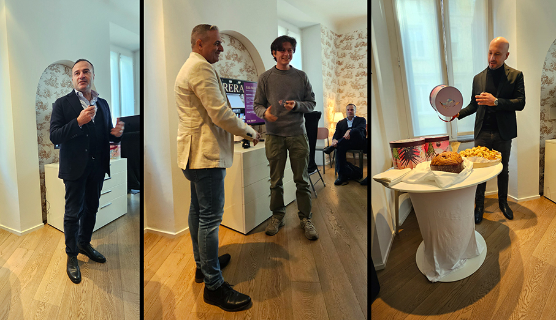
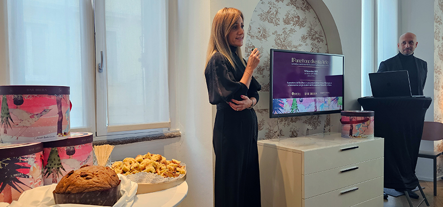

# Il Panettone diventa Arte: Bar Brera e Pasticceria Martesana 

>**Bar Brera e Pasticceria Martesana** insieme con un tributo artistico alle **Olimpiadi Invernali**, per un Natale meneghino tra sogno, cultura e tradizione

In un anno in cui Milano si prepara ad accogliere importanti manifestazioni internazionali e a vivere un inverno di grande vitalità culturale e sportiva, Bar Brera e Pasticceria Martesana celebrano la città con la **seconda edizione del Panettone dell’Arte 2025**. Un progetto che torna a unire **eccellenza artigianale, arte contemporanea e spirito di condivisione**, grazie alla collaborazione con l’**Accademia di Belle Arti di Brera**, e che si inserisce nel più ampio racconto di una Milano creativa, olimpica e profondamente identitaria.

Quest’anno il tradizionale dolce meneghino è avvolto in una **raffinata cappelliera**, che omaggia le prossime Olimpiadi Invernali, illustrata da **Gherardo Quadrio Curzio**, giovane artista dell’Accademia di Belle Arti di Brera, con la supervisione di **Daniele Cardone**, fotografo e Direttore Marketing del Bar Brera. 

Non si tratta di una semplice decorazione, ma di una vera e propria **narrazione visiva**: un paesaggio innevato, sospeso tra realtà e sogno, illuminato dalla luce della fiaccola, che riscalda l’attesa e accende la speranza. Al centro dell’immagine due figure: da un lato lo spettatore, avvolto da sciarpa e cappellino, dall’altro l’atleta in movimento, emblema di **energia creativa e tensione verso il futuro**. 

A guidarli, un grande uccello immaginario, presenza ricorrente in tutte le opere di Curzio, che qui diventa metafora dello slancio creativo, della libertà e della bellezza che uniscono le persone **nel segno dell’arte e dello sport**. Come ci racconta lo stesso **Curzio**: “_Per la composizione ho utilizzato dei ritagli digitali selezionati da acquerelli fatti a mano e poi posizionati sullo sfondo. L’ispirazione è una corsa olimpica, sulla neve, una corsa in cui si sfidano gli atleti e gli uccelli, basata sulla velocità_”. 

Come ci spiega **Cardone**: “_Abbiamo inserito il richiamo ai colori dei 5 cerchi olimpici e abbiamo inserito una decorazione anche sotto alla scatola. Nei tempi della IA i contenuti umani artistici genereranno sicuramente valori aggiunti_”.

Ogni dettaglio ha un significato e nulla è lasciato al caso: i colori scelti — **blu, giallo, nero, verde e rosso** — riprendono i **cinque cerchi** simbolo delle Olimpiadi Invernali, richiamati anche nel coperchio della confezione, suddiviso in sezioni concentriche che evocano movimento, connessione e universalità.

Ma la creatività del Panettone dell’Arte 2025 non è rappresentata solo dalla cappelliera, al suo interno viene custodito un’opera d’arte tutta da gustare. Un **impasto soffice e fragrante**, impreziosito da **arancia siciliana candita, uvetta australiana 6 corone e vaniglia Madagascar** pura in baccelli: una combinazione di ingredienti d’eccellenza che esalta il savoir-faire artigianale di **Pasticceria Martesana**.

“_Siamo profondamente orgogliosi di presentare la seconda edizione del Panettone dell’Arte. In un periodo in cui la tradizione culinaria incontra l'arte contemporanea, questo progetto rappresenta l’essenza del nostro impegno come Bar Brera: non solo un luogo di incontro storico nel cuore del quartiere, ma un ponte attivo tra le eccellenze del territorio_”. Spiega **Liborio Navarra**, AD del Bar Brera. Poi ha aggiunto: “_Il Panettone è il simbolo di Milano e, attraverso la visione poetica di Gherardo Quadrio Curzio, acquista un significato nuovo, diventando un vero e proprio messaggio di bellezza e creatività da condividere in tavola durante le feste. È un tributo al dialogo culturale che anima il nostro quartiere e un invito a celebrare il Natale con gusto e con uno sguardo d’artista_".

Il futuro passa dai giovani e dal saper fare italiano, che sono due fondamenti della Pasticceria Martesana. “_I giovani portano sempre energia all'interno del nostro laboratorio con una isole innovativa d'un sapere antico che diventa attuale, desiderabile e vivo. Il panettone e un simbolo di unione, un omaggio a Milano e alla bellezza che si fa con le mani e col cuore_” conclude **Navarra**.

Il **panettone** sarà acquistabile in esclusiva presso il **Bar Brera in Via Brera 23 a Milano**. Il Bar Brera affonda le sue radici alla fine dell’Ottocento, quando fu fondato come luogo di ritrovo e cultura nel cuore del quartiere Brera a Milano. Più che una semplice location, è considerato un’icona nell’immaginario collettivo. Qui hanno frequentato celebri personalità del mondo della cultura italiano e internazionale, della musica, dell’arte, e ancora oggi è un punto di incontro per giornalisti e scrittori.

Bar Brera, Accademia di Belle Arti di Brera e Pasticceria Martesana non sono sponsor ufficiali dei Giochi Olimpici o Paralimpici.

