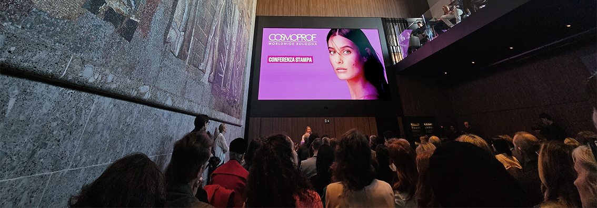
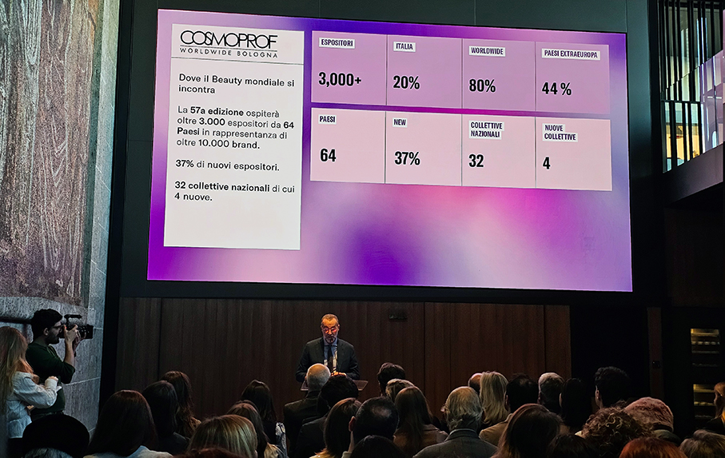
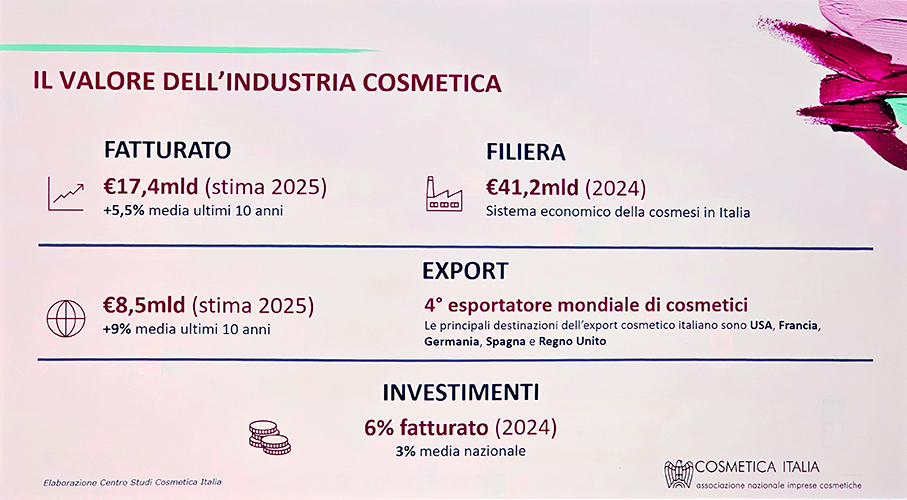
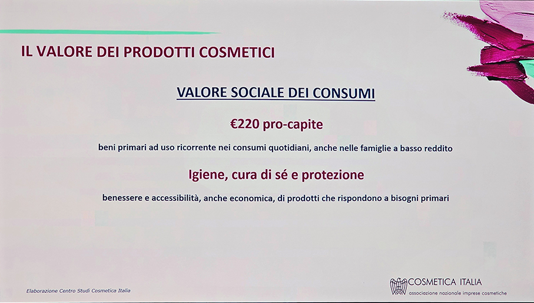
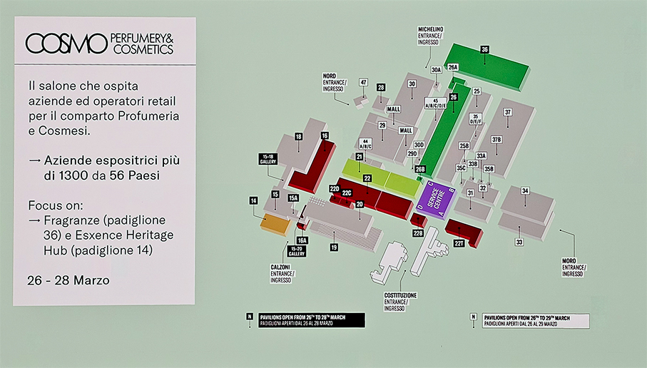
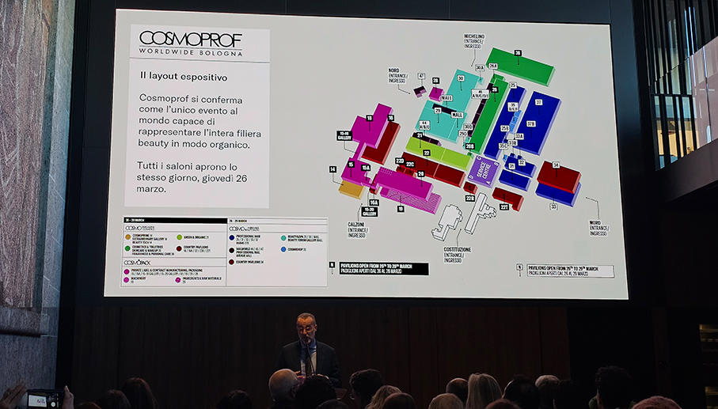

# In attesa di Cosmoprof Worldwide Bologna 2026

>Bologna si prepara ad accogliere la **57ª edizione** Cosmoprof  Worldwide Bologna, in programma **dal 26 al 29 marzo 2026**

Nato oltre cinquant’anni fa e oggi riconosciuto come **hub globale dell’industria della bellezza**, Cosmoprof  Worldwide Bologna è una piattaforma internazionale che connette filiera, mercati e visioni di tutti i protagonisti della filiera cosmetica mondiale, con una partecipazione sempre più globale e trasversale, confermandosi come piattaforma strategica di incontri e relazioni. Una comunità internazionale che cresce, si evolve e condivide una visione comune: **valorizzare la bellezza come linguaggio capace di creare connessioni** tra mercati, culture e persone.

“_Cosmoprof è cresciuto nel tempo ben oltre la dimensione di manifestazione fieristica, evolvendosi in una piattaforma internazionale di dialogo, confronto e costruzione di relazioni di lungo  periodo_”, dichiara **Gianpiero Calzolari, Presidente di BolognaFiere**. “_È il luogo in cui l’industria  beauty globale si incontra non solo per presentare prodotti e soluzioni, ma per interpretare i  cambiamenti del mercato, anticipare le tendenze e costruire connessioni che continuano a generare  valore durante tutto l’anno_”.

Con **oltre 250.000 visitatori attesi e oltre 3.000 espositori** provenienti da **64 Paesi**, in rappresentanza di più di **10.000 brand,** Cosmoprof Worldwide Bologna 2026 registra una manifestazione completamente sold-out. A conferma della capacità dell’evento di attrarre nuove realtà e nuovi investimenti, è particolarmente significativa la quota di **nuovi espositori, pari al 37% del totale**. 

Il profilo internazionale della manifestazione si conferma solido e bilanciato: il **56% degli espositori proviene da Paesi europei, il 20% dall’Italia, mentre il 44% arriva da mercati extra-europei**, a testimonianza del ruolo di Cosmoprof come piattaforma realmente globale. Saranno **32 le collettive nazionali** presenti in manifestazione, realizzate grazie alla collaborazione con istituzioni governative, camere di commercio locali e partner internazionali. 

Accanto alle presenze consolidate dei principali mercati mondiali, l’edizione 2026 vedrà l’ingresso di nuove collettive, tra cui **Arabia Saudita, Belgio, Portogallo e Ungheria**, che contribuiscono ad ampliare ulteriormente la rappresentatività geografica e culturale dell’evento. Il sito Cosmoprof ha registrato un incremento dei nuovi lead provenienti da **Nord America (+28%), Europa (+11%), Middle East (+23%), Asia (+53%) e Africa (+12%)**. 

Cosmoprof si conferma l’unico evento al mondo capace di **rappresentare in modo organico l’intera filiera beauty**, dalla supply chain al prodotto finito, seguendo da vicino l’evoluzione reale del mercato. Nel **Padiglione 20** troverà spazio **Fragrances & Ingredients Zone**, hub strategico dedicato a ingredienti e fragranze per l’industria cosmetica, che favorisce il dialogo tra ricerca, formulazione, terzisti e visione di brand. Nel mondo Cosmoprof, le fragranze assumono un ruolo sempre più centrale nell’esperienza beauty. 

Il **Padiglione 36** si consolida come punto di riferimento per **cosmetica, personal care e profumeria mass market**, mentre la presenza di **Esxence, al padiglione 14**, arricchisce l’offerta con un percorso olfattivo immersivo dedicato alla profumeria artistica e alle nuove espressioni creative del settore. 
Il mercato globale del beauty e personal care conferma nel 2025 una traiettoria di crescita solida e strutturale. A trainare l’espansione sono in particolare i **segmenti premium, prestige e dermocosmetico**, che mostrano dinamiche più vivaci rispetto al mass market, riflettendo un consumatore disposto a investire in soluzioni ad alto valore aggiunto, benessere e cura di sé. 

Anche categorie chiave come **skincare, haircare e fragranze** continuano a registrare performance positive e Fragrances si conferma uno dei pilastri più resilienti e aspirazionali del mercato beauty, con un ruolo sempre più centrale nella creazione di valore grazie a **un’elevata propensione alla spesa e a un legame emotivo forte** con il consumatore. Il comparto si inserisce pienamente nella crescita del premium e prestige beauty, trainato da **innovazione olfattiva, storytelling di marca** e dalla crescente rilevanza delle fragranze come **oggetti identitari e collezionabili**.

