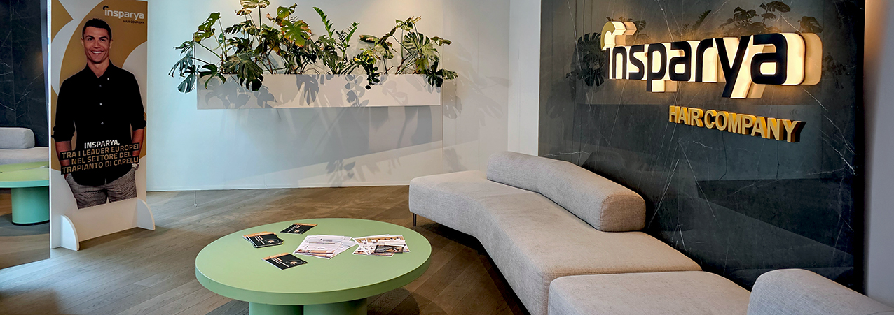
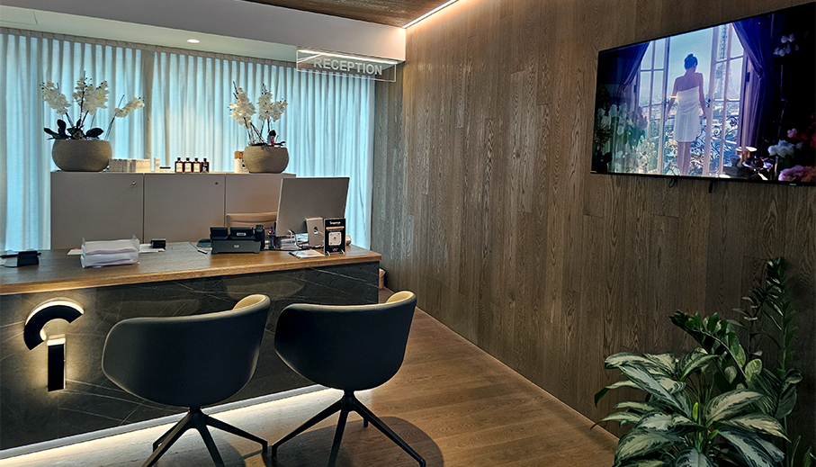
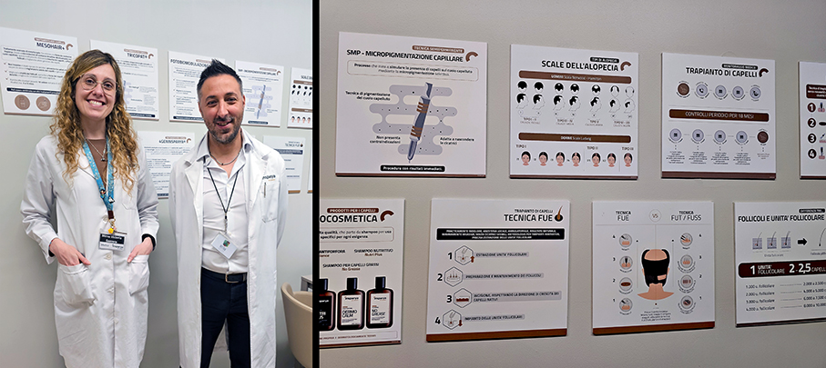
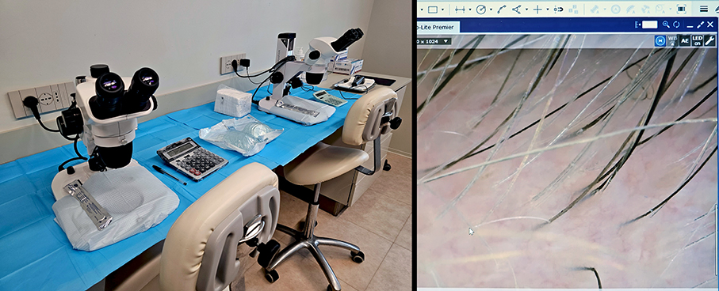
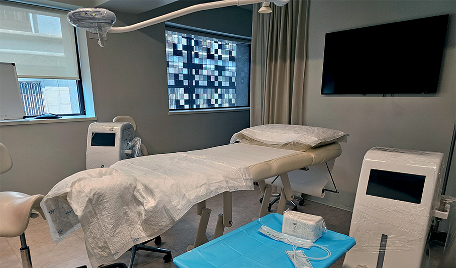
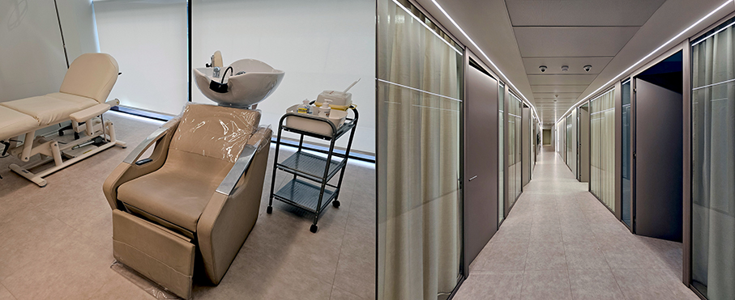
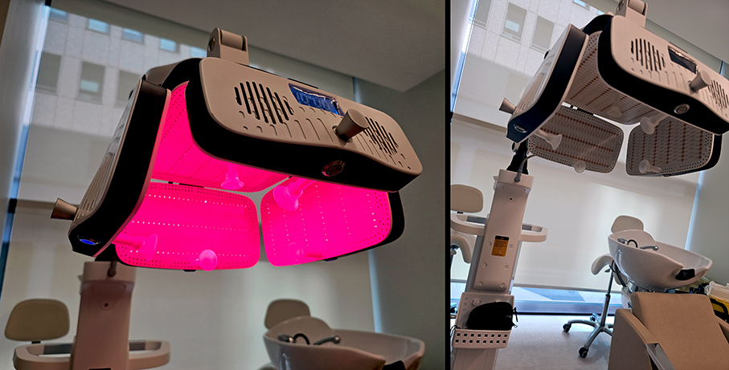
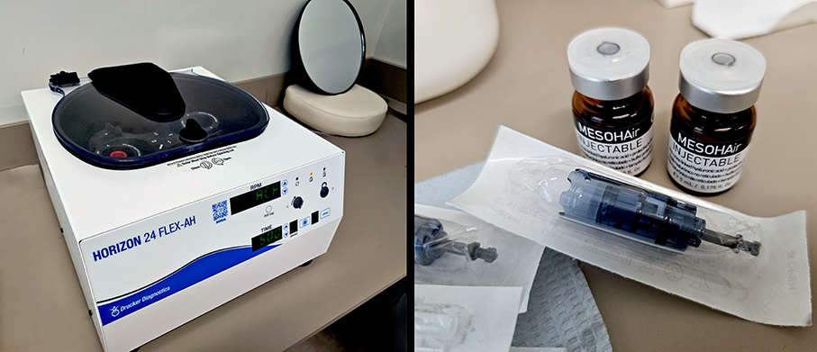
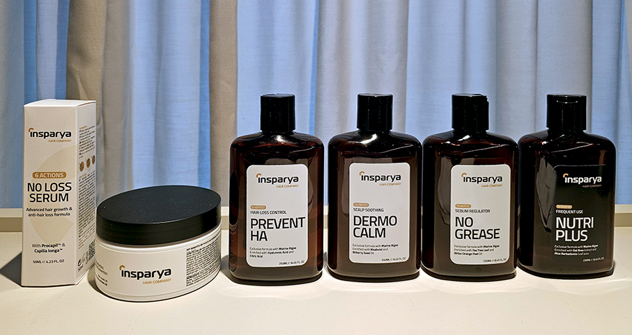

# Insparya – specialisti dell’Alopecia

>Il **Gruppo Insparya è leader europeo** specializzato nella diagnosi, nel trattamento e nella ricerca scientifica **sull'alopecia** 

Fondato da **Paulo Ramos e dalla società CR7 SA**, Insparya ha oltre **16 anni di esperienza e più di 70.000 pazienti** in Portogallo, Spagna, Italia, Arabia Saudita e Oman. Con un proprio dipartimento di ricerca biomedica e tecnologica (**Insparya Science and Clinical Institute**) e un centro di formazione per le sue tecniche esclusive, investe ogni anno oltre 2 milioni di euro. 

Il **Dott. Carlos Portinha, Direttore e Coordinatore Clinico del Gruppo**, guida un team di oltre 400 specialisti: medici, infermieri, consulenti clinici e ricercatori. 
**Insparya Academy** fornisce un rigoroso percorso di formazione per i suoi medici, garantendo standard clinici elevati, competenze specialistiche e padronanza del protocollo **Trapianto Capelli  Metodo Insparya** (TCMI e tecnologie innovative proprietarie). 

Nel centro **Insparya di Milano**, in Via Wittgens 2, si svolgono ogni giorno circa 150 visite mediche e una decina di trapianti. Grazie a **Alessandro Tenace - Sales & Operations Coordinator** di Insparya, ho visitato il centro ottenendo tutte le informazioni. Ho anche eseguito la prima **visita gratuita con analisi del capello**, condotta dalla **Dott.ssa Mirna Victoria Gazzera**, in cui si verificano le esigenze del cliente e l’eventuale possibilità di trapianto, se richiesto. 

I trapianti sono praticati con successo su entrambi i sessi affetti da **alopecia androgenetica**. Durante l’operazione, due medici chirurghi selezionano ed estraggono i bulbi da trapiantare manualmente. Successivamente, tramite **analisi al microscopio**, scelgono i migliori che, nel pomeriggio stesso, saranno **trapiantati sul paziente uno ad uno**. Verificano anche la direzione di crescita del capello all'interno del bulbo, fondamentale in caso di rifacimento della linea frontale. Nei mesi successivi al trapianto, **il paziente è seguito costantemente** con visite di verifica dell’operazione e trattamenti. 

Per chi non può o non necessita di sottoporsi a un trapianto, sono disponibili **trattamenti mirati ambulatoriali** sia per rinforzare il bulbo, sia per ritardare o annullare una eventuale perdita dei capelli. 

**Fotobiomodulazione Insparya (LLLT)**
Trattamento che sfrutta la potenza della luce laser a bassa intensità per stimolare la crescita dei capelli e ripristinare la salute dei follicoli. Ideale per chi soffre di alopecia androgenetica, diradamento dei capelli o per chi si trova nella fase di recupero dopo un trapianto di capelli. Una soluzione efficace e indolore.

**MesoHAir+**
Trattamento avanzato di mesoterapia che utilizza una formula esclusiva Insparya. Grazie a microiniezioni di
sostanze bioattive direttamente nel cuoio capelluto, stimola la crescita dei capelli, rafforza i follicoli e migliora la salute generale dei capelli.

**ActivePlasma Insparya**
Trattamento di medicina rigenerativa basato sull’estrazione del sangue dal paziente stesso, successivamente processato per concentrare le piastrine e seguito dall’iniezione del plasma arricchito nel cuoio capelluto. Essendo un trattamento autologo, che utilizza il sangue del paziente stesso, è completamente naturale, favorendo la rigenerazione dei capelli in modo sicuro ed efficace.

Parallelamente, il Gruppo Insparya propone una routine quotidiana con una **linea hair care domiciliare** a portata di tutti:

**NutriPlus, Dermocalm, No Grease, Balance e Prevent HA** gamma di shampoo adattati alle diverse esigenze dei capelli e del cuoio capelluto, progettati per garantire un cuoio capelluto pulito, equilibrato e privo di impurità.

**No Loss Serum** in caso di alopecia androgenetica maschile e femminile, la forma più comune di perdita dei capelli, agisce per ridurre l’impatto dell’ormone DHT sul follicolo, migliorare la microcircolazione del cuoio capelluto e proteggere dai danni dello stress ossidativo. Contiene vitamine, minerali, amminoacidi, estratti vegetali e peptidi bioattivi tra cui Procapil e Capilia Longa. Adatto anche per assottigliamento progressivo o perdita di densità. 

**Protect Mask 7 Actions** maschera multifunzionale per proteggere la fibra capillare grazie a: idratazione intensa, protezione termica, protezione ai raggi UV, protezione dall’acqua di mare, preservazione del colore, azione antiossidante e prevenzione delle doppie punte. Olio di Abissinia e burro di Murumuru creano uno strato lipidico protettivo che migliora idratazione, elasticità e resistenza del capello.

_Ph. Credits: Maria Rosa Sirotti_

**INSPARYA HAIR MEDICAL CLINIC ITALY**
Via Fernanda Wittgens, 2 - 20123 Milano (MI) 

