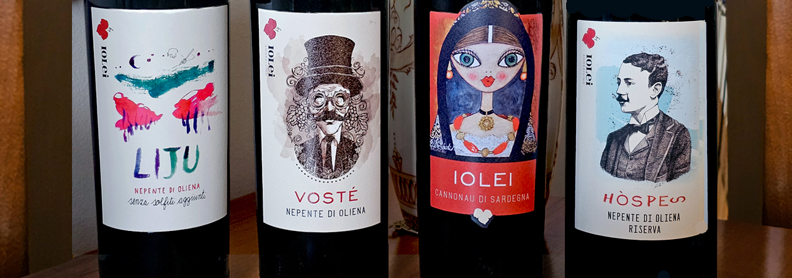
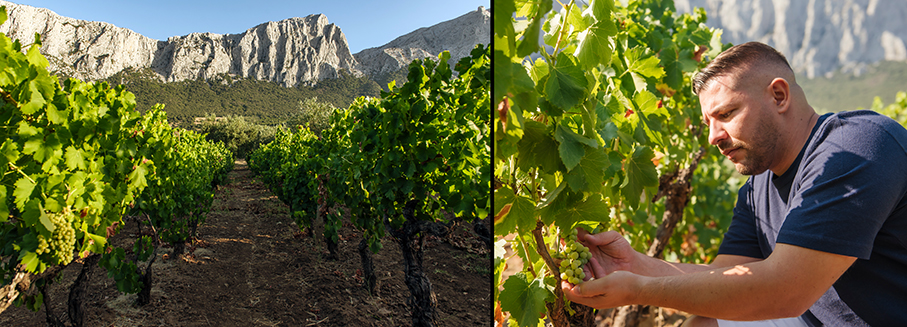
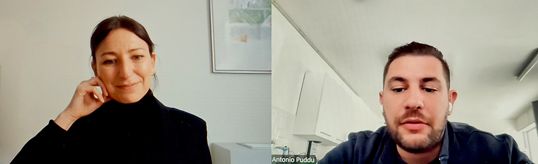
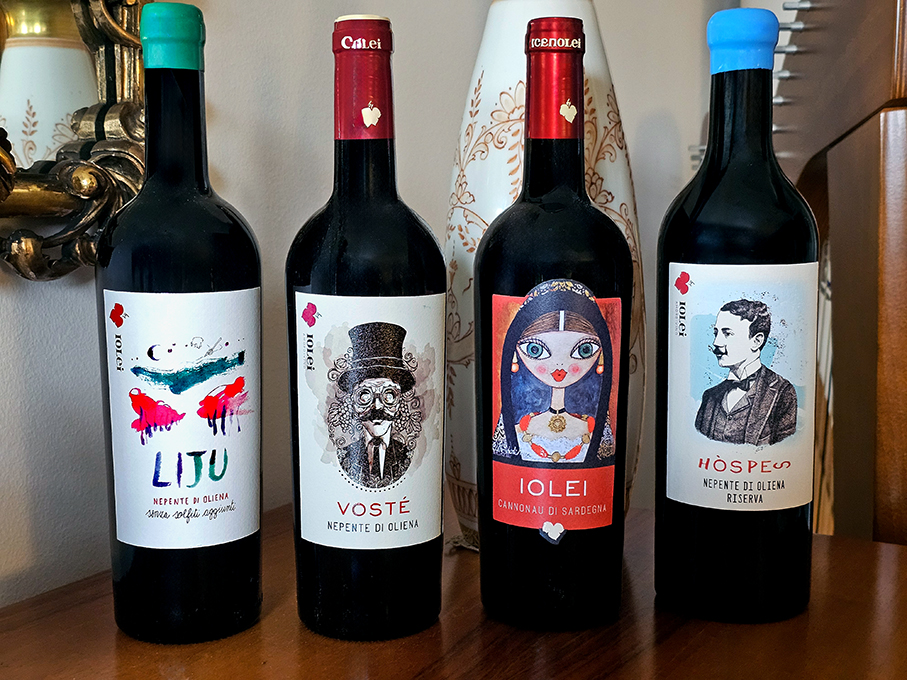
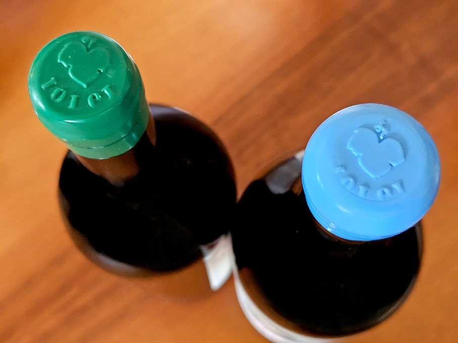
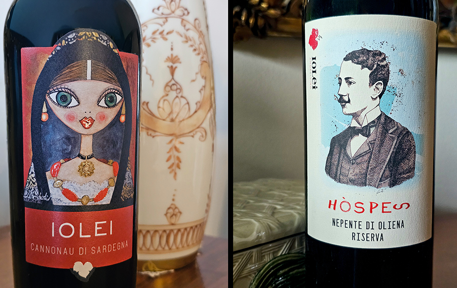
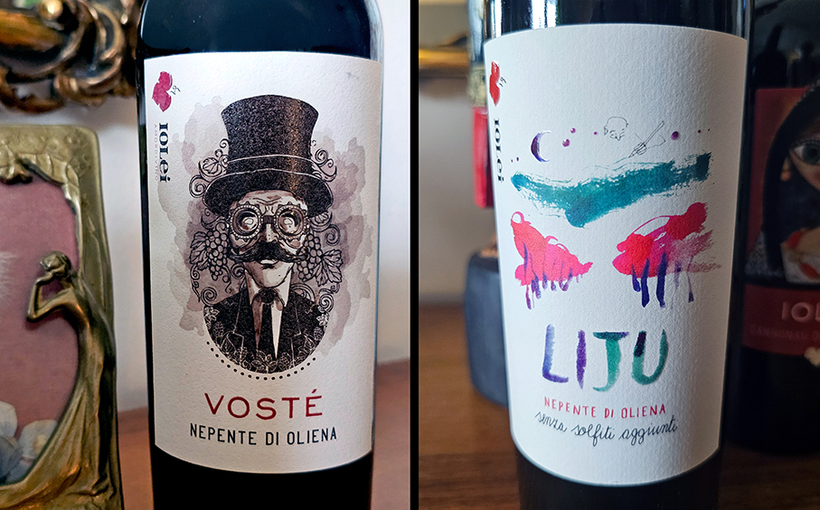

# Iolei Winery – il Cannonau contemporaneo

>A **Oliena in Sardegna**, una piccola cantina di famiglia produce **vini autoctoni con sensibilità moderna** 

di _Maria Rosa Sirotti_

Iolei è una piccola **realtà familiare situata a Oliena** (Nuoro), nel cuore di una delle zone più vocate per la produzione del **Cannonau di Sardegna**, la sottozona del **Nepente di Oliena**. Dal 2015 l’enologo **Antonio Puddu**, la moglie Simona e le sorelle Chiara e Sara, mamma Luisella e papà Salvatore coltivano l’amore per la Sardegna e per il vino figlio di queste terre. 

Fin da bambino, Antonio si appassiona alle viti e al vino, tanto da farne un lavoro. Dopo il diploma al prestigioso Istituto Agrario di San Michele all’Adige (Trento) e la laurea in Viticoltura ed Enologia all’Università degli Studi di Trento, **Antonio crea Iolei Cannonau di Sardegna Doc**, etichetta primogenita dell’azienda, **nel 2015**. Da qui avrà inizio l’avventura di Iolei e della sua interpretazione del Nepente di Oliena.

**Chiara**, sorella di Antonio, unisce la formazione accademica in **ambito economico** a una profonda dedizione al mondo agricolo e alla viticoltura. 
Dopo la laurea in enologia e diverse esperienze in Italia e all’estero, **Sara** inizia a lavorare nell’azienda di famiglia e **crea la linea Senza Solfiti**, l’ultima nata di Iolei. **Salvatore** (Tore) incarna l’amore per la **coltivazione della vite**, pratica introdotta a Oliena secoli fa. 

Come ci racconta Antonio, l’approccio di Iolei è moderno e contemporaneo e predilige **vini di pronta e facile beva**. L’azienda ha puntato a sdoganare la percezione del Cannonau, cercando di alleggerirlo e di contenere il **tenore alcolico a non più di 14,5** ottenendo così dei vini freschi. La vite è allevata ad alberello libero e **l’80% della produzione affina in acciaio inossidabile**. Il legno è destinato solo alla riserva. Quest'anno è stata introdotta anche l’**anfora**. Questa scelta riflette l’impegno a preservare le caratteristiche uniche di ciascun vitigno. 

La produzione di Iolei si focalizza sul **Nepente di Oliena** e sulle altre varietà tradizionali come il **Vermentino**. Il primo a rimanere stregato da questo vino fu **Gabriele D’Annunzio** durante un suo viaggio in Sardegna e, per questo motivo, lo troviamo raffigurato su alcune etichette. L’azienda produce attualmente **80.000 bottiglie** all’anno che vengono chiuse ermeticamente con la **gommalacca**, in modo da ridurre l'ingresso di ossigeno.

Il microclima di Oliena, determinato da diversi fattori come la presenza del massiccio calcareo del **Monte Corrasi** e la vicinanza al mare, si distingue per le **importanti escursioni termiche** tra il giorno e la notte, che favoriscono la sintesi di composti aromatici e polifenoli che contribuiscono ad aumentare la qualità delle uve e dei vini. Il terreno è caratterizzato da quattro substrati diversi: **basalto, granito, scisto e calcare**. Il suolo, invece, è composto da una parte **calcarea** e da una a disfacimento **granitico**.

**Tra i vini in produzione citiamo:**

**Iolei Cannonau di Sardegna D.O.C.**

Iolei non è solo il primogenito, è anche il vino più rappresentativo dell'azienda. Nasce dopo un'accurata selezione delle uve, vendemmiate rigorosamente a mano, nella prima decade di Ottobre.  In etichetta, un dipinto che ritrae una donna con il costume tradizionale di Oliena. Un Cannonau in purezza. Aromi di ciliegia, alloro fresco, bacche di mirto e chiodi di garofano. Al palato ha una buona acidità, è avvolgente ed equilibrato, tannico e ben bilanciato

**Hospes Nepente di Oliena Riserva Cannonau di Sardegna D.O.C.**

Hospes, dal latino “Hospes,itis: Ospite” in memoria dell’ospitalità che Oliena offrì a Gabriele D’Annunzio. In etichetta una rivisitazione del ritratto di D’Annunzio da ragazzo. Hospes proviene dalla migliore selezione delle uve e viene prodotto solo in annate particolarmente favorevoli. Effettua la fermentazione a temperatura controllata in acciaio, dove sosta per i primi mesi. Successivamente prosegue il suo affinamento in tonneaux di rovere francese a grana fine da 700 litri per 18 mesi. Il colore è di un profondo rosso rubino, mentre al naso si presenta intenso e persistente, con sentori di frutta rossa matura, liquirizia e vaniglia, con un finale morbido e avvolgente. Note di macchia mediterranea.

**Vostè Nepente di Oliena Cannonau di Sardegna D.O.C.**

Voste è un Cannonau su terreno calcareo ed è più fruttato.  Il nome deriva dal voi che si dà in segno di rispetto. In etichetta, una caricatura di Gabriele d'Annunzio. Ha affinamento in acciaio e in cemento, 20% a grappolo intero all'interno del serbatoio calandola dall'alto ed evita la frantumazione del raspo. Rosso rubino con riflessi violacei, al naso esprime note di ciliegia, more e lampone con piccoli accenni di mirto e macchia mediterranea. Un vino secco, morbido e avvolgente con un tannino setoso ed elegante, di grande equilibrio e persistenza. 

**Liju Nepente di Oliena Senza Solfiti Aggiunti Cannonau di Sardegna D.O.C.**

Dalla lingua Sarda Liju: liscio, un vino dalla finezza aromatica e dalle sensazioni vellutate. Nasce da una selezione delle migliori uve raccolte a mano in piccole cassette. Viene effettuato il raffreddamento dei grappoli, posti per una notte in cella. Il colore è rosso rubino intenso, all’olfatto si distinguono note floreali delicate che si armonizzano con sentori di frutta fresca rossa, mirtilli selvatici, frutti di bosco e prugna sotto spirito. Armonico ed equilibrato, in bocca stupisce per un finale piacevolmente morbido. 

**Iolei Winery**

Via Nuoro 47

08025 Oliena | Nuoro

Sardegna | Italy

www.iolei.com

