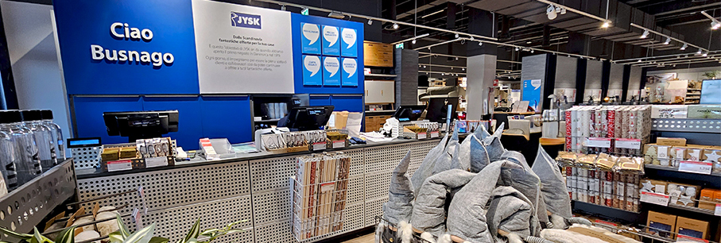
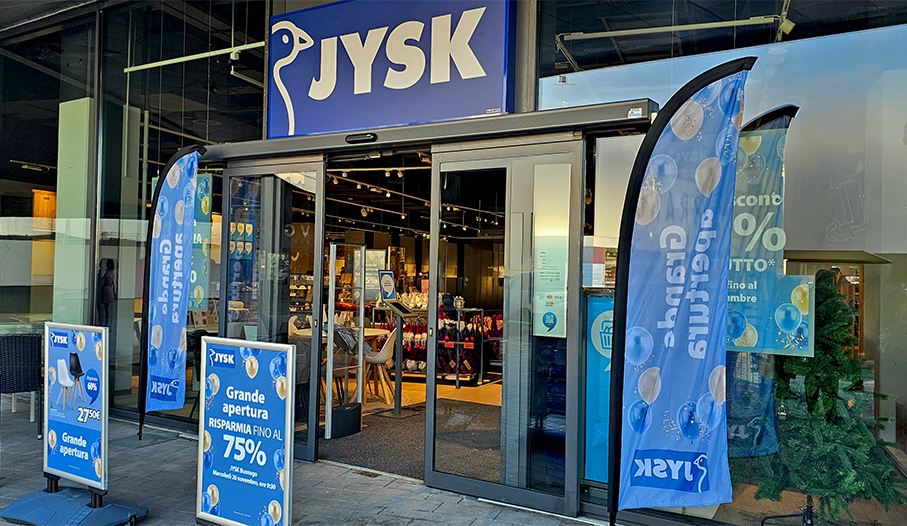
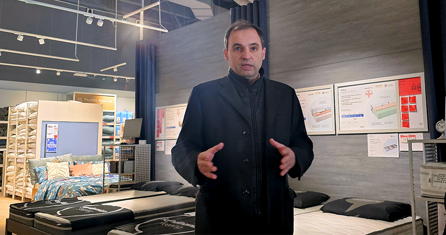
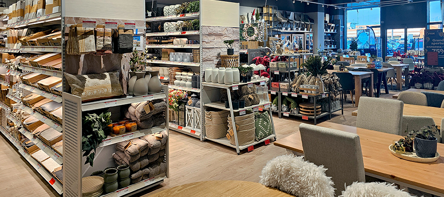
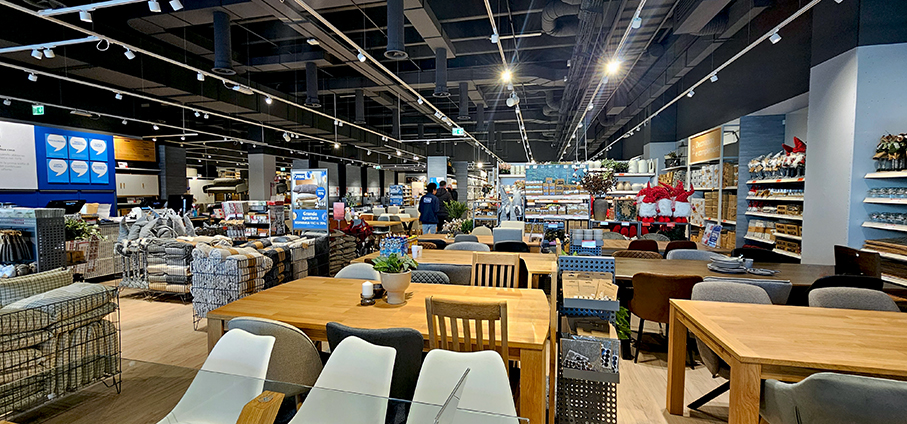

# Jysk al Centro Comm. Globo - Busnago

>Uno dei sedici punti vendita in Lombardia della **catena danese di articoli per la casa** in puro stile scandinavo trasloca a **Busnago**

JYSK **Scandinavian Sleeping & Living** è una catena danese di articoli per la casa in stile scandinavo che ha inaugurato 26 novembre a **Busnago** uno dei suoi sedici punti vendita in Lombardia, dopo il trasferimento da Trezzo sull’Adda. La riapertura all’interno del **Centro Commerciale Globo**, in via Italia 197, in una posizione più strategica, riflette una scelta maggiormente in linea con il potenziale bacino dello store e con le nuove dinamiche del territorio.

In occasione dell’inaugurazione prevista per le ore 9.00, JYSK accoglie i suoi clienti con un evento speciale. Per l’occasione è stata pensata una **promozione eccezionale, valida fino al 3 dicembre: sconti fino al 75% su oltre 2000 articoli** selezionati per la casa, tra cui mobili, tessili, complementi d’arredo, cuscini, materassi e biancheria da letto. 

**Cesare Bailo, Amministratore Delegato e Country Director di JYSK Italia**, accoglie per l’occasione la **stampa di settore**: “_Siamo molto felici di riaprire il nostro store in una nuova location. La scelta del trasferimento nasce dall’esigenza di disporre di una metratura più ampia, in linea con il nostro attuale concept di negozio e con l’esperienza d’acquisto che desideriamo offrire ai nostri clienti_”, ha dichiarato “_Una volta deciso di spostarci, puntiamo sempre a farlo in meglio: per questo abbiamo scelto il Centro Commerciale Globo, una posizione che riteniamo maggiormente in linea con il potenziale bacino del punto vendita e che rappresenta un passo naturale nella nostra crescita, per essere dove i nostri clienti vivono, si incontrano e fanno acquisti ogni giorno_”.

Anche JYSK Busnago è stato progettato secondo lo **Store Concept 3.0**, una nuova concezione degli spazi che interessa **tutti i nuovi negozi JYSK** a livello internazionale e che offre ai clienti maggiore ispirazione e una moderna esperienza di acquisto. Il layout rende più facile ‘navigare’ tra i corridoi e orientarsi tra le **proposte in puro stile scandinavo**. Tra queste, nello store JYSK di Busnago si possono scoprire tutte le novità della collezione **Nordic Mood Christmas** che si ispira alle radici scandinave del brand e al verde intenso delle foreste di pini nordici. La nuova collezione natalizia porterà un’atmosfera calda e magica in casa, aiutando a creare un ambiente domestico vibrante in puro **stile hygge**, espressione tipicamente danese, si pronuncia hüghe - con l’h iniziale un po’ aspirata – che rappresenta la ricerca di una **felicità quotidiana**, una filosofia di vita basata sulla sensazione di benessere, comodità e sul senso della condivisione.

Nell’ultimo anno JYSK Italia ha raggiunto **quindici anni di presenza su tutto il territorio nazionale** in tutte le venti regioni del Paese, con **106 negozi e oltre 900 dipendenti**. Tra i riconoscimenti ottenuti, spiccano **Top Employer** e quello per la parità di genere. JYSK conosce bene il valore della sua forza vendita, che è anche uno dei motivi del suo successo a tutte le latitudini.
Emblema del puro stile scandinavo, JYSK Italia ha recentemente conquistato il **terzo posto nella categoria “Arredamento Living e Soggiorno”** tra le realtà che offrono un servizio clienti d’eccellenza, secondo l’indagine Italy’s Best Customer Service 2025/2026, realizzata dall’inserto L’Economia del Corriere della Sera insieme a Statista, la business platform numero uno al mondo, fornitore leader di dati di mercato e di consumo, che ha recentemente aperto una filiale a Milano.

Nell’anno finanziario 2024/25, JYSK Italia ha ottenuto il proprio miglior risultato, con un **fatturato di 152,3 milioni di euro**, che rappresenta un **incremento del 24,5% sull’esercizio precedente** e nello stesso periodo (1° settembre 2024 - 31 agosto 2025) ha **aperto 14 nuovi negozi** e, in totale, ha realizzato 19 interventi sui negozi tra trasferimenti in nuove location, ampliamenti di negozi esistenti e restyling al più recente store concept 3.0.

**JYSK BUSNAGO**

Indirizzo: c/o Centro Commerciale Globo, via Italia 197, 20874 Busnago, MB

_Per maggiori informazioni sui prodotti JYSK:_ **JYSK.it**

_Per maggiori informazioni sull’azienda JYSK:_ **JYSK.com**

