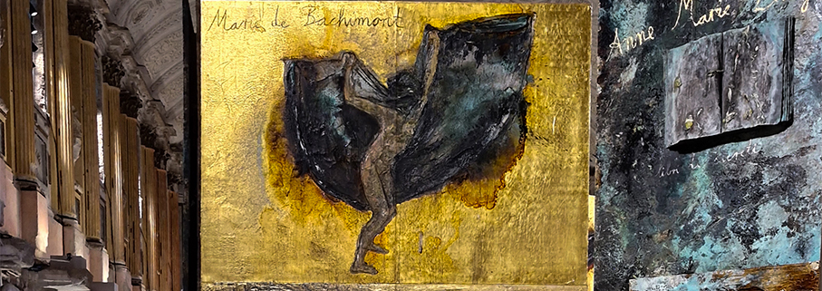
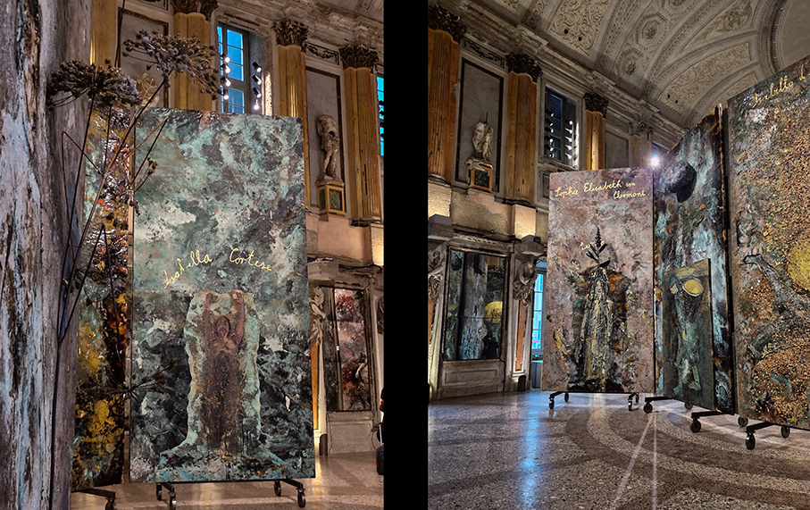
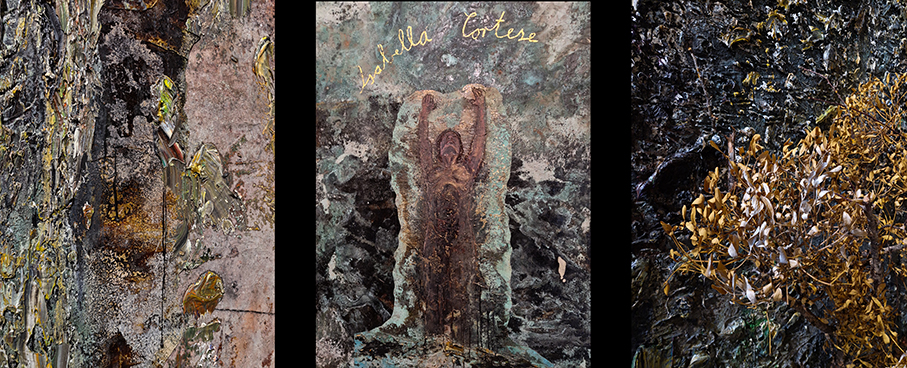
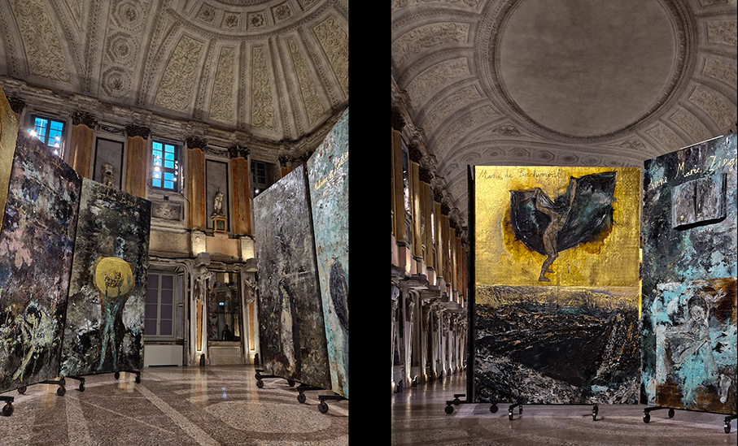
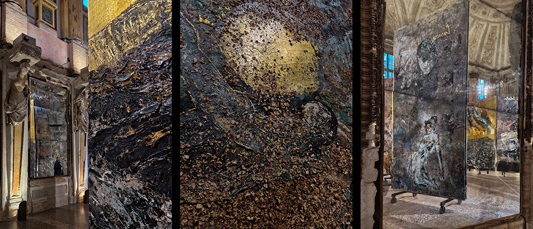

# Kiefer. Le Alchimiste

>La nuova opera di **Anselm Kiefer** concepita appositamente **per Palazzo Reale**: 42 imponenti teleri dedicati alle alchimiste

Nella **Sala delle Cariatidi** - Palazzo Reale- Milano, **dal 7 febbraio al 27 settembre 2026**, Anselm Kiefer, tra le figure più autorevoli dell’arte contemporanea internazionale, rende omaggio alle **alchimiste** con un nuovo ciclo pittorico concepito appositamente per Palazzo Reale. 
I **42 teleri**, dedicati a quelle donne che attraverso l’alchimia hanno dato un contributo fondamentale alla nascita della scienza moderna, dialogano con l’architettura della **Sala delle Cariatidi**.

I grandi dipinti delle **Alchimiste**, concepiti come un’opera unica **profondamente simbolica**, intrecciano temi centrali nel lavoro dell’artista: **mito, storia, memoria collettiva, identità, distruzione e rigenerazione**. La pittura diventa linguaggio alchemico: ogni quadro si offre come atto di resurrezione con un volto che emerge, un racconto, una materia che si trasfigura. Kiefer invita così il visitatore a immergersi in **un percorso emotivamente coinvolgente**, quasi iniziatico. Kiefer riesce a ridare voce, corpo e autorità a un sapere femminile a lungo rimosso, sottraendo le alchimiste a secoli di damnatio memoriae e riconoscendo nel loro operare una profonda affinità con il proprio processo creativo.

 una pittura materica e fortemente simbolica, l’artista rende visibile ciò che è stato sepolto: **corpi e volti femminili emergono dalle macerie** come presenze potenti e perturbanti, lontane da ogni idealizzazione. Le opere stesse si configurano come veri e propri **laboratori alchemici, in cui piombo, zolfo, ossidi, oro, fiori e cenere compiono la loro trasformazione**, sottoposte alla violenza della fiamma ossidrica, cosparse da una materia corposa a tinte plumbee, da dove **affiorano via via i corpi e i volti delle alchimiste**. 

Eroine o streghe? Angeli o demoni? Proto-scienziate o ciarlatane? Le Alchimiste erano **donne sapienti, dotate di una grande intelligenza intuitiva** e di rigore, visionarie e resilienti, ma forse anche per questo marginalizzate, **perseguitate e talvolta condannate** dalla cultura dominante.
«_Di questi meriti_ – sottolinea la curatrice **Gabriella Belli** nel saggio di catalogo,_ – _di queste competenze al femminile, e del rumore delle voci delle donne, quando rivendicano i loro talenti, parla la mostra, in uno sconfinamento continuo con un tema più generale e ancora più importante. È il tema della rigenerazione, della cura, della spoliazione dai pregiudizi, della congiunzione dei principi opposti, della luce e delle tenebre, del rapporto maschile- femminile, del bene e del male, della vita e della morte, in una discesa all’oscurità dell’ignoto alchemico ma anche in una risalita alla luce della ragione e della scienza, a cui la pittura di Kiefer dà voce esemplare_».

Promossa dal **Comune di Milano-Cultura** e prodotta da **Palazzo Reale** e **Marsilio Arte**, con il contributo di Gagosian e Galleria Lia Rumma e con il sostegno dei Main Sponsor Unipol e Banca Ifis, l’esposizione è **curata dalla storica dell’arte Gabriella Belli**.
La mostra rientra nell’ambito dell’**Olimpiade Culturale di Milano Cortina 2026**, il programma multidisciplinare, plurale e diffuso che animerà l’Italia per promuovere i valori Olimpici attraverso la cultura, il patrimonio e lo sport.
 
_Ph. credits: Bianca Beltramello_

Il **Catalogo, edito da Marsilio Arte**, è a cura di Gabriella Belli e contiene saggi di Natacha Fabbri, Gabriele Guercio e Lawrence Principe, oltre al contributo della curatrice.

