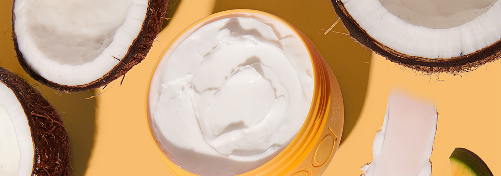
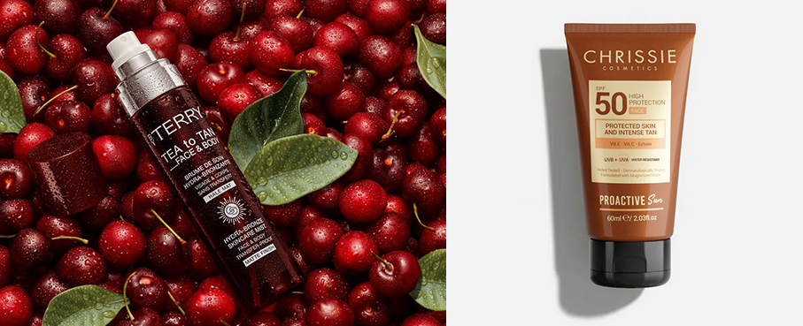
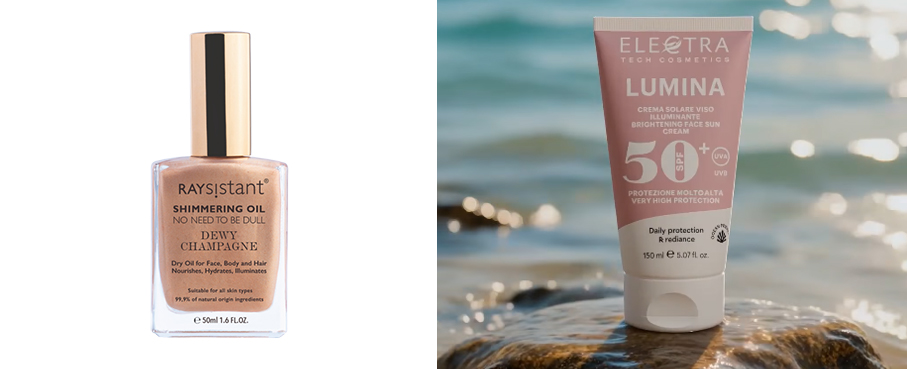
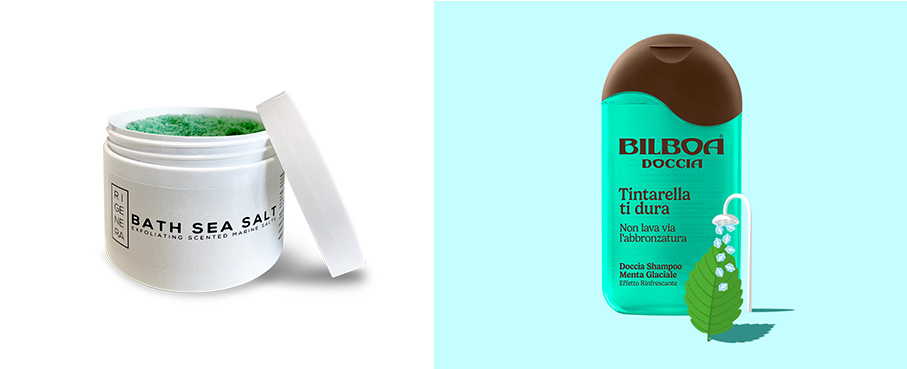
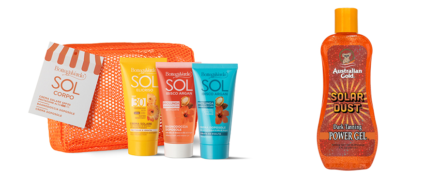
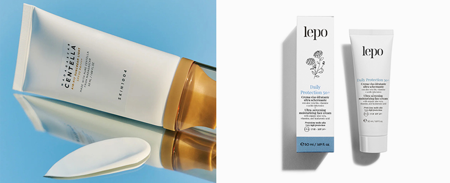
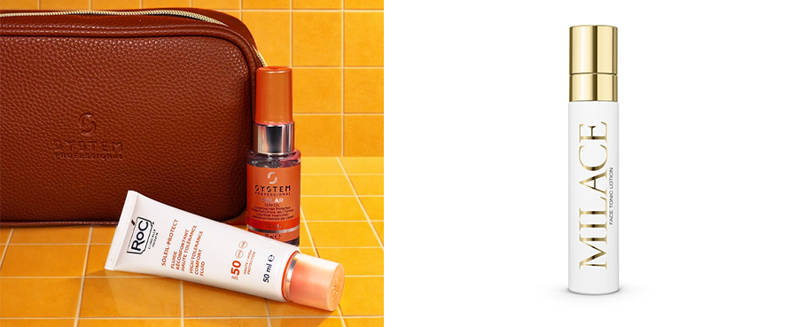
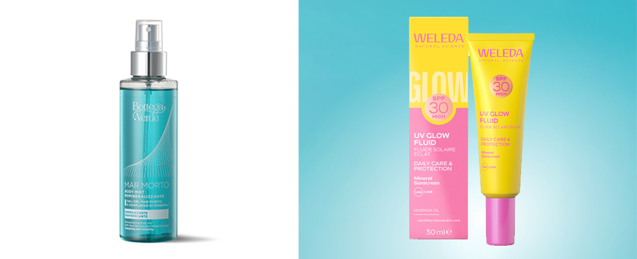
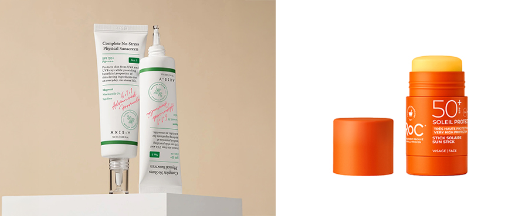
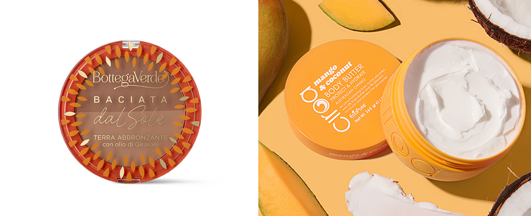

# L’Estate sul viso e sul corpo

>Proteggere prima di tutto, e poi idratare, rinfrescare, illuminare o anche abbronzare: 
tante le **proposte estive per viso e corpo**

_di Maria Rosa Sirotti_

**La protezione solare è fondamentale** per prevenire scottature, invecchiamento precoce e danni a lungo termine alla pelle causati dai raggi UV. I prodotti devono essere stesi abbondantemente **su tutta la cute scoperta**, senza dimenticare orecchie, collo, cuoio capelluto, mani e piedi. Inoltre, è consigliato utilizzare **formule specifiche** e delicate per la pelle del viso. 
Dopo l’esposizione al sole, sono tante le proposte per un **effetto rinfrescante, illuminante, idratante** ma anche **esfoliante e ossigenante**, oltre a prodotti **autoabbronzanti e per il make-up**.

**Tea to Tan Face & Body – By Terry** mist skincare idratante e abbronzante che dona alla pelle un effetto sun-kissed naturale dal finish opaco. Garantisce 24 ore di idratazione e una tenuta a lunga durata, no-transfer. Dona colore all’incarnato senza agenti autoabbronzanti, risultando facile da rimuovere con acqua. 
Disponibile qui: https://perfumology.it/products/tea-to-tan-face-body-spray-idratante-e-abbronzante

**SPF50 High Protection Face – Chrissie** crema fotoprotettiva dalla texture ricca e morbida. Protegge la pelle contrastando i segni dell'invecchiamento e favorendo un'abbronzatura intensa e duratura. Contiene  Vitamina E, Vitamina C, Ectoina e Olio di Cocco. Una formula con azione nutriente che mantiene la pelle morbida durante l'esposizione.

**Shimmering Oil - Dewy Champagne – Raysistant** olio corpo illuminante e ultra-idratante che dona alla pelle sfumature radiose e comfort immediato. Con il 99,9% di ingredienti di origine naturale tra cui oli di Mandorle e Baobab. Fonte di vitamine A, C, E, acidi grassi essenziali, Omega 3, 6 e 9 nutre a fondo, esalta l’abbronzatura, regalando una luminosità inaspettata.

**Lumina Crema Viso Illuminante SPF 50+ – Electra Tech Cosmetics** non più solo protezione, ma anche cura, difesa e bellezza della pelle sotto la luce: protezione quotidiana ad ampio spettro con effetto glow naturale, filtri di nuova generazione, acido ialuronico e peptidi per idratazione, elasticità e azione anti-age. Con micro-perle illuminanti uniforma l’incarnato. Ideale anche come base make-up.

**Bath Sea Salt - Sali marini da bagno – Rigenera**  miscela naturale ad azione esfoliante, a base di sale marino di alta qualità e di 33 oli essenziali diversi. I sali marini favoriscono l'eliminazione delle cellule morte, mentre la miscela di oli essenziali purissimi assicura un effetto rivitalizzante e al tempo stesso rilassante per il corpo e per lo spirito. Disponibile qui https://www.luxury-perfumes.net/prodotto/rigenera-bath-sea-salt/

**Sapore Di Aloe Stick Solare 50+ - Bilboa** stick solare per uso quotidiano in spiaggia e in città. Con Filtri Fotostabili UVA e UVB di ultima generazione, è perfetto per proteggere le pelli sensibili riducendo il rischio di scottature e danni solari. La sua texture, sensoriale e trasparente, non lascia residui né tracce, garantendo una protezione piacevole senza effetto unto.

**Travel Kit Suncare Corpo – Bottega Verde** pochette in rete arancio fluo che contiene 3 prodotti indispensabili per bagni di sole protetti e senza problemi, mantendo la pelle protetta e idratata anche con la detersione doposole: SOL Ibisco Argan – Crema doposole, SOL Elicriso - Crema solare, SOL Ibisco Argan - Bagnodoccia doposole.

**Solar Dust ™ - Australian Gold** gel abbronzante cosmetico con vitamine e Golden Shimmer, rieditato per festeggiare il 40° Anniversario del brand. Privo di Filtri Solari. Ad azione idratante e antiossidante, regala alla pelle scintille dorate. L’iconica fragranza Cocoa Dreams - firma olfattiva Australian Gold dal 1985 - è un bouquet estivo altamente identificativo.

**Madagascar Centella Air-Fit Suncream SPF50+ PA++++ – SKIN1004** protezione solare minerale con texture ultra leggera. Perfetta per pelli sensibili: combina ossido di zinco al 100% con potenti attivi lenitivi per proteggere, calmare e rinfrescare. Con Centella Asiatica e Houttuynia Cordata, lascia la pelle visibilmente più sana e luminosa, senza compromessi. Disponibile su https://cosmok.it/

**Daily Protection 50+ Crema viso idratante ultra schermante – Protezione molto alta UVA/UVB SPF 50+ - Lepo** crema viso fluida e leggera, per idratazione ottimale e protezione avanzata SPF 50+. Usata quotidianamente, previene le macchie scure. Antiossidante e protettiva con aloe vera bio, vitamine e acido ialuronico, contiene filtri solari organici di ultima generazione, fotostabili, water resistant e sea-friendly.

**Kit Solar Viso e Capelli - System Professional in partnership con RoC®** elegante pochette beauty in ecopelle firmata System Professional contenente la crema viso bestseller SPF 50 da 50 ml di RoC® e il Solar Sun Oil in formato 30 ml di System Professional. Un beauty set essenziale e sofisticato, perfetto da portare con sé in vacanza come in città. 

**Lozione Tonico Viso Uniformante - Milace** tonico spray che risveglia la pelle e favorisce l’ossigenazione dei tessuti, donando una piacevole sensazione di energia e freschezza. Può essere vaporizzato sul viso dopo la detersione ma anche in qualsiasi altro momento della giornata. Contiene: Estratto di Zafferano Milace; Estratto di Iris Fiorentino;  Acqua di Fiore di Loto;  Actibiome™.

**Mar Morto - Body Mist – Bottega Verde** un'acqua rinfrescante, leggera ed energizzante, con fragranza fresca e marina. Contiene Sali del Mar Morto e un Complesso di Minerali, tra cui magnesio, zinco e rame, selezionati per una sferzata di energia e vitalità. Caratterizzata dal 98% di ingredienti di origine naturale e flacone realizzato con il 100% di plastica riciclata. 

**UV Glow Fluid SPF 30 – Weleda** offre una protezione immediata dai raggi UVA/UVB e un colorito naturale. Una formula leggera con filtri 100% minerali, arricchita con olio di moringa nutriente e pigmenti illuminanti che riflettono la luce. La protezione solare SPF 30 dona un colorito naturale senza lasciare aloni bianchi. 

**Complete No-Stress Physical Sunscreen – Axis-Y** crema a protezione solare fisica con Artemisia, Niacinamide, Squalano e Acido Ialuronico. Una formula innovativa che unisce efficacia, delicatezza e sostenibilità ambientale. Offre un’azione lenitiva, idratante e protettiva senza stressare né la pelle né l’ecosistema marino. Disponibile su https://cosmok.it/

**Soleil Protect - Stick Solare SPF 50+ - RoC®** stick con combinazione di filtri a protezione molto alta UVA/UVB e di un duo di Vitamina C & Vitamina E, due potenti antiossidanti per una tripla azione protettiva, idratante e anti-età. La sua texture invisibile, che non lascia tracce, consente una facile riapplicazione durante tutta la giornata. Resistente all'acqua

**Baciata -Terra abbronzante con olio di Girasole – Bottega Verde** profumata con note estive, fresche e avvolgenti, questa polvere compatta senza talco dona un aspetto "pelle baciata dal sole" assolutamente naturale. Arricchita con olio di Girasole e fragranza di Cocco e Vanigli. Le due tonalità complementari consentono di personalizzare il colore con un effetto radioso e scolpito su viso e décolleté.

**Mango & Coconut Body Butter - Ciroa** una crema corpo che trasforma la beauty routine in un viaggio tra note gourmand, floreali e fruttate. Tutta la vitalità dell’estate in una fragranza esotica e irresistibile, dove il gusto intenso del mango incontra le note fresche del cocco per un vero viaggio sensoriale sotto il sole.