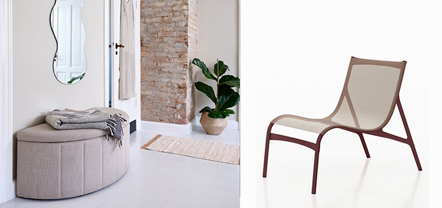

# La casa autunnale

> Le temperature si fanno più miti ma la fine dell’estate e l’autunno sono ancora momenti perfetti per godersi una **pausa rilassante in casa**, ma anche in **ambiente outdoor**
 

La linea **BBQ di Fulgor Milano** è progettata per integrarsi perfettamente in un sistema di arredo esterno. Si adatta facilmente a diversi contesti, offrendo un’esperienza di cottura all’aperto di alta qualità. Il barbecue ad incasso con finitura Matte Black è dotato  di robuste griglie in ghisa e di quattro bruciatori tubolari a gas che erogano una potenza complessiva pari a 15,2 kW. Il sistema elettronico di accensione ed il controllo Gas Stop, garantiscono la massima sicurezza durante l’uso. La disposizione lineare dei bruciatori consente di suddividere le aree di cottura, permettendo di utilizzare diverse temperature di cottura. Tra gli accessori a richiesta, oltre a varie tipologie di griglie, sono disponibili anche due versioni di coperchio alto e basso, per prestazioni ottimali di cottura e/o protezione dagli eventi atmosferici.

**Pouf Sam di Frigerio**. mana una sensazione di familiarità e sobria intimità. E’ caratterizzato da una struttura chiusa in vimini intrecciato con una silhouette morbida e organica. Il pouf dalle dimensioni abbondanti e accoglienti può essere completato da una materassina per renderlo ancora più confortevole.

**Chateau d’Ax** propone **Olympia**, il sistema di sedute modulare. La seduta e gli schienali avvolgenti sono un inno alle forme organiche per comfort e versatilità, in linea con i moderni trend del lifestyle, in cui emerge una sempre crescete combinazione tra spazi living e ambienti di lavoro nell’ambito del domestico. Le accentuate pieghe della pelle conferiscono un carattere distintivo e una coppia di tiranti, visibili anche nella parte posteriore, ne esaltano la comodità. Privo di meccanismi, le sue linee sono morbide e curve ed una doppia impuntura on tone ne risalta l’estetica. Ogni seduta è totalmente rivestita su ogni lato, per un utilizzo “stand alone”.

**Frigerio** presenta la **Poltrona Pan** che rende omaggio ai grandi classici del design reinterpretando in chiave attuale la lavorazione del giunco tipica dell’artigianato italiano degli anni ’50 e ’60. Divertissement e memoria si fondo in questo pezzo, in cui il materiale naturale viene piegato a vapore per raggiungere la curvatura desiderata e poi tinto scuro.

Collezione **Verdea di Vermobil** variante terracotta: una linea di arredo outdoor in alluminio progettata per resistere, evolversi e accogliere momenti di convivialità. La gamma comprende: Sedia e poltrona pranzo Sgabello bar Lounge e divano due posti. Tutti gli elementi sono impilabili e disponibili in otto colorazioni per la struttura in metallo, con cuscineria dedicata. Tre varianti con schienale in corda Olyna Made in Italy e braccioli in teak FSC. Completano la collezione due tavoli fissi in alluminio, ideali per l’arredo contract, terrazze e giardini.

**Aroma**, la nuova sedia di **Zilio A&C** è un’interpretazione contemporanea delle iconiche sedie da caffè. Un progetto che coniuga rigore ed emozione, pulizia formale e precisione delle lavorazioni. Realizzata interamente in frassino, si distingue per la forma avvolgente ottenuta grazie alla curvatura a vapore del legno massello. Il piccolo bracciolo semicircolare a sezione rettangolare si amplia rispetto ai modelli storici per offrire un comfort maggiore. Viene proposta in una raffinata palette: di sapore nordico la versione in frassino naturale, affiancata dalle varianti altrettanto sobrie smoke e classico nero. Più ludica e contemporanea la variante rosso acceso, insieme alle versioni verde oliva e rosso ossido.

**Wall by Meg Design**. Pannelli decorativi verticali in grado di connotare in modo distintivo l’ambiente in cui si vive. Una boiserie moderna con diverse valenze sia estetiche che funzionali indipendentemente dall’ambiente in cui si trova. Migliora l’acustica all’interno dell’ambiente in cui viene montato perché le onde sonore non vengono più interamente riflesse, ma raccolte tra le scanalature dei pannelli stessi. Resistente ai raggi UV, mantiene a lungo l’intensità e la profondità del colore. L’installazione dei pannelli è semplice grazie all’esclusivo sistema di collegamento con fissaggio molto rapido e preciso, sia con colla sia con apposite clips.

La sospensione **Driyos di Zava** è caratterizzata da una grande versatilità del corpo illuminante regolabile in altezza che permette di far confluire la luce in un punto preciso e, nello stesso tempo, di poter rimodulare l’intensità. Materiale: ferro. In versione outdoor diventa una sospensione fissa che punta dare valore ad un angolo ben preciso. La proposta cromatica è molto varia, ma per la zona relax sono stati scelti toni neutri, morbidi e intimi. Materiale: ferro.

**Regina Green Limited Edition** proposta da **Pianca** è un modello a basso impatto ambientale rispettoso dei principi dell’economia circolare. Il design organico ne caratterizza le forme tondeggianti e generose, mentre l’utilizzo di poliuretani speciali per l’imbottitura, ricavati da fonti rinnovabili e realizzati con componenti a base vegetale, assicura una morbidezza senza pari e un ridotto impatto ambientale. Il risultato è un accogliente e caldo abbraccio, materico e rassicurante. La base è realizzata in pannello MDF, con legno proveniente da foreste certificate a prelievo controllato, contro la deforestazione. La struttura portante è in acciaio, per un sostegno discreto e solido. La struttura è disassemblabile e permette di sostituire facilmente ogni singola componente in caso di usura o danneggiamento, senza dover necessariamente sostituire l’intera poltrona. A fine vita, ogni componente può essere separato e reintrodotto nel ciclo produttivo,

**Ta Design**: **Tavolino Lumia** 100% in graniglia di vetro o marmo riciclato e polimeri vegetali provenienti da fonti rinnovabili, fonde sostenibilità e design minimalista, offrendo versatilità e un tocco originale agli spazi contemporanei. **Tavolino Opale** unisce grafismi colorati a materiali riciclati al 100% in graniglia di vetro o marmo per il piano e polimeri vegetali da fonti rinnovabili, offrendo un arredo sostenibile che sposa eleganza, funzionalità e rispetto per l’ambiente. **Sedia Calima** essenziale e leggera, è formata da una struttura sottile in tondini metallici che crea un raffinato motivo di luci e ombre. Minimal e versatile, con o senza braccioli, si adatta a ogni ambiente con stile e funzionalità.

**Divano Dominick** – collezione Dehor di **Conte Casa**. Presenta una struttura in legno massello che abbraccia la morbida seduta imbottita, rivestita in pregiati tessuti, sempre studiati per resistere agli agenti atmosferici. Un oggetto di design che si integra perfettamente all’ambiente esterno e che aggiunge un tocco di eleganza e raffinatezza allo spazio, mantenendo le caratteristiche di durabilità e resistenza richieste agli arredi outdoor.

La texture **Mino** contrassegna la superficie materica di **Mino Vase** proposto da **Bosa**. L’oggetto è attraversato da un solco morbido e organico punteggiato da una serie di aperture dove possono essere inseriti fiori e foliage, per dar vita a composizioni botaniche libere e inattese. La forma arcaica del vaso riporta all’essenza dell’oggetto, mettendo in evidenza una gestualità spontanea nel rapporto con la natura.

La mano morbida e l’effetto tridimensionale delle lavorazioni regalano matericità al plaid jacquard **CrissCross** che si tinge delle nuove cromie **Fazzini**. I colori indagano nuove sfumature che portano in casa freschezza e purezza, ma anche la luminosità e l’energia della giovinezza. L’azzurro delicato che richiama i cieli d’estate per trasmettere serenità e ossigeno incontra l’intensità del blu China, i verdi spaziano fra le tonalità morbide dell’acqua, quelle energizzanti del giada e quelle intense delle foglie.

**Iridium Edition**: la nuova sperimentazione materica di **De Castelli**, la nuova finitura su acciaio inox che esplora la dimensione più pura della lucentezza in un dialogo sinergico con le potenzialità delle ossidazioni che l’azienda sperimenta quotidianamente. Un’inedita laccatura dell’interno in blu cobalto abbinata alla nuova finitura trasforma i pezzi in presenze dal carattere forte e vibrante.

**Hiro – Meridio e Op** Set tavolino e 2 sgabelli in acciaio trattato per outdoor. Il tavolino è adatto ad appoggiare le caraffe di the freddo, negli assolati pomeriggi estivi in compagnia di un buon libro. Pratica chiusura salvaspazio per spostarlo dove vuoi. Lo sgabello ricorda uno slittino fuori stagione, quasi a scivolare, col pensiero, nei prati d’estate. La maniglia lo rende facilmente trasportabile da interno casa al terrazzo.

**Avant-Garde – Bonaldo**. Semplici tratti e una studiata alternanza di pieni e vuoti in una vera e propria sfida all’equilibrio. Lo schienale e la seduta sono due pezzi unici formati da singole linee ricurve, collegate fra loro tramite un’asta in metallo. Le due parti si adattano naturalmente alla forma del corpo, garantendo un comfort ottimale e un’esperienza di seduta equilibrata. Se abbinata al pouf, per caratterizzare un’area living dallo spirito anticonvenzionale, si inserisce con naturalezza anche in una elegante sala d’attesa o nella lounge di un hotel.

**Cinelli Piume e Piumini** presenta la nuova linea **Mistral**: trapuntino, copriletto e guanciale sfoderabile realizzati interamente in lino e cotone, sia nel tessuto esterno che nell’imbottitura. Va ad ampliare la collezione Cinelli Natura® pensata per rispondere alle esigenze delle stagioni meno fredde. Il rivestimento esterno è composto per l’80% da cotone e per il 20% da lino in una tonalità neutra ed elegante, rifinito da un bordo in nuance. L’imbottitura interna combina le due fibre naturali in equilibrio ed è trapuntata a piccoli quadri (20×20 cm) per assicurare una distribuzione uniforme della leggerezza con un effetto visivo elegante ed essenziale. Il guanciale è inoltre dotato di fodera removibile particolarmente adatto per le notti estive, unendo funzionalità e cura estetica.

**Deltacalor – Pisolo**. Piccolo nelle dimensioni, ma grande nella tecnologia e nell’efficienza, è un dispositivo autonomo che racchiude la tecnologia di una pompa di calore all-in-one in dimensioni compatte, offrendo una soluzione versatile per il riscaldamento e il raffrescamento, senza la necessità di un collegamento a un impianto esistente: per farlo funzionare è necessaria solo una semplice presa di corrente. Per installarlo è sufficiente praticare due fori da 16 cm di diametro su una parete che abbia un lato esposto all’esterno.

La collezione **Zoey** di pouf e panche di **Dieffebi** interpreta con un nuovo linguaggio, espresso da volumi morbidi, proporzioni armoniose, geometrie pure e colori desaturati. Le nuove sedute imbottite, sostenute da eleganti elementi cilindrici, sono disponibili in forme squadrate o tonde e si distinguono per la loro leggerezza visiva, adattandosi con naturalezza ad ambienti contract, hospitality e residenziali. Zoey è la risposta al bisogno di spazi dinamici e trasversali, dove design, comfort e funzionalità si fondono con equilibrio.

**Lanerossi** presenta **Wool Energy**, il nuovo Sistema Letto ad alte prestazioni, un prezioso alleato per il miglioramento della qualità del sonno. Il completo letto **g_raphite** si distingue per la tecnica di tintura in capo realizzata con grafite riciclata, attraverso la tecnologia brevettata g_pwdr® di Alisea Srl – Società Benefit. Le micropolveri di grafite, oltre a garantire uniformità cromatica e profondità del colore, contribuiscono a disperdere le cariche elettrostatiche che si generano naturalmente durante la notte. Il risultato è un ambiente più stabile, rilassante e bilanciato. Alla base di tutto c’è la lana Merinos extrafine: termoregolante, igroscopica, traspirante, anallergica. È una fibra viva, capace di stabilizzare il ritmo cardiaco durante il sonno e di trasformarlo in rigenerazione naturale.

**Dalene – Jysk**. L’abitare contemporaneo oggi ricerca il benessere sensoriale. Le forme organiche, i bordi smussati e le finiture soft-touch rappresentano una risposta concreta ai bisogni di comfort, accoglienza e design empatico. Con funzione contenitore, il pouf rotondo Dalene è proposto in tessuto color terracotta.

**Kutyna** una sedia telescopica a scomparsa, che può essere totalmente chiusa, fungendo da pouf, regolata all’altezza di una sedia o a quella di uno sgabello. Il corpo è realizzato in policarbonato riciclabile trasparente arricchito da bolle incassate che richiamano il design anni ’50 e ’60. La parte superiore e la base sono disponibili in sei colori traslucidi: verde, arancio, ambra, fumé grigio, fumé scuro e blu avio. Da ottobre, sarà in vendita in 35 department store Coin diretti e in 60 negozi **Coin Casa** in franchising. La nascita della sedia ha dato vita anche a un altro oggetto, Flaminia, pensato con le medesime caratteristiche: una lampada regolabile in altezza con lo stesso meccanismo, che può quindi assumere diverse forme, adatte a differenti utilizzi.

**Segis** presenta **Sloop**. Una collezione di soft seating e pouf pensata per spazi pubblici e residenziali, Sloop si contraddistingue per carattere dinamico e personalità generosa. Le linee di ciascun elemento sono costruite con un perfetto bilanciamento di tratti squadrati e morbidi che creano una forma inedita e contemporanea. Il confort delle sedute della collezione è il risultato di uno studio attento dell’ergonomia garantita dalle differenti calibrature della schiumatura che non è mai eccessiva.

**Ikea** rivisita l’iconico divano Klippan con una fodera in tessuto **Buskopuntia**, gialla con fiori di campagna. Con questa collezione, Ikea invita a osare con il colore in ogni stanza della casa, dal soggiorno alla cucina.

**Dixpari** propone **Lucifero**. Molto più di un semplice punto luce da tavolo, rievoca l’infanzia con un’estetica etica, raffinata e contemporanea. E’ ottenuto dalla trasformazione degli scarti di materiali termoplastici. La sua forma, ispirata al ghiacciolo, prende vita grazie alla magia della plastica riciclata, la cui texture irregolare e le combinazioni di colore sempre diverse rendono ogni pezzo unico. Quando la luce lo attraversa, si accende di sfumature e riflessi imprevedibili, trasformandosi in un vero e proprio catalizzatore di energia e curiosità.

**NATURaLL** è il brand di tovagliato monouso 100% cotone compostabile e biodegradabile ideato per la ristorazione professionale e declinabile a tutti gli ambienti che richiedono soluzioni sostenibili e di qualità, dentro e fuori dal mondo Ho.Re.Ca. Offre una vasta gamma di tovaglioli, runner, coprimacchia e accessori in 100% puro cotone, compostabili in circa 28 giorni, privi di plastica e realizzati con cotone agricolo certificato, per garantire performance elevate e impatto ambientale minimo.

