# La Cosmesi Ungherese si presenta a Cosmoprof 2026

>Per la prima volta, **5 brand dell’eccellenza della cosmesi naturale e olistica ungherese** espongono insieme a Cosmoprof Worldwide Bologna
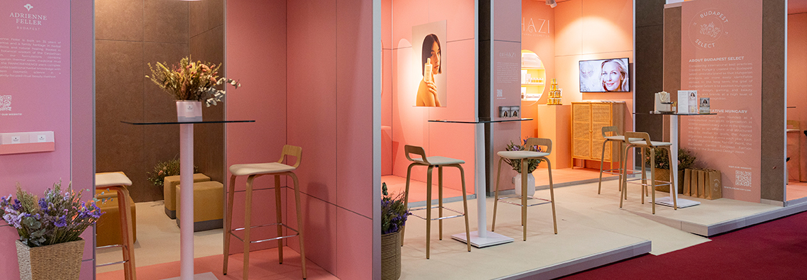

La **Cosmesi Ungherese** è un settore rinomato in tutto il mondo per l'uso di **ingredienti organici, acque termali e antiche tradizioni erboristiche medicinali** unite alla moderna dermatologia. A Budapest, la capitale mondiale delle terme, l'antica conoscenza delle erbe, la serena disciplina degli speziali e il mondo sensoriale dei rituali del bagno si sono evoluti **di pari passo con le scoperte scientifiche**. Oggi, i marchi di bellezza ungheresi portano avanti questo dialogo: radicati nel paesaggio e nella memoria, ma creati per la vita contemporanea. 

**Creative Hungary**, sotto l'egida di **Budapest Select**, ha selezionato **5 produttori ungheresi** che rappresentano il cuore della **cosmesi botanica di lusso ungherese**. La loro filosofia comune è l'uso di ingredienti "vivi" (estratti a freddo,) **combinando risorse naturali con la scienza più avanzata** per la cura della pelle. L'obiettivo è quello di mettere in luce l'industria cosmetica e della bellezza ungherese, innovativa e competitiva a livello globale. 

Le aziende ungheresi selezionate si impegnano a evitare sostanze nocive, ad adottare approcci sani e delicati per la pelle e a utilizzare **ingredienti di alta qualità**. Pongono inoltre grande enfasi sulla **produzione ecosostenibile**. A differenza della cosmesi standard che usa acqua demineralizzata come semplice solvente, la skincare ungherese utilizza l'**acqua termale come ingrediente attivo**. Calcio, magnesio, zinco e zolfo sono presenti in alte concentrazioni e aiutano a rinforzare la barriera cutanea, ridurre le infiammazioni (come eczema e psoriasi) e stimolare la produzione di collagene.

Si utilizzano **estratti di piante indigene come iperico, ciliegia nera, rosa damascena, e lavanda**. I prodotti sono curativa e trasformativi: si basano sull'idea che la salute della pelle sia legata al rilassamento muscolare e alla riduzione dello stress, trattando il viso come parte di un sistema di benessere totale.

**ADRIENNE FELLER** 

Adrienne Feller si fonda su 35 anni di esperienza e una tradizione familiare nella** fitoterapia e nella guarigione naturale**. Radicate nella saggezza botanica del Bacino dei Carpazi, le formulazioni combinano **acqua termale ungherese, fanghi medicinali e il complesso vegetale Pannonessence**. La conoscenza erboristica tradizionale si unisce alla moderna scienza cosmetica in un rituale di bellezza incentrato sulla longevità.  Adrienne Feller non formula solo prodotti, ma **rimedi per l'anima e la pelle**. 

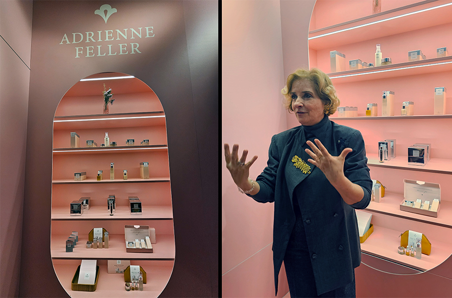

La **linea Rose de Luxe** è celebre per l'uso dell'olio essenziale di Rosa Damascena di altissima qualità, combinato con oli di nocciolo di albicocca, germe di grano e jojoba. È una linea ricchissima di fitosteroli che stimolano la produzione di collagene. I prodotti sono progettati per penetrare attraverso il sistema olfattivo 

**Rose de Luxe Face Oil** è un vero elisir di lunga vita per la pelle, che aiuta a eliminare i segni di stanchezza dal viso, a rallentare il processo di invecchiamento, ad aumentare la tonicità cutanea e a promuovere il rinnovamento cellulare. La sua azione rigenerante è dovuta agli oli essenziali di rosa e mirra, alle vitamine extra contenute e all'estratto di carota.

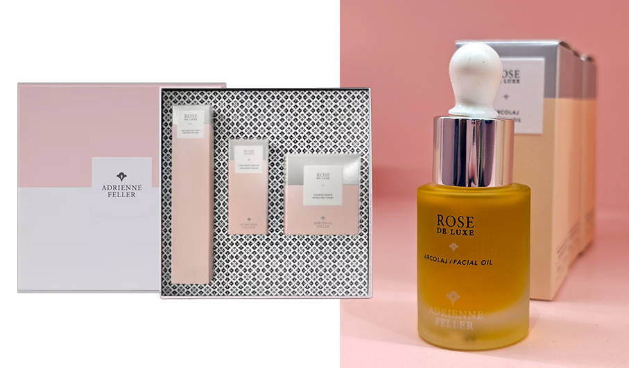

**Rose de Luxe Hyaluron set** è un set anti-età indispensabile con acido ialuronico e ingredienti botanici naturali per un'idratazione extra e un effetto rassodante. L'acido ialuronico contenuto nei prodotti rigenera efficacemente la pelle e la aiuta a trattenere l'acqua. 

**CREEM**

Crèem è un marchio di prodotti per la cura della pelle a conduzione familiare, originario dei **campi di lavanda di Visz**, in Ungheria. Fondato nel 2023, si basa sulla scienza e si ispira alla natura, creando prodotti per la cura della pelle sostenibili **a base di puro olio di lavanda e ingredienti botanici biologici**. Rappresenta l'evoluzione "Indie" e moderna del settore.
Nasce dalla necessità di eliminare ogni tipo di tossina e si concentra su **pochi ingredienti ma in dosaggi massicci**. 

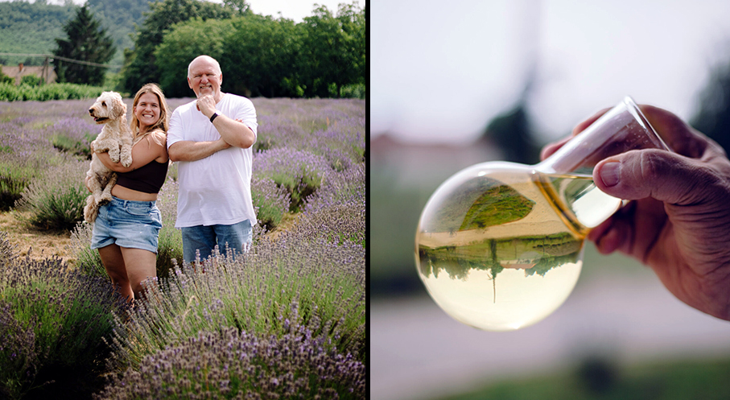

L'ingrediente chiave dei prodotti cosmetici è l'olio essenziale di lavanda, prodotto nella distilleria di famiglia e i fiori raccolti direttamente dai campi di lavanda di proprietà. Tutti i cosmetici sono realizzati a mano: uno dei valori più importanti del brand è che la triplice unità di **coltivazione - distillazione - produzione** si realizza nella stessa azienda agricola, in prossimità l'una dell'altra.
La coltivazione avviene senza alcun prodotto chimico: negli ultimi 20 anni non sono stati utilizzati erbicidi o pesticidi.

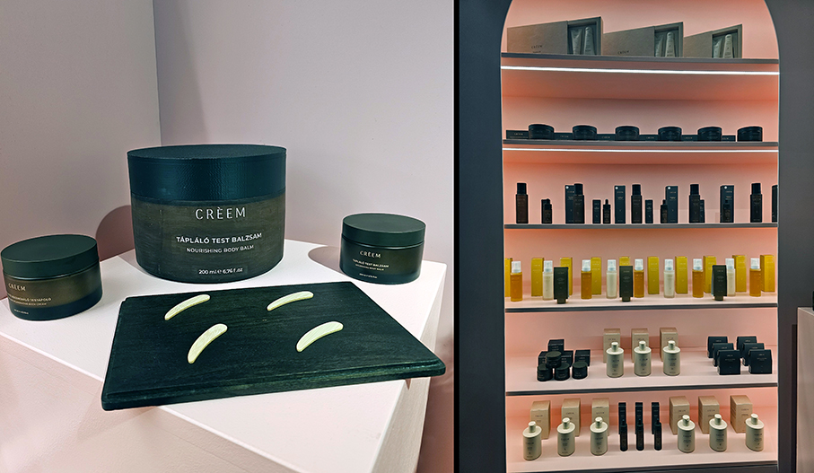

**Balsamo Corpo Nutriente** contiene olio essenziale di lavanda di grado farmacopeico ed è arricchito con diversi oli vegetali per un nutrimento profondo. Crema corpo idratante e rigenerante contiene oli essenziali di neroli, arancia e lavanda ed è ricca di antiossidanti

**DRHAZI** (Dr Hazi)

Drhazi è un marchio di lusso **tecnologicamente avanzato** per la cura della pelle, fondato sulla ricerca della farmacista Dott.ssa Edina Házi. Offre un'alternativa dermocosmetica naturale alle procedure estetiche invasive, con formule naturali, bioattive e identiche alla pelle. Il portfolio comprende sieri, creme, prodotti per la cura del contorno occhi, maschere e una linea uomo, utilizzando tecnologie avanzate e packaging airless sostenibile.

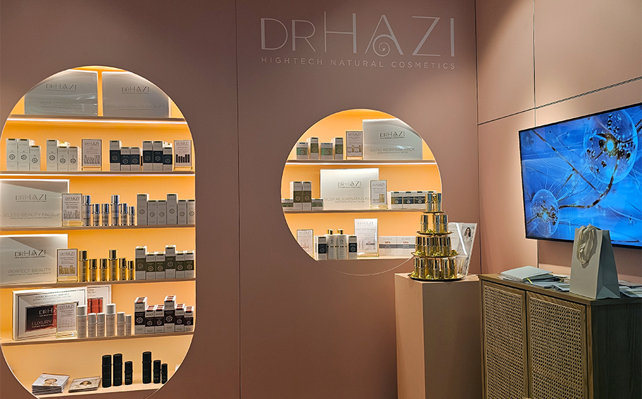

Molti prodotti **non contengono acqua, ma idrolati o succhi vegetali puri**. Questo significa che ogni goccia è un attivo biodisponibile al 100%. Utilizza **peptidi biomimetici** (che imitano le proteine umane) e l'argento colloidale come conservante naturale e antibatterico.

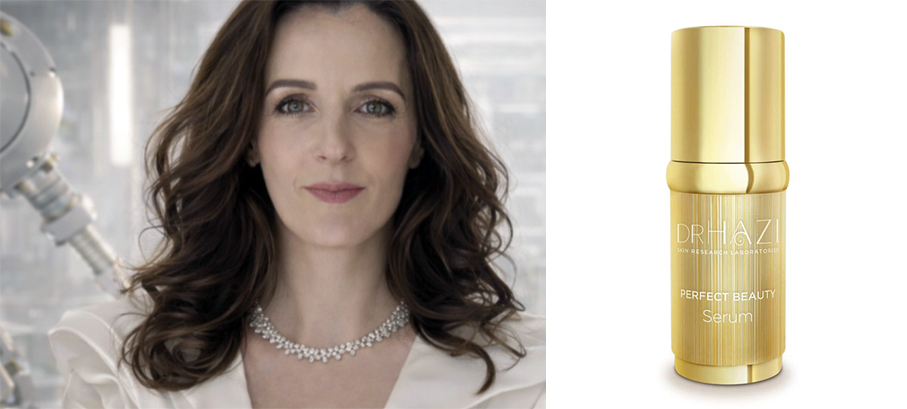

**Perfect Beauty Serum** è un siero di bellezza intensivo e rigenerante, senza oli, **con nanopeptidi (15) e cristalli colloidali** (6). Rinforza la struttura del derma per ripristinare il volume perduto, migliorare l'elasticità e il tono della pelle rilassata. La complessa miscela di nano-signalpeptidi (che mimano l'effetto rilassante muscolare, stimolante il collagene e rigenerante la matrice cutanea) attiva le nuove cellule della pelle. I cristalli colloidali (oro, argento, platino, iridio, silice, rame) riconfigurano la struttura della pelle e ne riattivano le funzioni. Il prodotto è realizzato con preziosa **acqua impoverita di deuterio**, la migliore acqua ringiovanente. La sua regolare struttura cristallina assicura la biodisponibilità di intensi principi attivi e contribuisce al rinnovamento cellulare della pelle, inibendo la proliferazione delle cellule danneggiate a livello del DNA.

**HARANGVÖLGYI INSTITUTE**

Anna Harangvölgyi Skinnotech è un marchio cosmetico a conduzione familiare, tramandato di generazione in generazione, con 70 anni di storia. Offre trattamenti professionali per la cura della pelle e prodotti complementari che uniscono il potere della natura, secoli di conoscenza e le **tecnologie più avanzate in un approccio olistico**. Il brand è l'estensione dei trattamenti manuali eseguiti nelle loro cliniche di Budapest.

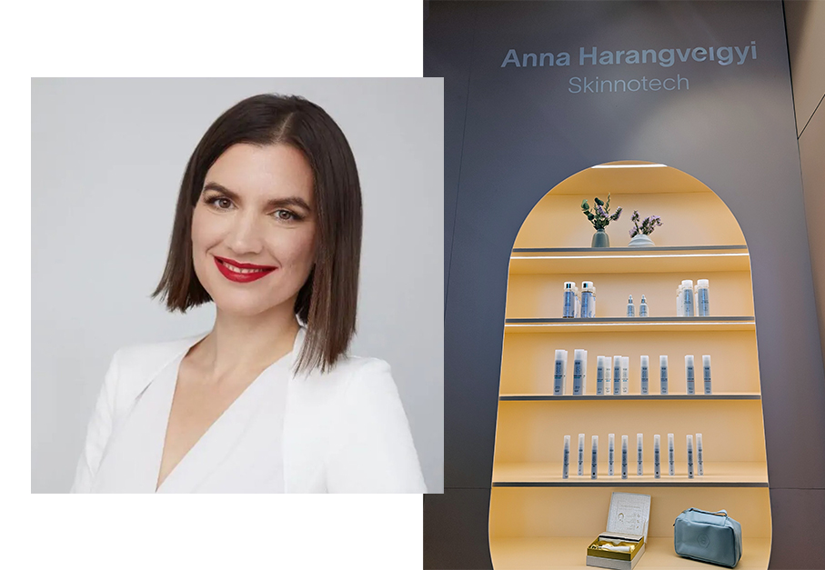

Utilizza alte concentrazioni di **Magnesio**, essenziale per il metabolismo cellulare, e **collagene marino ad alto peso molecolare** per un effetto rimpolpante immediato. Il brand è noto per l'uso di ingredienti che inviano "messaggi" alle cellule per attivare i processi di auto - riparazione, unendo la saggezza delle **acque termali ungheresi alla bio-nanotecnologia**.

**Siero AH Hyaluron BTX** Siero rassodante e antirughe per uso quotidiano. Il peptide in esso contenuto rallenta la contrazione dei muscoli mimici inibendo il flusso di informazioni tra nervi e muscoli, contribuendo così a prevenire la formazione di rughe dinamiche.

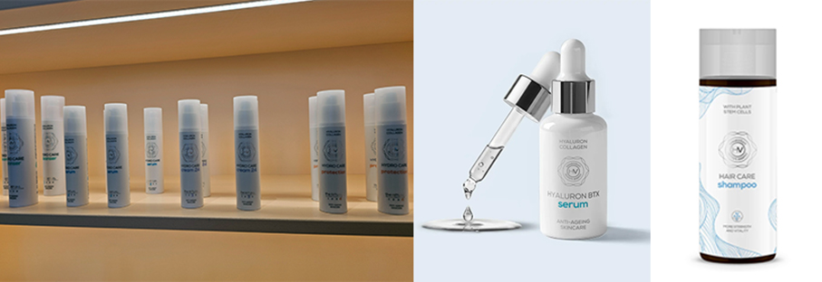

**Shampoo AH Hair Care** favorisce la rigenerazione capillare e contiene esclusivamente ingredienti di origine vegetale. Le cellule staminali di basilico contenute nello shampoo, formulato per donne e uomini, possono attivare le cellule staminali responsabili della produzione di capelli e coloranti, mentre la caffeina può contrastare la caduta dei capelli di origine androgenetica. Contiene solo ingredienti naturali, privi di sostanze chimiche sintetiche. Il tensioattivo che crea la schiuma è un tensioattivo a base di zuccheri vegetali. 

**ILCSI** (Ilcsi Beautifying Herbs)

Ilcsi è un marchio di cosmetici naturali a conduzione familiare, fondato nel 1958 e tramandato di generazione in generazione. I suoi prodotti sono creati con dedizione e responsabilità professionale, utilizzando esclusivamente componenti di origine vegetale e **ingredienti naturali con un contenuto di principi attivi eccezionalmente elevato**. 

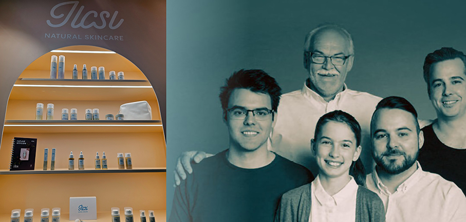

La filosofia di base del marchio è che **la natura può fornire soluzioni efficaci e delicate**. Non è un semplice marchio di cosmetici, è un metodo di cura della pelle basato sulla **fitoterapia agraria**. Ilcsi lavora con **erbe, frutta e verdura fresche, raccolte a mano** in Ungheria e trasformate in polpa che viene lasciata maturare per mesi. Questo processo mantiene intatti gli enzimi e le vitamine. L’**acqua termale** ricca di minerali funge da veicolante naturale.
 
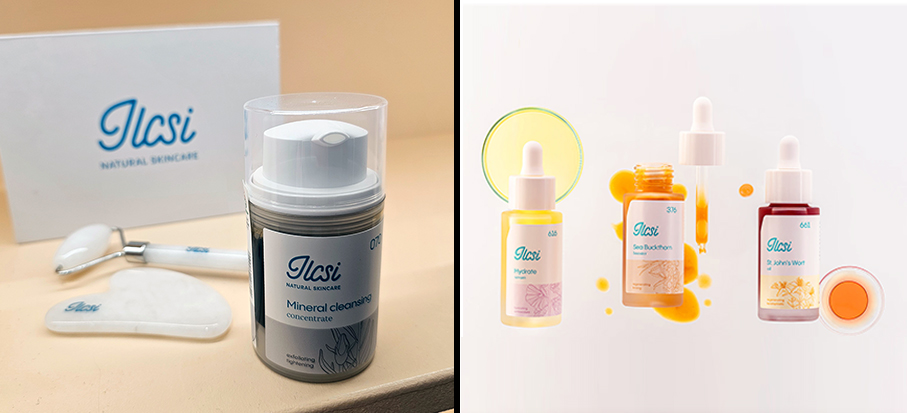

**Rosehip & Ectoin serum** è un siero che utilizza la  Rosa Canina, con i suoi preziosi ingredienti antiossidanti. Lenisce la pelle, mentre il suo contenuto di ectoina la protegge e la rigenera. Componente di oli essenziali naturali 99% di origine naturale del totale.

**BUDAPEST SELECT**

_Creative Hungary ha creato il marchio ombrello Budapest Select per rendere i prodotti ungheresi più facilmente identificabili all'estero. Offre un quadro coeso e riconoscibile che migliora la visibilità internazionale, preservando al contempo l'identità distintiva di ciascun marchio partecipante. Negli ultimi anni, la piattaforma ha presentato eccezionali creatori ungheresi da Londra a Milano, da Parigi a Dubai, rafforzando la loro presenza nelle principali capitali creative. Attraverso iniziative di esportazione, tutoraggio professionale e vetrine internazionali, Creative Hungary e Budapest Select amplificano l'eccellenza creativa ungherese, compreso il settore della bellezza e della cura della persona, garantendo che risuoni con chiarezza e impatto in tutto il mondo._

