# La K-Beauty a Cosmoprof 2026

>L'edizione di Cosmoprof Worldwide Bologna 2026 ha confermato il **ruolo centrale della Corea del Sud** come leader globale nell'innovazione estetica
_a cura di Maria Rosa Sirotti e Elena Braschi_
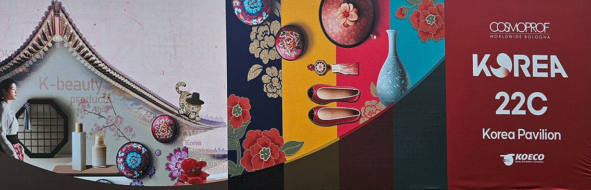

Con oltre **100 aziende leader** presenti nei padiglioni dedicati, la Corea del sud ha dominato il panorama beauty internazionale. Il tema principale è stato il **K-Beauty Renaissance**, una riscoperta della bellezza classica unita a tecnologie d'avanguardia. I marchi coreani, infatti, si sono distinti per un approccio che fonde **tradizione erboristica e alta tecnologia**. In questo modo, la medicina tradizionale coreana **Hanbang**, che si compone di trattamenti per la guarigione di mente e corpo, viene modernizzata: antiche  formule  con **erbe e radici** vengono aggiornate con **peptidi e tecnologie di incapsulamento** per una maggiore efficacia. 

L’ultima innovazione è il **PDRN** (Polideossiribonucleotide), un potente ingrediente rigenerante derivato da frammenti di **DNA di salmone o fonti vegetali**, utilizzato per stimolare **collagene ed elastina**. Migliora l'elasticità, ripara la barriera cutanea, idrata intensamente e riduce l'infiammazione, rendendo la pelle più giovane e luminosa.

Sempre molto amata la **Centella Asiatica**, uno degli ingredienti più utilizzati nella medicina tradizionale cinese e nella cosmesi coreana che apporta benefici ad ogni tipo di pelle per le proprietà **lenitive, antiossidanti, antinfiammatorie, idratanti e rigeneranti**. La K-Beauty dichiara guerra a qualunque tipo di rossore e imperfezione cutanea: il viso deve avere una pelle uniforme, chiara e lucida. Per questo, molte aziende si occupano di fornire **prodotti mirati ai problemi di macchie, pelle iper reattiva e a tendenza acneica**.

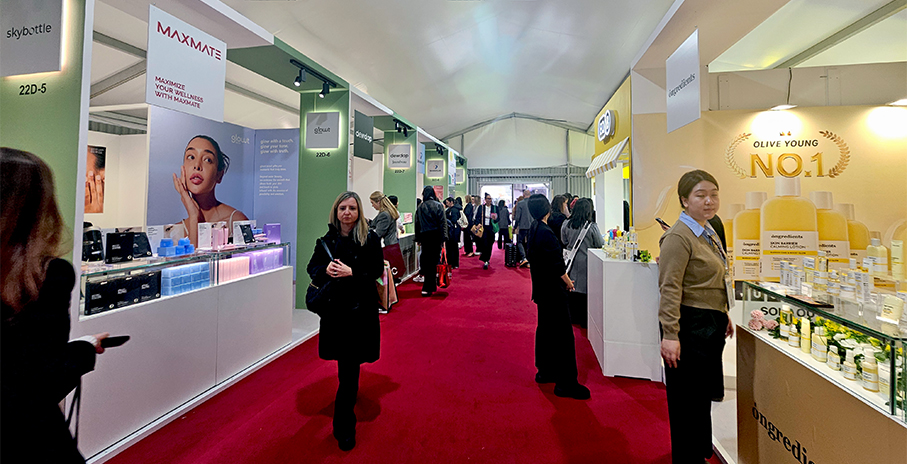

Il design presenta **forme arrotondate e tattili** e il packaging in vetro comunica sostenibilità e prestigio. Importante il focus su **Longevità e Barriera Cutanea**: un passaggio da routine frenetiche a una cura della pelle più matura, focalizzata sulla **salute a lungo termine della barriera cutanea**. 
Da segnalare la costante evoluzione delle texture e delle metodologie di applicazione:come i prodotti che **uniscono skincare e makeup**, come le **ampoule shots** e le essenze a base di **micro-aghi** (microneedle essences) per affinare la grana della pelle e minimizzare i pori. 
Le **maschere** continuano ad essere il prodotto più gettonato e si evolvono nella composizione, nel tipo di ingredienti all’interno e anche nel packaging, con il **nuovo formato arrotolato**. 

Una serie di **aziende coreane** che abbiamo incontrato a Cosmoprof e di cui abbiamo provato i prodotti, ci sono sembrate particolarmente rappresentative delle nuove tendenze:

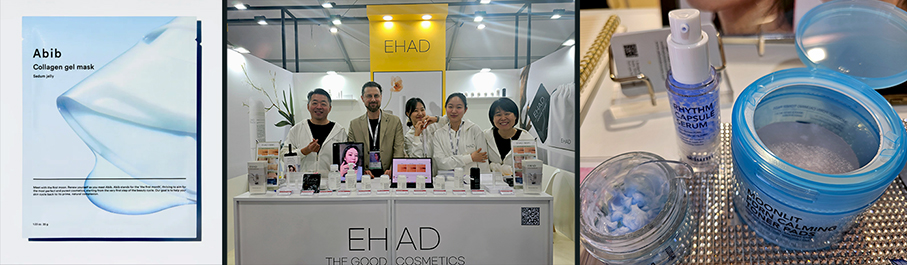

**ABIB**: il nome significa "primo mese", è un brand minimalista che punta a riportare la pelle al suo stato naturale di perfezione. È amato per le sue maschere in tessuto ultra-aderenti (Gummy Sheet Masks) e per il design pulito ed essenziale.

**SELUMI**: skincare di nicchia che punta sulla purezza degli ingredienti e su un'estetica minimalista. Propone soluzioni mirate per la cura della barriera cutanea, spesso integrando tecnologie fermentative per massimizzare l'assorbimento dei nutrienti.

**EHAD**: brand coreano di nicchia che propone la "skincare meditativa". I prodotti sono formulati per offrire un momento di pausa e cura del sé, con texture sensoriali e ingredienti derivati dalla medicina tradizionale asiatica rivisitata.

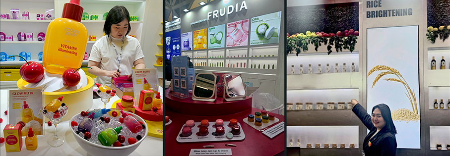

**EQQUALBERRY**: promuove una bellezza inclusiva e si distingue per l'uso di estratti di bacche e ingredienti botanici in prodotti sicuri, ipoallergenici e adatti a ogni fascia d'età e tipo di pelle.

**FRUDIA**: cosmesi basata sulla polpa e sui nutrienti della frutta spremuta a freddo. Utilizza la tecnologia brevettata R vita V per estrarre a freddo nutrienti e vitamine, offrendo linee specifiche per ogni esigenza: mirtillo per l'idratazione, melograno per il nutrimento e agrumi per la luminosità.

**SKINFOOD**: marchio iconico e storico, fondato nel 1957 e considerato uno dei pionieri nella cosmetica ispirata alla nutrizione alimentare; la filosofia del brand si basa sull’idea che ciò che è buono per il corpo può esserlo anche per la pelle, utilizzando ingredienti naturali ricchi di vitamine, minerali e antiossidanti tratti da frutta, verdura e alimenti nutrienti.

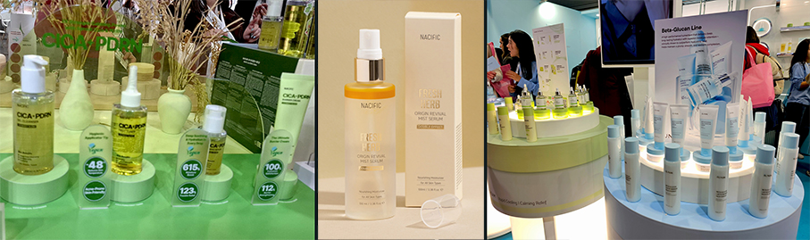

**NACIFIC**: segue una filosofia minimalista: ingredienti naturali per una pelle sana. Si concentra sull'eliminazione dello stress cutaneo utilizzando estratti botanici purissimi. I prodotti, come il celebre siero Fresh Herb, sono studiati per migliorare la texture della pelle in modo naturale e delicato.

**iUNIK**: acronimo di Ideal, Unique, Natural, Ingredients, Knowhow, punta alla semplicità. Le sue formulazioni sono essenziali e prive di riempitivi inutili, basate su ingredienti naturali come bava di lumaca, centella asiatica e propoli. 

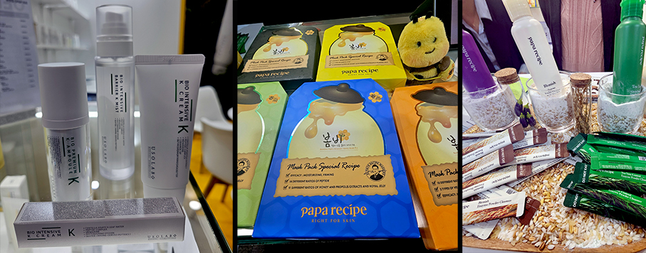

**USOLAB**: brand di derivazione medica specialistica con prodotti per il post-trattamento estetico. Utilizza ingredienti come il DNA di salmone (PDRN) e complessi di peptidi per accelerare la guarigione e la rigenerazione cutanea.

**PAPA RECIPE**: fondato da un padre per curare la pelle sensibile della figlia, è famoso per la linea Bombee Honey. Utilizza estratti naturali di miele e propoli per nutrire intensamente e lenire la pelle in modo delicato.

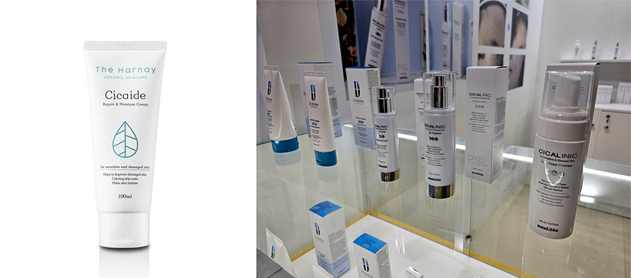

**THE HARNAY**: cosmesi estetica riparatrice per pelli irritate che si concentra sulla salute della barriera cutanea. È noto per l'uso della Cica (Centella Asiatica) e di complessi idratanti pensati per pelli irritate o che necessitano di una riparazione quotidiana profonda.

**CICALINIC**: propone trattamenti bio-skincare riparatori per pelli ultra-sensibili. Si distingue per la sua tecnologia PSL (Phyto-Sterol Liquid Crystal) che imita la struttura della barriera cutanea per ripararla e idratarla profondamente con ingredienti vegani e sicuri (EWG Green).

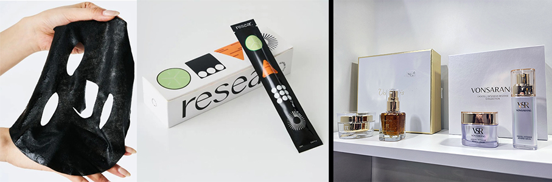

**RESEAR**: è un marchio di cosmetici coreano che trasforma il kimbap, un piatto tipico della cucina coreana, in maschere per il viso, un prodotto tipico della cosmesi coreana. La Kimbap Roll Mask è una maschera nera per pelle arrossata e irritata. Rinfrescante, idratante lenitiva rossore.

**THERAPY VONESTIS**: un marchio di alta gamma specializzato in trattamenti spa di lusso e protocolli anti-età esclusivi. La sua filosofia si basa sul valore della natura e sull'essenza del tempo, proponendo prodotti anti-età avanzati come la celebre linea Diamond Ritual e la piTherapy per ripristinare l'equilibrio della pelle.

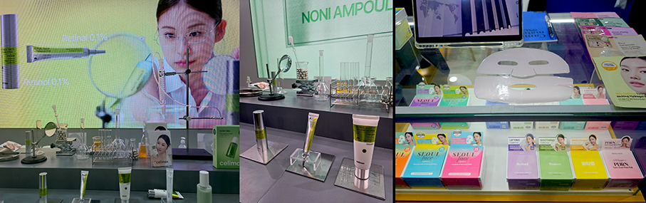

**CELIMAX**: si basa su trasparenza e onestà e si definisce un brand che non promette miracoli ma soluzioni reali testate dagli utenti. È celebre per la sua linea al Noni, un superfood dalle potenti proprietà antiossidanti e lenitive.

**SEOUL FACE**: incarna lo spirito della bellezza metropolitana di Seoul con prodotti innovativi e performanti, dai sieri illuminanti alle maschere viso, pensati per ottenere la famosa "glass skin" coreana.

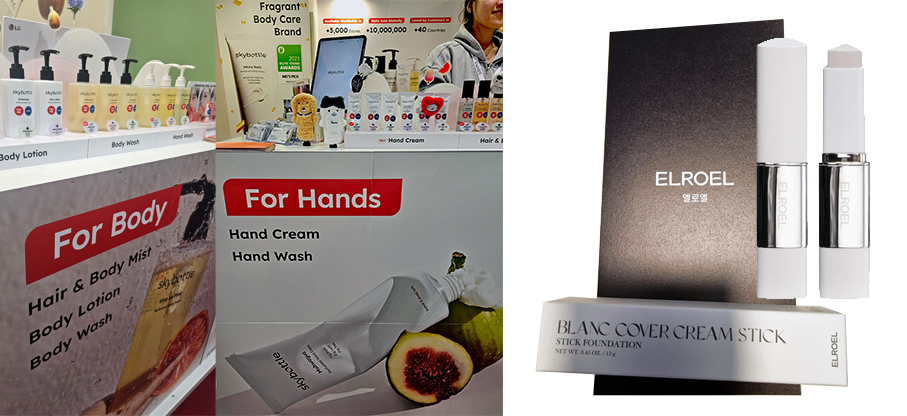

**SKYBOTTLE**: specializzato in "fragrance lifestyle", celebre per le sue creme mani e lozioni corpo dalle profumazioni ricercate e persistenti. Unisce la cura della pelle a un'esperienza sensoriale olfattiva unica e raffinata.

**ELROEL**: fonde l'esperienza dei make-up artist professionisti con la praticità quotidiana. È diventato famoso per i suoi formati innovativi come i fondotinta in stick con pennello integrato e i compatti "cushion" che cambiano colore adattandosi all'incarnato, rendendo l'applicazione del trucco veloce e impeccabile ovunque.

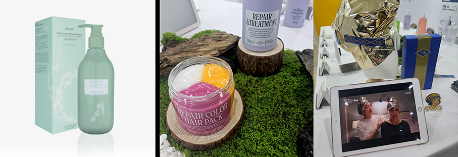

**AZH** (A to Z Hair): brand professionale per la cura dei capelli e dello styling. Sviluppato da esperti parrucchieri di Seoul, offre trattamenti intensivi e prodotti per lo styling che permettono di ottenere risultati da salone direttamente a casa.

**VIDAN**: Soluzioni tricologiche avanzate per la rigenerazione dei capelli. Specializzato nella cura del cuoio capelluto con un approccio dermatologico. Utilizza ingredienti biotecnologici avanzati come PDRN e peptidi per soluzioni anti-aging e rigeneranti per i capelli.

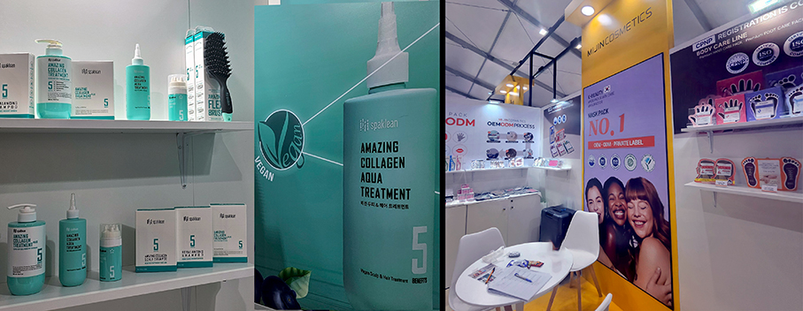

**SPAKLEAN**: Trattamenti professionali per la salute dei capelli e del cuoio capelluto, spesso utilizzato nei saloni di bellezza. Combina estratti botanici e tecnologie moderne per trattare problemi come la caduta dei capelli o la sensibilità cutanea, promuovendo una chioma sana "dalle radici".

**MIJIN** (MJ Care): leader mondiale nelle maschere in tessuto per l'uso quotidiano. Offre una varietà incredibile di varianti economiche ma efficaci, rendendo la skincare coreana accessibile a tutti per l'uso quotidiano.

