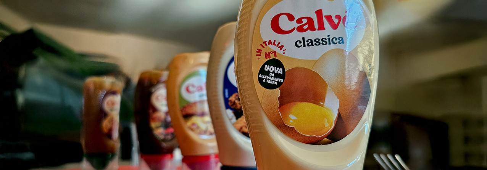
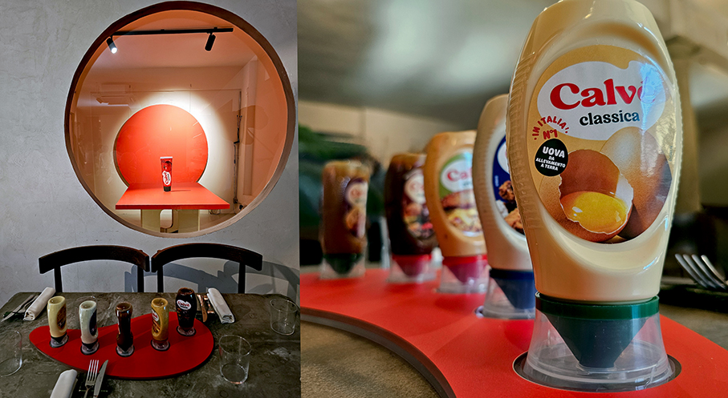
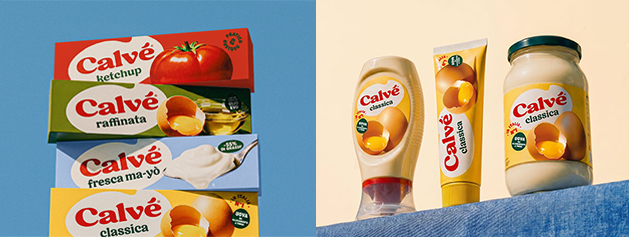
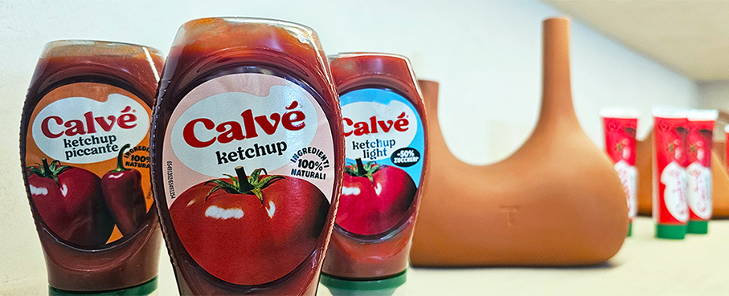
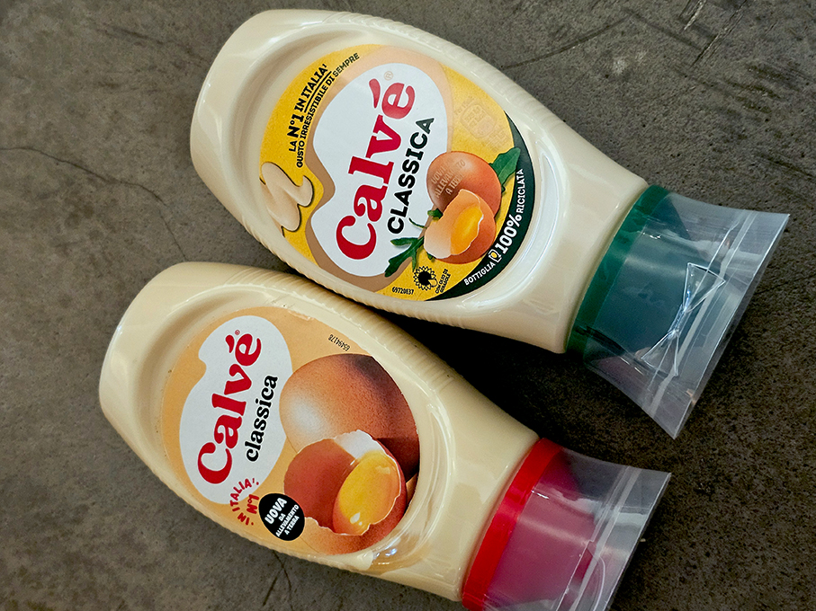
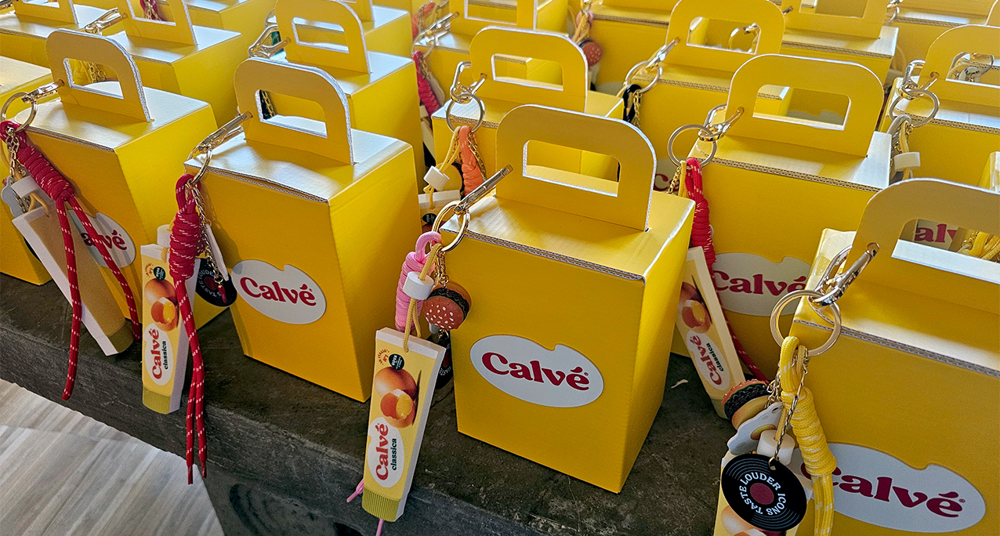

# “Le Icone, oggi”-  Ipsos Doxa per il rebranding Calvé

>Uno studio mostra che per il 59% degli italiani un'icona non è ciò che diventa virale, ma **ciò che resta rilevante nel tempo**. Per questo, ancora oggi, **maionese significa Calvè**

_di Maria Rosa Sirotti_

**Le Icone, oggi** è una nuova **ricerca Ipsos Doxa per Calvé** (Unilever) - in occasione del suo rebranding – che rivela come le **vere icone** della tavola italiana siano i **rituali più semplici e trasversali**: dal parmigiano sulla pasta (24%) a pane, olio e sale (18%), fino alla bruschetta (17%), al pane per fare la scarpetta (17%) e al **ketchup o maionese sulle patatine** (7%). Compaiono anche il sorbetto al limone a fine pasto, la **maionese nell’insalata di riso**, il limone sul fritto misto, la frutta a fine pasto e la pastina in brodo. 
Il dato racconta un’Italia in cui **l’iconico nasce da ciò che si tramanda**, seppur con elementi di novità. 

A rendere una marca iconica nel tempo, secondo **Gen Z e Millennial italiani**, contribuiscono: un’**identità forte (55%), l’essere riconosciuta da generazioni diverse (55%) e la capacità di essere riconosciuta facilmente (50%)**.  E’anche il legame con la tradizione, ma viene meno se quando il marchio propone sempre le stesse cose (42%), non cambia o non si evolve mai (38%) e non è in sintonia con le nuove generazioni (34%). La vera icona, quindi, non è quella che resta uguale a sé stessa, ma quella che **sa tenere insieme continuità e cambiamento**.

Su queste basi, Calvé inaugura una **brand identity rinnovata**, pensata per rendere ancora più forte, distintivo e contemporaneo il ruolo che il marchio occupa da sempre nell’immaginario quotidiano degli italiani, accompagna da un **approccio social-first**. Attraverso un linguaggio più immediato e attuale, si rende il marchio più contemporaneo nel modo in cui si mostra, si racconta e prende forma visivamente, preservando i valori fondanti - **tradizione, qualità, affidabilità, gusto** - ma raccontandoli con i codici visivi di oggi.

Il lancio della nuova visual identity **parte dall’Italia**, mercato centrale per la storia, il posizionamento e l’identità culturale di Calvé. È qui che il brand sceglie di inaugurare questa nuova fase, con una **serata dedicata alla stampa di settore**.
Tramite la ricerca Ipsos Doxa, Calvè ha voluto aprire una riflessione più ampia sul ruolo delle icone oggi. «_Oggi più che mai essere riconoscibili significa custodire ciò che le persone amano da sempre continuando a parlare al presente_ – spiega **Martina Grotto, Category Lead di Unilever**. - _È questa tensione tra continuità ed evoluzione che sentiamo vicina al percorso di Calvé: un brand che fa parte della quotidianità degli italiani e che oggi rinnova la propria espressione visiva per restare fedele a sé stesso, in modo ancora più contemporaneo_».

Il progetto coinvolge l’intero ecosistema di marca: **logo, packaging, palette cromatica, linguaggio fotografico e impianto visivo** complessivo. Il risultato è un’identità più essenziale ma anche più ricca, più pulita ma al tempo stesso **più appetitosa**: il nuovo logotipo traduce visivamente una caratteristica fondamentale del prodotto - la **cremosità - con lettere più curvate e morbide** che richiamano le gocce di salsa, mentre l’accento evolve fino a diventare un segno iconico a sé, pensato per funzionare anche come elemento distintivo del brand. 

Anche il linguaggio fotografico cambia: il nuovo racconto visivo punta su **immagini più immersive, macro ravvicinate, ingredienti protagonisti** e ricette ispirate ai grandi classici italiani, con l’obiettivo di aumentare la percezione di gusto, autenticità e desiderabilità. Il prodotto non viene più raccontato solo come accompagnamento o dettaglio funzionale, ma come parte integrante dell’esperienza, **da semplice condimento a ingrediente di riconoscibilità del piatto**.

A completare il progetto c’è una **palette cromatica rinnovata, più fresca, genuina e contemporanea**, pensata per svecchiare il look & feel del brand mantenendo al centro **l’iconico giallo Calvé**, che resta un asset fondamentale della marca. 
Il risultato è un’identità che non rompe con il passato, ma lo organizza e lo rilancia in una forma più chiara, forte e contemporanea. 

 

