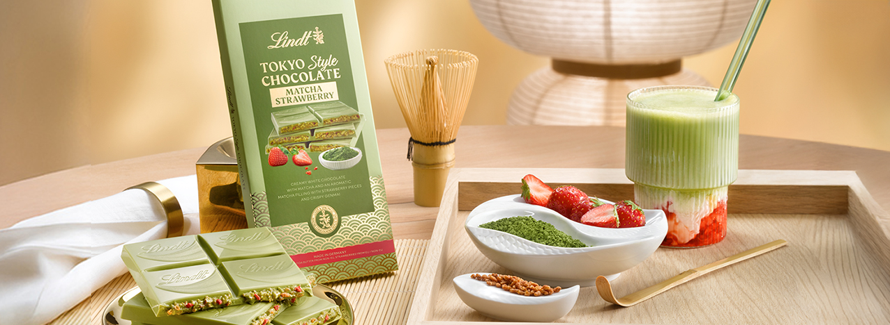
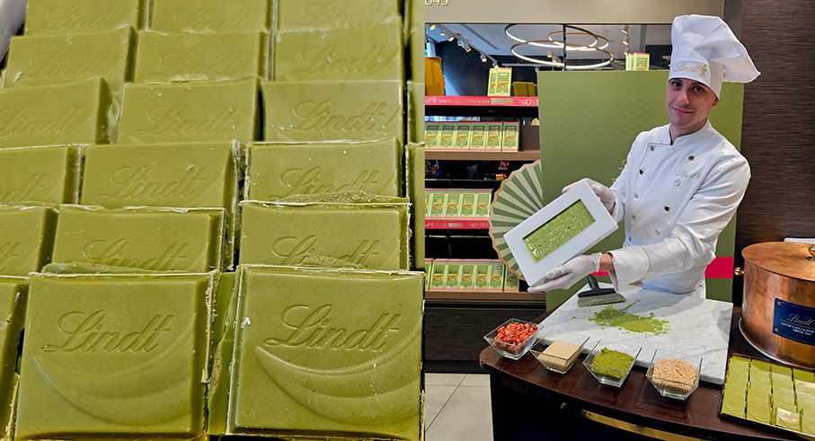
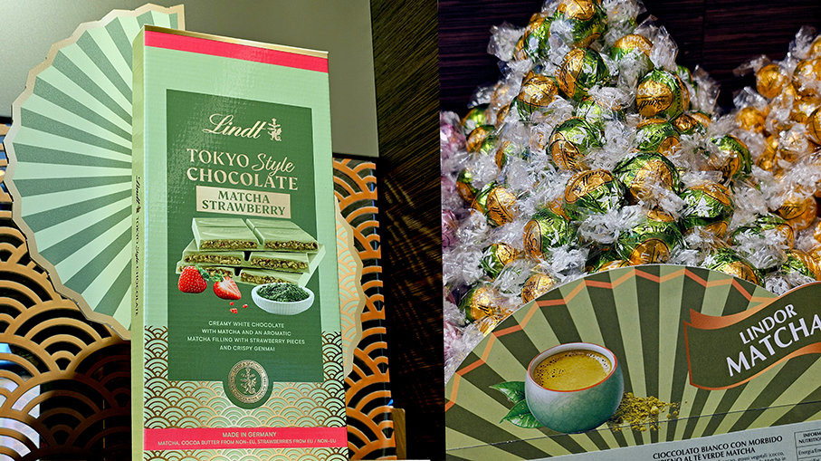
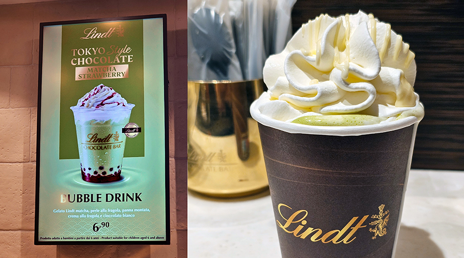
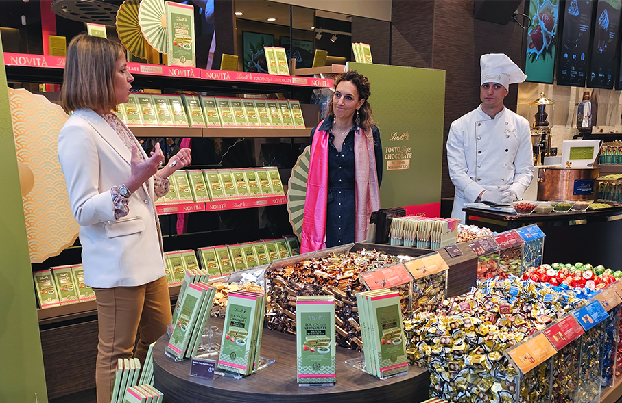

# Lindt presenta Tokyo Style Chocolate
>Una **nuova dolcezza** ispirata a uno degli **ingredienti più amati del Giappone** in anteprima retail a Milano

**Lindt Italia**, parte del gruppo svizzero Lindt & Sprüngli, leader mondiale nella produzione di cioccolato premium, presenta in anteprima retail **Lindt Tokyo Style Chocolate**, la nuova tavoletta ispirata alla **cultura gastronomica giapponese**. La nuova creazione è stata presentata alla stampa di settore presso il Lindt Shop di Via Dante 9 a Milano che, per l’occasione, si è trasformato in un’esperienza immersiva vestendosi dei codici estetici e sensoriali dell’universo Tokyo Style.

Con Tokyo Style Chocolate Lindt prosegue il percorso di innovazione, dopo il successo di Dubai Style Chocolate, continuando a **interpretare i trend internazionali** attraverso l’eccellenza dei suoi **Maîtres Chocolatiers**. Un approccio che trasforma le tendenze globali in creazioni premium, capaci di offrire esperienze di gusto raffinate e sorprendenti.

Tokyo Style Chocolate  nasce dall’**incontro tra il finissimo cioccolato bianco Lindt** e ingredienti iconici della tradizione giapponese: **matcha genmai, riso tostato miscelato al tè verde e fragole**. Un equilibrio raffinato di dolcezza, note verdi e sfumature fruttate, arricchito dalla croccantezza del riso soffiato, per un’esperienza sensoriale completa e innovativa.

Protagonista dell’evento sono stati anche i nuovi **Lindt Tokyo Style Bubble Drink** e **Matcha Latte**, novità disponibili presso il Lindt Chocolate Bar all’interno del punto vendita, pensate per accompagnare e valorizzare le note aromatiche della tavoletta Tokyo Style Chocolate.

«_Dopo il successo di Dubai Style Chocolate, abbiamo voluto continuare questo percorso di esplorazione dei trend globali, interpretando una delle tendenze più rilevanti del momento come il matcha, attraverso l’eccellenza e l’innovazione del cioccolato Lindt_», commenta **Giulia Muzzin Scevola, Marketing Director Lindt Italia**.

«_I nuovi lanci sono una leva fondamentale per il dipartimento retail: Tokyo Style Chocolate è pensato per offrire un’esperienza immersiva che unisce gusto, design e innovazione, valorizzando i nostri negozi come luoghi di scoperta_», aggiunge **Francesca Bernasconi, Retail Director Lindt Italia**. «_Con il Tokyo Style Bubble Drink ampliamo questa visione, portando la stessa creatività anche nel mondo della somministrazione e dimostrando la nostra capacità di interpretare le tendenze contemporanee, offrendo ai consumatori esperienze sempre nuove e coinvolgenti_».

_Ph. Credits: Maria Rosa Sirotti_