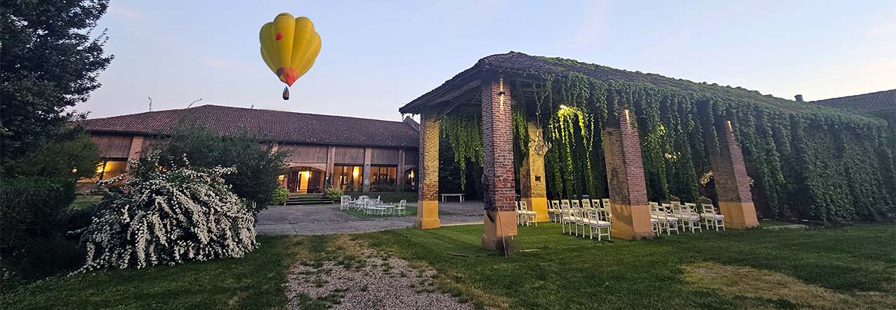
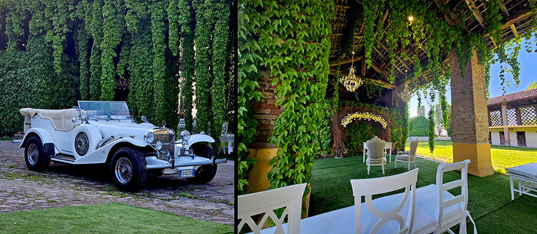
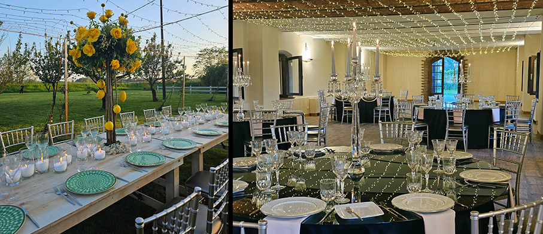
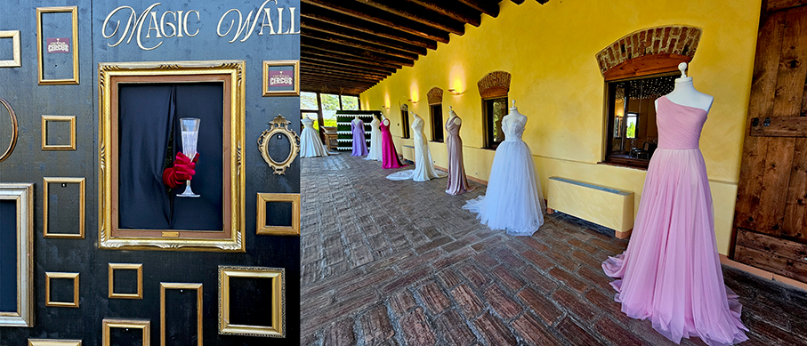
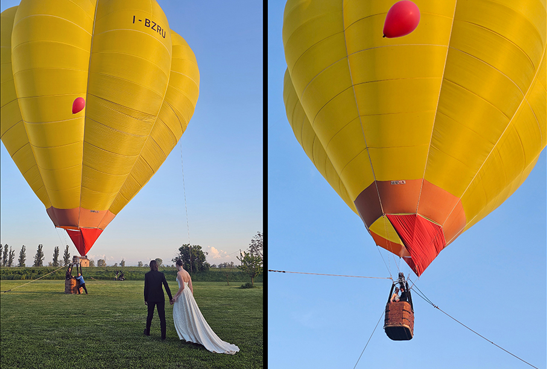
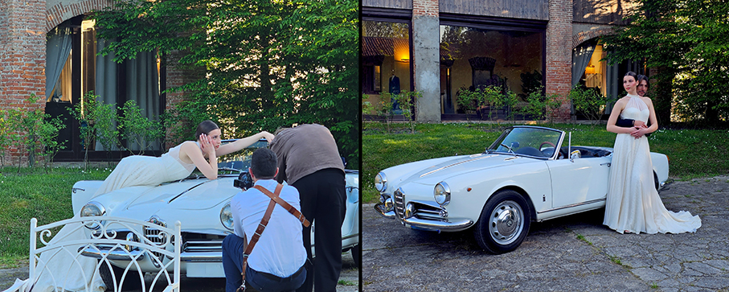
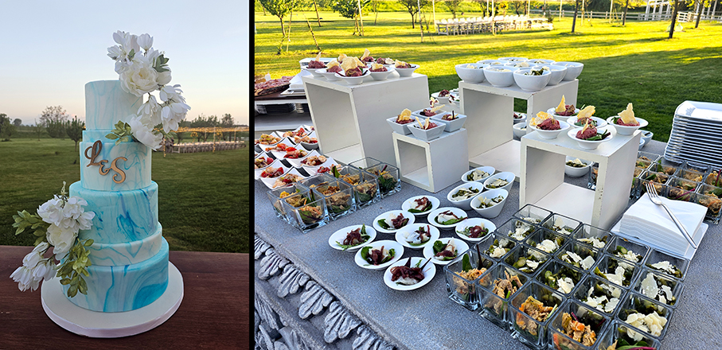

# Love Is In The Air - Sogno ad alta quota

>Un **wedding party tra il verde e il cielo** oggi è possibile alla **Tenuta Corte Vittoria** di Pavia

Presso la **Tenuta Corte Vittoria di Sonia Gatti**, a Pavia, si è celebrato **Love is in The Air – Sogno ad alta quota**, un evento concepito come un’esperienza unica nel suo genere. Un tributo all'amore inteso in ogni sua espressione, in un **equilibrio perfetto tra terra e cielo**. 

La serata, complice lo splendido tramonto, ha trasformato la Tenuta in un **palcoscenico suggestivo**, dove gli allestimenti curati personalmente da Sonia Gatti si sono intrecciati con **scenografie spettacolari, musica, cucina e moda**, tracciando un percorso esperienziale per gli ospiti.

Custodita all’interno di un’oasi verdeggiante, Tenuta Corte Vittoria emerge per la sua atmosfera sospesa che accoglie fin dall’arrivo. Questa **storica cascina lombarda**, grazie a spazi poliedrici, regala scenari multipli: **dai giardini meticolosamente curati ai cortili carichi di suggestione**. L’evento ha preso il via con un cocktail di benvenuto curato da **Cocktail Circus**, che ha proposto drink originali accompagnati dal **DJ set** di Loris Capone.

Tra i momenti più iconici, il **volo in mongolfiera** ha rappresentato l'apice della poesia: un simbolo di leggerezza e romanticismo che ha saputo conquistare il cuore dei presenti. 

Contemporaneamente, lo **shooting live di Marco Sacchi ed Enrico Pezzaldi** ha fissato nel tempo l’essenza della serata: sorrisi spontanei e dettagli preziosi, incorniciati dalla raffinatezza delle creazioni di **Marco Gabrielli Atelier** per la sposa e dall'eleganza rigorosa di **Carosi Moda** per lo sposo. A completare il quadro, le splendide vetture d’epoca de **Le auto di Magnolia** hanno offerto uno sfondo ideale per scatti fotografici senza tempo. 

Il servizio catering della serata era firmato dall'**Enoteca Raiteri**. Il gran finale è stato affidato alla creazione di **Sara – Magie ad ogni morso**: una torta scenografica capace di fondere estetica e sapore.
Questa esperienza ha saputo emozionare e stupire per la sua originalità, confermando la Tenuta come una location per **grandi eventi esclusivi**, in un connubio tra arte, natura e passione.

**Sonia Gatti**, wedding manager e host di Tenuta Corte Vittoria, ha commentato: “_Siamo orgogliosi di aver dato vita a un’esperienza così particolare per i nostri ospiti. Ogni dettaglio è stato pensato per colpire i sensi e il cuore. ‘LOVE IS IN THE AIR’ non è stato un semplice evento, ma un vero viaggio romantico che celebra l'amore in modo totale, consolidando la nostra struttura come punto di riferimento per celebrazioni che restano nel cuore_”.

_Ph. Credits: Maria Rosa Sirotti_

**www.tenutacortevittoria.it**
