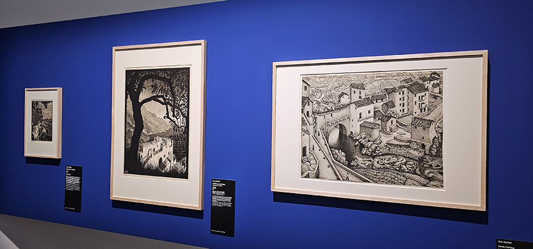

# M.C. Escher. Tra arte e scienza 

> Al **Mudec di Milano**, un nuovo sguardo sul percorso artistico di **Escher**, in collaborazione con il **Kunstmuseum Den Haag** 

La mostra **M.C. Escher. Tra arte e scienza**, al **MUDEC** di Milano **dal 25 settembre all’8 febbraio 2026**, riporta a Milano dopo dieci anni di assenza uno degli artisti più affascinanti e riconoscibili del Novecento,** Maurits Cornelis Escher** (Olanda, 1898-1972). 

Attraverso un progetto espositivo interamente dedicato a lui, la mostra propone un nuovo sguardo sul suo percorso artistico. Noto per le sue **architetture impossibili, illusioni ottiche, tassellazioni e metamorfosi**, M.C. Escher ha creato un linguaggio visivo unico che **unisce arte e matematica**. Quella matematica fatta non di astratti ragionamenti degli accademici di professione, ma di un lungo, minuzioso e appassionato lavoro, basato su un approccio più intuitivo e percettivo. 

In Escher **arte e scienza si fondono in una visione rigorosa, inventiva e profondamente personale**, in un fil rouge che caratterizza fortemente la mostra che esplora **l’influsso dell’arte islamica** – in particolare le decorazioni dell’Alhambra di Granada e della Mezquita di Cordova – nella costruzione dell’universo grafico che caratterizza lo stile distintivo dell’artista olandese. Il Mudec dunque – attraverso le sue mostre dal concept espositivo caratterizzato – porta l’attenzione non solo sull’artista e sulla sua poetica, ma anche sulle **fonti di ispirazione e i modelli culturali ‘altri’**. 

Ma fu soltanto dal **1937**, dopo la lettura di alcuni articoli scientifici pubblicati su riviste di **cristallografia**  che M.C. Escher intraprese una ricerca sistematica sulle **tassellazioni regolari del piano euclideo** e sui corrispondenti **17 gruppi cristallografici** del piano. Di questo studio approfondito offrono eloquente testimonianza non solo gli schizzi nei suoi taccuini e quaderni, ma anche capolavori grafici quali Giorno e notte (1938) e Cavalieri (1946). 

L’incontro, nel **1954, con il matematico Harold Scott MacDonald Coxeter** segnò l’inizio di una nuova fase nelle ricerche artistiche di M.C. Escher, che da tempo era interessato a trovare un ambiente geometrico atto alla creazione di “motivi” le cui dimensioni si facessero via via più piccole, procedendo dal centro verso la periferia, “fino a raggiungere il limite dell’infinita piccolezza”. Esplorando, con i metodi euristici a lui propri, l’universo delle tassellazioni regolari del disco iperbolico di Poincaré, Escher riuscì a raggiungere questo obiettivo, realizzando, tra il 1958 e il 1960, le opere di straordinaria complessità matematica che costituiscono la serie Limite del cerchio I - IV. 

La mostra indaga poi un aspetto ancora poco conosciuto dal grande pubblico, ovvero **lo stretto rapporto che l’artista ebbe con l'arte islamica** e le sue inconfondibili tassellazioni. L’uso delle simmetrie, la ripetizione modulare e la visione astratta dello spazio, elementi chiave dell’ornamentazione islamica, offrono a M.C. Escher uno spunto importantissimo per **superare la rappresentazione naturalistica della realtà**. 

La mostra dunque si snoda percorrendo **otto sezioni tematiche**. 
Attraverso** 90 opere di Escher** tra incisioni, acquerelli, xilografie e litografie nonché oltre **40 oggetti islamici** di confronto provenienti dal Kunstmuseum Den Haag e da altri musei milanes, si segue infatti l’evoluzione dell’artista: **dagli esordi influenzati dall’Art Nouveau, alla scoperta dei paesaggi italiani, fino alla piena maturità**, in cui M.C. Escher sviluppa un sofisticato uso di tassellazioni, cicli metamorfici, illusioni ottiche e rappresentazioni dell’infinito. Pur senza una formazione scientifica, l’artista riesce a visualizzare concetti matematici complessi con sorprendente intuizione grafica. 

Il comitato scientifico, supportato dalla **Fondazione M. C. Escher** e coordinato da Federico Giudiceandrea, su concept di **Judith Kadee, Curator del Kunstmusem Den Haag**, è composto dai curatori **Claudio Bartocci**, Docente di Geometria e Storia della Matematica presso l'Università di Genova– per l’approfondimento dei legami di Escher con gli aspetti matematici e scientifici - **Paolo Branca**, Professore di Lingua e Cultura Araba presso l’Università Cattolica di Milano - per indagare il rapporto con l’arte islamica - e **Claudio Salsi**, Docente di Storia del Disegno, dell’Incisione e della Grafica presso l’Università Cattolica di Milano - per un affondo sulla produzione grafica dell’artista. 
Alle sezioni tematiche si affiancano lungo il percorso di mostra le **installazioni multimediali** che spiegano in modo assolutamente immediato, intuitivo e anche ludico i concetti di **tassellazione e di infinito**.

 Infine, a chiusura della mostra, una sorta di **infinity room** porta il visitatore a entrare in una camera immersiva dall’effetto caleidoscopico all’interno di una stanza a specchio, dove vengono proiettate animazioni in alta definizione sulle tassellazioni iperboliche di Escher, creando un ambiente visivamente affascinante e coinvolgente.

 

Prodotta da 24 ORE Cultura – Gruppo 24 ORE e promossa dal Comune di Milano-Cultura con il supporto di Turisanda1924 – esclusivo brand di viaggi parte di Alpitour World – e con il patrocinio dell’Ambasciata e Consolato Generale dei Paesi Bassi in Italia, l’esposizione è in collaborazione con il Kunstmuseum Den Haag ed è resa possibile grazie a Fondazione M.C. Escher. Grazie a questa preziosa sinergia è infatti possibile ammirare in un unico allestimento le importanti opere provenienti dalla collezione permanente del museo olandese, che custodisce la più grande collezione museale pubblica di M.C. Escher al mondo, di cui in mostra ritroviamo una significativa rappresentanza. La mostra è inserita nell’ambito. 

_Ph. credits: Maria Rosa Sirotti_

**INFO UTILI:** 

**MUDEC** Via Tortona 56, tel. 02/54917 (lun-ven 10.00-17.00) 

**DATE** 25/09/2025 – 08/02/2026 

**ORARI** Lun 14.30 ‐19.30 | Mar, Mer, Ven, Dom 09.30 ‐ 19.30 | Gio, Sab 9.30-22.30 

**BIGLIETTI** Intero € 16 | Ridotto € 14 

Il servizio di biglietteria termina un’ora prima della chiusura.
