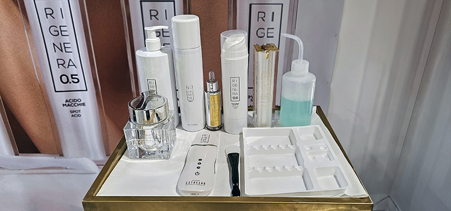
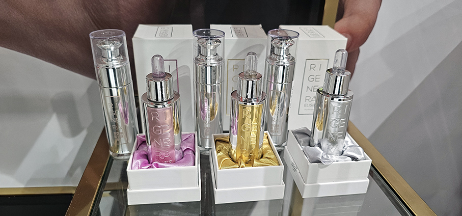
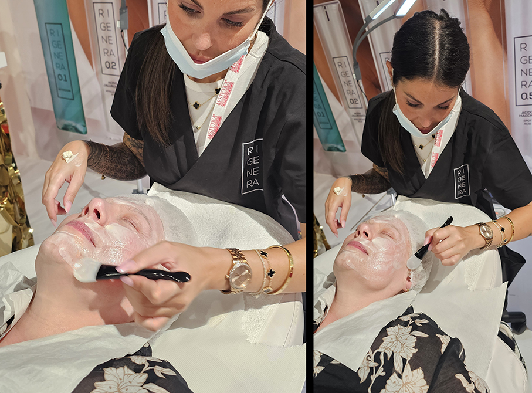
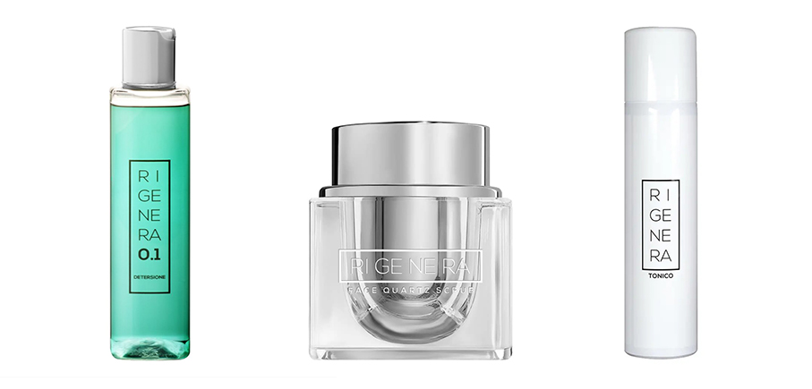
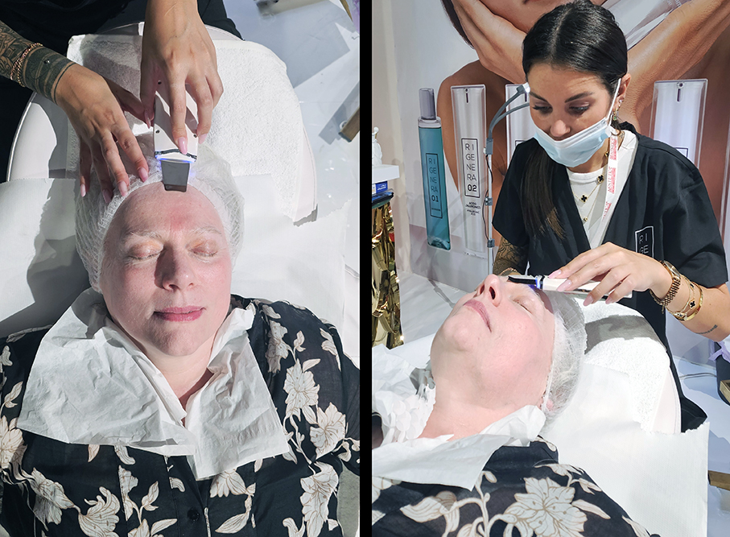
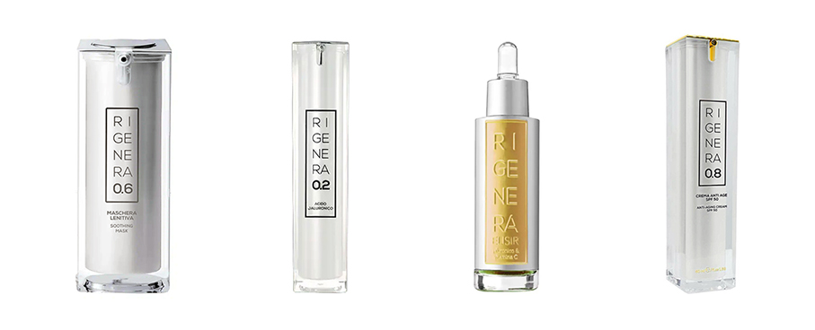

# Maison Group alla MBW 2025 

> **Maison Group** alla **Milano Beauty Week 2025**: un viaggio nel mondo dell’estetica con **bellezza e innovazione** attraverso esperienze immersive e soluzioni all’avanguardia
 

Durante la **Milano Beauty Week 2025**, presso la Scuola Militare Teulié a Milano, **Maison Group** era presente con un corner dedicato ai suoi brand: **Face+, Esthelab, Rigenera, Integra e Xaikonix**. I visitatori hanno potuto scoprire le soluzioni più innovative e i prodotti domiciliari per la cura della pelle e approfondire le caratteristiche e le peculiarità di ciascun brand. Partecipare alla Milano Beauty Week ha consentito di immergersi in un mondo di bellezza e innovazione, adatto sia a chi lavora nel settore estetico sia a chi desidera conoscere le ultime tendenze e soluzioni per il benessere quotidiano.

I professionisti e la stampa di settore hanno avuto l’opportunità di vivere un’esperienza unica nel mondo dell’estetica: un 
**trattamento viso Shine & Go by Rigenera** offerto da **Maison Group**.
Parliamo di un **trattamento ispirato alla potenza della vitamina C** e ai suoi straordinari benefici. Pensato per stimolare il naturale **turnover cellulare**, aiuta a contrastare i radicali liberi, donando alla pelle **maggiore elasticità, compattezza e luminosità**.

**Shine & Go** è dedicato a una donna intraprendente, dinamica e contemporanea: attenta alla sua skincare routine, desidera valorizzare la propria bellezza con pochi gesti, ottenendo il massimo risultato in termini di **freschezza e splendore**.

**Rigenera 0.1 – Detergente viso**

Si inizia purificando la pelle con un detergente delicato, ideale per **eliminare impurità e preparare il viso ai trattamenti successivi**. La detersione con Rigenera 0.1 può essere fatta sia al mattino che di sera perché è un detergente ultra delicato adatto anche alle pelli più sensibili. I suoi componenti sono di origine naturale e ben tollerati da tutte le pelli, anche per la cute lesa. Prodotto con estratti di Camomilla (antinfiammatoria), Calendula (stimolatore del metabolismo), Avena e Cetriolo (idratante e lenitivo). Questi prodotti **proteggono la pelle ed attenuano le irritazioni** ed eventuali allergie. Profumo delicato di Rosa e Fico, senza Allergeni. Grazie all’ associazione delle mucillagini contenute nell’estratto di Calendula, e dei polisaccaridi dell’Aloe, il gel risulta adatto a togliere dal viso ogni traccia di impurità. Dona luminosità e morbidezza alla pelle.

**Rigenera – Face Quartz Scrub esfoliante viso ai cristalli di quarzo**

Un trattamento esfoliante viso a tripla azione – fisica, chimica ed enzimatica – studiato per rinnovare la pelle in modo efficace ma delicato. La sua formula avanzata combina **cristalli puri di quarzo**, che agiscono meccanicamente per eliminare le cellule morte, con **attivi esfolianti chimici e enzimi naturali**, per un’esfoliazione completa e progressiva. La polvere di quarzo leviga la superficie cutanea, stimola il turnover cellulare e favorisce una texture più uniforme. Grazie alla sinergia tra le tre modalità esfolianti, **la pelle risulta più luminosa, liscia** e visibilmente rinnovata già dopo le prime applicazioni. Ideale per tutti i tipi di pelle, anche quelle spente o con grana irregolare, è il gesto perfetto per preparare il viso ai trattamenti successivi, potenziandone l’efficacia.

**Rigenera Tonico Spray Viso**

Rigenera Tonico Spray è tonico viso naturale creato **per pulire in profondità tutti i tipi di pelle** dopo la detersione. E’ in grado di eliminare eventuali residui di impurità richiudendo i pori e regalando alla pelle un’intensa sensazione di freschezza. Inoltre, può essere utilizzato anche come **fissante per il make-up**. Da Agricoltura biologica, è un tonico a base di acque distillate biologiche di Arancio, Aloe Vera gel e Betaina.

**Rigenera Maschera Viso Lenitiva Idratante**

Rigenera 0.6 Maschera Lenitiva è una crema viso ad azione nutriente e lenitiva **con Burro di Karité, Olio di Soia e Aloe Vera** da agricoltura biologica. Ricca e lussuosa, è formulata con ingredienti di alta qualità per una idratazione profonda e una cura rigenerante. Il burro di karité, noto per le sue proprietà nutrienti e restitutive, si combina con il succo biologico di aloe vera, lenitivo e riepitelizzante, per donare alla tua pelle un aspetto radioso e sano. L’olio di soia, estratto con cura per preservare le sue proprietà rigeneranti, aiuta a **riequilibrare la cheratinizzazione della pelle**, adattandosi sia alle esigenze delle pelli grasse che di quelle secche. La sua leggerezza consente un assorbimento rapido, lasciando la pelle morbida e levigata senza sensazione di unto. Per completare questa formulazione eccezionale, è incluso **l’estratto di hamamelis**, con le sue virtù decongestionanti e astringenti, per una pulizia profonda e una sensazione di freschezza duratura.

**Rigenera 0.2 – Acido Jaluronico**

Rigenera 0.2 è un siero viso acido ialuronico **liftante** che ha la funzione di creare un’impalcatura molecolare che mantenga la **forma e il tono del tessuto**. Inoltre, agisce come film protettivo della pelle e mantiene l’idratazione dermica. È la molecola più utilizzata nelle creme come **riempitivo dei solchi cutanei**.

**Rigenera – Elisir Acido Jaluronico e Vitamina C**

L’elisir idratante e illuminante contiene l’Acido Jaluronico, presente naturalmente nell’epidermide, contribuisce al **tono e all’elasticità dei tessuti cutanei**. L’ Acido Jaluronico è presente a diversi pesi molecolari e nella forma reticolata per un’azione a lungo rilascio. La presenza di **glitter argentato** apporta immediata lucentezza al viso. Rinfresca e lenisce e ha proprietà lenitive e aiuta a calmare rossori e irritazioni. Utile per rassodare, ridensificare e combattere i segni del tempo. I suoi componenti attivi come l’acqua distillata di camomilla, aiutano anche la pelle a respirare meglio. Per una **mirata azione antiage**, è stato potenziato con **vitamina C** ad azione antiossidante.

**Rigenera 0.8 – Crema Anti Age SPF 50**

La Crema Anti Age, Rigenera 0.8, è la crema definitiva per **contrastare la l’invecchiamento cutaneo** mentre protegge la pelle con la **protezione 50**. Pensata specificamente per preservare la pelle dai raggi UVA e UVB, è arricchita con Aloe Vera Bio, acido Jaluronico, Olio di Cocco ed Estratto di Calendula. Aiuta a mantenere la pelle idratata. I filtri protettivi permettono una protezione alta e duratura senza ungere la pelle e senza lasciare patine chiare nel punto di applicazione. Ideale come prodotto quotidiano per la skin care.

