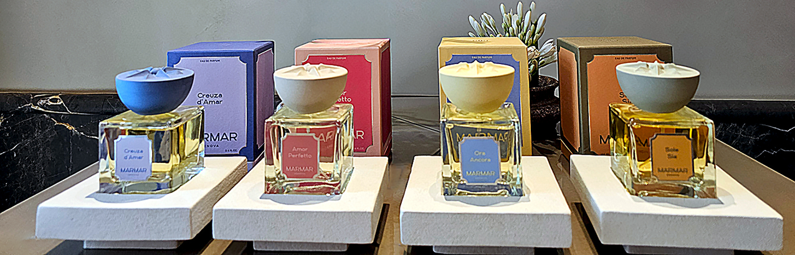
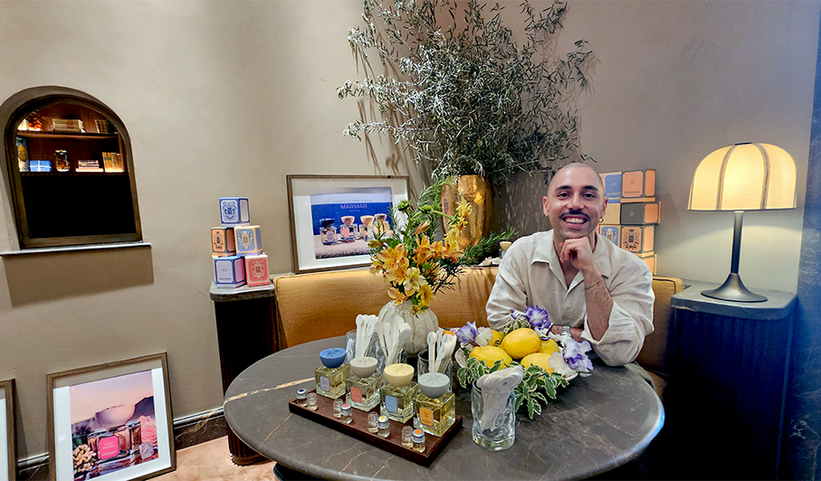
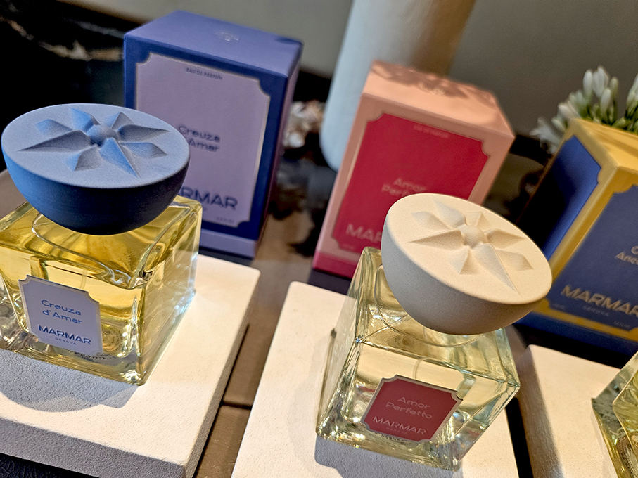
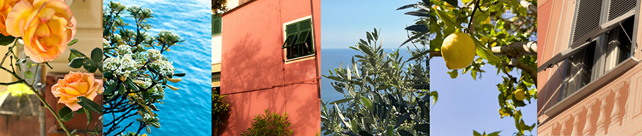
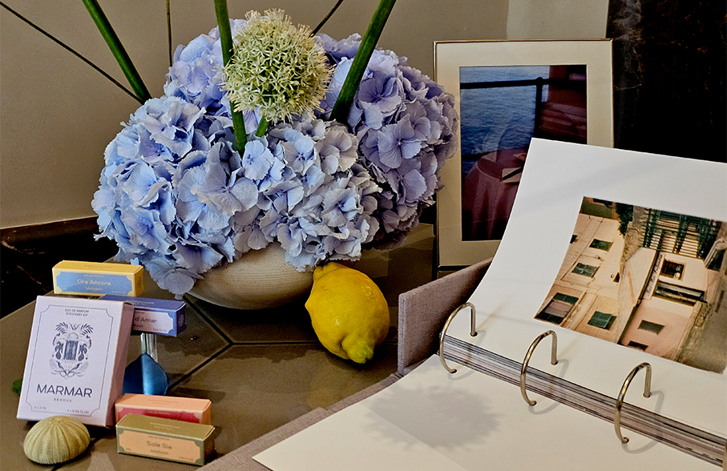
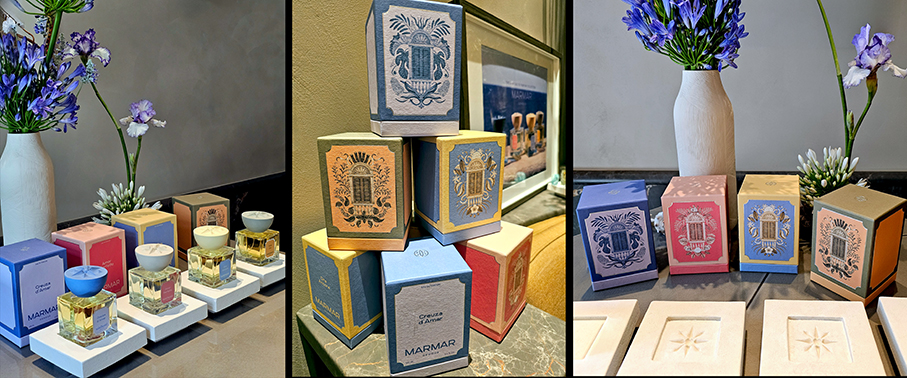
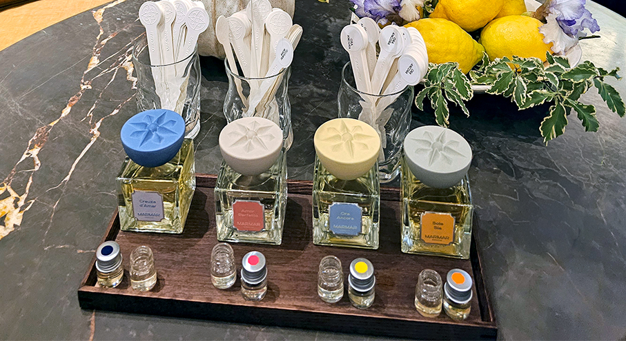

# MarMar – L’essenza di Genova sulla pelle

>**Quattro fragranze nate a Genova** che parlano della città: luoghi, profumi, colori e ricordi

_di Maria Rosa Sirotti_

Nascono dal vento e portano con loro i segreti di Genova, una città che vive e respira col mare. Come instantanee sulla pelle, da scoprire una alla volta: è questa l'anima dei profumi di **Filippo Fornasini, fondatore di MarMar** e ideatore di una collezione  pienamente identitaria, sia nelle piramidi olfattive, sia nella scelta dei colori, dei materiali, delle grafiche. Nulla è lasciato al caso. Filippo è fortemente determinato a **reinterpretare l'anima olfattiva di Genova** con il suo brand, per risvegliare il mare che ognuno porta dentro. 

A Genova il vento porta con sé odori diversi ad ogni stagione, ad ogni ora ed è questa la bussola creativa di **Filippo**: «_Dopo dodici anni a Parigi  nell’industria del profumo, sentivo il bisogno di fare qualcosa che parlasse davvero di me, del posto da cui venivo, di quello che portavo dentro. Quando è mancata mia mamma, tutto è diventato più chiaro. Tornare a Genova è stata una decisione difficile ma giusta, per riappropriarmi delle mie radici e portare avanti quello che lei aveva iniziato_». 

Le fragranze, **interamente prodotte in Italia**, nascono da materie prime di qualità tracciabile, con una firma olfattiva **marina, equilibrata e portabile**. Anche la filiera è interamente italiana, dalla formulazione all'assemblaggio, dal vetro alla carta Fedrigoni. Unica eccezione i tappi in grès porcellanato, realizzati a mano in Galizia. La **rosa dei venti** in rilievo  è il simbolo della maison e richiama il profilo delle colline liguri che si tuffano nel mare.

Anche il **colore** nasce da una ricerca paziente. Un anno di studio delle **facciate genovesi, della flora ligure e della luce** che attraversa la città. Perchè a Genova il colore non decora, racconta.
Una città che si vive con il naso prima ancora che con gli occhi e ogni fragranza MarMar è un invito a scoprirla con i suoi ritmi, i suoi umori, i suoi segreti.

**LA COLLEZIONE DI EAU DE PARFUM**

La prima collezione è composta da Eau de Parfum con concentrazioni in alcool d'origine vegetale **superiori al 20%**. Fragranze sofisticate e armoniche, tutte unisex, per chi vuole portare con sé un pezzo di mare.
Materie prime di qualità provenienti da tutto il mondo, omaggio a Genova come **crocevia storico** delle rotte commerciali del Mediterraneo. 

**CREUZA D’AMAR**
Un olivo intriso di salsedine dopo una pioggia di primavera. Le pietre umide delle creuze, (le stradine lastricate che scendono tortuose verso il mare) e l’eco delle onde che risalgono dal basso. Una fragranza contemplativa, intima. **Legnoso Aromatico Ambrato**.

«_La mattina apro la finestra e la salsedine sale dal mare, si mescola all’odore del giardino umido di rugiada, agli alberi di agrumi, agli olivi. Ho voluto catturare esattamente quell’istante: una freschezza pulita, vivificante, che mi rappresentasse in questo momento di vita_». — Filippo 

Testa: Rugiada erbacea, Zenzero, Cardamomo
Cuore: Fico, Rabarbaro, Giacinto  
Base: Salvia Sclarea, Muschio, Legno d’olivo

**AMOR PERFETTO**
Notte nei vicoli. L’aria calda e salata, il profumo di pittosporo in fiore che impregna i caruggi. La piazzetta dello Amor Perfetto, dove Tommasina Lomellini e  Luigi XII di Francia vissero un amore platonico, impossibile, che finì con la morte di lei e con il re inginocchiato sulla sua tomba: “Poteva essere un amore perfetto”.**Floreale Marino Ambrato**.

«_Una sera di giugno stavo attraversando il quartiere di Albaro in motorino. Rimasi inebriato da una ventata di profumo di tiglio: mieloso, ipnotico. Da lì è nata l’idea. L’abbiamo sfaccettata con il pittosporo, salino e carnale, con una nota metallica che evoca un’intimità nascosta dietro un bouquet fiorito_». — Filippo 

Testa: Bergamotto di Calabria, Sale, Pepe rosa
Cuore: Pittosporo, Tiglio, Rosa 
Base: Suede, Ambra grigia, Sandalo

**ORA ANCORA**
Un caffè sul mare. La focaccia ancora calda, l’aria che sa di limoni e salsedine. Genova di mattina, nella sua versione più intima. **Agrumato Marino Gourmand**.

«_Volevo un gourmand che sapesse di questa città, non di pasticceria, ma di sole e di mare. È la salsedine che spezza la dolcezza e la salva dalla stucchevolezza. L’accordo divide, provoca, crea una conversazione, e questo per me è già profumo riuscito. Il tocco finale è una nota d’aria pulita, di lenzuola asciugate dal vento nei vicoli_». — Filippo 

Testa: Salsedine, Neroli, Limone di Sicilia
Cuore: Monoï, Aldeidi fresche, Assoluta di Caffè del Brasile
Base: Cedro, Labdano, Vaniglia

**SOLE SIA**
A Genova d’estate si sale sui tetti. Basilico e rosmarino che bruciano sotto un sole cocente, la pelle che si abbronza lentamente. Un’estate intera condensata in un pomeriggio sospeso tra cielo e città. Che ci sia il sole. Che sia sole. Che il sole sia, semplicemente. **Cuoiato Legnoso Solare**. 

«_Volevo un profumo che sapesse di quel caldo: vegetale, resinoso, solare e un ricordo d’infanzia: i reganissi, le radici di liquirizia tipiche delle drogherie del centro storico, che rosicchiavo come se fossero caramelle_». — Filippo 

Testa: Pompelmo, Basilico, Pepe nero
Cuore: Cuoio, Liquirizia, Rosmarino
Base: Patchouli, Incenso, Amyris d’Haiti

_Ph. Credits: Maria Rosa Sirotti_
